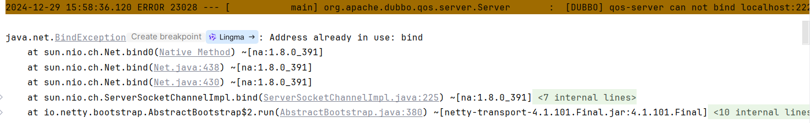

# 快速上手

## 一、概述

在一个 Dubbo 应用之中，主要包含如下内容：


> 其中，注册中心，实际上是可以选择的，非必须的

如果不需要注册中心，Consumer 直接访问 Provider 通信。这种方式也被称之为，直连式。接下来，我们首先搭建一个直连式的Dubbo应用。

## 二、Hello World

### 2.1 依赖管理

定义一个父项目，进行依赖的统一管理

> 如果涉及到多个项目统一管理，我们可以采用 flatten 插件来进行统一的版本号管理

::: code-group

```xml [依赖]
<properties>
    <revision>1.0.0-SNAPSHOT</revision>
    <spring.boot.version>2.7.18</spring.boot.version>
    <dubbo.version>3.2.0</dubbo.version>
    <flatten-maven-plugin.version>1.6.0</flatten-maven-plugin.version>
    <lombok.version>1.18.34</lombok.version>
    <maven-compiler-plugin.version>3.13.0</maven-compiler-plugin.version>
</properties>

<dependencyManagement>
    <dependencies>
        <dependency>
            <groupId>org.springframework.boot</groupId>
            <artifactId>spring-boot-dependencies</artifactId>
            <version>${spring.boot.version}</version>
            <type>pom</type>
            <scope>import</scope>
        </dependency>

        <dependency>
            <groupId>org.apache.dubbo</groupId>
            <artifactId>dubbo-bom</artifactId>
            <version>${dubbo.version}</version>
            <type>pom</type>
            <scope>import</scope>
        </dependency>

        <dependency>
            <groupId>org.projectlombok</groupId>
            <artifactId>lombok</artifactId>
            <version>${lombok.version}</version>
        </dependency>
    </dependencies>
</dependencyManagement>
```

```xml [plugin]
<build>
    <plugins>
        <!-- 统一 revision 版本 -->
        <plugin>
            <groupId>org.codehaus.mojo</groupId>
            <artifactId>flatten-maven-plugin</artifactId>
            <version>${flatten-maven-plugin.version}</version>
            <configuration>
                <flattenMode>resolveCiFriendliesOnly</flattenMode>
                <updatePomFile>true</updatePomFile>
            </configuration>
            <executions>
                <execution>
                    <goals>
                        <goal>flatten</goal>
                    </goals>
                    <id>flatten</id>
                    <phase>process-resources</phase>
                </execution>
                <execution>
                    <goals>
                        <goal>clean</goal>
                    </goals>
                    <id>flatten.clean</id>
                    <phase>clean</phase>
                </execution>
            </executions>
        </plugin>
    </plugins>
</build>
```

:::

### 2.2 API 模块

我们前面已经提供了，API 模块主要作为接口定义。我们定义一个简单的接口：

```java
public interface UserService {
    /**
     * 获取用户信息
     * @param userReq 请求参数
     * @return 获取到的用户信息
     */
    UserInfoVO getUserInfo(UserReq userReq);
}
```

对于RPC 调用过程之中的实体类对象，必须实现序列化接口

::: code-group

```java [UserReq]
@Data
public class UserReq implements Serializable {
    private String userName;
}
```

```java [UserInfoVO]
@Data
public class UserInfoVO implements Serializable {
    private String username;

    private String password;
}
```

:::

在定义完成 API 模块之中，接下来，我们就基于 SpringBoot 来进行第一个 Dubbo 应用的开发。

### 2.3 Provider

首先，我们来开发 Provider 模块。在 Provider 模块，我们首先添加如下的依赖

```xml
<dependencies>
    <dependency>
        <groupId>org.springframework.boot</groupId>
        <artifactId>spring-boot-starter</artifactId>
    </dependency>

    <dependency>
        <groupId>com.coding</groupId>
        <artifactId>dubbo-api</artifactId>
    </dependency>
    
    <dependency>
        <groupId>org.apache.dubbo</groupId>
        <artifactId>dubbo-spring-boot-starter</artifactId>
    </dependency>
</dependencies>
```

实现 API 模块的接口，完成功能的开发。**请注意，这里 `@DubboService` 注解**

```java
@DubboService
@Slf4j
public class UserServiceImpl implements UserService {
    /**
     * 获取用户信息
     * @param userReq 请求参数
     * @return 获取到的用户信息
     */
    @Override
    public UserInfoVO getUserInfo(UserReq userReq) {
        log.info("UserServiceImpl#getUserInfo param:{}",userReq);
        UserInfoVO userInfoVO = new UserInfoVO();
        userInfoVO.setUsername("coding");
        userInfoVO.setPassword("123");
        return userInfoVO;
    }
}
```

开发完成之后，在 SpringBoot 启动类中，添加：`@EnableDubbo` 注解

```java
@SpringBootApplication
@EnableDubbo
public class DubboProviderApplication {
    public static void main(String[] args) {
        SpringApplication.run(DubboProviderApplication.class, args);
    }
}
```

接下来，在配置文件之中如下的配置：

```yaml
server:
  port: 9001
  servlet:
    context-path: /provider
spring:
  application:
    name: dubbo-provider
dubbo:
  application:
    name: ${spring.application.name}
```

在启动完成之中，我们可以看一下控制台输出的信息：

- **向外暴露的访问的 URL**

:::info

从这里我们就能够看到，这个 URL 之中主要包含：应用名、IP、端口、接口名、方法名、Dubbo 的版本、序列化方式等

:::

```markdown
Export dubbo service com.coding.helloworld.api.UserService to url 

dubbo://192.168.1.5:20880/com.coding.helloworld.api.UserService?anyhost=true
&application=dubbo-provider&background=false&bind.ip=192.168.1.5&bind.port=20880
&deprecated=false&dubbo=2.0.2&dynamic=true&executor-management-mode=isolation
&file-cache=true&generic=false&interface=com.coding.helloworld.api.UserService
&ipv6=2408:8207:4841:3d50:8965:b8b2:a459:1763&methods=getUserInfo&pid=18744
&prefer.serialization=fastjson2,hessian2
&qos.enable=true&release=3.2.0&side=provider&timestamp=1735458362943
```

### 2.4 Consumer

在 consumer 模块，首先导入如下依赖：

```xml
<dependencies>
    <dependency>
        <groupId>org.springframework.boot</groupId>
        <artifactId>spring-boot-starter-web</artifactId>
    </dependency>

    <dependency>
        <groupId>org.apache.dubbo</groupId>
        <artifactId>dubbo-spring-boot-starter</artifactId>
    </dependency>

    <dependency>
        <groupId>com.coding</groupId>
        <artifactId>dubbo-api</artifactId>
    </dependency>

    <dependency>
        <groupId>org.springframework.boot</groupId>
        <artifactId>spring-boot-starter-test</artifactId>
        <scope>test</scope>
    </dependency>
    
</dependencies>
```

添加如下配置：

```yaml
server:
  port: 9092
  servlet:
    context-path: /consumer
dubbo:
  application:
    name: ${spring.application.name}
```

在 Consumer 模块，完成对于 Provider 模块的调用，这部分功能我们将通过单元测试的方式来进行演示

```java
@SpringBootTest
@Slf4j
class DubboConsumerApplicationTests {

    @DubboReference(url = "dubbo://192.168.1.5:20880/com.coding.helloworld.api.UserService")
    private UserService userService;

    @Test
    void helloWorld() {
        UserReq user = new UserReq();
        user.setUserName("coding");
        UserInfoVO userInfo = userService.getUserInfo(user);
        log.info("userInfo:{}",userInfo);
    }
}
```

注意，这里的 url 参数就是 Provider 模块启动时，在控制台输出的内容，不过我们这里只使用到一部分。

到这里，第一个 Dubbo 应用开发已经完成了。这种开发方式，也称之为 **直连式**。

不过在客户端启动的过程之中，有下面的这些错误信息：~~但是不影响使用~~



可以通过如下方式解决

```yaml{8}
server:
  port: 9092
  servlet:
    context-path: /consumer
spring:
  application:
    name: consumer
dubbo:
  application:
    name: ${spring.application.name}
    qos-enable: false
```

## 三、细节补充

接下来，我们对于上面程序的一些细节进行补充。

首先，我们在 Provider 模块之中，在启动类上，添加了 `@EnableDubbo` 的注解

这个注解的主要作用：扫描 `@DubboService` 并将对应的对象实例，发布成为了 RPC 服务，而他的扫描路径，就是应用这种注解的类所在的包及其子包，当然了，我们也可以通过里面的属性，来指定扫描那个包。

```java
@EnableDubbo(scanBasePackages = "com.coding.provider")
```

在 Consumer 模块，我们注意到，Consumer 获取到的 UserService 对象，实际上是代理对象


所以，`@DubboReference` 的主要作用就是，注入远端服务的代理对象。所以我们实际的调用应该是下面这样


加入了代理对象之后，Consumer 实际上和原来的调用没有区别，完全屏蔽了网络通信的整个过程。如果加入了注册中心，就变成下面这样了：


