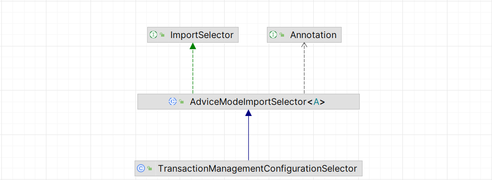
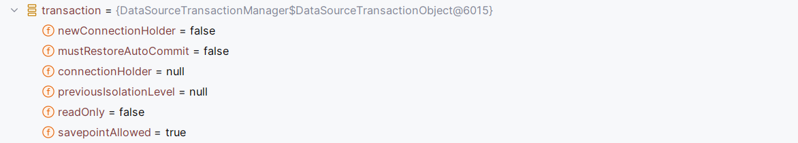

# 事务源码篇

## 一、前言

在注解版本使用事务的过程之中，我们引入了 `@EnableTransactionManagement` ，他是我们开始事务功能的核心，在这个注解过程中，有三个属性，定义如下：

```java
@Target(ElementType.TYPE)
@Retention(RetentionPolicy.RUNTIME)
@Documented
@Import(TransactionManagementConfigurationSelector.class)
public @interface EnableTransactionManagement {
    // 基于那个方式来创建代理
    boolean proxyTargetClass() default false;
    // 对于这个属性，有两个值 PROXY，运行时增强，ASPECTJ 类加载时增强
	AdviceMode mode() default AdviceMode.PROXY;
    // 加载顺序
	int order() default Ordered.LOWEST_PRECEDENCE;
}
```

在这个注解之上，他有`@Import(TransactionManagementConfigurationSelector.class)` 这个类，这个类对应的继承关系如下：



通过类图，能够发现，他间接实现了 `ImportSelector`，所以他会通过 selectImports 方法的返回值，通过反射将类加载到 Spring 容器之中。

对应的 selectImports 方法如下：

```java
@Override
protected String[] selectImports(AdviceMode adviceMode) {
    switch (adviceMode) {
        case PROXY:
            return new String[] {AutoProxyRegistrar.class.getName(),
                                 ProxyTransactionManagementConfiguration.class.getName()};
        case ASPECTJ:
            return new String[] {determineTransactionAspectClass()};
        default:
            return null;
    }
}
```

当注解中，mode 的值为：`PROXY` 的时候 他会在 Spring 之中注册如下的两个 Bean：

+ `AutoProxyRegistrar`
+ `ProxyTransactionManagementConfiguration` 

接下来，我们就来逐步分析一下这两个类，这个是我们的测试的方法

```java
@Transactional(rollbackFor = Exception.class)
@Override
public void insertUser() {
    userMapper.insertUser("coding");
}
```

## 二、创建代理对象

其次，对于 AutoProxyRegistrar 类

```java
public class AutoProxyRegistrar implements ImportBeanDefinitionRegistrar {}
```

在阅读Spring IOC 的过程之中，我们清楚，这个类的主要作用，就是为了向 Spring 容器之中注册 BeanDefinition。

```java
@Override
public void registerBeanDefinitions(AnnotationMetadata importingClassMetadata, BeanDefinitionRegistry registry) {
    boolean candidateFound = false;
    // 获取当前类上所有的注解
    Set<String> annTypes = importingClassMetadata.getAnnotationTypes();
    for (String annType : annTypes) {
        // 获取到注解里面的属性
        AnnotationAttributes candidate = AnnotationConfigUtils
                .attributesFor(importingClassMetadata, annType);
        if (candidate == null) {
            continue;
        }
        Object mode = candidate.get("mode");
        Object proxyTargetClass = candidate.get("proxyTargetClass");
        if (mode != null && proxyTargetClass != null && AdviceMode.class == mode.getClass() &&
                Boolean.class == proxyTargetClass.getClass()) {
            candidateFound = true;
            if (mode == AdviceMode.PROXY) {
                // 创建自动代理创造器
                AopConfigUtils.registerAutoProxyCreatorIfNecessary(registry);
                if ((Boolean) proxyTargetClass) {
                    AopConfigUtils.forceAutoProxyCreatorToUseClassProxying(registry);
                    return;
                }
            }
        }
    }
    // #### 日志打印
}
```

其实从这个代码来看，其实就是解析了 `@EnableTransactionManager`注解的相关属性，并调用了这个方法：

```java
AopConfigUtils.registerAutoProxyCreatorIfNecessary(registry);
```

而对于这行代码，是将自动代理创建器，注册到 Spring 容器之中，具体代码如下：

```java
@Nullable
public static BeanDefinition registerAutoProxyCreatorIfNecessary(
        BeanDefinitionRegistry registry, @Nullable Object source) {
    return registerOrEscalateApcAsRequired(InfrastructureAdvisorAutoProxyCreator.class, registry, source);
}
```

也就是说，使用这个类的作用，实际上就是注册一个类型为：`InfrastructureAdvisorAutoProxyCreator`   的 bean 对象

从这个类的类图上面来看，这个类间接的实现了 BeanPostProcessor 接口，而这个类的主要作用就是生成代理对象

```java
public Object postProcessAfterInitialization(@Nullable Object bean, String beanName) {
    if (bean != null) {
        Object cacheKey = getCacheKey(bean.getClass(), beanName);
        if (this.earlyProxyReferences.remove(cacheKey) != bean) {
            return wrapIfNecessary(bean, beanName, cacheKey);
        }
    }
    return bean;
}
```

创建代理就需要 Advisor，目前的 Advisor 就只有一个


## 三、TransactionInterceptor 

`ProxyTransactionManagementConfiguration`，这个类，实际上就是一个配置类，将 几个 Bean 注入到容器之中。不过这个几个 Bean 都是关键的 bean

```java
@Bean(name = TransactionManagementConfigUtils.TRANSACTION_ADVISOR_BEAN_NAME)
@Role(BeanDefinition.ROLE_INFRASTRUCTURE)
public BeanFactoryTransactionAttributeSourceAdvisor transactionAdvisor(
    TransactionAttributeSource transactionAttributeSource, TransactionInterceptor transactionInterceptor) {

    BeanFactoryTransactionAttributeSourceAdvisor advisor = new BeanFactoryTransactionAttributeSourceAdvisor();
    advisor.setTransactionAttributeSource(transactionAttributeSource);
    advisor.setAdvice(transactionInterceptor);
    if (this.enableTx != null) {
        advisor.setOrder(this.enableTx.<Integer>getNumber("order"));
    }
    return advisor;
}

@Bean
@Role(BeanDefinition.ROLE_INFRASTRUCTURE)
public TransactionAttributeSource transactionAttributeSource() {
    return new AnnotationTransactionAttributeSource();
}

@Bean
@Role(BeanDefinition.ROLE_INFRASTRUCTURE)
public TransactionInterceptor transactionInterceptor(TransactionAttributeSource transactionAttributeSource) {
    TransactionInterceptor interceptor = new TransactionInterceptor();
    interceptor.setTransactionAttributeSource(transactionAttributeSource);
    if (this.txManager != null) {
        interceptor.setTransactionManager(this.txManager);
    }
    return interceptor;
}
```

从这段代码之中，我们能够看到，实际上本质就是为了构建：`BeanFactoryTransactionAttributeSourceAdvisor ` 这个对象。

这个类是事务的核心类，并且他是 Advisor 的子类，由两个核心的部分构成：

- 切入点：用来判断是否可以作用于当前的方法核心逻辑就是里面的 matches 方法，由 TransactionAttributeSourcePointcut 完成
- 额外功能：由 TransactionInterceptor 来完成

<font style="color:#080808;background-color:#ffffff;">接下来，我们就来实际分析一个这个类</font>

```java
public class TransactionInterceptor extends TransactionAspectSupport implements MethodInterceptor, Serializable 
```

它实现了 MethodInterceptor 接口，在我们当时学习 AOP 的过程之中，我们实际使用过这个接口，就是用来实现 AOP 的，实际调用的是 invoke 方法，最后会调用到  `invokeWithinTransaction` 方法

```java
@Nullable
protected Object invokeWithinTransaction(Method method, @Nullable Class<?> targetClass,
        final InvocationCallback invocation) throws Throwable {
    // If the transaction attribute is null, the method is non-transactional.
    // 实际上是一个工具类，用来获取对应方法上的事务属性
    TransactionAttributeSource tas = getTransactionAttributeSource();
    // 封装事务属性 TODO1
    final TransactionAttribute txAttr = (tas != null ? tas.getTransactionAttribute(method, targetClass) : null);
    // 获取事务管理器
    final TransactionManager tm = determineTransactionManager(txAttr);
    if (this.reactiveAdapterRegistry != null && tm instanceof ReactiveTransactionManager) {
       // 响应式事务管理器。。省略
    }
    // 实际上是将 TransactionManager 转为 PlatformTransactionManager
    PlatformTransactionManager ptm = asPlatformTransactionManager(tm);
    // 构造方法的唯一标识
    final String joinpointIdentification = methodIdentification(method, targetClass, txAttr);

    if (txAttr == null || !(ptm instanceof CallbackPreferringPlatformTransactionManager)) {
        // Standard transaction demarcation with getTransaction and commit/rollback calls.
        // 事务的状态，定义信息都被封装在这个对象里面
        // 开启事务,不过请注意，这个方法的后缀是 IfNecessary，也就是看是否有必要开启事务，这实际上是与事务的传播属性相关联的
        // TODO 2.2.1 创建事务
        TransactionInfo txInfo = createTransactionIfNecessary(ptm, txAttr, joinpointIdentification);

        Object retVal;
        try {
            // This is an around advice: Invoke the next interceptor in the chain.
            // This will normally result in a target object being invoked.
            // 实际上代表着原始方法的执行
            retVal = invocation.proceedWithInvocation();
        }
        catch (Throwable ex) {
            // target invocation exception
            // 异常的回滚
            completeTransactionAfterThrowing(txInfo, ex);
            throw ex;
        }
        finally {
            // 清除信息
            cleanupTransactionInfo(txInfo);
        }

        if (retVal != null && vavrPresent && VavrDelegate.isVavrTry(retVal)) {
            // Set rollback-only in case of Vavr failure matching our rollback rules...
            TransactionStatus status = txInfo.getTransactionStatus();
            if (status != null && txAttr != null) {
                retVal = VavrDelegate.evaluateTryFailure(retVal, txAttr, status);
            }
        }
        // 提交事务
        commitTransactionAfterReturning(txInfo);
        return retVal;
    }
    else {}
}
```

### 3.1 创建事务
TransactionInfo 这里面实际上封装了事务相关的所有属性，只要有了这个对象，Spring 就会知道该如何控制事务

那么这个对象之中，实际上包含哪些信息呢？

1. 事务的属性
2. 事务的管理器
3. 事务的状态
4. 添加事务的方法

```java
protected TransactionInfo createTransactionIfNecessary(@Nullable PlatformTransactionManager tm,
        @Nullable TransactionAttribute txAttr, final String joinpointIdentification) {

    // If no name specified, apply method identification as transaction name.
    if (txAttr != null && txAttr.getName() == null) {
        txAttr = new DelegatingTransactionAttribute(txAttr) {
            @Override
            public String getName() {
                return joinpointIdentification;
            }
        };
    }
    TransactionStatus status = null;
    if (txAttr != null) {
        if (tm != null) {
            // TODO1 获取 TransactionStatus
            // 这段代码实际上还肩负着开始事务的作用
            status = tm.getTransaction(txAttr);
        }
        else {
            if (logger.isDebugEnabled()) {
                logger.debug("Skipping transactional joinpoint [" + joinpointIdentification +
                        "] because no transaction manager has been configured");
            }
        }
    }
    // TODO2 准备事务信息
    // 所有的事务信息最终都会被统一记录在 TransactionInfo 实例之中
    return prepareTransactionInfo(tm, txAttr, joinpointIdentification, status);
}
```

#### 3.1.1 获取 TransactionStatus

Spring 通过这段代码来处理事务的准备工作，包括事务的获取以及信息的构建，并且这个方法的返回值为：TransactionStatus，引入这个对象的主要目的，主要是为了解决传播属性的问题，这个对象记录当前事务的状态

1. 是否是一个新事务
2. 是否是只读事务
3. 是否开启同步
4. 挂起资源

接下来，我们就来实际分析一下，getTransaction 方法

```java
@Override
public final TransactionStatus getTransaction(@Nullable TransactionDefinition definition)
        throws TransactionException {

    // Use defaults if no transaction definition given.
    // 1. 如果没有传递事务属性，构建一个默认的
    TransactionDefinition def = (definition != null ? definition : TransactionDefinition.withDefaults());
    // 2. 获取事务 其实就是返回来一个 DataSourceTransactionObject 对象
    // TODO a.获取事务
    Object transaction = doGetTransaction();

    boolean debugEnabled = logger.isDebugEnabled();

    // 3. 判断是否存在事务
    // 判断 DataSourceTransactionObject 中是否存在 connectionHolder 
    // 并且 事务是活跃的（connectionHolder 的 transactionActive 是 true
    if (isExistingTransaction(transaction)) {
        // Existing transaction found -> check propagation behavior to find out how to behave.
        // TODO c.存在事务 TODO
        return handleExistingTransaction(def, transaction, debugEnabled);
    }
    // 能走到下面，说明当前就没有事务
    
    // 如果说你超时时间小于 -1 ，抛出异常
    if (def.getTimeout() < TransactionDefinition.TIMEOUT_DEFAULT) {
        throw new InvalidTimeoutException("Invalid transaction timeout", def.getTimeout());
    }
    // 如果说你事务的传播属性设置为了：必须允许在事务之中，抛出异常
    if (def.getPropagationBehavior() == TransactionDefinition.PROPAGATION_MANDATORY) {
        throw new IllegalTransactionStateException(
                "No existing transaction found for transaction marked with propagation 'mandatory'");
    }
        
    else if (def.getPropagationBehavior() == TransactionDefinition.PROPAGATION_REQUIRED ||
            def.getPropagationBehavior() == TransactionDefinition.PROPAGATION_REQUIRES_NEW ||
            def.getPropagationBehavior() == TransactionDefinition.PROPAGATION_NESTED) {
        // 挂起事务，其实运行在这里的时候，外部肯定没有事务，你这里挂起有什么用，肯定是个虚的
        SuspendedResourcesHolder suspendedResources = suspend(null);
        if (debugEnabled) {
            logger.debug("Creating new transaction with name [" + def.getName() + "]: " + def);
        }
        try {
            // TODO 02.开启事务
            return startTransaction(def, transaction, debugEnabled, suspendedResources);
        }
        catch (RuntimeException | Error ex) {
            resume(null, suspendedResources);
            throw ex;
        }
    }
    else {
        boolean newSynchronization = (getTransactionSynchronization() == SYNCHRONIZATION_ALWAYS);
        return prepareTransactionStatus(def, null, true, newSynchronization, debugEnabled, null);
    }
}
```

##### 01 获取事务

```java
@Override
protected Object doGetTransaction() {
    DataSourceTransactionObject txObject = new DataSourceTransactionObject();
    // 设置是否允许保存点
    txObject.setSavepointAllowed(isNestedTransactionAllowed());
    // 获取到当前事务中记录的数据库连接，其实第一次进来，肯定是 null，当前线程之中肯定没有啊
    // obtainDataSource() 方法的返回值为：DataSource
    ConnectionHolder conHolder =
            (ConnectionHolder) TransactionSynchronizationManager.getResource(obtainDataSource());
    txObject.setConnectionHolder(conHolder, false);
    return txObject;
}
```

接下来，我们看一下 getResource 方法，

```java
@Nullable
public static Object getResource(Object key) {
    Object actualKey = TransactionSynchronizationUtils.unwrapResourceIfNecessary(key);
    return doGetResource(actualKey);
}
```

通过进一步查看 doGetResource 方法，发现其主要是从下面这个 ThreadLocal 里面获取 Map ，Map 的key为：actualKey，而这个 key 实际上是DataSource

```java
ThreadLocal<Map<Object, Object>> resources = new NamedThreadLocal<>("Transactional resources");
```

所以，我们可以这样理解，一个线程之中，有一个 Map ，其中 key 为 DataSource ，value 为 ConnectionHolder。

我们通过 Debug 到这里，看一下当前这个对象



注意，这里的 connectionHolder 的对象是 null

##### 02 开启事务

```java
private TransactionStatus startTransaction(TransactionDefinition definition, Object transaction,
        boolean debugEnabled, @Nullable SuspendedResourcesHolder suspendedResources) {

    boolean newSynchronization = (getTransactionSynchronization() != SYNCHRONIZATION_NEVER);
    DefaultTransactionStatus status = newTransactionStatus(
            definition, transaction, true, newSynchronization, debugEnabled, suspendedResources);
    // 这个才是开始事务的核心
    // 获取了新连接，设置事务属性，DataSourceTransactionObject 保存 ConnectionHolder(新连接)，并存储到 ThreadLocal 中
    doBegin(transaction, definition);
    // 在 ThreadLocal 中存储事务信息
    prepareSynchronization(status, definition);
    return status;
}
```

::: code-group

```java [doBegin]
@Override
protected void doBegin(Object transaction, TransactionDefinition definition) {
    DataSourceTransactionObject txObject = (DataSourceTransactionObject) transaction;
    Connection con = null;

    try {
        if (!txObject.hasConnectionHolder() ||
            txObject.getConnectionHolder().isSynchronizedWithTransaction()) {
            // [1] 获取连接
            Connection newCon = obtainDataSource().getConnection();
            if (logger.isDebugEnabled()) {
                logger.debug("Acquired Connection [" + newCon + "] for JDBC transaction");
            }
            // 将连接封装为了 ConnectionHolder，并存储在了 DataSourceTransactionObject 中
            txObject.setConnectionHolder(new ConnectionHolder(newCon), true);
        }

        txObject.getConnectionHolder().setSynchronizedWithTransaction(true);
        con = txObject.getConnectionHolder().getConnection();
        // [2] 设置隔离级别
        // 可以关注一下这块，最终都是基于 Connection 来做的
        Integer previousIsolationLevel = DataSourceUtils.prepareConnectionForTransaction(con, definition);
        txObject.setPreviousIsolationLevel(previousIsolationLevel);
        // [3] 设置只读属性
        txObject.setReadOnly(definition.isReadOnly());
        // [4] 更改自动提交的设置，将 事务提交的控制权交给 Spring 来完成
        if (con.getAutoCommit()) {
            txObject.setMustRestoreAutoCommit(true);
            if (logger.isDebugEnabled()) {
                logger.debug("Switching JDBC Connection [" + con + "] to manual commit");
            }
            con.setAutoCommit(false);
        }
	
        prepareTransactionalConnection(con, definition);
        // [5] 设置当前线程是否存在事务的标志位
        // 这个标志位的使用已经提到了
       	// 判断是否有事务的标准就是：是否有 ConnectionHolder 以及 ConnectionHolde  TransactionActive 为 true
        // 这个标志位的主要作用就是：标志一下这个 连接 已经被事务激活
        txObject.getConnectionHolder().setTransactionActive(true);
		// [6] 设置超时属性
        int timeout = determineTimeout(definition);
        if (timeout != TransactionDefinition.TIMEOUT_DEFAULT) {
            txObject.getConnectionHolder().setTimeoutInSeconds(timeout);
        }

        // Bind the connection holder to the thread.
        if (txObject.isNewConnectionHolder()) {
            // [7] 将获取到的连接，存放在 ThreadLocal 之中
            TransactionSynchronizationManager.bindResource(obtainDataSource(), txObject.getConnectionHolder());
        }
    }
    catch (Throwable ex) {
        if (txObject.isNewConnectionHolder()) {
            DataSourceUtils.releaseConnection(con, obtainDataSource());
            txObject.setConnectionHolder(null, false);
        }
        throw new CannotCreateTransactionException("Could not open JDBC Connection for transaction", ex);
    }
}
```

```java [prepareSynchronization]
// 作用：将事务信息绑定到当前的线程之中
protected void prepareSynchronization(DefaultTransactionStatus status, TransactionDefinition definition) {
    if (status.isNewSynchronization()) {
        TransactionSynchronizationManager.setActualTransactionActive(status.hasTransaction());
        TransactionSynchronizationManager.setCurrentTransactionIsolationLevel(
            definition.getIsolationLevel() != TransactionDefinition.ISOLATION_DEFAULT ?
            definition.getIsolationLevel() : null);
        TransactionSynchronizationManager.setCurrentTransactionReadOnly(definition.isReadOnly());
        TransactionSynchronizationManager.setCurrentTransactionName(definition.getName());
        TransactionSynchronizationManager.initSynchronization();
    }
}
```

:::

从这里我们能够发现，对于超时属性，只读属性，隔离属性都是通过 Connection 对象来完成的。

事务的开启，也是从这个方法开始

##### 03 已存在事务
因为 Spring 之中支持多种事务的传播级别，而他都是在基础事务的基础之上来完成的

```java
private TransactionStatus handleExistingTransaction(
        TransactionDefinition definition, Object transaction, boolean debugEnabled)
        throws TransactionException {
    // 如果说你设置的传播属性是不允许允许运作在事务之中，而你进入这个方法的是因为存在事务，直接抛出异常
    if (definition.getPropagationBehavior() == TransactionDefinition.PROPAGATION_NEVER) {
        throw new IllegalTransactionStateException(
                "Existing transaction found for transaction marked with propagation 'never'");
    }
	// 如果说不支持在事务之中运行，如果说当前有事务，需要将事务挂起
    if (definition.getPropagationBehavior() == TransactionDefinition.PROPAGATION_NOT_SUPPORTED) {
        if (debugEnabled) {
            logger.debug("Suspending current transaction");
        }
        // 记录原有事务的状态
        // 在开启事务的时候，最终会把事务的各项信息放在 ThreadLocal 之中
        // 这里要做的，实际上就是将 ThreadLocal 之中的内容进行删除
        // 并且将原来事务的信息封装在了 suspendedResources 之中
        Object suspendedResources = suspend(transaction);
        boolean newSynchronization = (getTransactionSynchronization() == SYNCHRONIZATION_ALWAYS);
        return prepareTransactionStatus(
                definition, null, false, newSynchronization, debugEnabled, suspendedResources);
    }
	// 嵌套事务的处理
    if (definition.getPropagationBehavior() == TransactionDefinition.PROPAGATION_REQUIRES_NEW) {
        if (debugEnabled) {
            logger.debug("Suspending current transaction, creating new transaction with name [" +
                    definition.getName() + "]");
        }
        // 新事务的建立
        SuspendedResourcesHolder suspendedResources = suspend(transaction);
        try {
            return startTransaction(definition, transaction, debugEnabled, suspendedResources);
        }
        catch (RuntimeException | Error beginEx) {
            resumeAfterBeginException(transaction, suspendedResources, beginEx);
            throw beginEx;
        }
    }

    if (definition.getPropagationBehavior() == TransactionDefinition.PROPAGATION_NESTED) {
        if (!isNestedTransactionAllowed()) {
            throw new NestedTransactionNotSupportedException(
                    "Transaction manager does not allow nested transactions by default - " +
                    "specify 'nestedTransactionAllowed' property with value 'true'");
        }
        if (debugEnabled) {
            logger.debug("Creating nested transaction with name [" + definition.getName() + "]");
        }
        if (useSavepointForNestedTransaction()) {
            // Create savepoint within existing Spring-managed transaction,
            // through the SavepointManager API implemented by TransactionStatus.
            // Usually uses JDBC 3.0 savepoints. Never activates Spring synchronization.
            DefaultTransactionStatus status =
                    prepareTransactionStatus(definition, transaction, false, false, debugEnabled, null);
            status.createAndHoldSavepoint();
            return status;
        }
        else {
            // Nested transaction through nested begin and commit/rollback calls.
            // Usually only for JTA: Spring synchronization might get activated here
            // in case of a pre-existing JTA transaction.
            return startTransaction(definition, transaction, debugEnabled, null);
        }
    }

    // Assumably PROPAGATION_SUPPORTS or PROPAGATION_REQUIRED.
    if (debugEnabled) {
        logger.debug("Participating in existing transaction");
    }
    if (isValidateExistingTransaction()) {
        if (definition.getIsolationLevel() != TransactionDefinition.ISOLATION_DEFAULT) {
            Integer currentIsolationLevel = TransactionSynchronizationManager.getCurrentTransactionIsolationLevel();
            if (currentIsolationLevel == null || currentIsolationLevel != definition.getIsolationLevel()) {
                Constants isoConstants = DefaultTransactionDefinition.constants;
                throw new IllegalTransactionStateException("Participating transaction with definition [" +
                        definition + "] specifies isolation level which is incompatible with existing transaction: " +
                        (currentIsolationLevel != null ?
                                isoConstants.toCode(currentIsolationLevel, DefaultTransactionDefinition.PREFIX_ISOLATION) :
                                "(unknown)"));
            }
        }
        if (!definition.isReadOnly()) {
            if (TransactionSynchronizationManager.isCurrentTransactionReadOnly()) {
                throw new IllegalTransactionStateException("Participating transaction with definition [" +
                        definition + "] is not marked as read-only but existing transaction is");
            }
        }
    }
    boolean newSynchronization = (getTransactionSynchronization() != SYNCHRONIZATION_NEVER);
    return prepareTransactionStatus(definition, transaction, false, newSynchronization, debugEnabled, null);
}
```

#### 3.1.2 准备事务信息
构建 TransactionInfo 对象，并将其存放在 ThreadLocal 之中

```java
protected TransactionInfo prepareTransactionInfo(@Nullable PlatformTransactionManager tm,
        @Nullable TransactionAttribute txAttr, String joinpointIdentification,
        @Nullable TransactionStatus status) {
    TransactionInfo txInfo = new TransactionInfo(tm, txAttr, joinpointIdentification);
    if (txAttr != null) {
        txInfo.newTransactionStatus(status);
    }
    else {
    }
    txInfo.bindToThread();
    return txInfo;
}
```

当我们分析 bindToThread 方法的时候，看到他会存储一份原始的 TransactionInfo 对象，主要是为了解决，传播属性的问题

```java
private void bindToThread() {
    this.oldTransactionInfo = transactionInfoHolder.get();
    transactionInfoHolder.set(this);
}
```

### 3.2 事务回滚
```java
protected void completeTransactionAfterThrowing(@Nullable TransactionInfo txInfo, Throwable ex) {
    // 判断是否存在事务
    if (txInfo != null && txInfo.getTransactionStatus() != null) {
        if (logger.isTraceEnabled()) {
            logger.trace("Completing transaction for [" + txInfo.getJoinpointIdentification() +
                    "] after exception: " + ex);
        }
        // 是否回滚的依据是：抛出的异常是否是 RuntimeException 或者 Error
        // return (ex instanceof RuntimeException || ex instanceof Error);
        // 当然了，你可以进行进行扩展
        if (txInfo.transactionAttribute != null && txInfo.transactionAttribute.rollbackOn(ex)) {
            try {
                // 回滚
                txInfo.getTransactionManager().rollback(txInfo.getTransactionStatus());
            }
            catch (TransactionSystemException ex2) {
                logger.error("Application exception overridden by rollback exception", ex);
                ex2.initApplicationException(ex);
                throw ex2;
            }
            catch (RuntimeException | Error ex2) {
                logger.error("Application exception overridden by rollback exception", ex);
                throw ex2;
            }
        }
        else {
            // We don't roll back on this exception.
            // Will still roll back if TransactionStatus.isRollbackOnly() is true.
            try {
                // 如果说不满足事务的回滚要求，会进行提交
                txInfo.getTransactionManager().commit(txInfo.getTransactionStatus());
            }
            catch (TransactionSystemException ex2) {
                logger.error("Application exception overridden by commit exception", ex);
                ex2.initApplicationException(ex);
                throw ex2;
            }
            catch (RuntimeException | Error ex2) {
                logger.error("Application exception overridden by commit exception", ex);
                throw ex2;
            }
        }
    }
}
```

#### 回滚的条件

#### 回滚处理

```java
private void processRollback(DefaultTransactionStatus status, boolean unexpected) {
    try {
        boolean unexpectedRollback = unexpected;
        try {
            triggerBeforeCompletion(status);
            if (status.hasSavepoint()) {
                // 如果说有保存点，则恢复到保存点
                status.rollbackToHeldSavepoint();
            }
            else if (status.isNewTransaction()) {
                // 如果说当前的事务是一个新的独立的事务，则直接回退
                doRollback(status);
            }
            else {
                // Participating in larger transaction
                if (status.hasTransaction()) {
                    if (status.isLocalRollbackOnly() || isGlobalRollbackOnParticipationFailure()) {
                        // 如果说当前的事务不是独立的事务，那么说只能标记状态，等执行完成之后，统一回退
                        doSetRollbackOnly(status);
                    }
                    else {
                        
                    }
                }
                else {
                    logger.debug("Should roll back transaction but cannot - no transaction available");
                }
                // Unexpected rollback only matters here if we're asked to fail early
                if (!isFailEarlyOnGlobalRollbackOnly()) {
                    unexpectedRollback = false;
                }
            }
        }
        catch (RuntimeException | Error ex) {
            triggerAfterCompletion(status, TransactionSynchronization.STATUS_UNKNOWN);
            throw ex;
        }

        triggerAfterCompletion(status, TransactionSynchronization.STATUS_ROLLED_BACK);

        // Raise UnexpectedRollbackException if we had a global rollback-only marker
        if (unexpectedRollback) {
            throw new UnexpectedRollbackException(
                "Transaction rolled back because it has been marked as rollback-only");
        }
    }
    finally {
        // 如果说当前事务执行前有事务挂起，此时，就需要将挂起的事务进行恢复
        cleanupAfterCompletion(status);
    }
}
```

### 3.3 事务提交

```java
protected void commitTransactionAfterReturning(@Nullable TransactionInfo txInfo) {
    if (txInfo != null && txInfo.getTransactionStatus() != null) {
        if (logger.isTraceEnabled()) {
            logger.trace("Completing transaction for [" + txInfo.getJoinpointIdentification() + "]");
        }
        txInfo.getTransactionManager().commit(txInfo.getTransactionStatus());
    }
}
```

接下来，我们一起来分析一下 commit 方法

```java
@Override
public final void commit(TransactionStatus status) throws TransactionException {
    if (status.isCompleted()) {
        throw new IllegalTransactionStateException(
                "Transaction is already completed - do not call commit or rollback more than once per transaction");
    }

    DefaultTransactionStatus defStatus = (DefaultTransactionStatus) status;
    if (defStatus.isLocalRollbackOnly()) {
        if (defStatus.isDebug()) {
            logger.debug("Transactional code has requested rollback");
        }
        // 如果所当前事务状态已经被标记为了回滚，则直接回滚
        processRollback(defStatus, false);
        return;
    }

    if (!shouldCommitOnGlobalRollbackOnly() && defStatus.isGlobalRollbackOnly()) {
        if (defStatus.isDebug()) {
            logger.debug("Global transaction is marked as rollback-only but transactional code requested commit");
        }
        processRollback(defStatus, true);
        return;
    }
    // 完成事务的提交
    processCommit(defStatus);
}
```

在 processCommit 方法之中

```java
private void processCommit(DefaultTransactionStatus status) throws TransactionException {
    try {
        boolean beforeCompletionInvoked = false;

        try {
            boolean unexpectedRollback = false;
            prepareForCommit(status);
            triggerBeforeCommit(status);
            triggerBeforeCompletion(status);
            beforeCompletionInvoked = true;
            // 如果当前事务具有保存点，则不提交事务
            if (status.hasSavepoint()) {
                if (status.isDebug()) {
                    logger.debug("Releasing transaction savepoint");
                }
                unexpectedRollback = status.isGlobalRollbackOnly();
                status.releaseHeldSavepoint();
            }
            else if (status.isNewTransaction()) {
                if (status.isDebug()) {
                    logger.debug("Initiating transaction commit");
                }
                unexpectedRollback = status.isGlobalRollbackOnly();
                // 如果当前事务是新的，则提交事务
                doCommit(status);
            }
            else if (isFailEarlyOnGlobalRollbackOnly()) {
                unexpectedRollback = status.isGlobalRollbackOnly();
            }

            // Throw UnexpectedRollbackException if we have a global rollback-only
            // marker but still didn't get a corresponding exception from commit.
            if (unexpectedRollback) {
                throw new UnexpectedRollbackException(
                        "Transaction silently rolled back because it has been marked as rollback-only");
            }
        }
        catch (UnexpectedRollbackException ex) {
            // can only be caused by doCommit
            triggerAfterCompletion(status, TransactionSynchronization.STATUS_ROLLED_BACK);
            throw ex;
        }
        catch (TransactionException ex) {
            // can only be caused by doCommit
            if (isRollbackOnCommitFailure()) {
                doRollbackOnCommitException(status, ex);
            }
            else {
                triggerAfterCompletion(status, TransactionSynchronization.STATUS_UNKNOWN);
            }
            throw ex;
        }
        catch (RuntimeException | Error ex) {
            if (!beforeCompletionInvoked) {
                triggerBeforeCompletion(status);
            }
            doRollbackOnCommitException(status, ex);
            throw ex;
        }

        // Trigger afterCommit callbacks, with an exception thrown there
        // propagated to callers but the transaction still considered as committed.
        try {
            triggerAfterCommit(status);
        }
        finally {
            triggerAfterCompletion(status, TransactionSynchronization.STATUS_COMMITTED);
        }

    }
    finally {
        cleanupAfterCompletion(status);
    }
}
```

他不仅仅会进行事务的提交，还会调用如下方法：

```java
private void cleanupAfterCompletion(DefaultTransactionStatus status) {
    // 设置事务完成的标志位
    status.setCompleted();
    if (status.isNewSynchronization()) {
        // 清理 ThreadLocal 存放的当前事务相关的信息，
        TransactionSynchronizationManager.clear();
    }
    if (status.isNewTransaction()) {
        // 关闭内层事务的 Connection
        doCleanupAfterCompletion(status.getTransaction());
    }
    if (status.getSuspendedResources() != null) {
        if (status.isDebug()) {
            logger.debug("Resuming suspended transaction after completion of inner transaction");
        }
        Object transaction = (status.hasTransaction() ? status.getTransaction() : null);
        // 恢复外部事务信息
        resume(transaction, (SuspendedResourcesHolder) status.getSuspendedResources());
    }
}
```

## 四、总结

在 分析完成 Spring 的事务相关的源码之后，接下来，就来看几个 Spring 事务相关的几个问题吧

