# Sentinel

## 一、快速上手

Sentinel 是 Alibaba 开源的一款微服务流量控制组件

我们通过 https://github.com/alibaba/Sentinel/releases下载对应的 Jar 包，我这里下载的版本是 1.8.8，下载完成之后，可以通过如下方式启动：

```java
java -jar sentinel-dashboard-1.8.8.jar
```

这个也是一个 SpringBoot 项目，启动完成之后，访问默认的地址：http://localhost:8080 就可以访问到下面这个页面，默认的账户密码是sentinel/sentinel

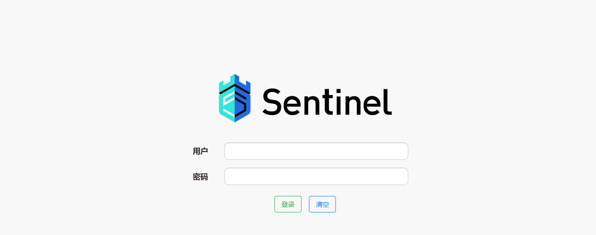

引入依赖

```xml
<dependency>
    <groupId>com.alibaba.cloud</groupId>
    <artifactId>spring-cloud-starter-alibaba-sentinel</artifactId>
</dependency>
```

在 yaml 之中

```yaml
spring:
  cloud:
    sentinel:
      transport:
        dashboard: localhost:8080
```

在引入配置文件之后，就可以在控制台看到对应的服务列表

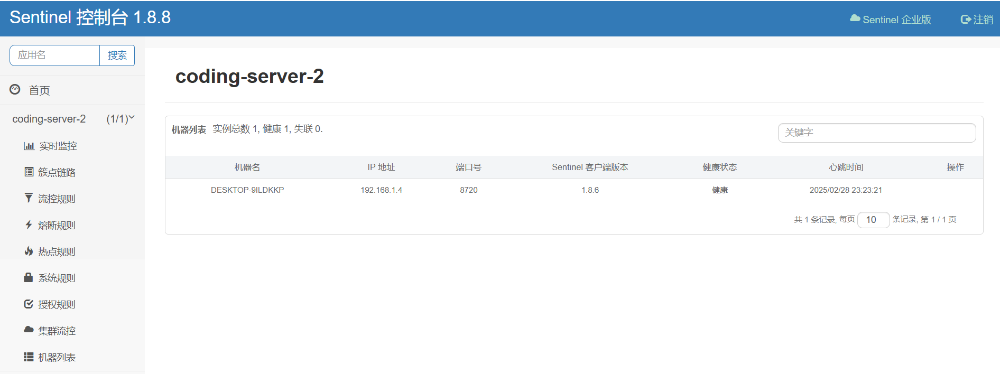

至此，我们就集成了 Sentinel。但是项目启动之后，并没有去连接 Sentinel，在控制台并不能够看到项目信息，这主要是因为 Sentinel 是懒加载机制，只有访问过一次的资源才能够被监控，可以通过修改如下配置：

```yaml
spring:
  cloud:
    sentinel:
      transport:
        dashboard: localhost:8080
      eager: true
```

这样，项目启动的时候，就去连接 Sentinel。

## 二、流量控制

流量控制，就是通过监控应用的流量的 QPS 等指标，当达到指定的阈值之后，对流量进行控制，避免瞬时的流量高峰冲款，从而保证应用的高可用性。

下面这个页面就是配置流量控制的页面

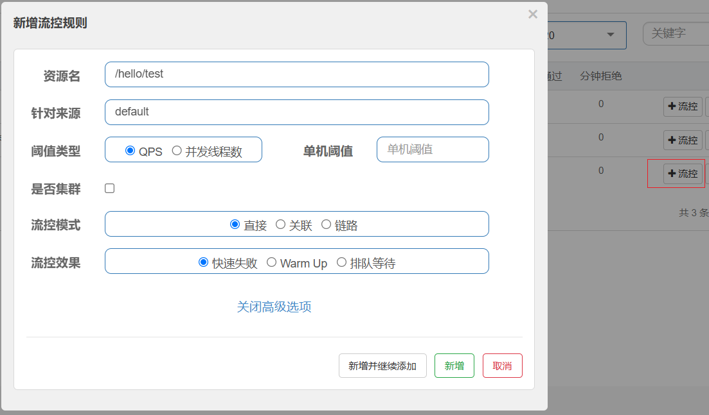

### 2.1 流控模式

对于流控规则，是指达到什么条件的时候进行限流，在 Sentinel 之中提供了 3 种方式，分别是：

- 直接：统计当前资源的请求，触发阈值的时候对当前的资源直接限流
- 关联：统计与当前资源相关的另一个资源，触发阈值时，对当前资源限流
- 链路：统计从指定链路访问到本资源的请求，触发阈值时，对指定链路限流

接下来，对 3 种方式进行实际演示

#### 2.1.1 直接

这里我们准备一个接口，示例代码如下：

```java
@GetMapping("/test")
public String test() {
    return "server2 test get success";
}
```

配置示例如下：

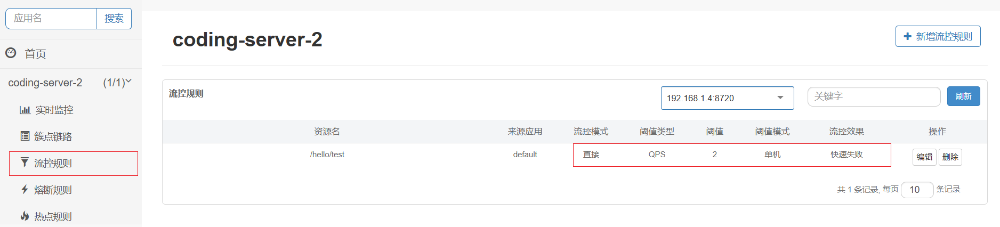

通过 JMeter 进行实际的压测，对应的配置如下：

> 含义：1秒内有10个线程发送请求，总共发送一次

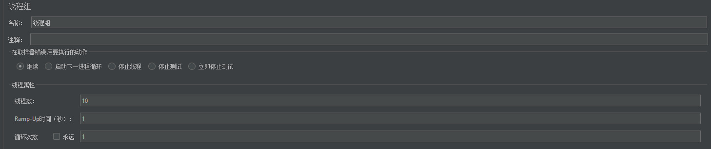

通过查看结果，确实只有两个请求通过了

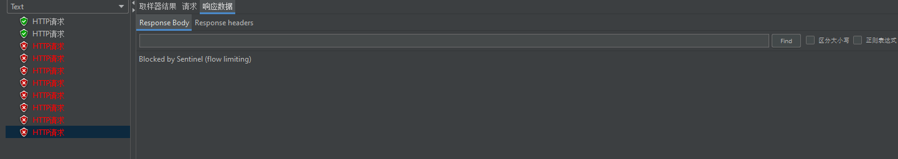

#### 2.1.2 关联

关联，是指统计当前线程关联的另一个资源，如果另一个资源达到了阈值，对当前的线程进行限流

这里，我们准备两个请求，

```java
@GetMapping("/test")
public String test() {
    return "server2 test get success";
}

@GetMapping("/test1")
public String test1() {
    return "server2 test1 get success";
}
```

对应的配置规则如下：

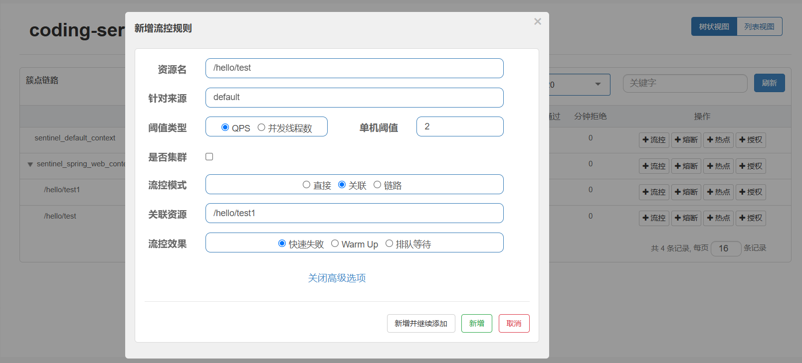

这表示，当 test1 达到配置的 QPS = 2 的时候，对 test 资源进行限流

当我们对于 test1 配置如下的压测线程时，此时再次发送 test 的请求，一个请求都不会进入

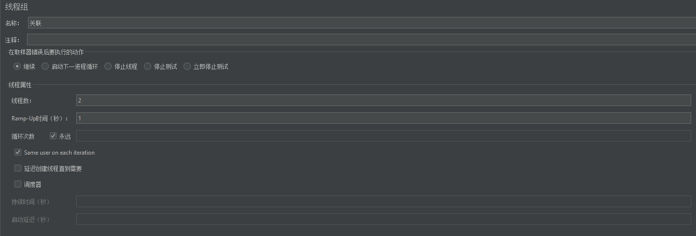

对于 test 请求的线程池配置如下：

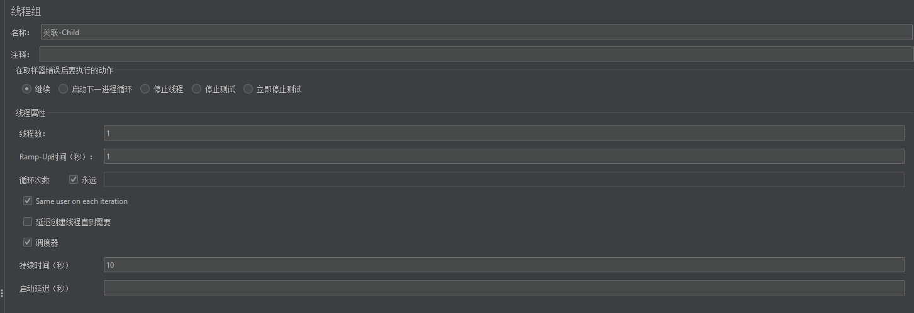

此时查看，test 请求并没有成功的，对应的聚合报告如下：

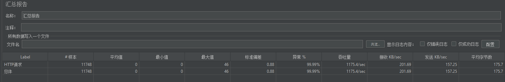

#### 2.1.3 链路

链路，统计从指定链路访问到本资源的请求，触发阈值时，对指定链路限流。一个被限流的方法，可能被多个 Controller 触发的链路进行调用，只对某个具体的入口进行限制。

请注意：Sentinel 默认只会标记 `Controller` 中的方法为资源，如果标记为其他的方法，需要利用 `@SentinelResource` 

::: code-group

```java [Controller]
@Resource
private UserService userService;

@GetMapping("/test")
public String test() {
    userService.login();
    return "server2 test get success";
}
```

```java [UserService]
@Service
public class UserServiceImpl implements UserService {
    
    @SentinelResource("login")
    @Override
    public String login() {
        return null;
    }
}
```

:::

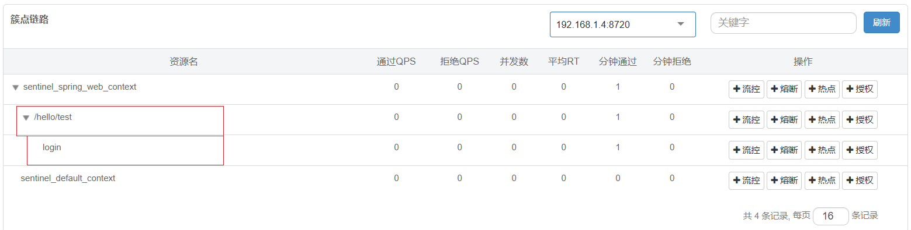

### 2.2 流控效果

流控效果是指请求达到流控阈值时应该采取的措施，在 Sentinel 之中，提供了三种方式：

- 快速失败
- warm up
- 排队等待

下面依次对，这三种方式进行说明

#### 2.2.1 快速失败

快速失败，达到阈值后，新的请求会被立即拒绝并抛出 FlowException 异常，这也是默认的方式

#### 2.2.2 预热模式

预热模式，当系统长期处于低水位的时候，当流量突然增大，直接把系统拉升到高水位可能瞬间把系统压垮。通过这种方式，让通过的流量缓慢增加，在一定时间内逐渐增加到阈值上线，给系统一个预热的时间，避免被压垮。

#### 2.2.3 排队等待

排队等待：让所有的请求按照先后次序排队执行，两个请求的间隔不能小于指定时长

## 三、服务降级

当服务出现异常时，系统可能承受不住大量请求，此时为了避免服务被冲垮，需要有一个限制瓶颈，当触发这个瓶颈的时候，快速失败。

### 3.1 慢调用比例

慢调用，业务的响应时间大于最大 RT，认定为慢请求。如果在统计的时间窗口之中，请求数量超过设定的最小数量，慢调用的比例大于设定的阈值，则触发熔断。

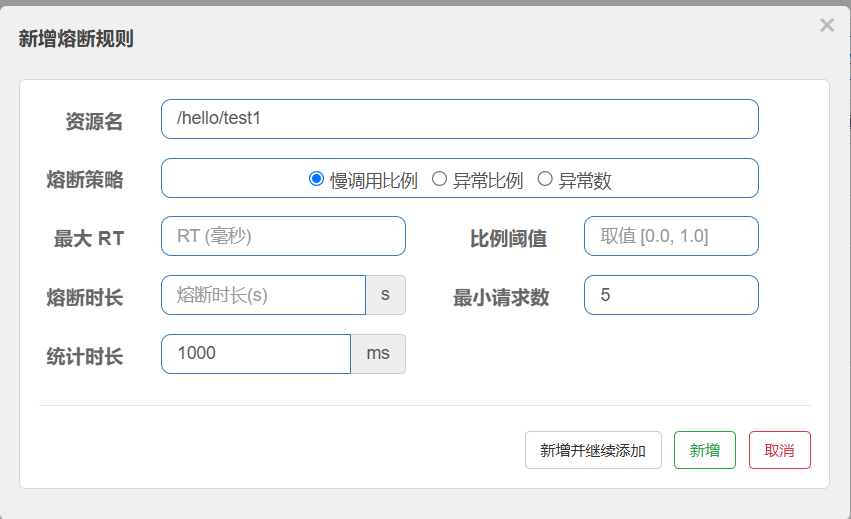

### 3.2 异常比例

异常比例，如果在统计的时间窗口之中，请求数量大于最小请求数，并且出现异常的比例大于设定的比例阈值，则触发熔断

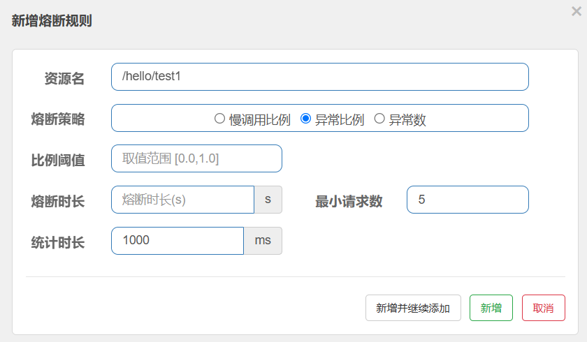

### 3.3 异常数

异常比例，如果在统计的时间窗口之中，请求数量大于最小请求数，并且出现异常的数量大于设定的数量，则触发熔断。

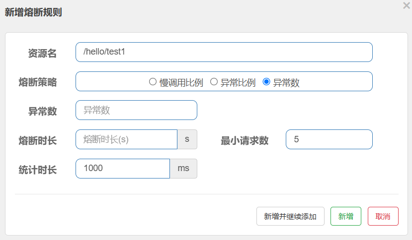

