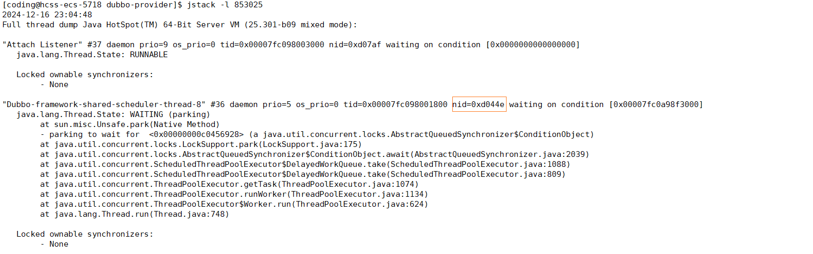
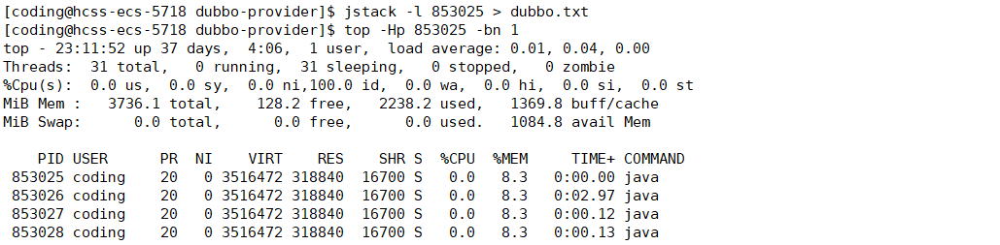

## 一、常用的命令

我这里准备了一个 SpringBoot 项目，接下来，我将从实际案例，来看一下，下面的这些命令。

基础环境：JDK 1.8.301

### jps

命令的格式

```markdown
jps [option] [hostId]
```

主要的选项如下

| 选项 | 作用                                                   |
| ---- | ------------------------------------------------------ |
| -q   |                                                        |
| -m   | 输出虚拟机进程启动时传递给主类的参数                   |
| -l   | 输出主类的全名，如果进程执行的是 jar 包，输出 Jar 路径 |
| -v   | 输出虚拟机集成启动的时候的 JVM 参数                    |

对于这个命令，可以查看一下当前虚拟机运行了那些 Java 进程。

如果不加任何的参数如下，只能看到进程号

```markdown
[coding@hcss-ecs-5718 dubbo-provider]$ jps
852894 Jps
852761 jar
```

如果需要查看时那个 jar 的时，就需要添加 `-l`  参数

```markdown
[coding@hcss-ecs-5718 dubbo-provider]$ jps -l
852761 dubbo-provider-1.0.0-SNAPSHOT.jar
852953 sun.tools.jps.Jps
```

如果想查看启动的时候携带的 JVM 参数信息可以添加 `-v`

```markdown
[coding@hcss-ecs-5718 dubbo-provider]$ jps -lv
853071 sun.tools.jps.Jps -Dapplication.home=/home/coding/jdk8 -Xms8m
853025 dubbo-provider-1.0.0-SNAPSHOT.jar -Xmx1024m
```

### jstat

作用：监视虚拟机的各种运行状态

命令的格式

```markdown
jstat [option] vmid [interval][s|ms] [count]
```

其中，interval 表示查询间隔，count 表示查询的次数，如果省略这两个参数，表示只查询一次。我们可以借助于这两个参数分析一下，各分区对象的增长速度。

主要的选项如下：

> -gc ： 监控 Java 堆的状况


其中各个参数对应的含义如下：

| 参数  | 含义                  | 参数   | 含义                 |
| ----- | --------------------- | ------ | -------------------- |
| `S0C` | s0 区的容量           | `MU`   | 方法区使用的大小     |
| `S1C` | s1 区的容量           | `CCSC` | 压缩类空间的大小     |
| `S0U` | s0 区已经使用的大小   | `CCSU` | 压缩类空间的使用大小 |
| `S1U` | s1 区已经使用的大小   | `YGC`  | 进行 Young GC 的次数 |
| `EC`  | Eden 区的容量         | `YGCT` | 进行 YoungGC 总耗时  |
| `EU`  | Eden 区已经使用的大小 | `FGC`  | 进行 Full GC 的次数  |
| `OC`  | 老年代的容量          | `FGCT` | 进行Full GC 总耗时   |
| `OU`  | 老年代已经使用的大小  | `GCT`  | 所有 GC 的总耗时     |
| `MC`  | 方法区的大小          |        |                      |

> -gcutil : 监控内容与 -gc 一致，但是输出主要关系的是 占用的 百分比


对于统计的指标量，不再是使用当前大小，而是占用的百分比，如 Eden 区占用了 39.44% 的内存

### jmap

作用：生成堆转储快照

命令格式：

```markdown
jmap [option] pid
```

常见的选项如下

| 选项           | 作用                                                         |
| -------------- | ------------------------------------------------------------ |
| -dump          | 生成 Java 快照，格式为：`-dump:[live,]format=b,file=<filename>` |
| -heap          | 显示 Java 堆的详细信息                                       |
| -histo         | 显示堆中对象统计信息                                         |
| -F             | 如果 -dump 没有响应的时候，可以通过这个选项，强制生成 dump 快照 |
| -finalizerinfo | 显示在 F-Queue 中等待 Filalizer 线程执行 finalize 方法的对象 |

比如说，我们可以通过如下的方式，生成快照，借助于 Eclipse mat 工具来进行二次分析

```markdown
[coding@hcss-ecs-5718 dubbo-provider]$ jmap -dump:format=b,file=dubbo-provider.bin 853025
Dumping heap to /home/coding/dubbo-provider/dubbo-provider.bin ...
Heap dump file created
[coding@hcss-ecs-5718 dubbo-provider]$
```

### jstack

作用：用于生成虚拟机当前时刻的线程快照

命令格式如下：

```markdown
jstack [option] pid
```

常用的选项如下：

| 选项 | 作用                                     |
| ---- | ---------------------------------------- |
| -F   | 当正常输出的请求无法响应的时候，强制输出 |
| -l   | 除了显示堆栈之外，显示锁的附加信息       |
| -m   | 如果调用本地方法，可以显示 C++/C 的堆栈  |



输出结果之中，比较重要的是 nid ，显示为 16进制。比如，我们执行了如下的命令：



我们将 PID 列对应的内容，转为 16 进制，去 jstack 的输出结果之中，找对应的 nid ，我们就能够找到占用 CPU 较高的线程是那个了，这也是分析 CPU 冲高的分析方式之一。

## 二、Eclipse mat

