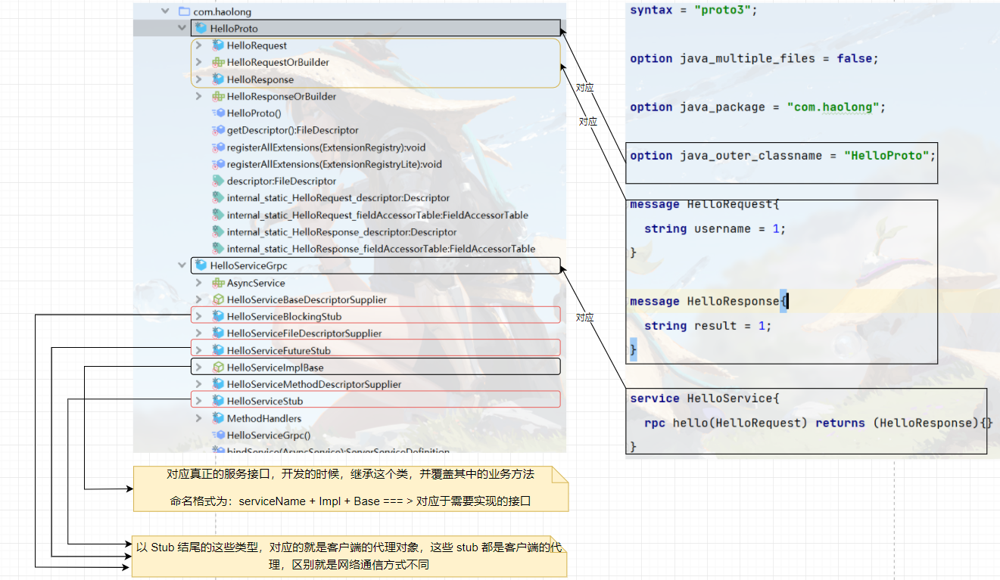
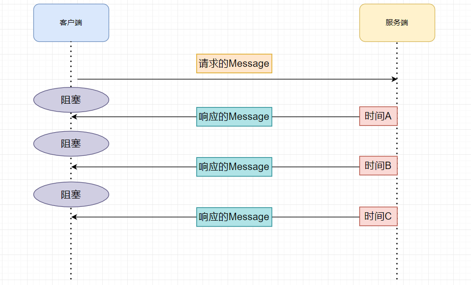
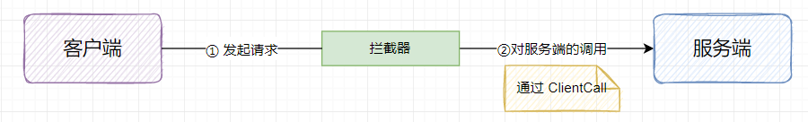

# GRPC

## 一、简介

gRpc 是有 google 开源的一个高性能的 RPC 框架。

1. 网络通信：gRPC自己封装了网络通信部分，提供多种语言的网络通信的封装
2. 协议：HTTP2 ，传输数据的时候，直接使用的是二进制数据。支持双向数据流
3. 序列化：使用二进制序列化方式，这种二进制方式叫做 protobuf，是google开源的一种序列化方式
    - 传输同样的数据的时候，使用protobuf ，在空间和时间效率是JSON的3到5倍
4. 代理的创建：让调用者向调用本地方法那样，去调用远端的服务方法

> <font style="color:black">gRPC 和 Thrift RPC 的区别</font>
>
> - 共性：两者都是支持异构语言的RPC框架
> - 区别
>     - 协议：Thrift RPC 使用 TCP；gRPC 使用 HTTP2
>     - 性能：Thrift RPC 效率是高于 gRPC

gRPC 的好处

- 高效的进行进程间的通信
- 支持多种语言，原生支持C，Go，Java实现
- 支持多平台运行，如 Linux，Android，IOS，MacOS，Windows
- 序列化方式使用 protobuf，效率更高 
- 使用HTPP2.0 协议

## 二、HTTP 2.0 协议

对于 HTTP 1.0 协议，采用请求响应的模式，是一个短连接协议，也可以称之为无状态协议，只能是单工通信，无法实现服务器的推送（这种有一个变现实现推送 ==> 客户端轮训的方式）

> <font style="color:black">TCP 是一个长连接协议，为什么 HTTP 是一个短连接协议呢？</font>
>
> 解答：HTTP 主动去断开的

对于 HTTP 1.1 协议，采用请求响应的模式，能够实现有限的长连接。

- 衍生技术：WebSocket，可是实现双工通信，实现服务器向客户端推送信息

> <font style="color:black">如何实现有限的长连接</font>
>
> 解答：请求头之中的 `keep-alive`

对于 HTTP 1.x 系列的协议，共性

- 传输数据采用文本格式，虽然可读性好，但是效率较差
- 本质上无法实现双工通信
- 资源的请求，需要发送多个请求，建立多个连接才能够完成

对于 HTTP 2.0 协议，是一个二进制协议，效率高于 HTTP 1.X 协议，但是可读性差；支持双工通信；一个请求，一个连接可以请求多个数据，定义了一个“流”的概念，它是二进制帧的双向传输序列，同一个消息往返的帧会分配一个唯一的流 ID。你可以把它想象成是一个虚拟的“数据流”，在里面流动的是一串有先后顺序的数据帧，这些数据帧按照次序组装起来就是 HTTP/1 里的请求报文和响应报文。

数据流的优先级：为不同的 stream 设置权重，来限制不同流的传输顺序

流控：客户端发送的速度比较快，服务端处理不过来，通知客户端暂停数据的发送

## 三、Protocol Buffers

> 简称：protobuf

`protobuf`，是一种与语言无关，与平台无关的中间语言，可以方便的在 客户端 和 服务端 之间进行RPC的数据传输

目前而言，protobuf 有两个版本，protobuf2 和 protobuf3，但是目前主流的版本是protobuf3

在使用过程之中，需要安装protobuf的编译器，编译器的目的，可以把protobuf 的IDL语言，转换成具体的某一种开发语言

### 3.1 编译器安装

```markdown
# GitHub 地址
https://github.com/protocolbuffers/protobuf/releases

# 对应版本的地址
https://github.com/protocolbuffers/protobuf/releases/tag/v3.19.6

# 直接解压缩即可

# 配置环境变量
配置到对应的bin目录之下

# 验证
protoc --version

# IDEA 插件安装
2021.2 版本之后的新版本，IDEA 内置了 Protobuf 插件

# 编译
protoc --java_out=/xxx /xx/xx.proto

# 编译示例
protoc --java_out=./java ./resources/study-protobuf.proto
```

### 3.2 语法

在学习语法之前，首先进行环境的搭建，在上一小节之中，已经安装了对应的编译器，在IDEA之中，创建一个新的 Module，作为 学习工程。

- 文件格式：文件的后缀名

```markdown
.proto
```

- 版本设定：`.proto`文件的第一行

```markdown
syntax = "proto3";
```

在我们新建一个 Module 之后，建立一个文件夹用来存放所有的 protobuf 文件，并新建一个 `demo.proto`开始学习下面的语法

1）单行注释

```markdown
//
```

2）多行注释

```markdown
/**
*
*/
```

03）与 Java 语言相关的语法

```markdown
# 后续 protobuf 生成的 Java 代码，为一个源文件还是多个源文件,这个值是可选的； true 为一个，false为多个
option java_multiple_files = true / false;

# 指定 protobuf 生成的类，放在那个一个包之中
option java_package = "";

# 指定 protobuf 生成的外部类的名称，用于管理内部类，内部类才是真正开发使用
option java_outer_classname = "";
```

04）逻辑包

- 对于 Java 工程师，这个用的少

```markdown
# 对于 protobuf 对于文件内容的管理
package xxx;
```

05）导入

```markdown
import "XXXX"
```

06） 基本类型

这里，可以去看看对应的官网

```markdown
https://protobuf.dev/programming-guides/proto3/
```

07）枚举

- 枚举的值，必须从 0 开始

```protobuf
enum SEASON = {
	SPRING = 0;
	SUMMER = 1;
}
```

08）Message

- 注意：这里的 1 表示 这个字段在里面的编号
- 编号从1开始，到 2^29 - 1结束，其中，19000 - 19999这个范围之中的编号不能够使用，由protobuf自己保留
- 关键字
    - `singular`：表示这个字段的值只能是 0 个或者 1个，默认关键字
    - `repeated`：表示这个字段的返回值是多个
    - `oneof`：表示只能使用里面的一个，后续如果使用name这个变量，只能是 `username` 和 `nickname` 其中的一个
- 可以定义多个消息
- 消息可以嵌套，如一个 消息里面定义了另一个 message ，比如示例三

```protobuf
message LoginRequest {
  string username = 1;
}
// 示例二
message UserInfo {
  oneof name {
    string username = 1;
    string nickname = 2;
  }
}
// 示例三
message User {
  message school {  
  }
}
```

09）服务

- 里面可以定义多个服务方法
- 定义多个服务接口

```protobuf
service HelloService {
	rpc hello(HelloRequest) returns(HelloResponse){};
}
```

## 四、第一个 gRPC 开发

### 4.1 准备

```markdown
protoc --java_out=/xxx /xx/xx.proto

# 示例
protoc --java_out=./java ./resources/study-protobuf.proto

# 实战之中使用 Maven 插件 进行 protobuf IDL文件的编译，并将它放置到IDEA的具体位置之上
https://github.com/grpc/grpc-java
```

按照这个 github 中的步骤，我们需要在Maven配置文件之中，引入了依赖和对应的插件

#### 1）添加依赖

```xml
<dependencies>
    <dependency>
        <groupId>io.grpc</groupId>
        <artifactId>grpc-netty-shaded</artifactId>
        <version>1.54.1</version>
        <scope>runtime</scope>
    </dependency>
    <dependency>
        <groupId>io.grpc</groupId>
        <artifactId>grpc-protobuf</artifactId>
        <version>1.54.1</version>
    </dependency>
    <dependency>
        <groupId>io.grpc</groupId>
        <artifactId>grpc-stub</artifactId>
        <version>1.54.1</version>
    </dependency>
    <dependency> <!-- necessary for Java 9+ -->
        <groupId>org.apache.tomcat</groupId>
        <artifactId>annotations-api</artifactId>
        <version>6.0.53</version>
        <scope>provided</scope>
    </dependency>
</dependencies>
```

#### 2）Maven 添加插件信息

```xml
<build>
    <extensions>
        <extension>
            <groupId>kr.motd.maven</groupId>
            <artifactId>os-maven-plugin</artifactId>
            <version>1.7.1</version>
        </extension>
    </extensions>
    <plugins>
        <plugin>
            <groupId>org.xolstice.maven.plugins</groupId>
            <artifactId>protobuf-maven-plugin</artifactId>
            <version>0.6.1</version>
            <configuration>
                <!--
                  1. ${os.detected.classifier} 获取操作系统的类型
                  2. com.google.protobuf:protoc 生成Message
                  3. io.grpc:protoc-gen-grpc-java 生成服务接口
                -->
                <protocArtifact>
                    com.google.protobuf:protoc:3.21.7:exe:${os.detected.classifier}
                </protocArtifact>
                <pluginId>
                    grpc-java
                </pluginId>
                <pluginArtifact>
                    io.grpc:protoc-gen-grpc-java:1.54.1:exe:${os.detected.classifier}
                </pluginArtifact>
            </configuration>
            <executions>
                <execution>
                    <goals>
                        <!--
                           1. compile 用于生成Message的命令
                           2. compile-custom 用于生成服务接口的命令
                         -->
                        <goal>compile</goal>
                        <goal>compile-custom</goal>
                    </goals>
                </execution>
            </executions>
        </plugin>
    </plugins>
</build>
```

在完成了上面的准备工作之中，我们首先来搭建项目的结构，和 `Thrift RPC` 开发过程之中的一样，我们需要api模块，server模块，client模块。按照正常的开发顺序，我们首先来开发 api 模块

### 4.2 Api 模块

在这个模块之中，我们首先来编写我们的 proto 文件。我们这里将 proto 文件统一放在 `src/main/proto`目录之下。

建立 Hello.proto 文件，在文件中编写如下内容：

```proto
syntax = "proto3";

option java_multiple_files = false;

option java_package = "com.haolong";

option java_outer_classname = "HelloProto";

message HelloRequest{
  string username = 1;
}

message HelloResponse{
  string result = 1;
}

service HelloService{
  rpc hello(HelloRequest) returns (HelloResponse){}
}
```

编写完成，我们需要将这个文件中编写的内容，按照如下的步骤，将 IDL 语言进行转化


不过这里发现，通过上面的步骤，执行完成之后，编译之后的文件是放在 target 目录之下的，在后续的步骤之中，我们还需要将生成的文件复制放在 java 目录之下，为了方便操作，我们对Maven 配置文件做一下修改，调整文件的生成位置

```xml
<build>
    <extensions>
        <extension>
            <groupId>kr.motd.maven</groupId>
            <artifactId>os-maven-plugin</artifactId>
            <version>1.7.1</version>
        </extension>
    </extensions>
    <plugins>
        <plugin>
            <groupId>org.xolstice.maven.plugins</groupId>
            <artifactId>protobuf-maven-plugin</artifactId>
            <version>0.6.1</version>
            <configuration>
                <!--
                  1. ${os.detected.classifier} 获取操作系统的类型
                  2. com.google.protobuf:protoc 生成Message
                  3. io.grpc:protoc-gen-grpc-java 生成服务接口
                -->
                <protocArtifact>
                    com.google.protobuf:protoc:3.21.7:exe:${os.detected.classifier}
                </protocArtifact>
                <pluginId>
                    grpc-java
                </pluginId>
                <pluginArtifact>
                    io.grpc:protoc-gen-grpc-java:1.54.1:exe:${os.detected.classifier}
                </pluginArtifact>
                <outputDirectory>
                    ${basedir}/src/main/java
                </outputDirectory>
                <clearOutputDirectory>
                    false
                </clearOutputDirectory>
            </configuration>
            <executions>
                <execution>
                    <goals>
                        <!--
                          1. compile 用于生成Message的命令
                          2. compile-custom 用于生成服务接口的命令
                        -->
                        <goal>compile</goal>
                        <goal>compile-custom</goal>
                    </goals>
                </execution>
            </executions>
        </plugin>
    </plugins>
</build>
```

到这里为止，api 模块生成的文件已经生成完成了。接下来就来看一下生成好的文件之中包含哪些内容，如下图所示：



<font style="color:orange">它是将 Message 放在了一个文件之下，将 service 放在了一个文件之下</font>

### 4.3 Server 模块

1）引入依赖：首先需要引入api模块

```xml
<dependencies>
    <dependency>
        <groupId>com.haolong</groupId>
        <artifactId>rpc-grpc-api</artifactId>
        <version>1.0-SNAPSHOT</version>
    </dependency>
</dependencies>
```

2）创建具体的实现类

```java
public class HelloServiceImpl extends HelloServiceGrpc.HelloServiceImplBase {
    @Override
    public void hello(HelloProto.HelloRequest request, StreamObserver<HelloProto.HelloResponse> responseObserver) 	  {

    }
}
```

> <font style="color:black">通过实现上述我们所说的 `HelloServiceImplBase` 之后，实现了对应的方法，但是我们发现这个方法居然没有返回值，并且我们在 proto文件之中定义了一个方法参数，但是这里有两个？</font>
>
> 解答：真正进行 GRPC实现的过程之中，业务方法的返回值在参数之中进行处理，通过观察者设计模式来设计

我们完善一下里面的方法内容

- 对于 Message 之中，属性的获取，gRPC 为我们提供了`getXXX()` 方法
- 对于`4.2`中的代码，如果不写，客户端程序即时发送完成了，也会一直等待

```java
@Override
public void hello(HelloProto.HelloRequest request, StreamObserver<HelloProto.HelloResponse> responseObserver) {
    // 1. 接受客户端的请求参数
    String username = request.getUsername();
    // 2. 业务处理
    System.out.println("username = " + username);
    // 3. 封装响应
    // 3.1 创建响应对象的构造者
    HelloProto.HelloResponse.Builder builder = HelloProto.HelloResponse.newBuilder();
    // 3.2 填充数据
    builder.setResult("method invoke success");
    // 3.3 封装响应对象
    HelloProto.HelloResponse response = builder.build();
    // 4. 结果返回
    // 4.1 处理后的响应的消息，通过网络回传客户端
    responseObserver.onNext(response);
    // 4.2 通知客户端，响应已经结束了
    responseObserver.onCompleted();
}
```

3）开启服务端

```java
public class GrpcServerMain {
    public static void main(String[] args) throws IOException, InterruptedException {
        // 1. 绑定端口
        ServerBuilder serverBuilder = ServerBuilder.forPort(9000);
        // 2. 发布服务
        serverBuilder.addService(new HelloServiceImpl());
        // 3. 创建服务对象
        Server server = serverBuilder.build();
        // 4. 开启服务
        server.start();
        server.awaitTermination();
    }
}
```

### 4.4 Client 模块

服务端开发完成之后，接下来就来开发客户端代码。

在开始之前，我们同样在 Client 模块的 XML 之中引入 api 模块的包！

```xml
<dependencies>
    <dependency>
        <groupId>com.haolong</groupId>
        <artifactId>rpc-grpc-api</artifactId>
        <version>1.0-SNAPSHOT</version>
    </dependency>
</dependencies>
```

接下来就开始编写客户端请求服务端的代码

```java
public class ClientMain {
    public static void main(String[] args) {
        // 1. 创建通信的管道
        ManagedChannel managedChannel = ManagedChannelBuilder.forAddress("localhost",9000).usePlaintext().build();
        // 2. 获得代理对象
        try {
            HelloServiceGrpc.HelloServiceBlockingStub helloService = HelloServiceGrpc.newBlockingStub(managedChannel);
            // 3. 完成 RPC 调用
            // 3.1 准备参数
            HelloProto.HelloRequest.Builder builder = HelloProto.HelloRequest.newBuilder();
            builder.setUsername("haolong");
            HelloProto.HelloRequest request = builder.build();
            HelloProto.HelloResponse response = helloService.hello(request);
            System.out.println("response = " + response);
        } catch (Exception e) {
            e.printStackTrace();
        } finally {
            // 4. 关闭连接
            managedChannel.shutdown();
        }
    }
}
```

到这里为止，我们的第一个 gRPC 流程开发就完成了！

## 五、gRPC 的四种通信方式


在GRPC之中，有四种通信方式，我们第四小节所写的 《第一个gRPC的开发》，也被称之为：简单RPC；

在简单RPC开发过程中，当客户端接收到服务端的结果之后，就直接通过`shutdown`方法，将服务进行停止了，相当于客户端与服务端只建立了一次连接，如果想接下来继续通信，只能客户端重启，再次发送！而我们更多的希望，在一次连接过程之中，服务端或者客户端能够持续性的向对方发送消息，这个时候简单RPC就不能够满足条件，这个时候就需要流式RPC。

对于持续性的发送，无非就是：客户端向服务端持续性的推送、服务端向客户端持续性推送、两者互相推送；这三种方式，也就对应于：客户端流式RPC、服务端流式RPC、双向流式RPC。

接下来，我们分别来说明一下四种通信方式！

### 5.1 简单RPC

对于简单RPC，通信流程如下：


**1） proto 文件**

```proto
syntax = "proto3";

option java_package = "com.haolong.grpc";

option java_outer_classname = "LoginApi";

option java_multiple_files = false;

enum accountType {
  manager = 0;
  customer = 1;
}

message UserReq {
  string username = 1;
  string password = 2;
  accountType type =3;
}

message UserVo {
  string code = 1;
  string desc = 2;
}

service Login {
  // 简单RPC
  rpc login(UserReq) returns(UserVo) {};
}
```

**2）服务端**

```java
@Slf4j
public class LoginService extends LoginGrpc.LoginImplBase {
    /**
     * 简单RPC
     * @param request
     * @param responseObserver
     */
    @Override
    public void login(LoginApi.UserReq request, StreamObserver<LoginApi.UserVo> responseObserver) {
        String username = request.getUsername();
        String password = request.getPassword();
        log.info("服务端接受到的参数，用户名为：{}，密码为：{}",username,password);
        LoginApi.UserVo.Builder responseBuilder = LoginApi.UserVo.newBuilder();
        responseBuilder.setCode("0");
        responseBuilder.setDesc("响应成功".getBytes(StandardCharsets.UTF_8).toString());
        responseObserver.onNext(responseBuilder.build());
        responseObserver.onCompleted();
    }
}
```

**3）客户端**

```java
@Slf4j
public class ClientMain1 {
    public static void main(String[] args) {
        ManagedChannel managedChannel = ManagedChannelBuilder
            .forAddress("localhost", 9000)
            .usePlaintext()
            .build();
        LoginGrpc.LoginBlockingStub loginBlockingStub = LoginGrpc.newBlockingStub(managedChannel);

        LoginApi.UserReq.Builder userReqBuilder = LoginApi.UserReq.newBuilder();
        userReqBuilder.setUsername("haolong");
        userReqBuilder.setPassword("123456");
        LoginApi.UserReq userReq = userReqBuilder.build();

        LoginApi.UserVo loginResponse = loginBlockingStub.login(userReq);
        log.info("请求结果：{}",loginResponse);

        managedChannel.shutdown();

    }
}
```

### 5.2 服务端流式RPC

> 所谓服务端流式RPC，其实就是，一个请求对象，服务端可以回传多个结果对象

整个业务流程图如下：



接下来我们就来看一下，怎么实现这一部分功能！

**1）proto 文件**

```protobuf
service Login {
  // 服务端流式RPC
  rpc loginServerStream(UserReq) returns(stream UserVo);
}
```

在语法方面，仅仅是多了一个 `stream` 关键字，其余的并没有变化；添加完成之后，我们重新生成一遍代码。其实对于服务端流式RPC，改动的也仅仅是客户端代码。我们首先来写一下服务端的代码，模拟一下，服务端向客户端推送的过程！

**2）服务端**

```java
/**
* 服务端流式RPC
* @param request
* @param responseObserver
*/
@Override
public void loginServerStream(LoginApi.UserReq request, StreamObserver<LoginApi.UserVo> responseObserver) throws InterruptedException {
    String username = request.getUsername();
    String password = request.getPassword();
    log.info("服务端接受到的参数，用户名为：{}，密码为：{}",username,password);
    for (int i = 0; i < 5; i++) {
        LoginApi.UserVo.Builder responseBuilder = LoginApi.UserVo.newBuilder();
        responseBuilder.setCode("0");
        responseBuilder.setDesc("server handle success");
        responseObserver.onNext(responseBuilder.build());
        TimeUnit.SECONDS.sleep(2);
    }
    responseObserver.onCompleted();
}
```

对于这段代码，进行几点说明：

- 服务端向客户端推送，调用的是`onNext`方法
- 服务端推送完成，最后调用`onCompleted`方法

写完服务端模拟推送之后，我们看一下客户端做了哪些改动！

**3）客户端**

```java
@Slf4j
public class ClientMain2 {
    public static void main(String[] args) throws InterruptedException {

        AtomicInteger atomicInteger = new AtomicInteger(1);
		// 1. 获取通信过程之中的通道
        ManagedChannel managedChannel = ManagedChannelBuilder
            .forAddress("localhost", 9000)
            .usePlaintext()
            .build();
		// 2. 构建代理对象
        LoginGrpc.LoginStub loginService = LoginGrpc.newStub(managedChannel);
		// 构建请求参数
        LoginApi.UserReq.Builder userReqBuilder = LoginApi.UserReq.newBuilder();
        userReqBuilder.setUsername("haolong");
        userReqBuilder.setPassword("123456");
        LoginApi.UserReq userReq = userReqBuilder.build();
		
        loginService.loginServerStream(userReq, new StreamObserver<LoginApi.UserVo>() {
            @Override
            public void onNext(LoginApi.UserVo userVo) {
                String code = userVo.getCode();
                String desc = userVo.getDesc();
                log.info("第 {} 次请求，接受到的请求状态码：{},描述信息为：{}",
                         atomicInteger.getAndIncrement(),code,desc);
            }

            @Override
            public void onError(Throwable throwable) {

            }

            @Override
            public void onCompleted() {
                log.info("请求完成，总共接收到 {} 次请求",atomicInteger.get() - 1);
            }
        });
        managedChannel.awaitTermination(100, TimeUnit.SECONDS);
    }
}
```

- 获取代理对象的过程之中，我们采用的是`newStub`
- 简单RPC之中，方法调用只需要传递请求参数就行，现在必须要求传递两个，增加了`StreamObserver`,用来接收服务端的推送结果。
    - 当服务端调用了一次`onNext`，在客户端这边的`onNext`方法就能够接收得到。
    - 当服务端调用`onCompleted`，在客户端就能够调用`onCompleted`接收到

通过日志，我们也能够看到调用的结果：


### 5.3 客户端流式RPC

编写完成服务端向客户端不断推送消息之后，我们接下来就来分析一下，作为客户端向服务端不断推送消息的场景！而这种推送方式，我们也称之为：客户端流式 RPC。

首先，我们看一下，proto 文件怎么去编写

```proto
service Login {
  // 客户端流式RPC
  rpc loginClientStream(stream UserReq) returns(UserVo) {};
}
```

重新生成一遍代码，再来看看服务端和客户端有哪些变化

首先来看一下服务端

```java
/**
* 客户端流式RPC
* @param responseObserver
* @return
*/
@Override
public StreamObserver<LoginApi.UserReq> loginClientStream(StreamObserver<LoginApi.UserVo> responseObserver) {
    return new StreamObserver<LoginApi.UserReq>() {
        @Override
        public void onNext(LoginApi.UserReq userReq) {
            String username = userReq.getUsername();
            String password = userReq.getPassword();
            log.debug("接收到客户端的请求：{},请求用户名为：{},请求密码为：{}",
                      atomicInteger.getAndIncrement(),username,password);
        }

        @Override
        public void onError(Throwable throwable) {
            log.error("接受客户端请求出现错误");
        }

        @Override
        public void onCompleted() {
            log.debug("服务端接受完成客户端的请求,总共接受的请求次数为：{}",atomicInteger.get() - 1);
            LoginApi.UserVo.Builder responseBuilder = LoginApi.UserVo.newBuilder();
            responseBuilder.setCode("0");
            responseBuilder.setDesc("sever invoke success");
            LoginApi.UserVo response = responseBuilder.build();
            responseObserver.onNext(response);
            responseObserver.onCompleted();
        }
    };
}
```

对于客户端呢

```java
/**
 * @project: Study-RPC
 * @description:
 * @author: haolong
 * @data: 2023/7/27 14:40
 */
@Slf4j
public class ClientMain3 {
    public static void main(String[] args) throws InterruptedException {

        ManagedChannel managedChannel = ManagedChannelBuilder.forAddress("localhost", 9000).usePlaintext().build();

        LoginGrpc.LoginStub loginService = LoginGrpc.newStub(managedChannel);

        StreamObserver<LoginApi.UserReq> userReqStreamObserver = loginService.loginClientStream(new StreamObserver<LoginApi.UserVo>() {
            @Override
            public void onNext(LoginApi.UserVo userVo) {
                log.debug("接收到服务端的反馈");
            }

            @Override
            public void onError(Throwable throwable) {
                log.info("通信过程出现异常");
            }

            @Override
            public void onCompleted() {
                log.info("服务端请求完成");
            }
        });
        for (int i = 0; i < 5; i++) {
            LoginApi.UserReq.Builder requestBuilder = LoginApi.UserReq.newBuilder();
            requestBuilder.setUsername("haolong" + i);
            requestBuilder.setPassword("1234546");
            LoginApi.UserReq userReq = requestBuilder.build();
            userReqStreamObserver.onNext(userReq);
            TimeUnit.SECONDS.sleep(1);
        }
        userReqStreamObserver.onCompleted();
        managedChannel.awaitTermination(100, TimeUnit.SECONDS);
    }
}
```

### 5.4 双向流式RPC

> 客户端可以发送多个请求消息，服务器响应多个响应消息

通信流程图如图所示：客户端和服务端可以在不同的时间点向对方发送消息


对于具体的开发代码如下：

1）proto 文件写法：在请求参数和返回值前面都添加 `stream`关键字

```protobuf
// 双向流RPC
rpc loginClientAndServerStream(stream UserReq) returns(stream UserVo) {};
```

在编写完成proto文件之后，还是与以往一样，使用Maven插件生成对应的代码

2）服务端写法：

```java
/**
* 双向流式RPC
* @param responseObserver
* @return
*/
@Override
public StreamObserver<LoginApi.UserReq> loginClientAndServerStream(StreamObserver<LoginApi.UserVo> responseObserver) {
    return new StreamObserver<LoginApi.UserReq>() {
        @Override
        public void onNext(LoginApi.UserReq userReq) {
            log.info("接收到客户端的请求");
            LoginApi.UserVo.Builder responseBuilder = LoginApi.UserVo
                .newBuilder().setCode("1").setDesc("server handler success");
            LoginApi.UserVo response = responseBuilder.build();
            responseObserver.onNext(response);
        }

        @Override
        public void onError(Throwable throwable) {
            log.info("接受客户端请求过程之中出现错误");
        }

        @Override
        public void onCompleted() {
            log.info("服务端出现完成");
            responseObserver.onCompleted();
        }
    };
}
```

客户端写法：

```java
/**
 * @project: Study-RPC
 * @description: 双向流 RPC
 * @author: haolong
 * @data: 2023/7/27 16:03
 */
@Slf4j
public class ClientMain4 {
    public static void main(String[] args) {
        ManagedChannel managedChannel = ManagedChannelBuilder.forAddress("localhost", 9000).usePlaintext().build();
        try {

            LoginGrpc.LoginStub loginService = LoginGrpc.newStub(managedChannel);
            StreamObserver<LoginApi.UserReq> userReqStreamObserver = loginService
                .loginClientAndServerStream(new StreamObserver<>() {
                @Override
                public void onNext(LoginApi.UserVo userVo) {
                    log.info("接收到服务端的推送");
                }

                @Override
                public void onError(Throwable throwable) {

                }

                @Override
                public void onCompleted() {
                    log.info("服务端推送完成");
                }
            });
            for (int i = 0; i < 5; i++) {
                LoginApi.UserReq.Builder builder = LoginApi.UserReq.newBuilder();
                builder.setUsername("haolong" + i);
                builder.setPassword("123456-" + i);
                LoginApi.UserReq userReq = builder.build();
                userReqStreamObserver.onNext(userReq);
            }
            userReqStreamObserver.onCompleted();
            managedChannel.awaitTermination(12, TimeUnit.SECONDS);
        } catch (InterruptedException e) {
            e.printStackTrace();
        } finally {
            managedChannel.shutdown();
        }
    }
}
```

## 六、代理方式

1）`BlockingStub`

- 阻塞通信方式

2）`Stub`

- 异步，通过监听处理的

3）`FutureStub`

- 同步，异步都支持；但是这种代理方式，只能够应用于一元 RPC

前两种方式，用法已经在上面的文章中共演示过了，这里只演示一下：`FutureStub`

```java
@Slf4j
public class ClientMain5 {
    public static void main(String[] args) {
        ManagedChannel managedChannel = ManagedChannelBuilder
            .forAddress("localhost", 9000)
            .usePlaintext().build();
        try {
            LoginGrpc.LoginFutureStub loginFutureStub = LoginGrpc.newFutureStub(managedChannel);

            LoginApi.UserReq.Builder reqBuilder = LoginApi.UserReq.newBuilder();

            reqBuilder.setUsername("haolong");
            reqBuilder.setPassword("123456");
            LoginApi.UserReq userReq = reqBuilder.build();

            ListenableFuture<LoginApi.UserVo> future = loginFutureStub.login(userReq);
            Futures.addCallback(future,new FutureCallback<LoginApi.UserVo>() {
                @Override
                public void onSuccess(LoginApi.UserVo userVo) {
                    log.info("get callback success");
                }
                @Override
                public void onFailure(Throwable throwable) {

                }
            }, Executors.newCachedThreadPool());
            LoginApi.UserVo userVo = future.get();
            log.info("获取到的请求结果：{},{}",userVo.getCode(),userVo.getDesc());
            managedChannel.awaitTermination(10, TimeUnit.SECONDS);
        } catch (InterruptedException e) {
            e.printStackTrace();
        } catch (ExecutionException e) {
            e.printStackTrace();
        } finally {
            managedChannel.shutdown();
        }
    }
}
```

## 七、SpringBoot 整合GRPC

在我们搭建GRPC的过程之中，我们涉及到了三个模块：API模块，服务端模块，客户端模块。

> <font style="color:black">对于API模块：</font>
>
> - 通过proto文件定义了消息以及服务接口。

对于这个模块来说，并没有进行封装的意义

> <font style="color:black">对于服务端模块</font>
>
> - 实现了API模块定义的服务接口
> - 发布服务

1）在原生的开发过程之中，我们通过下面的代码实现了服务接口

```java
public class HelloServiceImpl extends HelloServiceGrpc.HelloServiceImplBase{}
```

在和SpringBoot 整合过程之中，这一步并没有简化，或者说无法提供

2）对于服务的发布，我们是将这一部分的代码，写在了Main方法之中

```java
public static void main(String[] args) throws IOException, InterruptedException {
    // 1. 绑定端口
    ServerBuilder serverBuilder = ServerBuilder.forPort(9000);
    // 2. 发布服务
    serverBuilder.addService(new HelloServiceImpl());
    serverBuilder.addService(new TestFutureServiceImpl());
    // 3. 创建服务对象
    Server server = serverBuilder.build();
    // 4. 开启服务
    server.start();
    server.awaitTermination();
}
```

在和SpringBoot整合过程之中，会对这段代码进行封装，而在这一段代码之中，<font style="color:orange">变化的部分就是端口号和需要发布的服务</font>。在整合过程之中，Spring Boot 已经封装好了，但是我们需要做额外的配置。

- 对于端口号：在yml中配置；
- 对于需要发布的服务：在类上添加注解`@GrpcService`

这就是整合过程之中，服务端所进行的操作。我们来进行搭建环境,，

```xml
<dependency>
    <groupId>net.devh</groupId>
    <artifactId>grpc-server-spring-boot-starter</artifactId>
    <version>2.14.0.RELEASE</version>
</dependency>
<dependency>
    <groupId>com.haolong</groupId>
    <artifactId>rpc-grpc-api</artifactId>
    <version>1.0-SNAPSHOT</version>
    <exclusions>
        <exclusion>
            <groupId>io.grpc</groupId>
            <artifactId>grpc-netty-shaded</artifactId>
        </exclusion>
        <exclusion>
            <groupId>io.grpc</groupId>
            <artifactId>grpc-protobuf</artifactId>
        </exclusion>
        <exclusion>
            <groupId>io.grpc</groupId>
            <artifactId>grpc-stub</artifactId>
        </exclusion>
    </exclusions>
</dependency>
```

在yml之中进行配置

```yml
spring:
  application:
    name: grpc-server-name
grpc:
  server:
    port: 9090
```

但是在启动项目之中，发现里面起了一个Tomcat的端口，一个GRPC的端口。为解决这个问题，我们需要在配置文件中之中添加相关的配置

```yml
spring:
  application:
    name: grpc-server-name
  main:
    web-application-type: none
grpc:
  server:
    port: 9090
```

对于客户端的开发

```java
public static void main(String[] args) throws InterruptedException {
    //  1. 获取通信过程之中的管道
    ManagedChannel managedChannel = ManagedChannelBuilder.forAddress("localhost",9090).usePlaintext().build();
    try {
        // 2. 构建代理对象
        HelloServiceGrpc.HelloServiceBlockingStub helloServiceStub = HelloServiceGrpc.newBlockingStub(managedChannel);
        // 3. 完成 RPC 的调用
        // 3.1 构建参数
        HelloProto.HelloRequest.Builder requestBuilder = HelloProto.HelloRequest.newBuilder();
        requestBuilder.setUsername("haolong");
        HelloProto.HelloRequest request = requestBuilder.build();
        // 3.2 调用
        HelloProto.HelloResponse response = helloServiceStub.hello(request);
        log.debug("获取到的执行结果为：{}",response);
    } catch (Exception e) {
        e.printStackTrace();
    } finally {
        managedChannel.shutdown();
    }
}
```

核心内容为：① 通过管道设置IP和端口；② 获取远端服务的代理

对于IP和端口的设置，将信息放在yml之中进行配置；

对于获取远端服务的代理，本质就是一个对象，将其放在容器之中，直接进行使用即可

其实就是和其他的那些Starter引入之后一样。

## 八、拦截器

作为拦截器而言，其实就是请求真正达到之前，做统一的处理，比如说鉴权，数据校验，限流等。

常见的拦截器：

- Java Web 开发中的 `Filter`
- Spring MVC 中的 `Interceptor`
- Spring Security 中的 `Filter`
- Netty 中的 `Handler`

在 GRPC 之中，也为我们提供了拦截器，作用和思想和之前所学的拦截器都是一样的。他为我们提供了两类的拦截器（这种主要是根据四种通信方式来进行划分）：

- 针对于一元请求的拦截器
- 针对于流式请求的拦截器

而这两大类，里面有细分为`客户端`和`服务端`

### 8.1 一元拦截器

#### 01 客户端拦截器

1）简单客户端拦截问题

- **步骤一：开发拦截器**

```java
@Slf4j
public class CustomInterceptor implements ClientInterceptor {
    /**
     * @param methodDescriptor 方法藐视，那个类的那个方法，方法参数是什么
     * @param callOptions 额外的数据
     * @param channel 通信通道
     * @return
     */
    @Override
    public <ReqT, RespT> ClientCall<ReqT, RespT> interceptCall
        (MethodDescriptor<ReqT, RespT> methodDescriptor, CallOptions callOptions, Channel channel) 
    {
        log.debug("这是一个拦截器启动类，统一处理");
        return channel.newCall(methodDescriptor,callOptions);
    }
}
```

通过Debug方式启动，查看一下对应的方法参数：


添加了拦截器之后，服务通信过程如图所示：



图中也标注了，对于服务端的调用，实际上是通过`ClientCall`对象来完成的，那么这个对象是如何获取的？对于 gRPC 来讲，底层使用的是Netty来进行的通信，通信的核心就是Channel，而`ClientCall`又是完成对服务端调用的核心对象，所以对于这个对象的获取，应该通过channel来获取

- **步骤二：添加拦截器**
    - 添加过程之中，`usePlaintext`方法 和 `intercept`方法，两个方法的顺序是可以调换的，但是必须保证在`build`方法之前

```java
ManagedChannel managedChannel = ManagedChannelBuilder
               .forAddress("localhost",9000)
               .usePlaintext()
               .intercept(new CustomInterceptor())
               .build();
```

出现的问题：

- 只能拦截请求，不能拦截响应

- 即使拦截了请求操作，粒度业务广泛，不精准
    - 一个请求划分为：① 开始阶段，②设计消息数量，③发送数据阶段，④ 半连接阶段

2）复杂拦截器

- 解决了简单客户端拦截器出现的问题
- 对于这个复杂的拦截器，要想完成分阶段的拦截，就必须渗透到`ClientCall` 方法之中，这也是装饰器设计模式的典型体现
    - 装饰器设计模式
- 如果说我们需要使用这种拦截器，就需要对原始的`ClientCall`进行包装，包装完成之后，由这个包装完成的`ClientCall`完成对服务端的调用

> 装饰者设计模式：主要作用是给原始类添加功能。

实例代码如下：

```java
@Slf4j
public class CustomForwardingClientClass<ReqT,ResT> extends ClientInterceptors.CheckedForwardingClientCall<ReqT,ResT> {
    /**
     * @param delegate 最为原始的 ClientCall，没有经过包装
     */
    protected CustomForwardingClientClass(ClientCall<ReqT, ResT> delegate) {
        super(delegate);
    }

    /**
     * 步骤一：请求开始的时候进行调用
     * @param listener
     * @param metadata
     * @throws Exception
     */
    @Override
    protected void checkedStart(Listener<ResT> listener, Metadata metadata) throws Exception {
        log.debug("发起请求之前进行检查");
        // 由于通信的还是通过 ClientCall，所以说我们还需要通过 ClientCall 发起请求
        // 1. 如果说需要发送,就调用下面这一行代码，如果否，就不要调用下面这一行
        delegate().start(listener,metadata);
    }

    /**
     * 步骤二:设置发送消息的数量
     * @param numMessages
     */
    @Override
    public void request(int numMessages) {
        super.request(numMessages);
    }

    /**
     * 步骤三：发送数据
     * @param message
     */
    @Override
    public void sendMessage(ReqT message) {
        super.sendMessage(message);
    }

    /**
     * 步骤四：半连接，无法在发送请求的消息，但是能够响应的消息
     */
    @Override
    public void halfClose() {
        super.halfClose();
    }
}
```

通过控制台查看日志的打印顺序：


到现在为止，我们说明的都是请求拦截器，但是针对于服务端的响应数据做拦截，又该如何去做？这里就会出现一个问题：既然客户端要把数据给拦截掉，那么为什么服务端不能够直接不发呢？主要原因在于可能有多个客户端，不同客户端想要的结果可能是不同的！

开发 Listener

```java

```

在服务端调用onNext方法的时候，这个时候会把头打过来；服务端调用onCompleted方法的时候，这个时候会把消息打回来。

#### 02 服务端拦截器

1）简单服务端拦截器

2）复杂服务端拦截器

### 8.2 流式拦截器

#### 01 客户端拦截器

对于这个拦截器的核心就是使用：`ClientStreamTracer`，而这个对象的获取需要通过`ClientStreamTracerFactory`来获取

通过：ClientStreamTracerFactory  来创建 ClientStreamTracer

1）创建 ClientStreamTracer

```java
/**
 * 主要用于客户端流式拦截
 * @param <ReqT>
 * @param <RespT>
 */
@Slf4j
class CustomerClientStreamTracer<ReqT,RespT> extends ClientStreamTracer {
    // 1. 如果想拦截请求，覆盖 outbound 相关的方法

    @Override
    /**
     * 1.1 拦截消息的发送
     * @param seqNo 客户端发送数据的编号
     * @param optionalWireSize
     * @param optionUncompressedSize
     */
    public void outboundMessageSent(int seqNo, long optionalWireSize, long optionalUncompressedSize) {
        log.debug("client 拦截器，监控请求相关的操作：消息的序号：{}",seqNo);
        super.outboundMessageSent(seqNo, optionalWireSize, optionalUncompressedSize);
    }

    // 2. 如果想拦截响应，覆盖 inputbound 相关的方法
}
```

2）创建 ClientStreamTracerFactory  

```java
/**
 * 用来创建 ClientStreamTracer
 * @param <ReqT>
 * @param <RespT>
 */
class CustomerClientStreamTracerFactory<ReqT,RespT> extends ClientStreamTracer.Factory {
    /**
     * 创建 ClientStreamTracer 对象
     * @param info
     * @param headers
     * @return
     */
    @Override
    public ClientStreamTracer newClientStreamTracer(ClientStreamTracer.StreamInfo info, Metadata headers) {
        return new CustomerClientStreamTracer<>();
    }
}
```

3）开发拦截器

```java
/**
 * @project: rpc-lession
 * @description: 客户端流式拦截器
 * @author: haolong
 * @data: 2023/6/28 22:34
 */
@Slf4j
public class CustomerClientInterceptor implements ClientInterceptor {
    @Override
    public <ReqT, RespT> ClientCall<ReqT, RespT> interceptCall(MethodDescriptor<ReqT, RespT> methodDescriptor, CallOptions callOptions, Channel channel) {
        log.info("执行客户端拦截器。。。。。。。");
        //  将自己开发的 ClientStreamFactory 融入到 GRPC 的体系之中
        callOptions = callOptions.withStreamTracerFactory(new CustomerClientStreamTracerFactory<>());
        return channel.newCall(methodDescriptor,callOptions);
    }
}
```

#### 02 服务端拦截器

相比于客户端流式拦截器，服务端流式拦截器的inbound 和 outbound 的角度就有所不同了，其实对于输入和输出来讲，如果站在服务端的角度而言，对于服务端来说是输入，但是对于客户端来说就是响应。

在开发上，需要`CustomerClientStreamTracer`来进行实际的拦截型操作，需要`CustomerServerStreamTracerFactory`完成对`CustomerClientStreamTracer`对象的获取操作，但是需要注意的是，此时这个Factory之中的方法，需要强制我们去实现！

接下来就来看看具体的代码实现。

## 九、客户端重试机制

主要目的，保证系统的可靠性！

在GRPC 调用过程之中，因为网络的延迟或者抖动，可能造成客户端暂时连接不上服务端的情况，如果说出现了此类情况的话，那么可以让客户端重试连接，尽可能的的避免，因为网络问题，影响通信，从而保证系统的可靠性。

在 GRPC 之中，已经为我们定义了一些数据信息


```json
{
  "methodConfig": {
    "name": [
      {
        "service": "HelloServiceImpl", // 服务的名称，对应proto文件之中的 package
        "method": "hello" // 服务方法的名称
      }
    ],
    "retryPolicy" : {
      "maxAttempts": 3, // 重试次数
      "initialBackoff": "0.5s", // 初始重试的延迟时间
      "maxBackoff": "30s", // 最大重试的延迟时间
      "backoffMultiplier":2, // 退避质数，每一次重试时间的间隔
      "retryableStatusCodes": [ //  只有接受到这个数组中描述的异常，才会发起重试
        "UNAVAILABLE"
      ]
    }
  }
}
```

## 十、命名解析 NameResovler

### 10.1 简介

1）什么是命名解析? 本质上就是 SOA 或者微服务之中，所说的注册中心。

最开始的服务调用时这样的，多个客户端去调用服务端的一个 RPC 接口


随着服务端的压力过大，需要进行集群部署


2）为什么需要命名解析？

- 通过名称就能够访问到某一个应用


目前开发过程之中，常见注册中心：

- Dubbo
- zookeeper
- SpringCloud体系：eureka，nacos，consul

在 gRPC 之中，采用的注册中心：

- 默认gRPC 是通过DNS作为注册中心的
- 可以用户自定义注册中心，比如使用zookeeper，consul 等

如何进行 gRPC 注册中心的扩展

|            | zookeeper | etcd   | consul |
| ---------- | --------- | ------ | ------ |
| 开发语言   | Java      | go     | go     |
| 算法       | Paxos     | Raft   | Raft   |
| 多数据中心 | 不支持    | 不支持 | 支持   |
| web管理    | 支持      | 不支持 | 支持   |

### 10.2 Consul

[Consul](https://www.consul.io/)，是HashiCorp 公司开源的工具，用于实现分布式系统中的服务发现与配置。

1）作用：注册中心、配置中心

2）好处：安装简单、自带web管理界面

3）安装

consul agent -dev

服务注册的本质：consul 进行服务的注册的时候，不关心服务的名称，服务的功能

将一个 grpc 功能的集群，定义一个逻辑的名字

consul 会自己进行健康检查，本质就是我们提供的这个服务的 IP + 端口是不是可以进行通信

进行服务的删除

```markdown
http://127.0.0.1:8500/v1/agent/service/deregister/服务名
```

如果说不做健康检查，那么consul 是无法确定服务是否存活

底层就是开了新的线程

那么客户端又是如何从consul中获取一个健康的节点呢？

但是获取健康实例的过程之中，可能不够准确，

当客户端获取到多个健康的节点之后，有客户端负载均衡决定，客户端访问哪一个服务

### Grpc 中 Consul 注册中心的开发

服务端的处理

```java
package com.haolong.service;

import com.orbitz.consul.AgentClient;
import com.orbitz.consul.Consul;
import com.orbitz.consul.model.agent.ImmutableRegistration;
import com.orbitz.consul.model.agent.Registration;
import io.grpc.Server;
import io.grpc.ServerBuilder;
import lombok.extern.slf4j.Slf4j;

import java.io.IOException;
import java.util.Collections;
import java.util.Random;
import java.util.UUID;

/**
 * @project: rpc-lession
 * @description:
 * @author: haolong
 * @data: 2023/7/9 16:30
 */
@Slf4j
public class GrpcConsulServerMain2 {
    public static void main(String[] args) throws IOException, InterruptedException {

        Random random = new Random();
        int port = random.nextInt(65535);

        ServerBuilder<?> serverBuilder = ServerBuilder.forPort(port);
        serverBuilder.addService(new HelloServiceImpl());
        Server server = serverBuilder.build();
        String address = "127.0.0.1";
        server.start();
        log.info("server is start...,本次启动的端口是：{}",port);
        registerToConsul(address,port);
        server.awaitTermination();
    }

    private static void registerToConsul(String address,Integer port) {
        Consul consul = Consul.builder().build();
        AgentClient agentClient = consul.agentClient();
        String serviceId = "Server-" + UUID.randomUUID().toString();
        ImmutableRegistration service = ImmutableRegistration.builder()
                .id(serviceId)
                .name("grpc-server")
                .address(address)
                .port(port)
                .tags(Collections.singletonList("server"))
                .meta(Collections.singletonMap("version", "1.0"))
                .check(Registration.RegCheck.tcp(address + ":" + port, 10))
                .build();
        agentClient.register(service);
    }
}
```

客户端的开发

客户端在访问具体的GRPC服务之前，到命名中心，去查找注册的服务

通过 NameResolver ，根据名字，去注册中心查找服务，进而进行访问，而 NameResolver 的获取，实际上是通过 NamResolverProvider 进行创建

Grpc中的内置命名的解析，采用DNS的方式处理注册中心，

修改自定义的名字解析的优先级，让其高于DNS，才可以使用 consul 进行替换

客户端需要进行负载均衡的处理，这部分是有 grpc 客户端内置

```java

```

## 十一、Spring Boot 整合


