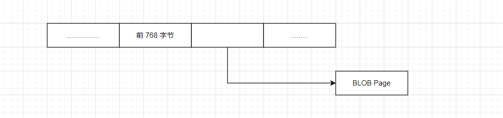
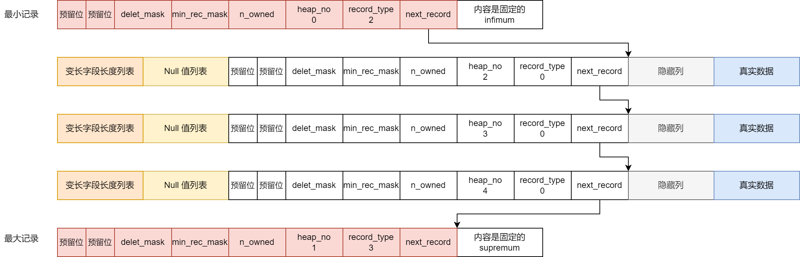

# InnoDB

## 一、基本信息

InnoDB 是一个将表中的数据存储到磁盘上的存储引擎，所以即使关机之后重启我们的数据还是存在的。而真正处理数据的过程是发生在内存中，所以需要把磁盘中的数据加载到内存中，如果是处理写入或者修改请求的话，还需要把内存中的内容刷新到磁盘中。

由于 IO 和 内存 之间的速度差异太大，所以当我们想从表中获取数据的时候，InnoDB 并没有一条一条从磁盘中读取，而是，将数据划分为若干个页，以页作为磁盘和内存之间的交互的基本单位，页的大小一般是16KB，所以，MySQL 最少从磁盘中读取 16KB 的数据到内容，同样一次最少把内存中 16KB 的数据刷新回到磁盘中。

## 二、行格式
### 2.1 基本信息
我们平时是通过记录为单位来向表中插入数据，这些记录在磁盘上的存放方式也被称之为`行格式`或者`记录格式`。MySQL一共提供了四种行格式：`Compact`、`Redundant`、`Dynamic`、`Compressed`。我们可以通过如下的语法，用来指定行格式：

```sql
-- 创建表的时候，指定行格式

create table user(
    id int,
    name varchar(25)
)engine = InnoDB ROW_FORMAT = COMPACT ;

-- 修改行格式

alter table user ROW_FORMAT=REDUNDANT ;
```

接下来，我们就来对这几种行格式进行说明！

### 2.2  Compact 行格式


对于这种行格式，将数据分为了两个部分！

我们首先准备一下，测试环境。

```sql
create table test_compact(
	t1 varchar(10),
	t2 varchar(10),
	t3 varchar(10),
	t4 char(10)
) engine=INNODB charset=ASCII ROW_FORMAT=compact;

insert into test_compact(t1,t2,t3,t4) values('a','bb','ccc','ddd');

insert into test_compact(t1,t2,t3,t4) values('a1',null,'ccc1','ddd1');
```

在 Linux 上解析对应的 ibd 文件：

```markdown
hexdump -C -v test_compact.ibd > a.txt
```

接下来打开对应的文件

```sql
00010070  73 75 70 72 65 6d 75 6d  03 02 01 00 00 00 10 00  |supremum........|
00010080  2b 00 00 00 00 2b 12 00  00 00 00 93 83 82 00 00  |+....+..........|
00010090  00 d3 01 10 61 62 62 63  63 63 64 64 64 20 20 20  |....abbcccddd   |
000100a0  20 20 20 20 04 02 02 00  00 18 ff c4 00 00 00 00  |    ............|
000100b0  2b 13 00 00 00 00 93 84  81 00 00 00 d5 01 10 61  |+..............a|
000100c0  31 63 63 63 31 64 64 64  31 20 20 20 20 20 20 00  |1ccc1ddd1      .|
000100d0  00 00 00 00 00 00 00 00  00 00 00 00 00 00 00 00  |................|
```

我们将上面的数据分为两个部分，分别对应两条插入的 sql

```markdown
# 变长字段的长度
03 02 01

# NULL值列表
00

# 记录头信息
00 00 10 00 2b

# 隐藏列 - row_id
00 00 00 00 2b 13

# 隐藏列 - transaction_id
00  00 00 00 93 83

# 隐藏列 - roll_point
82 00 00 00 d3 01 10

# 真实数据
61 62 62 63 63 63 64 64 64 20 20 20 20 20 20 20
```

对于第二列：

```markdown
# 变长字段的长度
04 02

# NULL值列表
02

# 记录头信息
00  00 18 ff c4

# 隐藏列 - row_id
00 00 00 00 2b 12

# 隐藏列 - transaction_id
00 00 00 00 93 84

# 隐藏列 - roll_point
81 00 00 00 d5 01 10

# 真实数据
61 31 63 63 63 31 64 64 64 31 20 20 20 20 20 20
```

### 2.2.1 额外信息
#### 2.2.1.1 变长字段长度列表
在MySQL中，支持一些变长的数据类型，也就是说他存储的字节数不是固定的，如 varchar，我们将这些数据类型称之为：变长字段。由于可变，为了避免混乱，在存储的时候，保存了其对应的长度。在上面的案例中，对应于最开始的：

```markdown
 03 02 01
```

并且，顺序与我们实际存储的顺序相反。并且，如果说存储的数据为 null，则不会在里面进行记录

```markdown
# 变长字段的长度
04 02
```

在我们的案例过程之中，我们采用的是 ascii 字符集，一个字符是固定的 1 个字节，对于 char 类型。

如果说列的长度小于 255 字节，用 1 字节表示，否则，使用 2 个字节来表示。

varchar(N) 里面的 N 是指字符的长度，而 65535 ，单位指的是字节

#### 2.2.1.2 NULL值列表
对于一个列中，能存放`null`，而将他们存放在记录真实数据的位置中就会占用很多的地方，所以可以将他们统一进行管理，存储在`NULL`值列表中。每个允许存储NULL 的列对应于一个二进制位。如果是 0，表示不为 NULL，如果是1，表示为 NULL。同样也是按照列的顺序逆序排列。

在上面的案例中，4 个列都是允许存放 null 的，所以每列都是有一个二进制位进行替代的。

```markdown
# NULL值列表
02

# 对应的二进制就表示
0000 0010
```

从上面的结果，就能够看出，t2 列对应的二进制为 1，存储的是 null

:::tips
请注意： NULL值列表必须用整数个字节的位来表示，如果不够，高位补 0。因为，在我们的案例之中，我们只有 4 列，只有对应 4 个 bit 位，用 1 个字节就够用了。但是如果说，我们有 9 列，每一列都允许存放 null 的话，就会占用 2 个字节，不允许存放 null 的列，不会有这个二进制位来表示是否是 null。

:::

#### 2.2.1.3 记录头信息
由固定的5个字节组成，共组成 40 个二进制位，不同的位表示不同的意思。


最后一个字段 next_record，用来表示下一条记录的相对位置，即当前记录的位置加上偏移量就是下一条记录的其实位置，所以，在 InnoDB 存储引擎之中，通过一种链表的结构来串连各个行记录的。

### 2.2.2 真实的数据
除了我们自定义的列之外，MySQL会为每个记录默认的添加一些列，也叫做隐藏列

| 列名 | 是否必须 | 占用空间 | 描述 |
| :---: | :---: | :---: | :---: |
| row_id | 否 | 6字节 | 行ID，唯一标识一条记录 |
| transaction_id | 是 | 6字节 | 事务ID |
| roll_pointer | 是 | 7字节 | 回滚指针 |


如果说创建表的时候，没有显式的定义主键，则 InnoDB 首先会选择表中非空的唯一索引作为主键，如果没有，则会自动创建一个 6 字节大小的指针。

对于 char 和 varchar 如果存储的都是 null，都不存储在真实列之中。

在我们的案例之中，如果说 char 类型，没有完全占用里面的空间，则会使用 0x20 来进行填充

### 2.3 Redundant 行格式


1. 字段长度偏移列表
+ 会将该条记录中所有列（包括隐藏列）的长度信息都逆序存储到字段长度偏移列表中
+ 因为该行格式并没有NULL值列表，所以将列对应的偏移量值的第一个比特位作为是否是NULL的依据，该比特位也可以称之为NULL的依据，如果该比特位为1就是NULL，反之不是。同时，对于存储NULL的字段是变长数据类型，则不再`记录的真实数据`处占用任何的存储空间；但是对于存储NULL的字段是定长数据类型，则该字段对应的数据使用`Ox00`字节进行填充。
2. 记录头信息
+ 占用6个字节，48个二进制位

### 2.4 行溢出数据
InnoDB 存储引擎可以将一条记录中的某些数据存储在真正的数据页面之外。

首先，来看一下 varchar 类型。当我们创建一个 65535 长度的 varchar 类型的时候，会出现报错

```sql
create table test_varchar(
	name varchar(65535)
) engine=innodb charset=ascii
> 1118 - Row size too large. The maximum row size for the used table type, not counting BLOBs, is 65535. This includes storage overhead, check the manual. You have to change some columns to TEXT or BLOBs
> 时间: 0.001s
```

那么，varchar 类型不支持 65535 字节吗？当我们换位 65532 字节的时候，就可以了。而当我们更换字符集， 65532 就不可以了。

所以，varchat(N) ，这个里面的 N 是指字符的长度，最大支持存储 65532 个字节的数据。在 InnoDB 中，一个数据页的大小为 16 KB，也就是 16384 个字节，而他支持 65532 个字节的数据，在一页之中是不可能存储的。因此，在一般情况之下，数据都是存放在页类型为 B-tree node 之中，但是当发生行溢出的时候，数据存放在了 Uncompress Blob 的页之中。



而多长的 varchar 会存放在 BLOB Page 之中？要保证数据页之中，至少能够存放在 2 条行记录，varchar 类型的行数据就不会存放在 BLOB 页之中。

### 2.5 Compressed 和 Dynamic
这两种类型的行格式，是 InnoDB 1.0.x 版本开始引入的新的文件格式。这种新的行格式，对于存放在 BLOB 的数据，完全了完全的行溢出的方式，在数据页之中，只会存出 20 个字节的指针，实际的数据都是存放在 Off Page 之中的，而之前的两种格式都会存放 768 个前缀字节。

Compressed 行格式的另一个功能就是，存储在里面的行数据会以 zlib 的算法来进行压缩，对于 BLOB，TEXT，Varchar 这类大长度类型的数据能够进行有效的存储

### 2.6 char 类型
对于 char 类型，char(M) 表示，最多存储 M 个字符的元素。如果说采用的是定长字符集的时候，该列占用的字节数不会被加入到变长字段列表之中，而如果说采用变长字符集的时候，该列占用的字节数才会被加入到变长字段列表之中。

```sql
create table test_char(
  name_varchar varchar(10),
	name char(10)
) charset=utf8;

insert test_char(name_varchar,name) values('coding','coding');
```

接下来，我们来看一下他的行格式

```markdown
 0a 06 
 00 
 00 00 10 ff f0
 00 00 00 00 2b 16 
 00 00 00 00 94 a9 
 81 00 00 00 b5 01 10 
 63 6f 64 69 6e 67 63 6f 64 69 6e 67 20 20 20 20
```

从这个里面，我们能够看到，对于 char 类型，实际占用的空间，已经被加入到变长字段列表之中了，未占用的空间，还是使用 0x20 来进行填充的。

## 三、数据页结构
在上文之中，我们也提到了，InnoDb 存储引擎，将 页 作为磁盘和内存之间交互的单位，记录都是被存储在页之中。

对于一个数据页，他包含如下的内容：

| <font style="color:rgb(51, 51, 51);">名称</font> | <font style="color:rgb(51, 51, 51);">中文名</font> | <font style="color:rgb(51, 51, 51);">占用空间大小</font> | <font style="color:rgb(51, 51, 51);">简单描述</font> |
| :---: | :---: | :---: | :---: |
| <font style="color:rgb(255, 80, 44);background-color:rgb(255, 245, 245);">File Header</font> | <font style="color:rgb(51, 51, 51);">文件头部</font> | <font style="color:rgb(255, 80, 44);background-color:rgb(255, 245, 245);">38</font><font style="color:rgb(51, 51, 51);">字节</font> | <font style="color:rgb(51, 51, 51);">页的一些通用信息</font> |
| <font style="color:rgb(255, 80, 44);background-color:rgb(255, 245, 245);">Page Header</font> | <font style="color:rgb(51, 51, 51);">页面头部</font> | <font style="color:rgb(255, 80, 44);background-color:rgb(255, 245, 245);">56</font><font style="color:rgb(51, 51, 51);">字节</font> | <font style="color:rgb(51, 51, 51);">数据页专有的一些信息</font> |
| <font style="color:rgb(255, 80, 44);background-color:rgb(255, 245, 245);">Infimum + Supremum</font> | <font style="color:rgb(51, 51, 51);">最小记录和最大记录</font> | <font style="color:rgb(255, 80, 44);background-color:rgb(255, 245, 245);">26</font><font style="color:rgb(51, 51, 51);">字节</font> | <font style="color:rgb(51, 51, 51);">两个虚拟的行记录</font> |
| <font style="color:rgb(255, 80, 44);background-color:rgb(255, 245, 245);">User Records</font> | <font style="color:rgb(51, 51, 51);">用户记录</font> | <font style="color:rgb(51, 51, 51);">不确定</font> | <font style="color:rgb(51, 51, 51);">实际存储的行记录内容</font> |
| <font style="color:rgb(255, 80, 44);background-color:rgb(255, 245, 245);">Free Space</font> | <font style="color:rgb(51, 51, 51);">空闲空间</font> | <font style="color:rgb(51, 51, 51);">不确定</font> | <font style="color:rgb(51, 51, 51);">页中尚未使用的空间</font> |
| <font style="color:rgb(255, 80, 44);background-color:rgb(255, 245, 245);">Page Directory</font> | <font style="color:rgb(51, 51, 51);">页面目录</font> | <font style="color:rgb(51, 51, 51);">不确定</font> | <font style="color:rgb(51, 51, 51);">页中的某些记录的相对位置</font> |
| <font style="color:rgb(255, 80, 44);background-color:rgb(255, 245, 245);">File Trailer</font> | <font style="color:rgb(51, 51, 51);">文件尾部</font> | <font style="color:rgb(255, 80, 44);background-color:rgb(255, 245, 245);">8</font><font style="color:rgb(51, 51, 51);">字节</font> | <font style="color:rgb(51, 51, 51);">校验页是否完整</font> |


我们自己存储的记录会按照我们制定的行格式存储到`User Records`部分。但是一开始生成页的时候，其实并没有这一部分，我们插入一条记录，都会从`Free Space`中申请一个记录大小的空间划分到`User Records`部分，当`Free Space`部分的空间全部被`User Records`部分替代掉之后，也就意味着这一页全部使用完成。如果说还有新的记录插入，就需要申请新的页。

在 2.2.1.3 章节，我们提到了，在每条记录的都会包含请求头，接下来，我们将完整的数据补齐，最终数据在 InnoDb 之中，就是以如下的方式进行存储的



**<font style="color:#2F54EB;">除了我们自己添加的行之外，MySQL在记录的两头分别添加了最小记录和最大记录。</font>**

接下来，我们来看一下，请求头中包含的数据

1. delete_mask：这个属性用来标注一下当前记录是否被删除，也就是说，当我们删除一行数据的时候，我们其实并没有将这行记录从 页 中移除，只是打了一个标志位，标记一下，这行记录已经被删除了，并且加入到一个链表之中，下次有新记录插入表中的时候，就会复用这部分空间。没有直接删除的主要原因是删除之后，其他的记录就需要在磁盘之中重新排列，所以，只会打上一个标志位。
2. min_rec_mask：B+树的每层非叶子节点的最小记录都会添加这个标记
3. n_owned：表示当前记录拥有的记录数
4. heap_no：当前记录在页之中的位置我们实际添加的行，实际上是从 2 开始的，因为 MySQL 会自动为我们添加最小记录和最大记录，分别占据了 0 和 1。
5. record_type：当前记录的类型，0 表示普通记录，1 表示 B+树非叶子节点的记录，2 表示最小记录，3 表示最大记录
6. next_record：表示当前记录的真实数据到下一条记录的真实数据的地址偏移量，通过这个指针，串联起页之中数据行，并且这条链之中的各个节点是按照主键顺序由小到大进行排列的。

我们能够看到，在一个页之中的数据是按照主键的顺序来进行排列的，并且通过链表的形式将数据串起来，如果说我们想查找某个元素，只需要遍历整个链表，就能够查找到对应的顺序，这样的时间复杂度是 O(N) 的。

InnoDB 并没有采用这种方式，而是将，一页之中的数据划分为多个组，每个组的主键最大的元素的偏移量记录下来，记录的位置，称之为页目录，每个分组之中，最大的元素，记录一下，所在分组有多少个元素，记录在 n_owned 字段之中。


:::info
 注意，在 InnoDB 之中，最小记录所在的分组只能有一条记录，最大记录所在的分组只能有 1 ~ 8 条记录，其余分组的条数在 4 ~ 8 条之间。

:::

有了这个槽，完全就可以做二分了呀。当然这也仅仅针对于通过主键查找的情况，不是主键查找的，还是遍历查找。当然对于一个表，一个页是完全不能够存储下的，需要多个页。**<font style="color:#2F54EB;">每个页的</font>**`**<font style="color:#2F54EB;">File Header</font>**`**<font style="color:#2F54EB;">部分都有一个上下页的编号，所以所有的数据页会组成一个双向链表。</font>**除此之外，File Header 还有一些比较重要的属性：

+ 记录页号，每个页号都是唯一的
+ 当前页的类型。

接下来，看一下 Page Header 部分，下面是里面存储的信息。

> 稀土掘金小册《MySQL 是怎么运行的：从根上理解 MySQL》
>


从这里就能看出，主要是用来存储数据页的一些信息。

在一个页的末尾，都会追加一个 File Trailer 的部分，这部分数据，主要是为了验证页的大小是完整的。

## 四、逻辑存储结构
InnoDB 以 页 作为基本单位来管理存储空间，为了更好的管理页，提出来 表空间 的概念。他对应于文件系统上的一个或者多个文件，每一个表空间可以被划分为很多页，我们的表数据被存放在某个表空间的某些页之中。对于一个表空间，他的组成部分如下：


在默认情况之下，会有一个默认的共享表空间，所有的数据都是存在与这个表空间之中，名为：`ibdata1`，不过大小只有 12MB，当其不够用的是偶，会自动增加文件的大小。在 MySQL 4.6.6 以及之后的版本之中，对于某个数据表，会为其创建一个 表名.ibd 的文件，在上面的我们已经接触过这个文件了。控制表空间位于那个表空间，实际上是由下面这个参数来进行控制的


对于一个 16KB 的页，连续的 64 个页就是一个区，也就是一个区默认占用的空间为 1MB。

## 五、Buffer Pool
MySQL 使用页作为内存和磁盘交互的单位，页的大小为 16KB，InnoDB 存储引擎<font style="color:rgb(51, 51, 51);">在处理客户端的请求时，当需要访问某个页的数据时，就会把完整的页的数据全部加载到内存中，也就是说即使我们只需要访问一个页的一条记录，那也需要先把整个页的数据加载到内存中。</font>

<font style="color:rgb(51, 51, 51);">与磁盘的交互开销实际上是很大的，比较好的方式就是加入缓存，在进行完读写访问之后并不着急把该页对应的内存空间释放掉，而是将其</font>缓存<font style="color:rgb(51, 51, 51);">起来，这样将来有请求再次访问该页面时，就可以省去磁盘</font>IO<font style="color:rgb(51, 51, 51);">的开销了。</font>为了缓存磁盘中的页，在 MySQL 服务器启动的时候就向操作系统申请了一片连续的内存，这个内存就叫做`Buffer pool`。默认这段内存是128M，在这里面存放的实际上就是那些“缓存页”。每一个缓存页都创建一些控制信息，将这些信息存储在了控制块之中，一个控制块对应于一个缓存页。所以，最终 Buffer Pool 中的结构就如下面这样：


:::tips
 不过这里牵扯到一个碎片的概念，这是因为，如果说 buffer pool 不能够完整的存放一个 控制块 + 缓存页 的话，用不到的那一点内存空间就称之为碎片。

:::

由于，在 MySQL 启动之前，需要完成对 Buffer Pool 的初始化过程，由于此时并没有真实的页存放在 Buffer Pool 之中。如果说有真实的页需要刷新到 Buffer Pool 中的时候，我们并不知道，此时哪一个缓存页是空的，我们最好能够记录一下，那些缓存页是空的。由于控制块就能够反映缓存页的信息，所以说，我们可以针对于控制块来设计一下。可以维护一个空闲链表，将没有使用的缓存页的控制块放在链表之中，如果从链表之中移除，说明缓存页已经被使用了。


在我们访问某个页中的数据的时候，就会把该页从磁盘加载到 Buffer Pool 之中，那么，就会出现，我怎么知道，我访问的页在不在缓存页之中呢？

首先，我们访问一个数据页，实际上是通过 表空间号 + 页号 来定位的，


