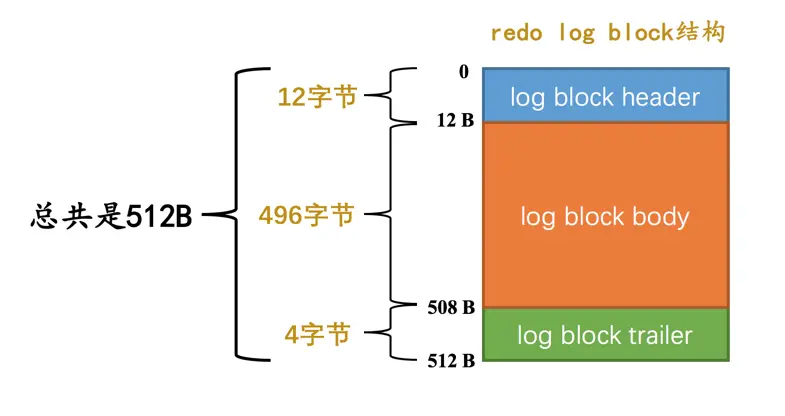
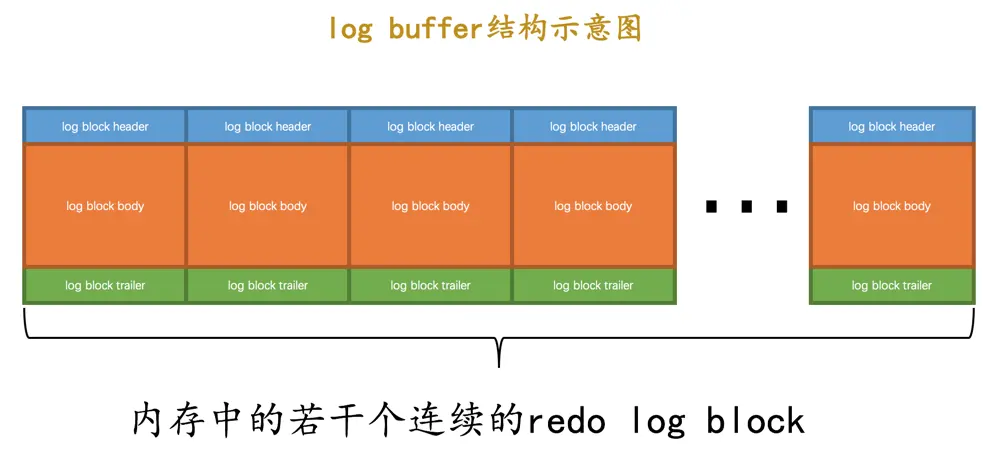
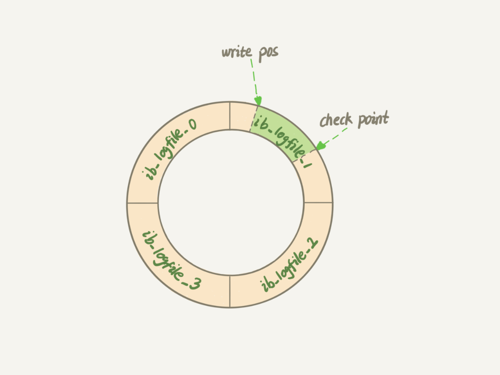
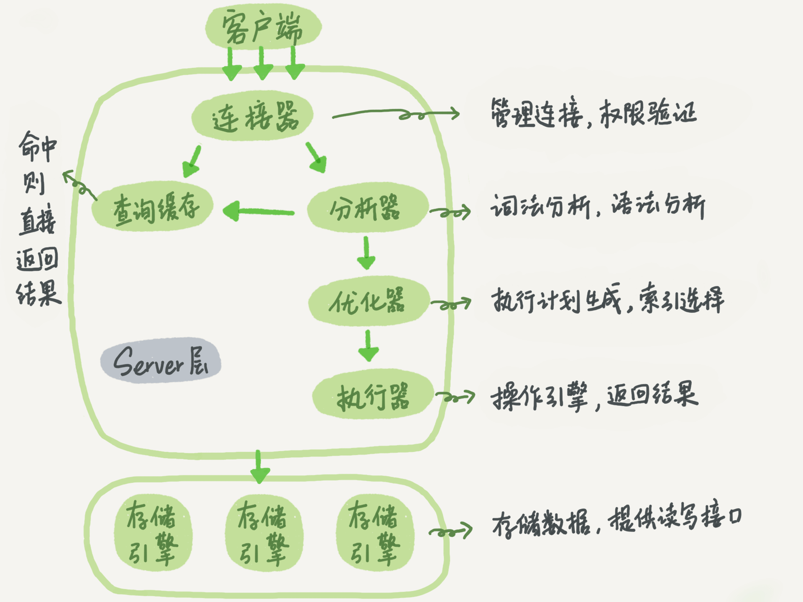
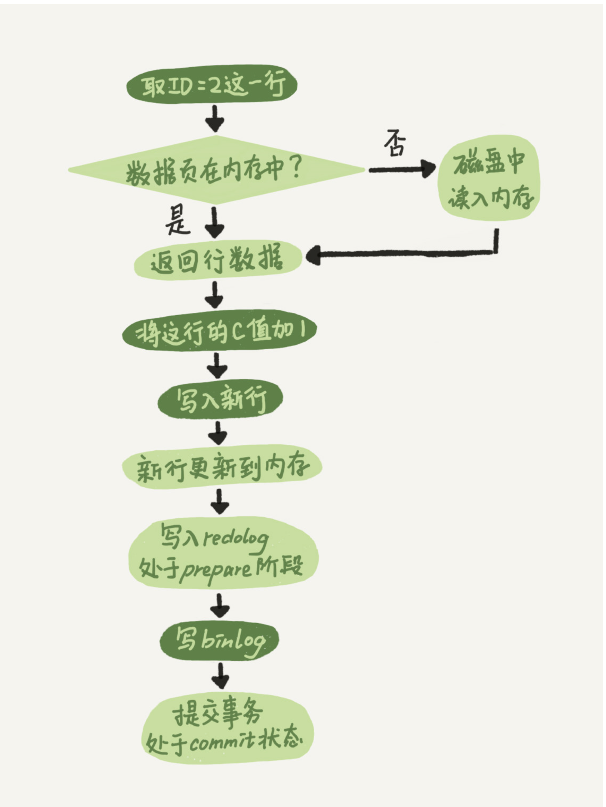

# 日志

## 一、redo log

MySQL 是通过 页 进行磁盘和内存之间交互的，真正访问页面的时候，是需要将 页 加载到 Buffer Pool 之中。在实际运行过程之中，执行对应的操作修改的页是 Buffer Pool 之中的页。对于一个已经提交的事务，如果说系统发生故障，导致 Buffer pool 中的数据丢失，就不满足事务的持久性。问题就在于，并没有即时将修改的数据页，刷新回到磁盘之中。

那么，可以在事务提交之前把该事务所修改的页面全部都刷新到磁盘中。但是，如果说只修改了数据页之中的一条记录，就刷新回到磁盘之中，比较耗费资源，并且事务之中，涉及到了多个数据页的修改，这就可能是随机 IO。

那我们其实可以只记录一下对那些数据页的那些内容做了修改，在事务提交的时候，我们只需要把这部分数据刷新回到磁盘之中，即使系统发生了崩溃，重启按照上述的内容重新更新一下数据页，那么该事务对于数据库所做的更新又可以被恢复出来，这种日志也叫做，**重做日志 或者 redo 日志**。相比于将整个事务操作的所有数据页全部刷新回到磁盘之中，`redo log` 不仅仅占用的空间比较小，而且他是顺序写入到磁盘之中的。

 在一个语句执行过程之中，比如说，我们想表中插入一条数据，如果说主键并不是按照顺序来的，就有可能造成页分裂，这就会修改多个数据页，就会对应多条 redo log， 并且这部分操作必须是原子的，所以，在 InnodDB 之中，将这部分日志，划分为一个组，对于一个组中的 redo log ，必须全部成功或者全部失败。并且将这部分原子操作称之为` Mini-Transaction`，简称 `mtr`。mtr 产生的数据，被写入到了一个 **512 字节的页**中，如下图，mtr 产生的数据，都被记录在页中的 log back body 部分。

而且，`redo log` 也不是直接写入到磁盘之中的，而是先写入到内存之中，然后在写入到磁盘之中，将这块缓冲区的内容称之为：`redo log buffer`。

`redo log buffer` 写回磁盘文件时，也是以 `block` 的形式进行写入的，这些文件都是以`ib_logfile` 开头的，如 `ib_logfile0`，`ib_logfile1`。如果说 `ib_logfile0` 写满了，就会接着 `ib_logfile1` 进行写，依此类推。如果写入到最后一个 `ib_logfile`，他就会从头开始写。每个文件前 4 个 block 都是一些控制信息，后面的 block 才是存储数据的。

::: info
缓存区内容写回磁盘的时机

+ 事务提交时
+ 后台线程每秒刷新
+ 当缓冲区内容不够时
+ 将某个脏页刷新回到磁盘前，会保证先将该脏页对应的 redo 日志刷新回到磁盘之中。如果 redo log 更新磁盘失败了，还没有进行脏页的刷新，就等同于没有进行这次操作。如果 redo log 成功了，还没有进行脏页的刷新，系统崩溃了，这个时候按照 redo log 进行恢复，也是没有问题的

可以通过修改 `innodb_flush_log_at_trx_commit` 的值进行更改

+ 0：事务提交时，不立即更新，而是由后台线程来完成
+ 1：事务提交时，立即更新
+ 2：事务提交时，写入到操作系统对应的缓冲区中

:::

写入 `redo log buffer` 是以 mtr 的方式进行写入的，在 InnoDB 之中，维护了一个日志的序列号 **LSN**，每一个 mtr 写入的日志，都会对应一个序列号。在 InnoDB 中维护了一个变量 `buf_next_to_write` 用来标记一下那些日志已经被刷新回到磁盘之中。

除此之外，InnoDB 中还提供了一个表示刷新回到磁盘中的 redo 日志量的全局变量，`flush_to_disk_lsn`。这个变量实际和 lsn 进行对应的。他们两个之间的差值就表示有那些内容没有刷新回到磁盘之中。

对于 redo log 日志文件容量是有限的，会循环写入，那么我如何判断一下这部分 redo log 可以覆盖呢？首先明确一点是，redo log 是为了系统崩溃之后，保证事务的持久性，如果这部分修改的数据页已经被刷新回到磁盘之中，那么这部分内容也就没有存在的必要了。在 InnoDB 之中提供了一个全局变量，`checkpoint_lsn`， 用来表示可以被覆盖的 redo 日志总量是多少，比如 mtr1 修改了页 a，页 a 被刷新回到磁盘之中，那么 mtr1 对应的 redo log 就可以被覆盖，进行一次增加 `checkpoint_lsn` 的操作，我们把这个过程称之为 `checkpoint`。

如下图：其中，write pos 表示当前要写入的位置，check point 表示是当前要擦除的位置。如果说 write pos 追赶上了 check point ，就需要进行 checkpoint 操作

## 二、undo log
一个事务在执行过程中，在还没有提交事务之前，如果MySQL 发生了崩溃，要怎么回滚到事务之前的数据呢？就好像这些语句没有执行过。这也是事务原子性的要求。

对于我们常见的操作，对于查询是对数据库没有任何影响的，所以说不用管，最为主要的就是添加，删除，修改

+ 在**插入**一条记录时，要把这条记录的主键值记下来，这样之后回滚时只需要把这个主键值对应的记录**删掉**就好了；
+ 在**删除**一条记录时，要把这条记录中的内容都记下来，这样之后回滚时再把由这些内容组成的记录**插入**到表中就好了；
+ 在**更新**一条记录时，要把被更新的列的旧值记下来，这样之后回滚时再把这些列**更新为旧值**就好了。

将这种记录回滚数据的日志，称之为 undo log 。对于不同的操作，产生的 uodo log 格式实际上是不一样的，这里不做赘述了。

在之前讲解行格式的时候，我们提到过，对于一行记录，还有三个隐藏列。分别是：主键 ID，事务 ID，回滚指针。如果说一个事务对某个表执行了增删改操作，那么 InnoDB 就会给事务分配一个唯一的事务ID，行格式里面存储的事务 ID，就是它，可以理解为对这行记录进行操作的事务对应的事务 ID。当执行了操作的时候，会写入 undo log，而回滚指针就是指向这块的 undo log。

## 三、bin log
`redo log` 是`InnoDB`引擎特有的日志，而`Server`层也有自己的日志，称之为`binglog`，也叫做归档日志，在里面记录了数据库发生的变化。

bin log 主要用于 如下两个方面：

+ **用于复制**：对于`一个主服务器和多个从服务器`情况，对于改变数据库状态的请求，我们发到主服务器，对于基本的查询，我们发到从服务器之上。为了让主从数据一致，每当我们改变主服务器中的数据后，就需要将改变的信息同步给各个从服务器，binlog中记录的就是这些数据，从服务器只需要读取主服务器的binlog日志，然后执行这些日志中的语句，从而达到主从数据一致
+ **用于恢复**

我们可以通过如下方式来判断一下是否开启了 bin log

bin log 也不是一个单独的文件，而是一个文件组，如下面这样：

前面几个才是 binlog 文件，最后一个是 binlog 的索引文件，这个文件可以直接打开，他就是记录了一下有哪几个 bin log 文件。

## 四、杂谈
### 其余日志
1. `错误日志`：对MySQL的启动，运行，关闭过程进行了记录，能够帮助MySQL定位问题
2. `慢查询日志`：用来记录执行之间超过`long_query_time`这个变量定义的时长的查询语句，通过该日志，可以查找那些查询语句的执行效率很慢，方便进行优化
3. `一般查询日志`：记录了所有对MySQL数据库请求的信息，无论请求是否正确执行。

### 一条更新语句的执行流程
对于一条更新语句，他和查询一样，也会经过如下的流程：

不过与查询不同，这里面会涉及到两个日志板块：`redo log` 和 `bin log`。这两个日志有如下的不同点：

1. `redo log` 是 `InnoDB` 特有的日志，`bin log` 则是 `MySQL Server`层对应的日志
2. `redo log` 是物理日志，记录数据页的那部分进行了修改，而 `bin log` 则记录的是逻辑日志，记录执行了 sql。
3. 两个日志都不是单指一个文件，他们都是一个文件组，不过 redo log 会循环写，而 bin log 只会进行追加操作。

由于 redo log 是属于 InnoDB 的，对于 MySQL 而言，可以自由选择存储引擎，所以说，必须要有自己的一份日志。

通过前面的学习，我们知道，MySQL 是通过 页 作为磁盘与内容的交互单位，操作某一个数据的时候，必须首先将对应的数据页加载到内存之中，记录对应的 undo log， 然后修改对应的数据页，这个时候他会首先记录一下 `redo log`，然后在去修改一个数据页，不过此时 redo log 处于 perpare 阶段。完成之后，告诉执行器可以去提交事务了，执行器去记载对应的 bin log，并且写回磁盘，开始调用存储引擎的提交事务接口，将 redo log 改为 commit 状态。对应的流程图如下：

为什么要将整个事务的提交分为两个阶段呢？

::: info
这里，我们首先来分析一下，如果分开写两个文件，会带来什么问题？

1）先写 redo log，后写 bin log：mysql 重启之后，redo log 能够保证事务的一致性，但是 bin log 之中却没有记载这一条修改的语句，如果说通过此时的 bin log 来主从数据同步，就会造成数据不一致。

2）先写 bin log，后写 redo log：bin log 之中成功记录了这行语句，但是 redo log 中的数据就丢失了，相当于这个事务没进行任何的操作。仍然会造成主从数据不一致。

:::

两个日志是两个独立的逻辑，将 redo log 分为两个阶段，就是让这两个状态保持逻辑上的一致。 如果说最后一步失败了呢？在 MySQL 启动之后，会首先扫描 bin log，收集一下最近写入的事务 ID，然后扫描 redo log 里面有那些未提交的事务，如果事务写入到了 bin log，那么执行 commit，如果没有写入 bin log，则回滚对应的事务。

