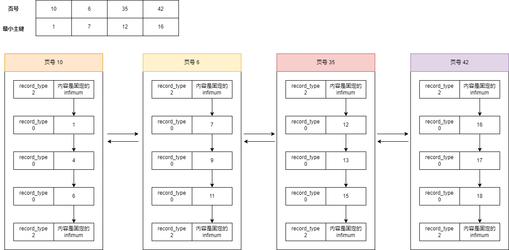
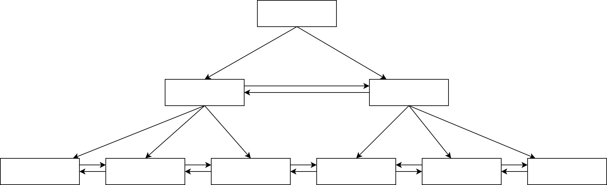
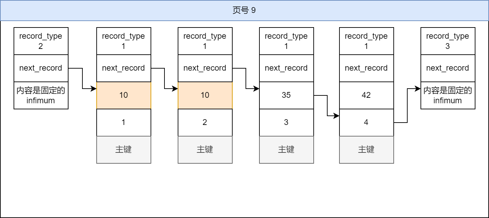
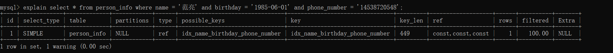
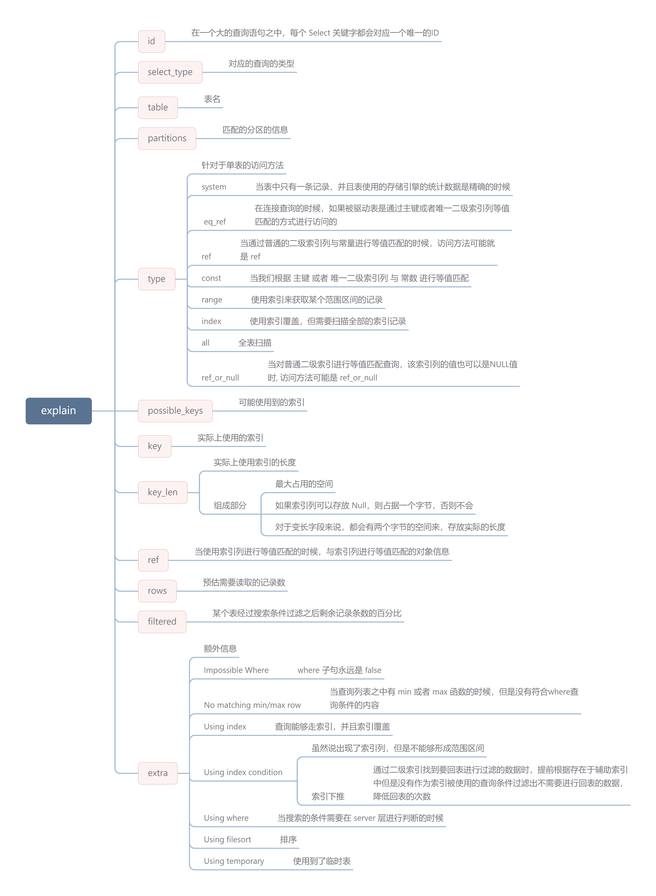
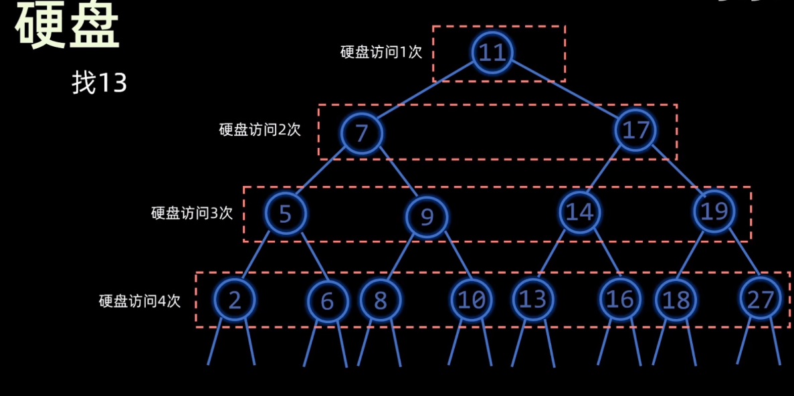
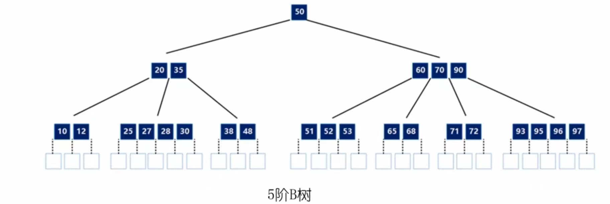

# 索引

##     一、基本信息

在 MySQL 之中，以 页 作为内存和磁盘之间的交互单位，在每一个数据页之中，会按照   **按照主键的大小进行排序，组成一个单链表**，为了加快在一个数据页之中，数据查找的效率，InnoDB 使用了页目录，将记录进行分组，并将分组之后的组内最大元素的偏移量，记录在页目录之中，这样，我们在通过主键查找数据的时候，就能够首先在页目录之中，定位到具体的槽，进而确定到分组，分组确定之后，在分组之中，进行遍历，就能够查找到对应的元素。

但是，如何在多个数据页之中进行查找？多个数据页是通过 File Header 进行串联的，构成一个双向链表，貌似，我们只能通过遍历的方式，确定一下，元素在那个数据页之中，然后在通过上述的方式，进行数据页内查找。

但是，如何定位页呢？我们开始尝试对这些数据页也添加一个目录，如下图



建立出来这样的目录结果之后，通过主键搜索时，我们可以首先在目录项里面查找，确定一下，数据在那个数据页之中，也就是找到大于等于当前搜索的主键的最小主键在哪个目录项里面。找到了目录项就找到了数据页。这个目录就叫做 **索引**。

**所以，索引可以理解为存储引擎用于快速查找记录的一种数据结构。**

:::info
 不过有一个前提条件，前一个页中主键的最大值是小于后一个页中主键的最小值。

:::

如果说目录项所在的数据页超过了页的容量，就需要分配一个新的数据页来存储这个目录项，并且为了优化查找目录项的时间，按照原有思路，再次进行提取，最终形成的树结果如图所示



这样的数据结构，称之为 B+ 树。在 InnoDB 中，每个节点都是数据页，**但是只有叶子节点才会真正的存储用户的完整数据，其余节点都是存储的目录**。我们同样将这样的数据结构，称之为索引。

在上文之中，我们也提到了，后一个页的最小主键，必须小于前一个的最大主键，这样才能够建立出目录结构，形成索引。

实际上 InnoDB 在创建表的时候，会自动进行创建，称之为，**聚簇索引**。并且搜索条件是主键的时候，才能发挥作用。而如果搜索条件不是主键的时候，并不能使用。

但是实际场景之中，我们并不能保证，都只通过主键来查询数据，为了解决这一问题，我们可以多建立几颗 B+ 树，不同的B+树采取不同的排序规则，在叶子节点中存放的不在是实际的数据，而是 **主键 + 索引列**，这种 B+ 树我们就称之为 **二级索引或者辅助索引**。



使用这种方式，我们需要先根据规则找到主键值，然后通过主键值进行一次聚簇索引的查找，这个操作叫做 **回表**。有时候为了避免回表带来的性能消耗，在 select 查询的时候，尽量查询索引列，也就是说索引 k 已经“覆盖了”我们的查询需求，我们称为 **覆盖索引。**

我们也可以为多个列建立一个索引，称之为 **联合索引**，但本质仍然是二级索引。如果说创建联合索引的顺序为 `a,b,c`，则B+树的数据页和记录先按照   `a列`  的值进行排序，在   `a列`  的值相同的情况之下才使用   `b列`，依次类推。比如下面这样，如果第一列相同了，在按照第二列来进行排序。


通过使用索引，能够提高数据检索的效率，降低数据库的 IO 成本，但是，维护索引结构也同样需要占用空间，但是如果需要移除或者更新表中的数据，也同样需要维护这部分数据结构。

## 二、操作索引
接下来，我们就来实际操作一下索引：

```sql
-- 创建表的时候添加索引
create table users (
    id int not null,
    name varchar(30),
    sex varchar(10),
    key MyIndex (name)
);

-- 添加索引
alter table users add key idx_name (name);

-- 添加联合索引
alter table users add key index_name_sex(name,sex);

-- 删除索引
alter table users drop key idx_name;
```

数据库会为我们建立一个聚簇索引，并且我们自己创建了一个联合索引

```sql
CREATE TABLE person_info(
    id INT NOT NULL auto_increment,
    name VARCHAR(100) NOT NULL,
    birthday DATE NOT NULL,
    phone_number CHAR(11) NOT NULL,
    country varchar(100) NOT NULL,
    PRIMARY KEY (id),
    KEY idx_name_birthday_phone_number (name, birthday, phone_number)
);
```

## 三、索引的使用
接下来，我们首先创建一个如下的表结构，用来进行测试

```sql
CREATE TABLE person_info(
    id INT NOT NULL auto_increment,
    name VARCHAR(100) NOT NULL,
    birthday DATE NOT NULL,
    phone_number CHAR(11) NOT NULL,
    country varchar(100) NOT NULL,
    PRIMARY KEY (id),
    KEY idx_name_birthday_phone_number (name, birthday, phone_number)
);
```

创建完成之后，我们就来看一下，索引可以应用于哪些场景。在开始之前，我们首先回顾一下，以前的内容

::: info
一个表之中，只有一个聚簇索引，他是通过主键来进行排序的，并且只有搜索条件是主键的时候，才会使用这个索引。而联合索引是在索引结果中记录了索引列和主键值，有多个索引列的时候，会首先按照第一个字段进行排序，第一个字段相同，按照第二个索引列进行排序，以此类推。

:::

### 3.1 索引使用条件

下面列举了能够使用索引的场景：

1. **全值匹配**：我们搜索条件中的列和索引列一致，这就称之为全值匹配

```sql
select * from person_info where name = '范亮' and birthday = '1985-06-01' and phone_number = '14538720548'
```

2. **匹配左边的列**
+ 搜索条件中不用包含全部联合索引中的列，只包含左边就行（建立索引时的左边）

```sql
select * from person_info where name = '范亮'
```

+ 匹配多个最左边的列，但是如果说我们想匹配联合索引中多个列的时候，各个列必须是联合索引中最左边连续的列。

```sql
select * from person_info where name = '范亮' and birthday = '1985-06-01'
```

3. **匹配列前缀**
+ 对于字符串类型的索引列来说，我们只匹配他的前缀是可以快速定位记录的。但是如果出现了 `%范`这种就不能够走索引
+ 对于字符串来说的话，在 MySQL 中排序，实际上是字典序

```sql
select * from person_info where name = '范%'
```

4. **匹配范围值**
+ 所有记录都是按照索引列的值从小到大的顺序排好序的，所以这极大的方便我们查找索引列的值在某个范围内的记录

+ 不过在使用联合进行范围查找的时候需要注意，如果对多个列同时进行范围查找的话，只有对索引最左边的那个列进行范围查找的时候才能用到B+树索引
5. **精准匹配某一列并范围匹配另外一列**
6. **用于排序**
+ 在使用联合索引的时候，请注意，order by 的子句后边的列的顺序也必须按照索引列的顺序给出
+ 排序列之中如果包含不在当前索引中的列，不会走索引
7. **用于分组**

### 3.2 索引失效

接下来，我们看一下不能够使用索引的场景：

1、当我们使用左或者左右模糊匹配的时候，也就是 like %xx 或者 like %xx%这两种方式都会造成索引失效；

2、当我们在查询条件中对索引列使用函数，就会导致索引失效。

3、当我们在查询条件中对索引列进行表达式计算，也是无法走索引的。

4、MySQL 在遇到字符串和数字比较的时候，会自动把字符串转为数字，然后再进行比较。如果字符串是索引列，而条件语句中的输入参数是数字的话，那么索引列会发生隐式类型转换，由于隐式类型转换是通过 CAST 函数实现的，等同于对索引列使用了函数，所以就会导致索引失效。

5、联合索引要能正确使用需要遵循最左匹配原则，也就是按照最左优先的方式进行索引的匹配，否则就会导致索引失效。

6、在 WHERE 子句中，如果在 OR 前的条件列是索引列，而在 OR 后的条件列不是索引列，那么索引会失效。

7、使用  `!=`  或者  `<> `,就会造成索引的失效

## 四、Explain

一个查询语句经过 MySQL 查询优化器的各种基于成本和规则的优化之后，会生成一个执行计划，他会说明查询语句的执行方式。

```sql
explain select * from person_info where name = '范亮' and birthday = '1985-06-01' and phone_number = '14538720548'
```

执行完成之后，我们就看到了他的执行计划，我们首先对他输出的列来进行说明！



上图对应的各个列，对应的解释如下：



在执行完成 Explain 命令之后，可以通过 `show warnings` 查看与这条语句相关的查询信息。

## 五、杂谈

### 5.1 索引数据结构

除了，使用 B+ 树作为索引之外，还有以下几种常见的索引结构
1）**哈希表**：将值放在数组中，用一个哈希函数把 key 换算成一个确认的位置，然后把 value 放在数组的这个位置之上

+ <font style="color:rgb(51, 51, 51);">用拉链法处理哈希冲突问题，适用于只有等值查询的场景</font>
+ 模糊查找不支持：哈希表是把索引字段映射成对应的哈希码然后在存放在对应的位置，这样的话，如果我们要进行模糊查找的时候，显然哈希表这种结构不支持，而B+树则可以通过最左前缀匹配原则快速查找
+ 不支持范围查找
+ 哈希冲突问题：索引字段通过哈希映射成哈希码，如果说很多字段都刚好映射到相同值的话，那么形成的哈希结构将会是一条很长的链表，这样的话，查找的时间复杂度就会大大增加

2）**有序数组**：按照顺序存储，查询用二分法可以快速查询，但是更新效率低，只适用于静态存储引擎

而如果采用其他的树形结构，如二叉搜索树，AVL树，红黑树，通常都是将数据全部加载到内存之中进行处理，由于索引不仅仅是位于内存之中，还需要写入到磁盘之中，当数据量较大时，访问的节点个数就会比较多。从这里，能够看到硬盘的访问次数实际上和树的高度成正比。



为了降低树的高度，就出现了 B 树。它实际上是一个多叉的平衡搜索树。



对于一个 m 阶 B 树，他有以下几个特点：

- 树中每个节点至多有 m 颗子树
- 如果根节点不是叶子节点，则至少包含两颗子树
- 除了根节点的所有非终端节点至少包含 m / 2 颗子树
- 每个节点内部都是有序的，并且节点内部存储的关键字左分支都是小于这个关键字，右分支都是大于这个关键字
- 所有叶子节点都位于同一层

B+ 树是 B 树的一种变体，优化了数据存储和查询的效率，B 树能够做的，B+ 树都能够做，但是 B+ 树的中间节点不保存数据，能够存放更多的节点数据，减少树的高度

### 5.2 索引合并

在一个表中，如果为多个列建立单列索引，在大部分情况之下并不能够提高 MySQL 的执行效率，MySQL 引入了一种叫 **索引合并** 的策略，能够在一定的程度之上可以使用表中的多个单列索引来定位指定的行。

### 5.3 创建好的索引
1. <font style="color:rgb(51, 51, 51);">只为出现在 where 子句之中的列，连接子句中的连接列，或者出现在 order by 或者 group by 子句之中的列创建索引</font>
2. <font style="color:rgb(51, 51, 51);">为列的基数大的列创建索引</font>
3. <font style="color:rgb(51, 51, 51);">索引列的类型尽量小</font>
4. <font style="color:rgb(51, 51, 51);">可以只对字符串值的前缀建立索引</font>
5. <font style="color:rgb(51, 51, 51);">只有索引列在比较表达式中单独出现才可以适用索引</font>
6. <font style="color:rgb(51, 51, 51);">为了尽可能少的让</font> 聚簇索引 发生页面分裂和记录移位的情况，建议让主键拥有  AUTO_INCREMENT 属性。
7. 定位并删除表中的重复和冗余索引
8. 尽量使用覆盖索引进行查询，避免回表带来的性能损耗。

