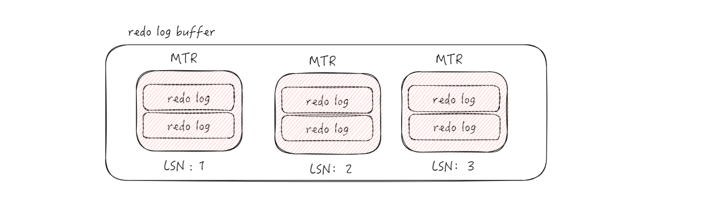
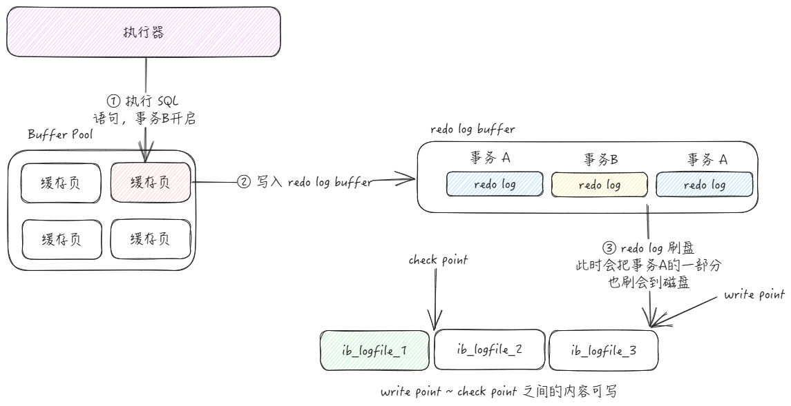
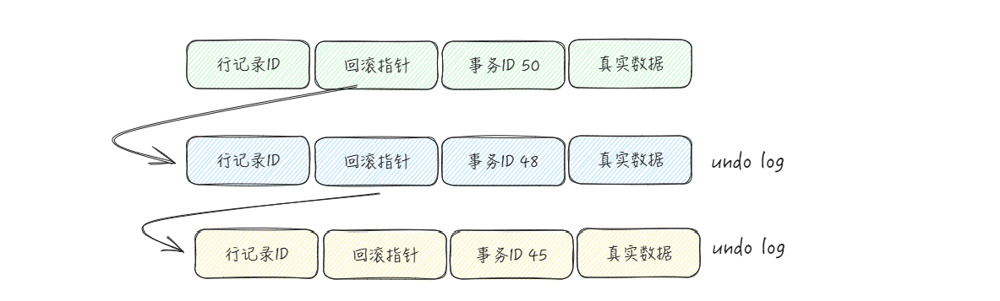
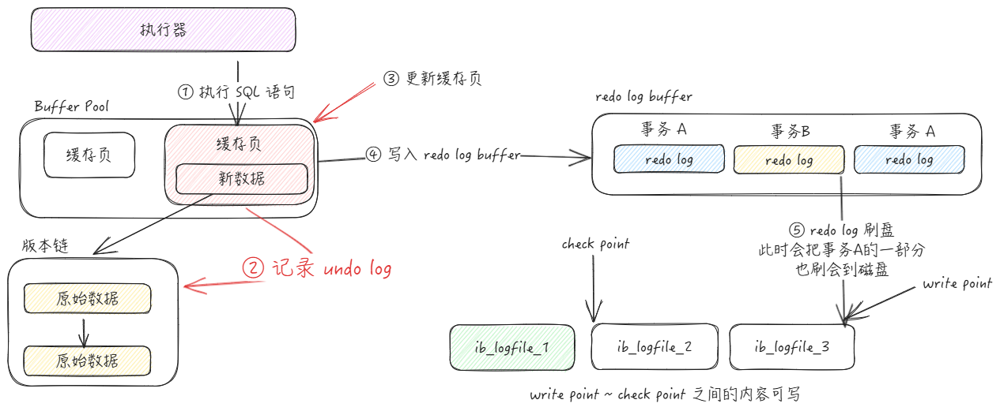
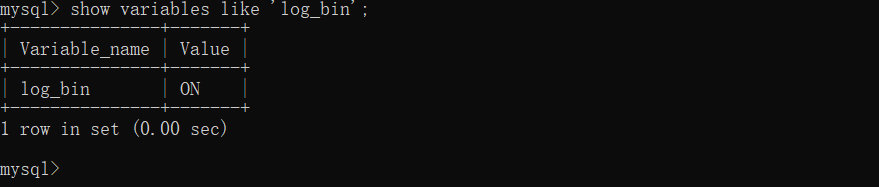
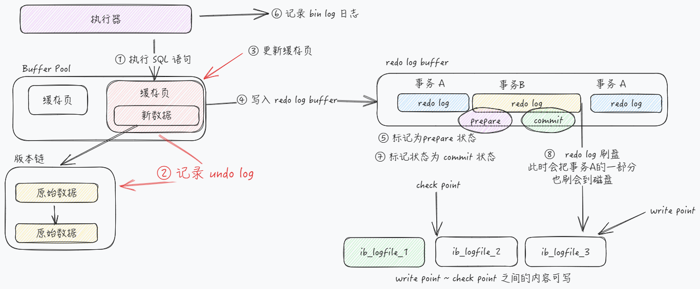

# 日志

## 一、redo log

> MySQL 是通过 页 进行磁盘和内存之间交互的，真正访问页面的时候，是需要将 页 加载到 Buffer Pool 之中。在实际运行过程之中，执行对应的操作修改的页是 Buffer Pool 之中的页

对于一个已经提交的事务，如果说系统发生故障，导致 Buffer pool 中的数据丢失，就不满足事务的持久性，而问题就在于，没有即时将修改的数据页，刷新回到磁盘之中。如果事务结束，立即将页刷新回到磁盘之中，可能会有如下问题：

- 只修改了一条记录，就刷新回到磁盘之中，比较耗费资源
- 涉及到了多个数据页的修改，这就可能是随机 IO

为了解决这个问题，其实可以 **只记录一下对那些数据页的那些内容做了修改**，在事务提交的时候，我们只需要把这部分数据刷新回到磁盘之中，即使系统发生了崩溃，重启按照上述的内容重新更新一下数据页，那么该事务对于数据库所做的更新又可以被恢复出来，这种日志也叫做，**重做日志 或者 redo 日志**，相比于将整个事务操作的所有数据页全部刷新回到磁盘之中。

并且，`redo log` 也不是直接写入到磁盘之中的，而是先写入到内存缓冲区 `redo log buffer` 之中，然后在写入到磁盘之中。

如果一条语句，修改了多个数据页，实际上对应与多条 redo log，为了保证操作的原子性，InnoDB 将这样的多条 redo log，组成了一条 MTR，每个 MTR 都有一个编号 LSN。所以，最终写入到 redo log buffer 之中的数据如图所示：

当然了，实际上多个 MTR 还会组成 redo log block，这里简单看一下就行。这里有几个点需要注意一下：

1）redo log 也是先写入到内存中，那么，redo log 就没有丢失的风险吗？实际上取决于 redo log buffer 的刷盘时机

::: info
缓存区内容写回磁盘的时机

+ 当 redo log buffer 内存不够的时候
+ 事务提交时，将修改该过这些页面对应的 redo log 刷新回到磁盘之中
+ 后台线程每秒刷新
+ 将某个脏页刷新回到磁盘前，会保证先将该脏页对应的 redo 日志刷新回到磁盘之中

:::

2）对于 redo log 日志文件容量是有限的，会循环写入

如下图：其中，write pos 表示当前要写入的位置，check point 表示是当前要擦除的位置，两个指针中间的内容就表示可以进行写入

那么如何判断一下这部分 redo log 可以覆盖呢？

首先，redo log 是为了系统崩溃之后，保证事务的持久性，如果这部分修改的数据页已经被刷新回到磁盘之中，那么这部分内容也就没有存在的必要了，这部分内容都是可以进行覆盖的。

当事务B执行完成之后，但是事务A的一部分redo log 刷新回到了磁盘，此时如果

## 二、undo log

对于 redo log，解决了事务持久性的问题，那么，如果事务没有提交，发生了崩溃，或者手工回滚了，怎么回滚到事务之前？

对于我们常见的操作，查询是对数据库没有任何影响的，所以说不用管，最为主要的就是添加，删除，修改。

+ 在插入一条记录时，要把这条记录的主键值记下来，这样之后回滚时只需要把这个主键值对应的记录 删掉 就好了；
+ 在删除一条记录时，要把这条记录中的内容都记下来，这样之后回滚时再把由这些内容组成的记录插入到表中就好了
+ 在更新一条记录时，要把被更新的列的旧值记下来，这样之后回滚时再把这些列更新为旧值就好了。

将这种记录回滚数据的日志，称之为 **undo log** 。对于不同的操作，产生的 undo log 也是不一样的。

- Insert：此时并没有历史版本，也会产生一条 undo log，这块也只是为了回滚的时候用到
- Delete：对于删除操作，仅仅是将这行记录打一个标记，只有当事务提交的时候，才会将这条记录真正的删除
- Update：对于更新操作，实际上又分为两种情况
  - 通过主键：
  - 不通过主键：如果更新前后存储空间不变，就会直接在原有记录上更新，否则先删除旧的记录，后插入新的记录

在 InnoDB 的行格式中，对于一行记录，除了真实的数据之外，还有三个隐藏列，分别是：主键ID、事务ID、回滚指针。

:::info

一个事务对某个表进行了增删改操作是，InnoDB 就会给事务分配一个唯一的事务ID。即使我们并没有显示的通过 begin 开启事务，但是 MySQL  会隐式开启事务。并且这个事务ID是自增的

:::

所以，这里的事务ID，就可以理解为对于这行记录进行操作的事务进行操作对应的事务，当执行了操作的时候，会写入 `undo log`，而回滚指针就是指向这块的    `undo log`。

这里我们总结一下redo log 和 undo log 的先后顺序

## 三、bin log

在上文之中，我们提到了两种类型的日志，redo log 和 undo log，这两个都是 InnoDb 引擎独有的日志。对于 MySQL 而言，可以自由选择存储引擎，所以说，必须要有自己的一份日志。，称之为 `bin log`，也叫做归档日志，在里面了数据库发生的变化，比如表结构发生了变化，表中的数据发生了变化。

bin log 主要用于如下两个方面：

+ **用于复制**：对于`一个主服务器和多个从服务器`情况，对于改变数据库状态的请求，我们发到主服务器，对于基本的查询，我们发到从服务器之上。为了让主从数据一致，每当我们改变主服务器中的数据后，就需要将改变的信息同步给各个从服务器，binlog中记录的就是这些数据，从服务器只需要读取主服务器的binlog日志，然后执行这些日志中的语句，从而达到主从数据一致
+ **用于恢复**

我们可以通过如下方式来判断一下是否开启了 bin log

bin log 也不是一个单独的文件，而是一个文件组，如下面这样：

前面几个才是 binlog 文件，最后一个是 binlog 的索引文件，这个文件可以直接打开，他就是记录了一下有哪几个 bin log 文件。

在了解了这几个日志之后，我们就来梳理一下一条 update 语句的执行流程

通过前面的学习，我们知道，MySQL 是通过 页 作为磁盘与内容的交互单位，操作某一个数据的时候，必须首先将对应的数据页加载到内存之中，记录对应的 undo log， 然后修改对应的数据页，这个时候他会首先记录一下 `redo log`，然后在去修改一个数据页，不过此时 redo log 处于 perpare 阶段。完成之后，告诉执行器可以去提交事务了，执行器去记载对应的 bin log，并且写回磁盘，开始调用存储引擎的提交事务接口，将 redo log 改为 commit 状态。对应的流程图如下：

为什么要将整个事务的提交分为两个阶段呢？

::: info
这里，我们首先来分析一下，如果分开写两个文件，会带来什么问题？

1）先写 redo log，后写 bin log：mysql 重启之后，redo log 能够保证事务的一致性，但是 bin log 之中却没有记载这一条修改的语句，如果说通过此时的 bin log 来主从数据同步，就会造成数据不一致。

2）先写 bin log，后写 redo log：bin log 之中成功记录了这行语句，但是 redo log 中的数据就丢失了，相当于这个事务没进行任何的操作。仍然会造成主从数据不一致。

:::

两个日志是两个独立的逻辑，将 redo log 分为两个阶段，就是让这两个状态保持逻辑上的一致。 如果说最后一步失败了呢？在 MySQL 启动之后，会首先扫描 bin log，收集一下最近写入的事务 ID，然后扫描 redo log 里面有那些未提交的事务，如果事务写入到了 bin log，那么执行 commit，如果没有写入 bin log，则回滚对应的事务。
