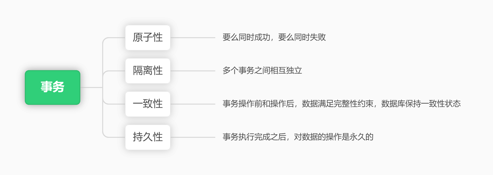
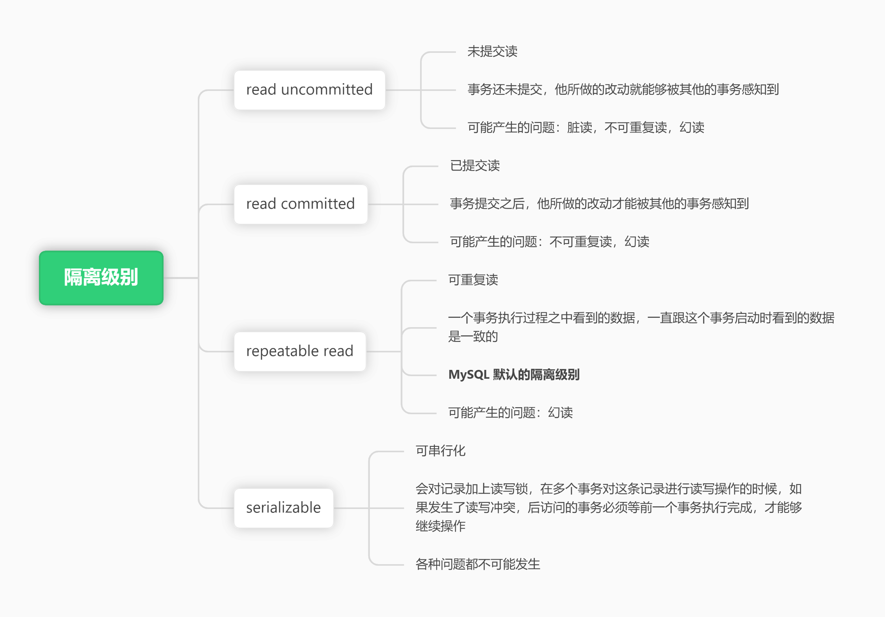
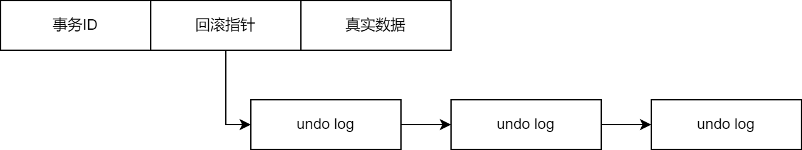
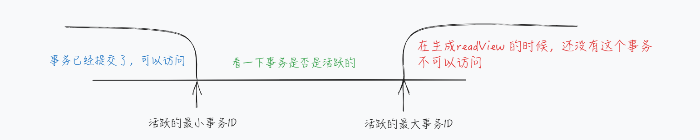
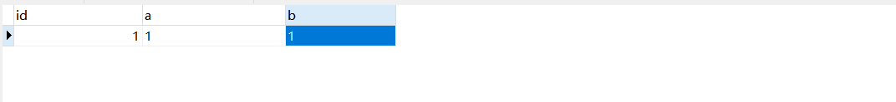

# 事务

## 一、前言

其中原子性，通过 undo log 来保障，持久性通过 redo log 来保障。接下来，我们分析一下隔离性

:::info

在并发场景之下，可能会出现的问题：

- 脏读，是指一个事务，读取到了另一个事务还没有提交的信息
- 不可重复读，在一个事务之中多次读取同一个数据，如果说前后两次读取到的数据不一致。
- 幻读，在一个事务内多次查询某个符合查询条件的记录数量，前后两次查询到的记录数量不一致

:::

为了解决这些问题，就有了隔离级别，在  MySQL 之中，提供了不同的隔离级别，隔离级别越高，安全性就会越高，但是性能就会越低

那么，MySQL 又是如何实现这些隔离级别的呢？

在 undo log 之中，提到了版本链，每条数据的更新都会同时记录一条 undo log，每个事务都会分配一个事务ID

对于读未提交来说，他可以读取到其他事务未提交的数据，所以直接读取记录的最新的版本就好了，对于可串行化，通过锁的方式来控制，如果事务始终对某行记录进行更新操作，其余事务如果想读取，必须等该事务提交之后，释放对应的锁，才能够读取到

而 读已提交 和 可重复读，都必须保证读到已经提交了的事务修改过的记录，假如另一个事务已经修改了记录但是尚未提交，是不能直接读取最新版本的记录的，核心问题就是需要判断一下版本链中那个版本是当前事务可见的。为此，提出  `ReadView`。

在 Read View 之中，包含了如下内容：

+ `m_ids`：生成  `  ReadView`  时当前系统中活跃的读写事务的事务id列表
+ `min_trx_id`：m_ids 中的最小值
+ `max_trx_id`：m_ids 中的最大值
+ `creator_trx_id`：生成该`ReadView`的事务的事务id

当具备了 ReadView 的时候，我们来看一下，读取一条数据对应的流程

- 如果被访问版本的  `trx_id`  属性值与    `ReadView`   中的   `creator_trx_id`   值相同，意味着当前事务在访问它自己修改过的记录，所以该版本可以被当前事务访问。
- 如果被访问版本的  `trx_id`  属性值小于当前系统活跃的最小事务ID，说明这个版本事务已经提交了，所以可以进行访问。
- 如果被访问版本的  `trx_id` 属性值大于或等于当前系统活跃的最大事务ID，表明生成该版本的事务在当前事务生成  `ReadView` 后才开启，所以该版本不可以被当前事务访问。
- 如果被访问版本的  `trx_id` 属性值在  `ReadView` 的  `min_trx_id` 和 `max_trx_id`之间，那就需要判断一下`trx_id`属性值是不是在`m_ids`列表中，如果在，说明创建`Rea dView`时生成该版本的事务还是活跃的，该版本不可以被访问；如果不在，说明创建`ReadView`时生成该版本的事务已经被提交，该版本可以被访问。

:::info

只读事务不分配trx_id（会分配一个假trx_id），只有涉及到数据更新才会分配事务ID。

:::

那么 read view 是什么时候生成的呢？

+ `read committed`在每次一次进行普通select操作的时候生成一个ReadView
+ `repeatable read`只在第一次进行普通select操作前生成一个ReadView，后面会复用这个`ReadView`，版本链不会发生变化，所以说不会出现重复读的问题。

## 二、案例

下面以实际的案例分析一下具体的隔离级别

我现在有一张表 tt ，里面的数据如下：

### 2.1 隐式事务

T2 时刻是分配了事务ID，假设为 100，在 T3 的时候生成 readView，此时活跃的事务ID为：100，在判断版本链的过程之中，最新的 a = 2，事务ID 为 100，处于活跃的事务ID列表之中，不可见，所以 a = 1

| 时间 | session1                          | session2                                          |
| ---- | --------------------------------- | ------------------------------------------------- |
| T1   | begin                             |                                                   |
| T2   | update tt set a = 2 where id = 1; |                                                   |
| T3   |                                   | select * from tt;  此时读取到的数据，a 等于 1 |
| T4   | commit                            |                                                   |
| T5   |                                   | select * from tt; 此时读取到的数据，a 等于2   |

### 2.2 可重复读

相比于上一个场景，此时 session2 查询出来的结果，两次都是 1,  在 MySql 中默认的隔离级别是 可重复读，两次使用的 ReadView 实际上是同一个，在 T4 的时候生成 ReadView，此时活跃的事务ID为 100，虽然在 T5 的时候，将事务提交了，但是由于 T6 和 T4 使用的是同一个 ReadView ，就导致 T6 的时候，还是认为 事务ID 100 是活跃的，记录仍然是不可见

| 时间 | session1                          | session2                                          |
| ---- | --------------------------------- | ------------------------------------------------- |
| T1   | begin                             |                                                   |
| T2   | update tt set a = 2 where id = 1; |                                                   |
| T3   |                                   | begin                                             |
| T4   |                                   | select * from tt;  此时读取到的数据，a 等于 1 |
| T5   | commit                            |                                                   |
| T6   |                                   | select * from tt; 此时读取到的数据，a 等于1   |

### 2.3 读已提交

这里还是假设 session1 在 T3 的时候，生成的事务ID 为100，T5 的时候，session2 生成了 ReadView，此时活跃的事务ID 为 100，记录不可见，所以 a = 1，在 T6 的时候，事务提交了，此时 session2 重新生成了 ReadView，此时没有活跃的事务ID了，此时就可以认为最新的记录是可见的，此时 a = 2

| 时间 | session1                          | session2                                                |
| ---- | --------------------------------- | ------------------------------------------------------- |
| T1   |                                   | set session transaction isolation level READ COMMITTED; |
| T2   | begin                             |                                                         |
| T3   | update tt set a = 2 where id = 1; |                                                         |
| T4   |                                   | begin                                                   |
| T5   |                                   | select * from tt;  此时读取到的数据，a 等于 1       |
| T6   | commit                            |                                                         |
| T7   |                                   | select * from tt; 此时读取到的数据，a 等于 2        |