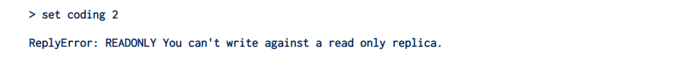
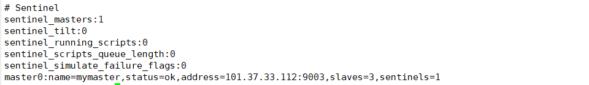
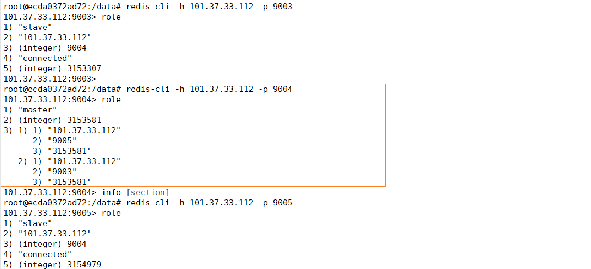
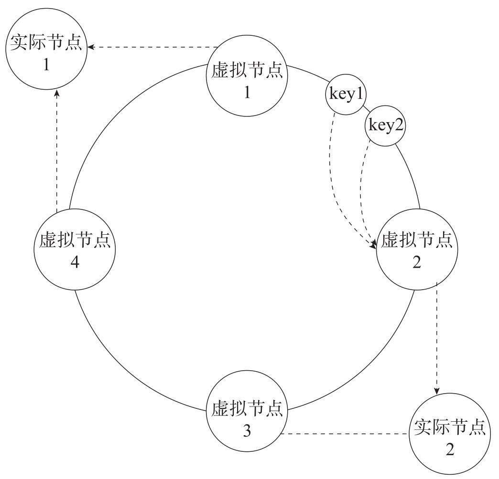

# Redis 架构演进

## 一、主从复制架构

在上一篇文章之中，我们讲解了 AOF 和 RDB 来保证 Redis 宕机之后，数据恢复的问题。这实际上是不符合高可用的部署的。而这个问题，可以通过增加副本的形式解决，即将一份数据同时保存在多个实例上。但是从节点仅仅用来同步数据，不执行具体的写操作，由主库来完成对应的写操作，执行完成之后，再将数据同步给从节点。

### 1.1 搭建主从复制
接下来，我们通过 docker 来搭建 redis 的主从复制架构。我们将对应的 redis.conf 里面的端口，分别改为了 9003,9004,9005

```markdown
docker run --restart=always -p 9003:9003 --name redis-1 -v /home/coding/redis-master-slave/redis-1/conf/redis.conf:/etc/redis/redis.conf -v /home/coding/redis-master-slave/redis-1/data:/data  -d redis:6.2 redis-server /etc/redis/redis.conf

docker run --restart=always -p 9004:9004 --name redis-2 -v /home/coding/redis-master-slave/redis-2/conf/redis.conf:/etc/redis/redis.conf -v /home/coding/redis-master-slave/redis-2/data:/data  -d redis:6.2 redis-server /etc/redis/redis.conf

docker run --restart=always -p 9005:9005 --name redis-3 -v /home/coding/redis-master-slave/redis-3/conf/redis.conf:/etc/redis/redis.conf -v /home/coding/redis-master-slave/redis-3/data:/data  -d redis:6.2 redis-server /etc/redis/redis.conf
```

运行完成之后，我们已经启动了 3 台 Redis，接下来，我们首先测试一下是否能够连接上，通过 quickRedis 来测试一下，都能够连接上。能够完成写操作。接下来，我们让 redis2 与 redis3 作为 redis1 的从节点。

分别在 redis2 和 redis3 上执行如下命令

```markdown
replicaof ip 9003
```

首先通过 role 命令，来确定一下，主从是否已经建立了联系。

```markdown
101.37.33.112:9003> role
1) "master"
2) (integer) 96290
3) 1) 1) "101.37.33.112"
      2) "9005"
      3) "96290"
   2) 1) "101.37.33.112"
      2) "9004"
      3) "96290"
101.37.33.112:9003> 
```

```markdown
101.37.33.112:9005> role
1) "slave"
2) "101.37.33.112"
3) (integer) 9003
4) "connected"
5) (integer) 94581
101.37.33.112:9005>
```

检查完成，主从已经能够建立起联系了。如果我们在从节点上执行写操作



除了在命令行执行之外，我们还可以通过修改配置文件来实现主从同步


如果想取消从节点复制，可以执行如下命令

```markdown
replicaof no one
```

### 1.2 主从同步流程

在搭建完成了主从复制的流程之后，我们来看一下主从同步的流程。主要流程图如下：


1. 从节点会首先向主节点发送请求，但是由于是第一次请求，对于主节点的 runId 不清楚，对于复制的偏移量也是传递的是 - 1
2. 主节点接受到请求之后，会向从节点发送 runId 以及目前主库复制的进度
3. 主节点生成 RDB 文件，并将 RDB 文件发送给从节点

::: info
采用 RDB 文件的原因：RDB 文件是通过压缩过的二进制数据，文件比较小，传输 RDB 文件尽可能会降低对于网络传输的压力。从库可以直接按照 RDB 文件协议还原数据，速度比较快。对于 AOF 方法并没有默认开启。

:::

4. 在此期间，主节点还会将这段时间接受到的写命令，写入到与从节点的缓冲区之中
5. 后续就是基于长命令的复制了

只有第一次同步会发送 RDB 文件，这也是**全量复制**，在此之后，都是 **通过长连接发送命令**，来进行主从之间通信，这其实就是一个 **增量复制 **的过程。

> 但是如果网络发生波动或者中断之后，主从之间如何进行保持数据的一致？
>

Redis 中，除了上面所说的 `replication buffer` 缓冲区之外，还有 `repl_blacklog buffer`缓冲区，主库会将写命令写入到 `repl_blocking buffer` 缓冲区中，并且主节点还会维护一个自己写入缓冲区的偏移量，`master_repl_offset`，从节点发起重连，执行 psync 的时候，会将自己的偏移量，`slaver_repl_offset`， 发送给主节点，主节点接收到之后，会将 master_repl_offset ~ slaver_repl_offset 在 repl_blocking_buffer 中的数据，发送给从节点，如下图黄色部分。


不过，请注意，`repl_blocking buffer `是一个环形缓冲区，主节点写完一轮之后，会从头开始写，就会造成之前的数据丢失

1） 如果从库的读取速度比较慢，就可能会导致从库还未读取，主库已经将原来的数据覆盖了，进而造成主从库的数据不一致。可以通过 `repl_blacking_size` 来进行设置

2） 如果主从长时间断开，导致 salve-repl-offset 的已经被覆盖，此时从库和主库之间将执行全量复制。

3）这个环形缓冲区也仅仅是在主动断开这段时间有用

## 二、哨兵机制
在 Redis 的主从复制架构之中，如果从库发生了故障，主库还可以继续提供服务，但是如果说主库发生了故障，整个主从复制架构仍然可以处理读请求，但是对于写请求却没有办法进行处理了，通常，一个节点挂了之后，我们需要有新的节点来接替主节点。那么就会面临新的问题：

+ 怎样才能够认为主库不能够进行使用了？
+ 主库宕机之后，谁来选择新的主库？
+ 选择了新的主库之后，如何把相关信息通知给客户端和其余的从库？

这就需要，哨兵机制。哨兵其实就是一个运行在特殊模式下的Redis进程，主从库实例运行的同时，它也在运行。总体而言，**<font style="color:#2F54EB;">哨兵主要负责的就是三件事情：监控、选主和通知</font>**。接下来，我们首先看一下哨兵的主要职责

### 2.1 哨兵的职责
#### 2.1.1 监控
监控，哨兵进程在运行时，周期性地给所有的主从库发送`ping`命令，检查他们是否仍然在线运行。如果说从库没有在规定时间之内进行响应，哨兵就会把它标记为`下线状态`；如果是主库没有在规定时间内进行响应，哨兵就会判定主库下线，然后开始 **选主 **的流程。对于从库下线，对于集群而言，并没有影响，但是主库下线，整个集群就不可以进行写请求，如果说因为网络原因，主节点没有在规定的时间之内进行响应，而哨兵确认为他宕机了，开始进行了选主切换，就带来了没有必要的开销，这也就是一个误判，枪杀友军。

为了减少误判，通常会 **引入多个哨兵实例 **一起来进行判断，就可以避免单个哨兵因为自身网络状况不好，而误判主库下线的情况。只有大多数的哨兵实例，都判断主库已经“主观下线”了，主库才会被标记为“客观下线”

#### 2.1.2 选主
选主，主库挂了之后，哨兵就要从很多的从库里面，按照一定的规则选择一个从库的实例，把它作为新的主库。

哨兵选择新主库的过程称之为“筛选 + 打分”。我们需要从多个从库中，先按照**一定的筛选条件**，把不符合条件的从库去除。然后，我们在按照 一定的规则，给剩下的从库逐个打分，将得分最高的从库选为新的主库。

#### 2.1.3 通知

通知，哨兵会把新主库的连接信息发送给其他的从库，让他们执行`replicaof`命令，和新的主库建立连接，并执行数据复制。同时，哨兵会把新主库的连接信息通知给客户端，让他们把请求操作发到新的主库之上。

### 2.2 搭建哨兵架构
接下来，我们在第一小节，主从的基础之上，来搭建 redis 的哨兵架构

我们从 github 上下载 sentinel.conf，配置需要监听到的 Redis 主节点

```markdown
sentinel monitor mymaster 101.37.33.112 9004 1
```

启动 Docker

```markdown
docker run --restart=always -p 9006:6379 --name redis-sentinel-1  -v /home/coding/redis-sentinel/redis-1/conf/:/etc/redis/ -v /home/coding/redis/sentinel/redis-1/log/:/var/log/ -d redis:6.2 redis-sentinel  /etc/redis/sentinel.conf
```

执行完成之后，我们查看一下容器


检查一下哨兵的状态



现在的主节点是 reids-1，现在我们将其停止

```markdown
docker stop redis-1
```

我们进入到从节点中，查看一下是否进入了主从切换



通过这样，我们就能够完成了，通过哨兵实现 Redis 的主从切换。

这里，我们用`Spring Boot`来配置 Redis 的哨兵架构，在这里，我们附上对应的配置文件

```yaml
spring:
  redis:
    sentinel:
      master: mymaster
      nodes:
        - 101.37.33.112:9006
```

对于其余的使用方式，并没有改变

## 三、集群
在上边的篇幅之中，我们学习了主从复制架构和哨兵架构，并且他们都是为了解决特定的问题

1.  为了保证 Redis 单节点带来的分险，我们搭建了主从复制架构
2. 为了保证主节点宕机的问题，Redis 无法进行写操作带来的问题，我们搭建了哨兵

**但是，对 Redis 进行的写操作，还是集中在一个节点上，并没有缓解 Redis 写的压力**。

为了解决这个问题，可以启动多个Redis实例组成一个集群，然后按照一定的规则，把收到的数据划分为多份，每一份都用一个实例来保存。这就是 Redis 的集群架构

既然它是将数据划分为多份，每一份都是有一个实例来保存，那么数据在多个实例上如何进行分布？客户端如何确定想要的数据位于哪一个实例之上？

接下来，我们逐步分析一下，Redis 都是如何解决这个问题的？

### 3.1 数据在多个实例之上分布 
从Redis 3.0 开始，官方提供了一个名为 Redis Cluster 的方案，用于实现切片集群。

在该方案中规定了数据和实例之间的一个对应规则。主要是使用 **哈希槽 **来解决数据和实例之间的映射关系。在此之前，我们首先来了解一下: 一致性 Hash 分区。

#### 3.1.1 一致性 Hash
首先，通过 key 计算对应的 Hash 值，然后通过 Hash 值 % 节点的个数，最终将 key 映射到不同节点


然而，**如果说节点的数量发生变化，意味着需要对所有的 key 进行重新计算。数据需要大规模迁移**。

为了避免这个问题，可以使用一致性 Hash 的方式。将整个 Hash 空间组织成为一个虚拟的圆环，圆环上面有若干个节点，数据取余之后，确定数据在圆环上面的位置，然后从此为止沿着圆环顺时针行走，找到的第一个节点就是数据应该映射到的节点。


但是这样还是会出现问题，如果说一个节点出现了变化，对相邻节点的影响大。可以在此基础之上，引入了虚拟节点，将虚拟节点分配给实际的实例。



在该方案中，一个切片集群中，共有 **16384** 个虚拟节点，也将虚拟节点称之为哈希槽，每个键值对都会根据他的 key，被映射到一个哈希槽中，哈希槽又会被分给不同的 Redis 的实例，通过这种方式，实现了 Redis 节点与 key 的解耦合。

可以通过如下方式，确定一下，key 位于那一个虚拟节点之上。

```markdown
CRC16(key) mod 16384
```

#### 3.1.2 客户端定位数据
在该方案之下，**客户端可以请求任意一个节点，每个节点都会保存所有虚拟节点具体映射到那个节点之上的信息**。如果客户端给一个实例发送数据读写操作的时候，这个实例之上并没有相应的数据，这个实例就会给客户端返回一个 `MOVED` 命令来响应结果。在这个结果之中，包含了客户端请求的键值对所在的哈希槽，以及位于哪一个实例之上，客户端接受到信息之后，会更新本地缓存。

如果说集群中，由于实例增加，实例减少，或者因为负载均衡而进行的数据重新分配，会导致哈希槽和实例的映射关系发生变化，当客户端进行操作的时候，会收到命令执行的报错信息。


和 MOVED 命令不同，ASK 命令并不会更新客户端缓存的哈希槽分配的信息。

### 3.2 搭建 Redis 集群
```shell
for port in $(seq 7010 7016); \
do \
  docker run --restart=always -p ${port}:${port} --name redis-${port} \
  -v /home/coding/redis-cluster/${port}/conf/redis.conf:/etc/redis/redis.conf \
  -v /home/coding/redis-cluster/redis-1/data:/data  \
  -d redis:6.2 redis-server /etc/redis/redis.conf \
done
```

### 3.3 主从切换
当一个节点故障的时候，集群需要将这个节点标记为异常，并且自动进行下线处理。在集群之中，每一个节点都是哨兵，对于异常的标记分为主观下线和客观下线。

1. 如果 节点 A 发送 ping 消息给 节点 B，如果说 节点 B 超时未回应，则节点 A 会将节点 B 标记为 pfail 状态
2. 客观下线：节点 A 向 节点 C 发送携带 B 已经 pfail 的消息之后，会

### 3.3.1 自动切换

主观节点下线之后，从节点通过自动切换成为了主节点。

### 3.4 副本漂移


