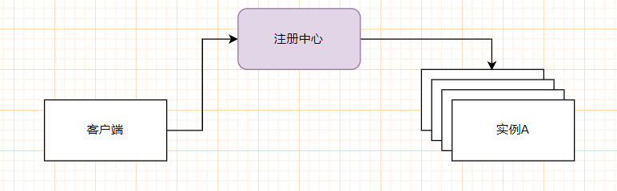

# RPC 概述和架构的演变

## 一、简介

### 1.1 引言

**RPC** 是远程过程调用 （`Remote Procedure Call`）的缩写形式，是一种跨进程的方法调用形式，是目前在 Java 分布式，微服务体系过程之中，重要的一种通信方式。 

> 在 JVM 中，启动一个项目，就意味着开启了一个线程，这里的跨进程可以理解为：有两个项目在两个虚拟机之中去跑，或者在一个虚拟机之中同时运行。

究竟是那些问题的存在，导致了这种方式的出现呢？下面我们首先来看一下系统架构的演变过程

### 1.2 架构的演变过程

在软件开发的时候，最早出现的就是单体架构，就是将系统中所有的功能代码耦合在一起，生成**一个 jar（war**），部署在**一个tomcat**之中，是**一个JVM进程**，就比如下面这个系统一样

那么这个架构到底存在什么问题呢？下面来进行列举

1）`存在热点问题`：这两部分资源都是放在一个jar包里面，跑在一个虚拟机之中，就会出现一个系统的访问量过大，占用了服务器的资源，进而就会影响到另一个系统的访问

2）`扩展性比较差`：新资源的分配粒度不精确

3）`模块的耦合性较高`：两个模块都是在一个大项目之中去写的，可能会出现，两个模块都依赖于一个Service，如果有一天门户提出了一个新的需求，需要去修改AService，但是后台管理系统不需要或者说不想要这个需求，就会产生影响

4）`维护和部署的成本较高`：某一次发布，只更新一部分代码，但是由于是单体架构，所以会发布整个系统

5）`技术栈受限`，必须要使用相同的编程语言

接下来出现的架构就是：**单体式架构的水平扩展**，将一个相同的项目，部署到个多个机器之上

但是这种架构只解决了热点问题，也就是说可以解决单体架构在单台服务器之上，内存，CPU，网络连接数遇到瓶颈时的问题，但是其余的问题还是没有解决掉，

**垂直结构**，把一个单体架构的应用，按照子系统进行划分，每个子系统都部署在自己的 tomcat 之中，多个子系统共享数据库等存储资源，有限的解决了单体架构的问题。当我们的系统通过垂直架构来进行划分之后，比如说现在已经拆分出来两个模块，模块A 和 模块B，如果说现在模块A要实现一个功能点C，但是这个功能在模块B之中已经存在了，所以现在就有两种策略：

- 方式一：在模块A之中，再实现一波功能C
- 方式二：调用模块B的这个功能

对于这两种方式，使用方式二能够使得系统的内聚性更高。

> 模块内部的各个元素之间的关联更加紧密，即所谓的高内聚性，模块的内聚性越高，其模块化的效果就会越好，软件的可维护性、可扩展性和可重用性也会更加优秀。

而方式二，由一个模块调用另一个模块的功能，也就是所说的 **RPC**。

到这里为止，我们就看了一下整体架构的演变过程，那么我们该如何去设计一个 RPC 框架呢？

## 二、RPC 的设计

### 2.1 设计目标

对于一个RPC框架，它的设计目标就是：让调用者像调用本地方法一样调用远端的服务方法。

为了实现这个目标，究竟需要解决那些问题？

### 2.2 核心问题

RPC 是 两个模块之间进行跨进程调用，首先需要解决的就是通信方式

#### 01 通信方式

两个模块在不同的虚拟机上，就会涉及到了跨进程的调用，跨进程调用可以走网络，进行网络编程，这里就会涉及到了协议的选择，使用 Http 协议？ 还是使用 TCP协议 ？

> Http 底层虽然也是 TCP，但是走Http协议，会在消息头加上Http相关信息
>
> Http 是短连接协议 （即时到后面也是有限的长连接），需要频繁的建立 和关闭连接

那么走两种协议究竟会带来哪些优点，哪些缺点？

**1）如果走 HTTP 协议**

- 使用HTTP协议，最为方便的是不用开发服务器，有现成的，如Tomcat，Resin。
- 服务器端，不能够直接通过网络进行调用Service，需要通过控制器进行暴露。
- 客户端发起 Http 请求，可以使用HttpClient，RestTemplate，WebClient，OKHttp
- 优势：文本类型 字符串协议，跨语言平台好
- 问题：传输数据量大
- 典型的技术实现方案：Spring Clout Feign ；Hessian RPC

**2）如果走 TCP 协议**

- 服务器端需要自己开发 Socket 编程，接受客户端传递过来的参数，不过可以直接调用 Service 进行使用，
- 优势：效率高，连接的复用性较好。自己定义应用协议。自己定义序列化的方式
- 问题：开发难度增大，对使用者不友好
- 典型的技术实现方案：Dubbo

#### 02 协议

如果使用 TCP ，需要自定义协议。如果说我们自定义协议，将会包含两大部分：

- 协议头
- 协议体

#### 03 序列化

在网络通信之中，序列化是必不可少的一环。他相当于通信双方定义的一种标准，对数据进行处理。

发送方在发送的时候，将数据通过`序列化`操作转换为一种格式，接受方在接受之中，在将这种格式的数据通过`反序列化`转为原来的样子。

根据序列化之后的数据格式，可以分为以下两种：

- 文本格式的序列化实现方案：数据通过某种格式通过文本的格式呈现；目前最为广泛使用是`JSON`格式和`XML`格式
- 二进制格式的序列化实现方案：数据通过某种编排规则通过二进制格式呈现；但是这种方式对于异构性语言并不友好

由于序列化的最终目的是为了进行网络传输，所以选择一种比较好的序列化方式，让内容转换之后尽可能的小，就显得尤为重要了。

#### 04 远程代理类

RPC 的设计目标就是让调用者像调用本地方法那样调用远端方法。在设计的时候，要尽可能屏蔽细节，让适用方只关注业务接口，所以在调用者这方，需要创建远程服务类的代理类。

### 2.3 衍生方案 - 注册中心

当服务端有多个实例的时候，这种情况之下就需要考虑注册中心了，在注册中心之中，有所有服务的注册的信息。

那个这个注册中心究竟有哪些功能呢？

1）进行负载均衡，基于轮训或者加权的一些策略，将请求达到对应的服务上

2）进行服务的管理：定期的发送心跳，看那些服务是可以使用的

3）解耦合：客户端不需要写死服务端的地址，而是从注册中心去获取服务

4）熔断：如果服务端的这个实例挂了，断开这个连接

5）限流：限制某一个实例的访问量