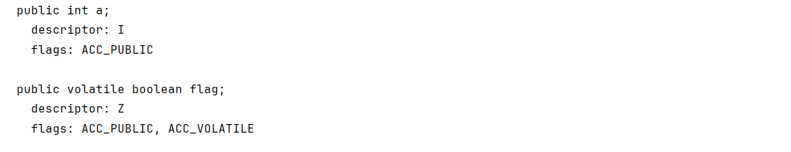
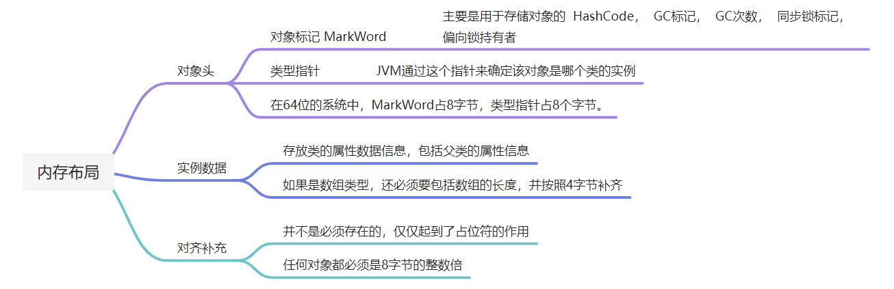
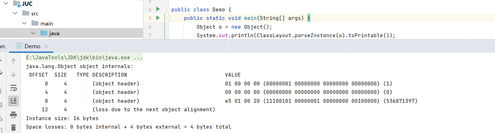
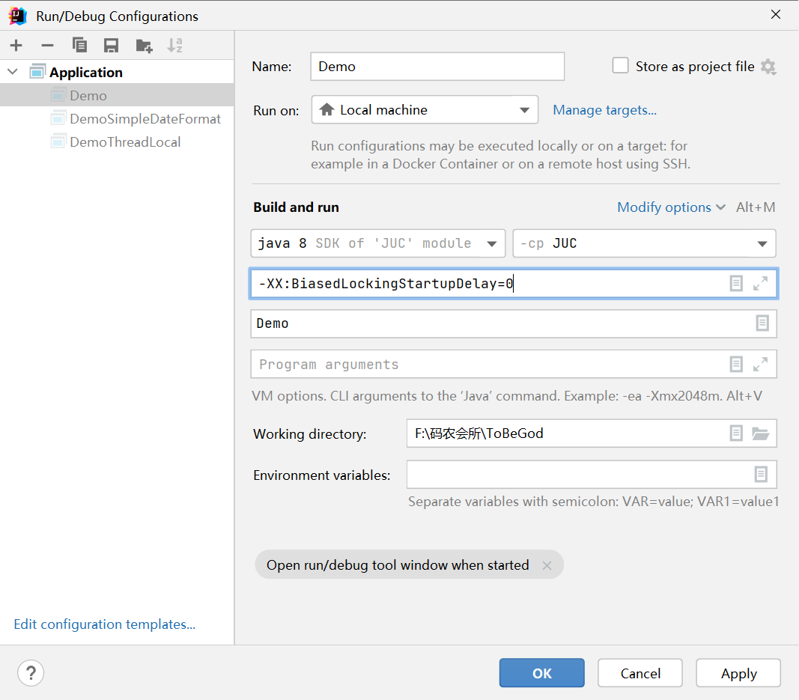
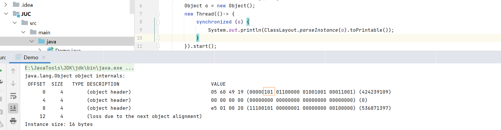
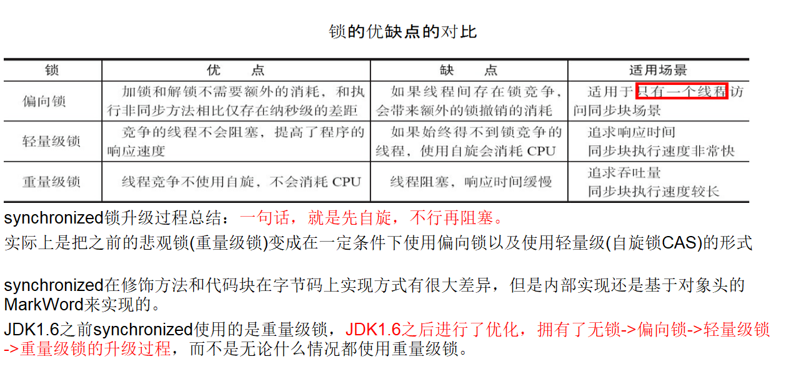
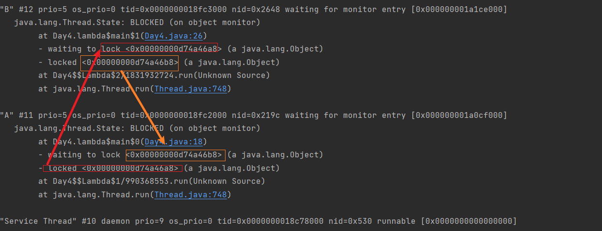
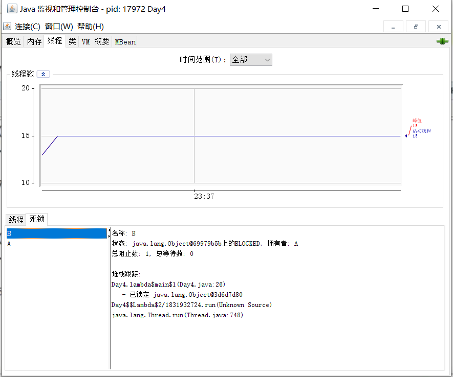

# 并发编程基础

## 一、概述

JUC 是  `java.util.concurrent` 包的简称，在 Java 5.0 之中添加，目的就是为了更好的支持高并发任务，让开发者进行多线程编程的时候减少竞争条件和死锁的问题。

当一个程序被运行的时候，从磁盘中加载这个程序的代码到内存之中，这时候就开启了一个 **进程**，进程是系统进行资源分配和调度的基本单位，每个进程都有自己独立的内存空间的系统资源，而 **线程** 是进程中的一个实体，存在于进程之中。

### 1.1 创建线程

在 Java 之中，有三种创建线程的方式，分别是：

1）继承 Thread 类

2）实现 Runnable 接口

3）实现 Callable 接口：和 Callable 配合使用的有一个Future类，通过这个类可以了解任务执行情况，或者取消任务的执行，获取执行结果

### 1.2 用户线程 和 守护线程

Java 线程分为用户线程 和 守护线程，线程的 daemon 属性是 true 是守护线程，false 是用户线程

- **守护线程**：一种特殊的线程，专门为用户线程提供服务的线程，生命周期依赖于用户线程，只有 JVM 中仍然存在用户线程正在运行的时候，守护线程才有存在的意义，否则，一旦JVM进程结束，守护线程也会随之结束。比如垃圾回收线程
- **用户线程**：是系统的工作线程，他会完成这个程序需要完成的业务操作

:::info

如果用户线程全部结束了，意味着程序需要完成的业务操作已经结束了，系统可以退出了。所以系统只剩下了守护线程的时候，JVM会自动退出

:::

## 二、线程的状态

在通用的线程生命周期之中，线程具有如下的状态：


但是对于Java来讲，他对运行和可运行状态进行了简化，并对休眠状态进行了细化。在Java中提供了这6种线程状态。


## 三、管程
`Monitor`，监视器，也就是我们平时所说的锁，其实是一种同步机制，他的义务就是保证同一时间只有一个线程可以访问被保护的数据和代码。JVM 中同步是基于进入和退出监视器对象来实现的，**<font style="color:#2F54EB;">每个对象实例都会有一个  Monitor  对象，Monitor  对象会和  Java对象  一同创建和销毁</font>**，底层使用  C++ 语言 实现。**<font style="color:#2F54EB;">执行线程就要求先成功持有管程，然后才能执行方法，最后当方法完成时释放管程</font>**。在方法执行期间，执行线程持有了管程，其他任何线程都无法在获取到同一个管程。

对于一个监视器对象，具有如下的属性：

| _owner | 指向持有ObjectMonitor对象的线程 |
| :---: | :---: |
| _WaitSet | 存放处于  wait状态 的线程队列 |
| _EntryList | 存放等待锁释放状态的线程队列 |
| _recursions | 锁的重入次数 |
| _count | 用来记录该线程获取锁的次数 |

比如说，下面这个示例

:::=tabs
::源代码

```java
new Thread(() -> {
    synchronized (TestSynchronized.class) {
        System.out.println("ThreadA");
        try {
            TestSynchronized.class.wait();
        } catch (InterruptedException e) {
            throw new RuntimeException(e);
        }
    }
},"ThreadA").start();

new Thread(() -> {
    synchronized (TestSynchronized.class) {
        System.out.println("ThreadB");
    }
},"ThreadB").start();

new Thread(() -> {
    synchronized (TestSynchronized.class) {
        System.out.println("ThreadC");
    }
},"ThreadC").start();
```

::对应的监视器

:::

## 四、线程之间协作

### 4.1 join

在线程中调用另一个线程的 join() 方法，会将当前线程挂起，而不是忙等待，直到目标线程结束。

join 方法会释放CPU，底层调用的仍然是wait方法

```java
Thread threadA = new Thread(() -> {
    log.info("ThreadA");
    try {
        TimeUnit.SECONDS.sleep(10);
    } catch (InterruptedException e) {
        throw new RuntimeException(e);
    }
});
threadA.start();
threadA.join();
log.info("Main Thread");
```

执行效果如下：

```markdown
20:44:15.699 [Thread-0] INFO com.coding.join.TestJoin - ThreadA
20:44:25.715 [main] INFO com.coding.join.TestJoin - Main Thread
```

如果不加 join 方法，则对应的执行效果如下

```markdown
20:45:13.787 [main] INFO com.coding.join.TestJoin - Main Thread
20:45:13.787 [Thread-0] INFO com.coding.join.TestJoin - ThreadA
```

对于 join 方法，底层仍然是通过 wait 方法来完成的

### 4.2 wait() notify() notifyAll()

对于这几个方法实际上都是和管程对象密切相关的，只能在 同步方法或者同步代码块之中执行。

他们都属于 Object 的一部分，而不属于 Thread 方法。

|      方法      | 含义                                                         |
| :------------: | ------------------------------------------------------------ |
|    notify()    | 通知一个在对象上等待的线程，使其从wait方法返回，而返回的前提是该线程获取了对象的锁 |
|  notifyAll()   | 通知所有等待在该对象上的线程                                 |
|     wait()     | 调用该方法的线程进入等待状态，只有等待另外线程的通知或者被中断才被放回。 |
|   wait(long)   | 超时等待一段时间，这里的参数时间是毫秒，也就是等待长达n秒    |
| wait(long,int) | 对于超时时间更细粒度的控制，可以达到毫秒级别                 |

当调用 wait 方法之后，线程就会进入 Monitor 对象的 wait 队列之中等待，当调用 notify 方法之后，就会唤醒 wait 队列的线程。

进入 wait 之后，就会释放出当前持有的 Monitor 对象。

> 场景：三个线程轮流打印 ABC

```java
private static int state = 0;

Object lockA = new Object();

new Thread(()->{
    for (int i = 0; i < 10; i++) {
        synchronized (lockA) {
            while (state != 0) {
                try {
                    lockA.wait();
                } catch (InterruptedException e) {
                    throw new RuntimeException(e);
                }
            }
            System.out.println("A");
            state = 1;
            lockA.notifyAll();
        }
    }

}).start();

new Thread(()->{
    for (int i = 0; i < 10; i++) {
        synchronized (lockA) {
            while(state != 1) {
                try {
                    lockA.wait();
                } catch (InterruptedException e) {
                    throw new RuntimeException(e);
                }
            }
            System.out.println("B");
            state = 2;
            lockA.notifyAll();
        }
    }
}).start();

new Thread(()->{
    for (int i = 0; i < 10; i++) {
        synchronized (lockA) {
            while(state != 2) {
                try {
                    lockA.wait();
                } catch (InterruptedException e) {
                    throw new RuntimeException(e);
                }
            }
            System.out.println("C");
            state = 0;
            lockA.notifyAll();
        }
    }
}).start();
```

### 4.3 await() signal() signalAll()

JUC 类库中提供了 Condition 类来实现线程之间的协调，可以在 Condition 上调用 await() 方法使线程等待，其它线程调用 signal() 或 signalAll() 方法唤醒等待的线程。相比于 wait() 这种等待方式，await() 可以指定等待的条件，因此更加灵活。

> 场景：三个线程轮流打印 ABC 

```java
Lock lock = new ReentrantLock();
Condition conditionA = lock.newCondition();
Condition conditionB = lock.newCondition();
Condition conditionC = lock.newCondition();

new Thread(()->{
    for (int i = 0; i < 10; i++) {
        lock.lock();
        while (state != 0) {
            try {
                conditionA.await();
            } catch (InterruptedException e) {
                throw new RuntimeException(e);
            }
        }
        System.out.println("A");
        state = 1;
        conditionB.signal();
        lock.unlock();
    }

},"A").start();

new Thread(()->{
    for (int i = 0; i < 10; i++) {
        lock.lock();
        while (state != 1) {
            try {
                conditionB.await();
            } catch (InterruptedException e) {
                throw new RuntimeException(e);
            }
        }
        System.out.println("B");
        state = 2;
        conditionC.signal();
        lock.unlock();
    }

},"B").start();

new Thread(()->{
    for (int i = 0; i < 10; i++) {
        lock.lock();
        while (state != 2) {
            try {
                conditionC.await();
            } catch (InterruptedException e) {
                throw new RuntimeException(e);
            }
        }
        System.out.println("C");
        state = 0;
        conditionA.signal();
        lock.unlock();
    }

},"C").start();
```

## 五、并发编程Bug的源头

### 5.1 可见性

一个线程对共享变量的修改，另外一个线程能够立刻看到，我们称之为**可见性**。

在单核 CPU 下，所有线程操作的都是同一个 CPU 的缓存，一个线程更改了缓存之后，对于另一个线程而言一定是可见的。但是在多核时代，每颗CPU都有自己的缓存，当多个线程在不同的CPU上执行的时候，这些线程操作的是不同的CPU缓存。

比如下面这个示例：

```java
public class Test7 {
    public static void main(String[] args) throws InterruptedException {
        int count = 0;
        Thread t1 = new Thread(()->{
            for(int i = 0; i < 10000; i++) count += 1;
        });
        Thread t2 = new Thread( ()-> {
             for(int i = 0; i < 10000; i++) count += 1;
        });
        t1.start();
        t2.start();
        t1.join();
        t2.join();
        System.out.println(resource.getCount());
    }
}
```

对于上述的代码，我们可能想会得到一个 20000 的结果，但是结果不是，通过运行，最终会得到一个随机数。

我们假设两个线程是同时开始执行的，那么一开始都会将 count 读到各自的CPU缓存中，基于各自的CPU缓存中的 count 进行计算，最终导致结果的不确定性，这就是缓存的可见性问题,   出现这种问题的原因主要是缓存，这种问题也被称之为【缓存一致性问题】


对于上述的代码，我们可能想会得到一个20000的结果，但是结果不是，通过运行，最终会得到一个随机数。

我们假设两个线程是同时开始执行的，那么一开始都会将count 读到各自的CPU缓存中，基于各自的CPU缓存中的count进行计算，最终导致结果的不确定性，这就是  **缓存的可见性问题**

### 5.2 原子性

OS 做任务切换的时候，可以发生在任何一条CPU指令执行完成之后，而不是高级语言的一条语句。就比如 count + 1 指令。

对于程序而言，就是一条语句，但是实际上至少需要 3 条 CPU 指令。

- 将 count 从 内存读取到 CPU 的寄存器
- 在寄存器中执行 +1 操作
- 将结果写入到内存之中

可能在执行第二条指令的时候，CPU 进行了任务的切换。就比如下面这样


我们把一个或者多个操作在CPU执行的过程中不被打断的特性称之为  **<font style="color:#E8323C;">原子性，解决原子问题的关键，就是保证中间状态对外不可见</font>**

### 5.3 有序性

当我们把代码写好之后，虚拟机并不一定会按照我们写的代码的顺序来执行。如果优化后，将代码顺序改变之后，也称之为重排序，这些重排序可能会导致多线程内存可见性问题，这种问题我们称之为**【有序性问题】**

重排序分3种类型：

+ **编译器优化的重排序**。编译器在不改变单线程程序语义的前提下，可以重新安排语句的执行顺序
+ **指令级并行的重排序**。现代处理器采用了指令级并行技术（Instruction-Level Parallelism，ILP）来将多条指令重叠执行。如果不存在数据依赖性，处理器可以改变语句对应机器指令的执行顺序
+ **内存系统的重排序**。由于处理器使用缓存和读/写缓冲区，这使得加载和存储操作看上去可能是在乱序执行

通过这样的优化之后，最终生成要执行的指令序列，比如说下面这个场景：

```java
public class Base {
    public int a = 0;

    public volatile boolean flag = false;
    
    public void read() {
        a = 1; // 1
        flag = true; // 2
    }
    
     public void write() {
        if(flag) {
            int i = a * a; // 3
            System.out.println(i);
        }
    }
}
```

一个线程执行 read ，另一个线程执行 write，此时如果对 1 和 2 进行了重排序，就会出现 write 方法进行了 if 判断，但是此时 a = 0 的问题，就会导致 write 方法的执行结果不正确

## 六、内存模型

导致可见性的原因是缓存，导致有序性的原因是编译优化，解决可见性和有序性 的办法就是禁用缓存和编译优化。

虽然说问题解决了，但是程序的性能就会带来影响。合理的方案就是  **按需禁用缓存以及编译优化**。JMM 规范了 JVM 如何提供 **按需禁用缓存和 编译优化** 的方式。其中包括：

- volatile
- synchronized
- final
- Happens-Before 规则

#### 6.1 volatile

> 可见性

当声明一个 volatile 变量的时候，表示告诉编译器，对于这个变量的读写，不能使用 CPU 缓存，必须从内存之中读取或者写入。

由`volatile` 修饰的变量在进行写操作的时候，会多出一条`Lock`指令。而这条指令，会将当前处理器缓存行中的数据，强制写回到 系统内存之中，并且一个处理器的缓存写入到内存之中，总会导致其他处理器缓存无效。处理器会通过 **嗅探机制** 在总线上传播数据来检查自己的缓存值是否是过期，如果是的话，就会将当前处理器中的缓存行设置为无效，重新从系统内存读取一份。

**简而言之，对于 volatile 的写内存语义是直接刷新到主内存之中，读的内存语义就是直接从主内存中读取。**

> 有序性

对于有序性的问题，编译器在生成字节码的时候，会在指令序列中插入  **内存屏障**  来禁止特定类型的处理器重排序，有如下四种内存屏障

| 型         | 示例                       | 说明                                                         |
| ---------- | -------------------------- | ------------------------------------------------------------ |
| LoadLoad   | load1； LoadLoad； load2   | 确保 load1 数据的装载先于 load2 以及后续所有装载指令         |
| StoreStore | Store1；StoreStore；Store2 | 确保 Store1 数据刷新内存先于 Store2 及后续存储指令的存储     |
| LoadStore  | Load1；LoadStore；Store    | 确保 Load1 数据装载先于 Store2 及后续所有的内存指令刷新到内存 |
| StoreLoad  | Store1；StoreLoad；Load2   | 确保 Store1 的操作结果刷新到内存先于 Load2 及后续所有装载指令的装载 |

接下来，我们以实际的案例看一下 volatile 的实现，这里我们还是通过 Base 类为基础

```java
public class Base {
    public int a = 0;

    public volatile boolean flag = false;

    public void write() {
        if(flag) {
            int i = a * a;
            System.out.println(i);
        }
    }
    public void read() {
        a = 1;
        flag = true;
    }
}
```

查看对应的字节码，声明为 volatile 的变量 ，会多出一个 `ACC_VOLATILE` 的指令



#### 6.2 synchronized

##### 6.2.1 概述

对于 volatile 能够实现可见性和有序性，但是无法实现原子性。而保证原子性最为有效的操作就有通过加锁的方式。

sychronized 被称之为 “重量级锁”，

::: info

在`JDK5` 之前，只有重量级锁，依靠操作系统的 `mutex` 指令，需要 用户态和内核态 进行切换，性能损耗明显。很多时候会出现切换时间比用户的业务时间更短。

:::

Java中每个对象都可以作为锁，具体表现形式有以下三种：

1. 对于普通同步方法，锁的是当前实例对象，通常是指 this，是指对象锁。
2. 对于静态同步方法，锁的是当前类的class对象，是指类锁。
3. 对于同步方法块，锁的是`synchronized`括号中的对象。

在上文之中，我们提到了 管程，任何一个对象都有一个 monitor 与之关联， synchronized 底层就是通过这个对象来实现的。

接下来，我们就来详细讨论一下 synchronized 

开始之前，我们先回顾一下，在 JVM 篇，我们提到了，对于一个对象，主要有如下部分组成：



如果说一个 Java 对象被某个线程锁住，则该对象的 Mark Word字段中LockWord 指向`monitor`的起始地址；`Monitor`的 `Owner` 字段会存放拥有相关联对象锁的线程ID。

synchronized用的锁是存在Java对象头里的Mark Word中，锁升级功能主要依赖 MarkWord 中锁标志位和释放偏向锁标志位


synchronized 在不同场景之下，会采用不同的锁，而锁的转换过程如下：


接下来，我们就来看一下对应的锁，以及锁升级的过程。我们可以借助于下面这个依赖，查看对象的内存占用情况

```xml
<dependency>
  <groupId>org.openjdk.jol</groupId>
  <artifactId>jol-core</artifactId>
  <version>0.9</version>
</dependency>
```

##### 6.2.2 无锁

现在并没有HashCode，只有调用的时候才会生成。（注意看的顺序，倒着看）



##### 6.2.3 偏向锁

如果从始至终，对于这个锁都不存在与竞争，那么其实就没有必要上锁，只需要打个标记就行了，这就是偏向锁的思想。一个对象初始化后，还没有任何线程来获取他的锁，那么他就是可偏向的，当有第一个线程来访问它并尝试获取锁的时候，他就把这个线程记录下来，如果尝试获取锁的线程是偏向锁的拥有者，就可以直接获取锁，开销小，性能高。

那么只需要在锁第一次被拥有的时候，记录下偏向线程ID。这样偏向线程就一直持有着锁(后续这个线程进入和退出这段加了同步锁的代码块时，不需要再次加锁和释放锁。而是直接比较对象头里面是否存储了指向当前线程的偏向锁)。线程是不会主动释放偏向锁

> 演示偏向锁

偏向锁在应用程序启动几秒之后才激活，可以通过使用JVM参数来关闭延迟。  

+ `-XX:+UseBiasedLocking -XX:BiasedLockingStartupDelay=0`





这里只是一个线程的情况，当有其余的线程来逐步竞争锁的时候，就不能够使用偏向锁，要升级为轻量级锁。

**<font style="color:#2F54EB;">情况一</font>**：当第一个线程正在执行sychronized方法，**<font style="color:#F5222D;">也就是处于同步块</font>**，他还没有执行完成，其他线程来抢夺，该偏向锁会被取消并出现锁升级，此时轻量级锁由原来持有偏向锁的线程持有，继续指向其同步代码块，而竞争的线程会进入自旋等待获得该轻量级锁。

**<font style="color:#2F54EB;">情况二</font>**：当第一个线程执行完成sychronized方法，**<font style="color:#F5222D;">也就是退出同步块</font>**，则将对象头设置为无锁状态并撤销偏向锁，重新偏向。

##### 6.2.4 轻量级锁

轻量级锁，是为了在线程近乎交替执行同步块的时候提高性能。

当关闭偏向锁功能或者多线程竞争偏向锁会导致偏向锁升级为轻量级锁。如果说不能抢到锁，就一直自旋。通过自旋的方式尝试获取锁，但是不会进入阻塞状态。在自旋锁中规定了自旋次数。如果说超过了自旋次数，进行锁升级

轻量级锁每次退出同步块都需要释放锁，而偏向锁是在竞争发生的时候才释放锁。


 

##### 6.2.5 重量级锁

重量级锁是互斥锁，他是利用操作系统的同步机制来实现的，所以开销非常大。


##### 6.2.6 锁的总结



#### 6.3 final 

对于 final 域，要遵守两个重排序的规则：

- 构造函数内对于 final 的写入，与随后将这个被构造对象的引用赋值给一个引用变量，不能够重排序
- 初次读一个包含 final 域的对象的引用，与随后初次读这个 final 域，不能重排序

```java
class User {
    public static Object obj;
}

public class TestFinal {
    public int a;
    
    public TestFinal() {
        a = 1;
        User.obj = this;
    }
}
```

#### 6.4 Happens-Before 规则

对于重排序优化，造成多线程内存可见性的问题，JMM 通过要求 Java 编译器在生成指令序列的时候插入**内存屏障**来解决。其中主要包括从 JDK 5 开始，Java使用新的 JSR-133 内存模型。JSR-133 使用  `happens-before`  的概念来阐述操作之间的内存可见性。

**在 JMM 中，如果一个操作执行的结果需要对另一个操作可见，那么这两个操作之间必须存在 happens-before 关系。**

::: info

一条 happens-Before 规则都是通过一个或者多个禁止重排序来完成的

:::

提供的规则如下：

1. `次序规则`：一个线程内，按照代码顺序，写在前面的代码先行发生于写在后面的代码
2. `锁定规则`：对于一个锁的解锁，happens-before于随后对这个锁的加锁
3. `volatile变量规则`：对于一个volatile变量的写，happens-before于后续对这个volatile变量的读
4. `传递规则`：如果说A 先行发生于 B，B又先行发生于C，可以得出 A 先行发生于 C
5. `线程启动规则`：Thread对象的start()方法先行发生于此线程的每一个动作
6. `线程中断规则`：对线程 interrupt()方法的调用先行发生于被中断线程的代码检测到中断事件的发生；
7. `线程终止规则`：线程中的所有操作都先行发生于对此线程的终止检测
8. `对象终结规则`：一个对象的初始化完成（构造函数执行结束）先行发生于它的 finalize() 方法的开始

## 七、死锁

两个或者两个以上的进程在执行过程中，互相持有对方所需要的资源，导致这些线程处于等待状态，无法继续执行，如果说没有外力的干涉，他们就无法再执行下去。

产生死锁的原因

1. 互斥：互斥资源X和Y只能被一个线程访问
2. 占有且等待：线程A占有资源A，在等待资源B，但是等待过程中，不释放资源A
3. 不可抢占：其他线程不能抢夺线程T1已经占有的资源
4. 循环等待：线程A占有X，等待Y，线程B占有Y，等待X

解决死锁，最好的方法就是避免死锁

1. 破坏占有且等待条件：一次性申请所有资源
2. 破坏不可抢占的条件：线程A占有资源A，在等待资源B，但是等待过程中，如果说等待不到，释放资源A
3. 破坏循环等待条件：需要对资源进行排序，然后按序申请资源

接下来，通过实际案例来来演示一下，如何排查死锁

```java
public class Day4 {
   static Object lockA = new Object();
   static Object lockB = new Object();

    public static void main(String[] args) {
        new Thread(() -> {
            synchronized (lockA) {
                System.out.println(Thread.currentThread().getName()+"\t"+"持有A锁，想要获取lockB");
                try {
                    Thread.sleep(1000);
                } catch (InterruptedException e) {
                    e.printStackTrace();
                }
                synchronized (lockB) {
                    System.out.println(Thread.currentThread().getName()+"\t"+"获取了B锁");
                }
            }
        },"A").start();
        new Thread(() -> {
            synchronized (lockB) {
                System.out.println(Thread.currentThread().getName()+"\t"+"持有B锁，想要获取lockA");
                synchronized (lockA) {
                    System.out.println(Thread.currentThread().getName()+"\t"+"获取了A锁");
                }
            }
        },"B").start();
    }
}

```

当出现了死锁之中，我们可以通过 jstack 来进行排查



在 window 情况之下，我们还可以借助于 jconsole 来进行定位




