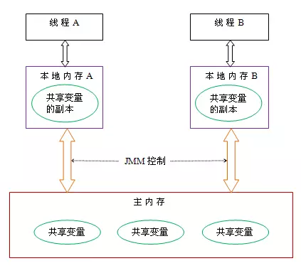

# 内存模型
Java 内存模型，描述了线程如何与内存进行交互，虚拟机规范视图定义一种 Java 内存模型，来屏蔽掉各种操作系统内存访问的差异，以实现 Java程序在各种平台下都能达到一致的访问效果。

主要目的在于，定义各个变量的访问规则，并决定一个线程对共享变量的写入何时以及如何变成对另一个线程可见。

在并发编程需要处理两个关键的问题，**线程之间如何进行通信** 和 **线程之间如何进行同步****，**Java线程之间的通信是由JMM控制，JMM决定一个线程对共享变量的写入何时对另一个线程可见。从抽象角度来看，JMM定义了线程和主内存之间的抽象关系：线程之间的共享变量存储在主内存之中，每个线程都有自己的一个私有的本地内存，本地内存中存储该变量的副本。这里的本地内存就是JMM的一个概念

如果说两个线程要通信，要进行如下步骤

    1. 将本地内存的副本刷新到主内存
    2. 从主内存中读取已经更新过的数据

其实这个通信过程是通过主内存的，JMM通过控制主内存和每个线程的本地内存之间的交互，来提供可见性保护。**定义了8种操作来完成【变量如何从主内存到本地内存】以及变量如何 从本地内存到主内存**

# 3. happen-before
## 3.1 基本信息
1. 从JDK 5开始，Java使用新的`JSR-133`内存模型。`JSR-133`使用`happens-before`的概念来阐述操作之间的内存可见性
2. 在JMM中，如果一个操作执行的结果需要对另一个操作 可见性 或者 代码重排序，那么这两个操作之间必须存在 happens-before 关系。

## 3.2 总原则
1. 如果一个操作happens-before另一个操作，那么第一个操作的执行结果将对第二个操作可见，而且第一个操作的执行顺序排在第二个操作之前。
2. 两个操作之间存在happens-before关系，并不意味着一定要按照happens-before原则制定的顺序来执行。如果重排序之后的执行结果与按照happens-before关系来执行的结果一致，那么这种重排序并不非法。

## 3.3 8 条规则
1. `次序规则`：一个线程内，按照代码顺序，写在前面的代码先行发生于写在后面的代码
2. `锁定规则`：对于一个锁的解锁，happens-before于随后对这个锁的加锁
3. `volatile变量规则`：对于一个volatile变量的写，happens-before于后续对这个volatile变量的读
4. `传递规则`：如果说A 先行发生于 B，B又先行发生于C，可以得出 A 先行发生于 C
5. `线程启动规则`：Thread对象的start()方法先行发生于此线程的每一个动作
6. `线程中断规则`：对线程interrupt()方法的调用先行发生于被中断线程的代码检测到中断事件的发生；
7. `线程终止规则`：线程中的所有操作都先行发生于对此线程的终止检测
8. `对象终结规则`：一个对象的初始化完成（构造函数执行结束）先行发生于它的finalize()方法的开始

