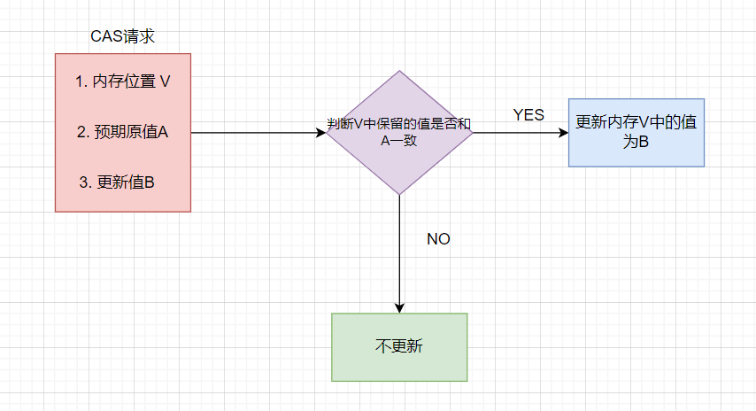
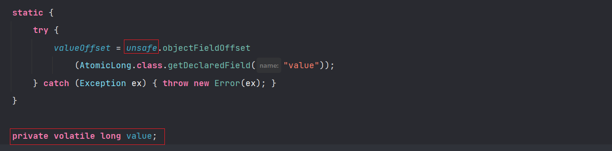
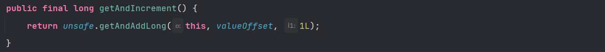
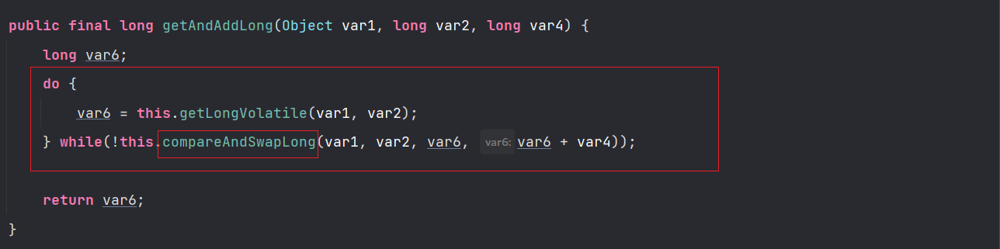

# CAS

```java
class User {
    long count = 0;
    void add() {
        for(int i = 0; i < 1000; i++) {
            count += 1;
        }
    }
}
```

对于这样的案例，add方法并不是线程安全的，问题主要在于变量 count 的可见性和 count+=1 的原子性，可见性问题，我们可以使用volatile，原子性问题，可以采用互斥锁。而相对于简单的原子问题，Java 为我们提供了一种无锁方案，就是使用原子类，比如下面这段代码

```java
class User {
    AtomicLong atomicLong = new AtomicLong(0);
    void add() {
        for(int i = 0; i < 10000; i++) {
            atomicLong.getAndIncrement();
        }
    }
}
```

通过这样的方式，我们就可以避免使用互斥锁带来的性能损耗问题。而这种方案是通过硬件来实现的。实际上就是CAS，`compare and swap`的缩写，中文翻译成 **比较并交换**  ，实现并发算法时常用到的一种技术。它包含三个操作数：

- 内存位置V
- 预期原值A
- 更新值B。

如下图所示：



更新失败的线程不会被阻塞，而是被告知这一次的竞争失败，还可以继续尝试。

CAS 是 JDK 提供的非阻塞原子操作，他通过硬件保证了比较更新的原子性，是CPU的一条原子指令（ cmpxchg指令）。

当执行这条指令的时候，会首先判断当前系统是否是多核操作系统，如果是就给总线加锁，保证只有一个线程会对会对总线加锁成功，成功之后会执行CAS操作。**总而言之，CAS的原子性实质上是通过操作系统实现的**。

在上一个例子中，我们所说的使用原子类来解决我们的原子性问题，而他的底层实际上是调用 Unsafe 类中的方法，而这些方法都是native方法，也就是这些都是调用底层操作系统的方法。

通过观察原子类的属性，我们发现了里面有unsafe类，还有使用`volatile`修饰的变量。



自增方法如下，实际上就是调用unsafe中的方法。





通过这段代码的分析，我们就可以看出，原子类在执行自增操作的时候，在不断的进行自旋操作，而跳出自旋的依据就是通过CAS进行实现。但是这种方案也是存在问题的

+ 问题一：`ABA`问题：如果说一个值从 A -----> B ------> A，comparaAndSet 是不会发现问题的。

+ 问题二：由于是不断的进行自旋，就会导致循环时间过长
+ 问题三：只能保证一个共享变量的原子操作

