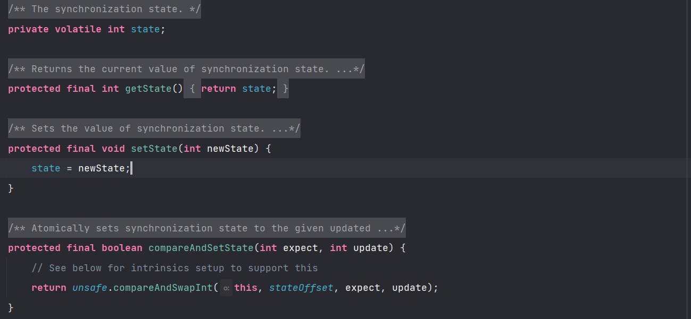
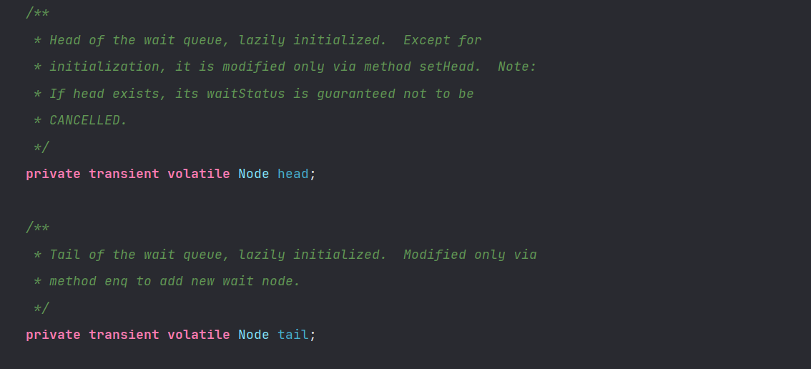
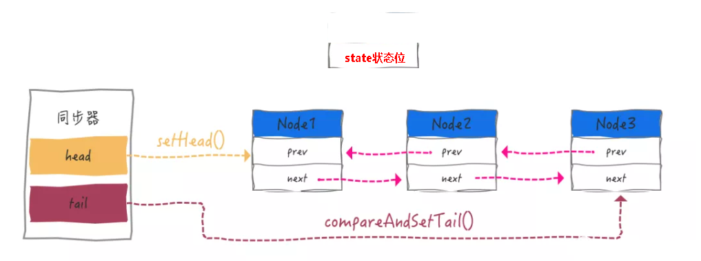

# AQS

## 一、基本信息

`AbstractQueuedSynchronizer`,  抽象的队列式的同步器，内部定义了很多锁相关的方法。在内部中维护了一个`**volatile int state**`**来代表共享资源是否被占用的标志位**，并用一个`FIFO`线程等待队列。

**<font style="color:#2F54EB;">同步器的主要使用方式是继承</font>**<font style="color:black;">，子类通过继承同步器并实现它的抽象方法来管理同步状态。</font>

**<font style="color:#2F54EB;">类推荐被定义为自定义同步组件的静态内部类</font>**<font style="color:black;">，同步器自身没有实现任何同步接口，它仅仅是定义了若干同步状态获取和释放的方法来供自定义同步组件使用，</font>**<font style="color:#2F54EB;">同步器既可以支持独占式地获取同步状态，也可以支持共享式地获取同步状态。</font>**同步器的设置是基于模板方法模式。

## 二、内部结构
### 2.1 state
线程获取锁的两种方式

+ 独占模式，一旦被占用，其他线程就不能被占用。
+ 另外一种方式就是共享模式，一旦被占用，其他共享模式下的线程也能获取锁。

**<font style="color:#2F54EB;">所以这个state，不仅仅用来表示共享资源是否被占用，还用来表示线程占用的数量。</font>**

使用 `volatile` 就保证了线程的可见性。通过 CAS 进行值的设置，保证原子性。这里还有一个直接设置State变量的方法，主要是在获取锁成功之后，进行锁释放的时候进行



### 2.2 Node
```java
static final class Node {
       // 表示已共享模式的情况之下，共享锁
        static final Node SHARED = new Node();
    
        // 表示以 独占模式的情况之下，占用锁
        static final Node EXCLUSIVE = null;
    
       // 表示线程获取锁的请求已经取消了 cancelled
        static final int CANCELLED =  1;
    
        // 表示线程已经准备好了，就等资源释放了
        static final int SIGNAL    = -1;
    
       // 表示节点在等待队列之中，节点线程等待被唤醒
        static final int CONDITION = -2;
    
       // 只有在共享模式下才会被使用
        static final int PROPAGATE = -3;

        volatile int waitStatus;
    
        // 指向当前节点的前驱节点
        volatile Node prev;
    
        // 指向当前节点的后继节点
        volatile Node next;
        
        volatile Thread thread;

        Node nextWaiter;

        final boolean isShared() {
            return nextWaiter == SHARED;
        }

        final Node predecessor() throws NullPointerException {
            Node p = prev;
            if (p == null)
                throw new NullPointerException();
            else
                return p;
        }

        Node() {}

        Node(Thread thread, Node mode) {
            this.nextWaiter = mode;
            this.thread = thread;
        }

        Node(Thread thread, int waitStatus) {
            this.waitStatus = waitStatus;
            this.thread = thread;
        }
    }
```

### 2.3 CLH 双端队列




## 三、核心方法

接下来，我们讲解一下 AQS 中的核心方法，

首先，我们看一下 acquire 方法，对于这个方法，所有的子类都不能够进行重写

```java
public final void acquire(int arg) {
    if (!tryAcquire(arg) &&
        acquireQueued(addWaiter(Node.EXCLUSIVE), arg))
        selfInterrupt();
}
```

:::code-group

```java [tryAcquire]
// 其中，tryAcquire 方法子类必须要进行重写，表示尝试获取锁
protected boolean tryAcquire(int arg) {
    throw new UnsupportedOperationException();
}
```

```java [addWaiter]
// 如果说获取锁失败，将当前线程封装为一个Node，放入等待队列之中，如果说队列不为空，就CAS设置尾节点
// 执行完成这个方法，线程一定会被封装为 Node 节点，放在了队列里面去
private Node addWaiter(Node mode) {
    // 封装为 Node 节点
    Node node = new Node(Thread.currentThread(), mode);
    // Try the fast path of enq; backup to full enq on failure
    // 如果队列之中有元素, 通过 cas 设置尾部
    Node pred = tail;
    if (pred != null) {
        node.prev = pred;
        if (compareAndSetTail(pred, node)) {
            pred.next = node;
            return node;
        }
    }
    // 如果说等待队列为空，直接调用`enq`方法将当前线程放入到的等待队列。
    enq(node);
    return node;
}
```

```java [acquireQueued]
final boolean acquireQueued(final Node node, int arg) {
    boolean failed = true;
    try {
        boolean interrupted = false;
        for (;;) {
            // 获取 Node 的前一个节点
            final Node p = node.predecessor();
            // 如果说前一个节点是头结点并且获取锁成功了
            if (p == head && tryAcquire(arg)) {
                setHead(node);
                p.next = null; // help GC
                failed = false;
                return interrupted;
            }
            // 如果说获取锁失败了
            if (shouldParkAfterFailedAcquire(p, node) && parkAndCheckInterrupt())
                interrupted = true;
        }
    } finally {
        if (failed)
            cancelAcquire(node);
    }
}
```

```java [shouldParkAfterFailedAcquire]
private static boolean shouldParkAfterFailedAcquire(Node pred, Node node) {
	// 获取前一个节点的状态
    int ws = pred.waitStatus;
    // 如果前一个节点的状态是：被通知状态，则将当前线程阻塞，retun true 就会调用 parkAndCheckInterrupt
    if (ws == Node.SIGNAL)
        return true;
    // 如果是 大于0 的，CANCELLED 也就是这个状态，直接让其出队
    if (ws > 0) {
        do {
            node.prev = pred = pred.prev;
        } while (pred.waitStatus > 0);
        pred.next = node;
    } else {
        // 通过 cas 的方式设置为前一个线程的状态等待
        compareAndSetWaitStatus(pred, ws, Node.SIGNAL);
    }
    return false;
}
```

:::

接下来，我们总结一下

`acquire  `方法是AQS为我们提供的模板方法，主要是为了进行锁的获取操作，`tryAcquire`方法是我们必须要进行重写的方法，主要是为了尝试获取锁，完成状态的变化。如果说获取锁失败了，我们需要进入`addWaiter`方法中，先将该线程封装为一个节点，然后将该节点入队

+ 如果此时同步队列是空的，我们需要进入`enq`方法，在第一个循环之中，`CAS`设置头结点，之后`CAS`设置尾节点
+ 如果此时同步队列不为空，直接`CAS`设置尾节点

结束完`addWriter`方法之后，就会使得该节点已经插入到队列中，并获得该线程封装的节点，之后进入`acquireQueued`方法之中:

+ 如果说此时该节点的头节点是head，并且获取锁成功，设置当前节点为头节点
+ 如果说此时不是头节点或者获取锁失败，进入`shouldParkAfterFailedAcquire`

在该方法之后，我们会判断他前一个节点的等待状态，

+ 如果说是SIGNAL，就好好等待，将当前线程进行阻塞
+ 如果是callelled(1)状态，则移除
+ 其他状态节点，则通过CAS设置为 SIGNAL

除了 acquire 方法之外，AQS 还提供了如下的方法：

- tryRelease：独占式释放同步状态
- tryAcquireShared：共享式获取锁
- tryReleaseShared：共享式释放锁
- isHeldExclusively：当前同步器是否被占用

## 四、Lock 接口
在`Lock`接口出现之前，Java程序是靠`synchronzied`关键字来实现锁功能的，而在Java SE5 之后，并发接口中新增加了Lock接口，提供和`synchronized`关键字相似的同步功能，**<font style="color:#1890FF;">只是在使用时需要显示的获取和释放锁</font>**，虽然说去少了隐式获取释放锁的便捷性，但是却**<font style="color:#1890FF;">拥有了锁获取和释放的可操作性以及超时获取锁等synchronized关键字不具备的同步特性</font>**。


```java
public interface Lock {
    // 获取锁，调用该方法当前线程将会获取锁，当锁获取之后，从该方法返回
    void lock();
    
    // 可中断获取锁
    void lockInterruptibly() throws InterruptedException;
    
    // 尝试非阻塞获取锁，一次性获取锁，如果获取成功则成功，如果说失败则失败
    boolean tryLock();
    
    // 超时获取锁，在超时时间之内，循环获取锁
    boolean tryLock(long time, TimeUnit unit) throws InterruptedException;
    
    // 释放锁
    void unlock();
    
    // 获取等待通知组件，该组件和当前的锁绑定，当前线程只有获取了锁，才能调用wait方法
    // 而调用之后，当前线程将释放锁
    Condition newCondition();
}
```

在 Lock 的实现类之中，最为常见的是：ReetrantLock。是基于AQS，在并发编程中他可以实现公平锁和非公平锁来对共享资源的同步，同时，和synchronized 一样，ReetrantLock 支持可重入，除此之外，ReetrantLock在调度上更加的灵活，支持更多丰富的功能。

在这个类中只有一个属性，并且这个属性还是内部类

```java
// 被final 修饰，说明一旦被初始化，就不能修改引用
private final Sync sync;
// 这是一个抽象类，等待子类重写
abstract static class Sync extends AbstractQueuedSynchronizer{

    abstract void lock();
    
    final boolean nonfairTryAcquire(int acquires) {
            final Thread current = Thread.currentThread();
            // 获取 state
            int c = getState();
            // 如果说state 为 0，说明还没有线程来占用
            if (c == 0) {
                if (compareAndSetState(0, acquires)) {
                    setExclusiveOwnerThread(current);
                    return true;
                }
            }
            else if (current == getExclusiveOwnerThread()) {
                // 当前线程是否是独占线程
                int nextc = c + acquires;
                if (nextc < 0) // overflow
                    throw new Error("Maximum lock count exceeded");
                setState(nextc);
                return true;
            }
            return false;
        }
}
// 非公平锁
static final class NonfairSync extends Sync{}
// 公平锁
static final class FairSync extends Sync{}

```

:::info
按序排队公平锁，就是判断同步队列是否还有先驱节点的存在，如果没有先驱节点才能获取锁

先占先得非公平锁，是不管这件事的，只要能够抢获到同步状态就可以了。

:::

