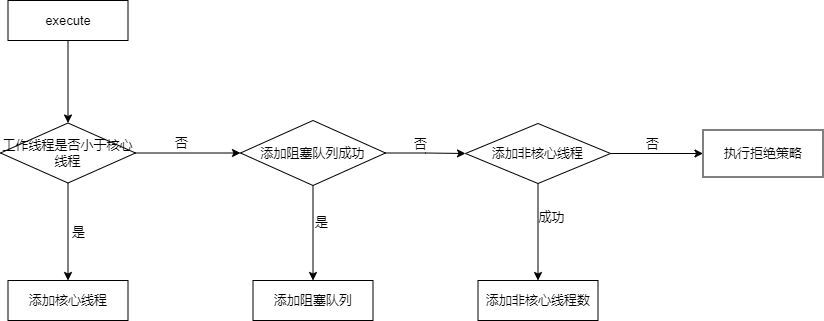

# 线程池

## 一、简介

虽然说从 Java  的角度，创建一个线程非常的简单，只需要  `new Thread()` 就能够完成，但是，实际上创建一个线程确实要调用操作系统的 API，然后操作系统为线程分配一系列资源，这个成本就会很高，所以说呢，线程是一个重量级的资源，应该避免重复的创建和销毁。我们可以通过  **线程池**  来解决问题，他其实就是池化思想的体现，并且他还可以限制线程的个数，动态添加线程。


目前，有两种方式来获取线程池：

+ 方式一：`Executors`，里面已经封装了一些默认的线程池，可以根据实际场景来进行选择
+ 方式二：`ThreadPoolExecutor` 来进行自定义创建

不过，`Executors` 方法提供的默认线程池，都是依赖于 `ThreadPoolExecutor` 

首先，我们通过 idea 来看一下，整个体系结构，如下图：


在 Executor 类中，仅仅提供了一个方法

```java
public interface Executor {
    void execute(Runnable command);
}
```

在这个接口之中，只有一个方法，接受一个 `Runnable` 的实例，他用来执行一个任务，注意只能是  `Runnable`。他创建线程是异步执行的，也就是说，不用等待每个任务执行完毕后在执行下一个任务。

在 `ExecutorService` 中，对 `Executor` 进行了扩展，并且可以接受 Callable 对象

而 `Executor`  和  `ExecutorService`  都仅仅作为接口定义，但是还没有实际实现，所以，这部分工作就落到了 `AbstractExecutorService` 中，这个类又是一个抽象类，不能够直接进行使用，所以，能够直接使用的类，只有 `ThreadPoolExecutor`

这里我们可以想到一点，接口就是用来定义一个具体的行为，而抽象类则是去抽取一些子类公用的内容。

## 二、ThreadPoolExecutor
### 2.1 构造函数


虽然说提供了四种构造函数，但是本质上还是调用最后一个构造函数。所以直接学习最后一个构造函数即可。

```java
new ThreadPoolExecutor(
    int corePoolSize, // 线程池的基本大小
    int maximumPoolSize, // 最大线程数量
    long keepAliveTime, // 线程的存活时间
    TimeUnit unit, // 时间单位
    BlockingQueue<Runnable> runnableTaskQueue,// 等待队列
    ThreadFactory threadFactory,// 线程工厂，用来创建线程
    RejectedExecutionHandler handler // 拒绝策略
);
```

下面我们来详细说明一下构造参数中的各个属性值，总共有 7 个参数

- corePoolSize：表示核心线程池的容量大小。可以被看做成稳定的工作线程数
- maximumPoolSize：最大线程数
- keepAliveTime：线程池的保活机制，表示线程在没有任务执行的情况之下保持多久会被终止，在默认情况之下，这个参数只有在线程数量大于 corePoolSize 时才会生效。
- millseconds：时间单位
- runnableTaskQueue：等待队列，用来保存待执行的任务
- threadFactory：线程工厂
- handler：拒绝策略，当阻塞队列已经满并且说线程池中的线程个数已经达到最大线程数的时候，线程池该如何处理这次任务

### 2.2 核心属性

在了解了，他的构造函数之后，我们开始看一下 TheadPoolExecutror 类的实现。他在里面大量运用了位运算

#### 2.2.1 线程池的状态

```java
// 32 - 3 = 29
private static final int COUNT_BITS = Integer.SIZE - 3;

// runState is stored in the high-order bits
// 线程池的状态
private static final int RUNNING    = -1 << COUNT_BITS;
private static final int SHUTDOWN   =  0 << COUNT_BITS;
private static final int STOP       =  1 << COUNT_BITS;
private static final int TIDYING    =  2 << COUNT_BITS;
private static final int TERMINATED =  3 << COUNT_BITS;

// 获取到线程池的状态
private static int runStateOf(int c)     { return c & ~CAPACITY; }
```

在里面有几个属性，用来表示线程池的状态

+ running<font style="color:#080808;background-color:#ffffff;">：接受新任务，也能处理阻塞队列中的任务</font>
+ shutdown<font style="color:#080808;background-color:#ffffff;">：不接受新任务，但是处理阻塞队列中的任务</font>
+ stop：不接受新任务，不处理阻塞队列中的任务，中断处理过程中的任务
+ tidying：所有任务执行完成，并且线程池中没有工作线程，并且将要调用 terminated方法
+ triminated：线程池彻底结束


我们打印一下这几个变量的值

```java
public class TestThreadPoolStatus {
    private static final int COUNT_BITS = Integer.SIZE - 3;

    private static final int RUNNING    = -1 << COUNT_BITS;
    private static final int SHUTDOWN   =  0 << COUNT_BITS;
    private static final int STOP       =  1 << COUNT_BITS;
    private static final int TIDYING    =  2 << COUNT_BITS;
    private static final int TERMINATED =  3 << COUNT_BITS;

    public static void print(String prefix,int num) {
        System.out.println(prefix +"\t"+ num);
        for(int i = 31; i >= 0; i--) {
            System.out.print(num >> i & 1);
            System.out.print(" ");
        }
        System.out.println("\n\n");
    }
    public static void main(String[] args) {
        print("RUNNING",RUNNING);
        print("SHUTDOWN",SHUTDOWN);
        print("STOP",STOP);
        print("TIDYING",TIDYING);
        print("TERMINATED",TERMINATED);
    }
}
```


能够注意到，只有高 3 位是有值的

#### 2.2.2  工作线程的个数
```java
// 32 - 3 = 29
private static final int COUNT_BITS = Integer.SIZE - 3;

// 工作线程的最大数量
private static final int CAPACITY   = (1 << COUNT_BITS) - 1;

// 获取到工作线程的个数
private static int workerCountOf(int c)  { return c & CAPACITY; }
```

#### 2.2.3 ctl
```java
/**
* 维护了线程池的两个核心内容
* 1. 线程池状态: 高 3 位
* 2. 工作线程数量: 核心线程数 + 非核心线程数 ： 低 29 位
*/
private final AtomicInteger ctl = new AtomicInteger(ctlOf(RUNNING, 0));

// 重新计算 ctl 的值
private static int ctlOf(int rs, int wc) { return rs | wc; }
```

这个 ctl， 就是组合了线程池的状态和池中工作线程数两个信息的变量，线程的状态只用了高3位，而工作线程数使用了低29位进行表示

初始化的时候调用了 ctlof方法，将工作线程标记为了 RUNNING 状态，并且工作线程数为0，结果如下：


### 2.3 提交任务

向一个线程池之中提交任务，除了使用 execute 方法，还可以通过 submit 方法进行提交，下面我们以 execute 方法为例，看一下如何提交一个任务

```java
public void execute(Runnable command) {
    if (command == null){
        throw new NullPointerException();
    }
    int c = ctl.get();

    // 如果说工作线程数小于核心线程数
    if (workerCountOf(c) < corePoolSize) {
        // 添加核心线程
        // TODO: true 表示核心线程，false 表示非核心线程
        if (addWorker(command, true))  {
            return;
        }
        // 如果添加失败，重新获取 ctl
        c = ctl.get();
    }
    // 如果能到这里，就说明核心线程数已经达到了最大值
    
    // 如果线程池处于工作状态 并且说 添加任务到工作队列成功
    if (isRunning(c) && workQueue.offer(command)) {
        // 重新获取 ctl
        int recheck = ctl.get();
        // 如果此时不是处于运行状态，把任务从工作队列里面移除，返回拒绝策略
        if (! isRunning(recheck) && remove(command)) {
            reject(command);
        }
        // 设置核心线程设置为 0，所有的线程都是非核心线程
        // 此时，核心线程被销毁
        else if (workerCountOf(recheck) == 0)
            // 增加没有初始任务的非核心线程
            addWorker(null, false);
    }
    // 如果说工作队列失败了，就要考虑添加非核心线程数
    else if (!addWorker(command, false))
        // 如果还是失败，执行拒绝策略
        reject(command);
}
```

对应的流程图如下：



#### 2.3.1 添加线程

##### 01 addWorker

```java [addWorker]
/**
* 添加核心线程和非核心线程都是通过这个方法完成的
* firstTask 表示我们提交的任务
* core 用来表示添加的是核心线程还是非线程线程
*/
private boolean addWorker(Runnable firstTask, boolean core) {
    retry:
    for (;;) {
        // 获取 ctl
        int c = ctl.get();
        // 获取线程池的状态
        int rs = runStateOf(c);
        if (rs >= SHUTDOWN &&
            /**
            * 1. 线程池的状态是 SHUTDOWN
            * 2. 提交了空任务
            * 3. 工作队列中还有任务
            * 只有这三个条件有一个不满足，直接返回
            */
            ! (rs == SHUTDOWN &&
               firstTask == null &&
               ! workQueue.isEmpty()))
            return false;
        
        // 判断工作线程的状态
        for (;;) {
            // 获取工作线程的个数
            int wc = workerCountOf(c);
            // 工作线程是否已经是工作线程的最大值
            if (wc >= CAPACITY ||
                // 没有超过工作线程的最大值
                // 如果是核心线程，判断是否超过核心线程的最大值
                // 如果是非核心线程，判断是否超过设置的最大线程数
                wc >= (core ? corePoolSize : maximumPoolSize))
                return false;
            // 对工作线程 + 1
            if (compareAndIncrementWorkerCount(c))
                // cas 成功，跳出最外层的循环
                break retry;
            // 重新获取 ctl
            c = ctl.get();  // Re-read ctl
            // 判断线程池的状态是否有变化，如果有变化，终止本次循环，重新来过
            if (runStateOf(c) != rs)
                continue retry;
            // else CAS failed due to workerCount change; retry inner loop
        }
    }
    // 添加 工作线程的业务
    boolean workerStarted = false;
    boolean workerAdded = false;
    Worker w = null;
    try {
        // 创建 worker 线程，在这个里面实际上已经创建了线程
        w = new Worker(firstTask);
        final Thread t = w.thread;
        if (t != null) {
            // 获取锁，因为要在启动这个线程的时候，避免线程池的状态发生变化
            final ReentrantLock mainLock = this.mainLock;
            mainLock.lock();
            try {
                int rs = runStateOf(ctl.get());

                if (rs < SHUTDOWN ||
                    (rs == SHUTDOWN && firstTask == null)) {
                    // 判断 worker 中的线程是否已经启动了，一般不会启动，除非在线程工厂中就启动
                    if (t.isAlive()) // precheck that t is startable
                        throw new IllegalThreadStateException();
                    // 将工作线程存储在 HashSet 中
                    // private final HashSet<Worker> workers = new HashSet<Worker>();
                    workers.add(w);
                    int s = workers.size();
                    if (s > largestPoolSize)
                        largestPoolSize = s;
                    workerAdded = true;
                }
            } finally {
                mainLock.unlock();
            }
            // 如果添加成功了，则启动任务
            if (workerAdded) {
                t.start();
                workerStarted = true;
            }
        }
    } finally {
        // 如果工作线程启动失败，移除工作线程
        if (! workerStarted)
            addWorkerFailed(w);
    }
    return workerStarted;
}
```

从这个方法的解析之中，我们能够看到几点：**线程池中的线程最终共是以 Worker 类的形式存在的，然后放在了 HashSet 之中**，并且核心线程和非核心线程并没有区别

##### 02 Worker

我们首先来看一下这个类，这类不仅是 AQS 的子类，还实现了 Runnable 接口

```java
private final class Worker extends AbstractQueuedSynchronizer implements Runnable {}
```

这个 Worker 类，实际上是 TreadPoolExecutor 的内部类，我们在 new 这个对象的时候，他会创建一个线程，并将任务存放在成员变量里面

```java
Worker(Runnable firstTask) {
    // 在没有 执行 runworker 的时候，禁止中断
    // 其他线程调用了线程池的 shutdownNow 的时候，如果 Worker 的状态是 >= 0 则会中断该线程
    setState(-1); // inhibit interrupts until runWorker
    this.firstTask = firstTask;
    this.thread = getThreadFactory().newThread(this);
}
```

既然他继承了 Runnable ,我们就来看一下他的 run 方法

```java
public void run() {
    runWorker(this);
}
```

调用本类的 runWorker 方法

```java
final void runWorker(Worker w) {
    // 获取当前线程对象
    Thread wt = Thread.currentThread();
    // 任务
    Runnable task = w.firstTask;
    w.firstTask = null;
    w.unlock(); // 这里实际上是去释放锁了
    boolean completedAbruptly = true;
    try {
        // 获取 task, 如果 当前 Worker 没有分配任务，则会从 getTask 中进行获取
        while (task != null || (task = getTask()) != null) {
            w.lock(); // 加锁
            if ((runStateAtLeast(ctl.get(), STOP) || 
                 (Thread.interrupted() && runStateAtLeast(ctl.get(), STOP))) && !wt.isInterrupted())
                // 中断当前线程
                wt.interrupt();
            try {
                // 这个方法实际上是一个钩子函数，没有实现，可以扩展子类进行实现
                beforeExecute(wt, task);
                Throwable thrown = null;
                try {
                    // 实际的任务运行
                    task.run();
                } catch (RuntimeException x) {
                    thrown = x; throw x;
                } catch (Error x) {
                    thrown = x; throw x;
                } catch (Throwable x) {
                    thrown = x; throw new Error(x);
                } finally {
                    // 钩子函数，提供给子类进行扩展
                    afterExecute(task, thrown);
                }
            } finally {
                task = null;
                // 统计一下 当前 worker 执行了多少任务
                w.completedTasks++;
                w.unlock();
            }
        }
        completedAbruptly = false;
    } finally {
        // 正常情况之下 completedAbruptly 一定为 false
        processWorkerExit(w, completedAbruptly);
    }
}
```

下面对里面的两

:::code-group

```java [getTask]
private Runnable getTask() {
    boolean timedOut = false; // Did the last poll() time out?
    for (;;) {
        int c = ctl.get();
        int rs = runStateOf(c);
        // 如果线程池状态为 shutdown 或者 工作队列是否为空
        if (rs >= SHUTDOWN && (rs >= STOP || workQueue.isEmpty())) {
            decrementWorkerCount();
            return null;
        }
        int wc = workerCountOf(c);
        // Are workers subject to culling?
        boolean timed = allowCoreThreadTimeOut || wc > corePoolSize;

        if ((wc > maximumPoolSize || (timed && timedOut))
            && (wc > 1 || workQueue.isEmpty())) {
            if (compareAndDecrementWorkerCount(c))
                return null;
            continue;
        }

        try {
            Runnable r = timed ?
                workQueue.poll(keepAliveTime, TimeUnit.NANOSECONDS) :
                workQueue.take();
            if (r != null)
                return r;
            timedOut = true;
        } catch (InterruptedException retry) {
            timedOut = false;
        }
    }
}
```

```java [processWorkerExit]
private void processWorkerExit(Worker w, boolean completedAbruptly) {
    // 如果是非正常情况
    if (completedAbruptly) // If abrupt, then workerCount wasn't adjusted
        decrementWorkerCount();

    final ReentrantLock mainLock = this.mainLock;
    mainLock.lock();
    try {
        // 记录完成的任务个数
        completedTaskCount += w.completedTasks;
        // 移除当前工作线程
        workers.remove(w);
    } finally {
        mainLock.unlock();
    }
    // 线程池是否可以中止
    tryTerminate();

    int c = ctl.get();
    // 如果说当前线程池的状态小于 STOP
    if (runStateLessThan(c, STOP)) {
        // 判断线程池中的工作队列是否还有任务，并且工作线程是否还在
        if (!completedAbruptly) {
            // allowCoreThreadTimeOut 默认就是 false，用来表示核心线程是否允许超时
            int min = allowCoreThreadTimeOut ? 0 : corePoolSize;
            if (min == 0 && ! workQueue.isEmpty())
                min = 1;
            if (workerCountOf(c) >= min)
                return; // replacement not needed
        }
        // 添加非核心的线程，处理工作线程中的任务
        addWorker(null, false);
    }
}
```

:::

#### 2.3.2 添加阻塞队列

#### 2.3.3 拒绝策略

现在已经提供的拒绝策略如下：

+ AbortPolicy：丢弃任务并抛出 RejectedExecutionException 异常，让你感知到任务被拒绝了，越是你可以根据业务逻辑选择重试或者放弃提交等策略
+ DiscardPolicy: 直接丢弃任务，但是不抛出异常，相对而言处在一定的风险，因为我们提交之后根本不知道这个任务被丢弃了，可能造成数据的丢失
+ DiscardOldestPolicy：如果线程池没有被关闭，并且没有能力执行，则直接丢弃队列最前面的任务，然后重新尝试执行任务（重复此过程
+ CallerRunsPolicy：这种机制相对而言比较完善，当有新的任务提交的时候，如果说线程池没有被关闭且没有能力执行，则由调用线程处理该任务，也就是说谁提交的，谁负责执行任务

除了这些拒绝策略之外，当然了还可以自定义拒绝策略，下面是自定义拒绝策略的案例

## 三、 Executors
创建线程的工具类，可以使用静态工厂方法来创建线程池


这些线程池的底层实现都是有`ThreadPoolExecutor`来提供支持的

1. 对于`FixedThreadPool`，核心线程数和最大线程数是一样的，选取的是LinkedBlockingQueue，如果说我们处理任务的速度比较慢，随着请求的增加，队列中积压的任务就会越来越多，最终大量积压的任务就会占用大量的内存，发生OOM
2. 对于`SingleThreadExecutor`，使用唯一的线程去执行任务，选取的是LinkedBlockingQueue，任务积压，发生OOM
3. 对于`CachedThreadPool`，线程数几乎可以无限增加，当线程闲置的时候，还可以对线程进行回收。选取的是`SynchronousQueue`，并不会控制线程的数量，就会导致创建非常多的线程，最终超过操作系统的上限而无法创建新的线程，或者导致内存不足
4. 对于newWorkStealingPool，基于Java的Fork-Join进行实现

