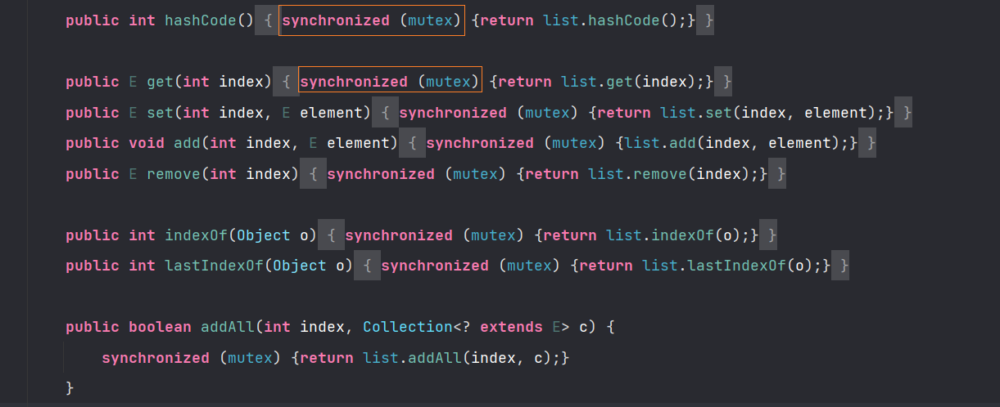

# List 集合

## 一、常见的方法
> 这里仅仅给出常见的方法
>

```java
//  通过下标返回集合中对应位置的元素
T  get(int index) :                                

// 在集合中指定位置存储对象(替换)
T  set(int index,T element):                        

//  从前向后查找某个对象在集合中的位置
int  indexOf(Object o):                           

// 从后向前查找某个对象在集合中的位置
int  lastIndexOf(Object  o ):                       

// 实例化ListInterator 接口，用来遍历List集合
ListInterator<E> listInterator():                   

// 通过下标截取List集合
List<E> subList(int  fromIndex,int lastIndex):      
```

## 二、 ArrayList
> 这里首先给出 `ArrayList`的继承和实现关系体系。注意：这里 I 表示接口，C 表示类
>

ArrayList，是基于数组实现的结合，数组的容量是在定义的时候确定的，扩容是创建一个 1.5 倍的新数组，然后把原来的数组的值拷贝过去。

对于 ArrayList 对应的类图如下：


接下来，我们看一下实现了对应的接口，ArrayList 具有了那些能力：

- 实现 `RandomAccess` 接口，说明支持快速的随机访问，这个接口实际上没有定义任何的方法，它仅仅是一个标识方法，标志这实现这个类的接口具有这样的能力。
- 实现`Cloneable`接口，说明支持克隆功能
- 实现`Serialiable`接口，说明支持序列化
- 继承了`AbstractList`，说明这个抽象类中，提供了List接口的骨架实现，大幅度减少了迭代遍历的代码量。

在 ArrayList 中，只有两个属性。

+ `ArrayList`真正的大小，实际上就是 `elementData` 的大小
+ `size`仅仅是用来记录数组中有多少个元素

> 这里注意这个`transient`关键字，这个关键字修饰的成员变量不能被序列化。
>

```java
// 用来保存元素
transient Object[] elementData; // non-private to simplify nested class access


// 已经使用元素的个数
private int size;
```

在 ArrayList 中，提供了三种构造函数：

+ 构造函数一：传入容量
    - 如果说这个长度是 > 0，就创建为指定长度的数组
    - 如果说这个长度是 = 0，默认指向空数组，初次使用的时候，从0开始扩容，扩容为1

+ 构造函数二：都不传
    - 默认指向空数组，初次使用的时候，扩容为10

+ 构造函数三：传入一个Collection
    - 进行数组的拷贝，这里使用的是 `Arrays.copyof`，这里是浅拷贝

对于 ArrayList 并不是一个并发安全的集合，对于其方法并没有使用锁进行保护。

## 三、LinkedList
LinkedList 集合同时具有 List 集合 Queue 集合的特点，对应的类图，从类图之中，我们也看到了，其同时实现了 List 和 Queue 接口


通过看这个类图，我们会发现，LinkedList并没有实现RandomAccess 接口，这就是 ArrayList 的一个区别，说明不支持随机访问。

LinkedList 底层使用双向链表，当我们通过 add 方法进行添加元素的时候，实际上采用的是尾插法。

对于 LinkedList 也并不是线程安全的集合，对应的方法也并没有采用锁进行保护


## 四、线程安全的List

在上文之中，我们介绍了两种 List：ArrayList 和 LinkedList，对于这两种集合都不是线程安全的，那么 JDK 是否提供了线程安全的 List 集合呢？

接下来，我们就来看几种线程安全的集合

### 4.1 Collections.synchronizedList

```java
ArrayList<Integer> list = new ArrayList<>();
List<Integer> newList = Collections.synchronizedList(list);
```

通过这种方式返回的实际上返回的是 Collections 的一个内部类 SynchronizedList，而他保证线程安全的方式就比较简单了，就是通过加入一个 Synchronized 锁来完成的，对应的示例如下：



### 4.2 Vector

Vector 作为 Java 以前的集合，底层使用数组来进行实现，它也是线程安全的


对于 Vector 底层也是通过数组来实现的，不过现对于ArrayList ，Vector 每次扩容时扩容原始容量的一倍

### 4.3 CopyOnWriteArrayList

在 JUC 包之中，提供了线程安全的集合，CopyOnWriteArrayList。相比于 Synchronized，这里采用的 ReentrantLock 来进行加锁。

其中 get 方法并没有进行加锁操作，对应 set，add 方法会使用 ReetrantLock 进行加锁。

```java
public boolean add(E e) {
    // 加锁
    final ReentrantLock lock = this.lock;
    lock.lock();
    try {
        // 获取原始数组
        Object[] elements = getArray();
        int len = elements.length;
        // 通过拷贝的方式，构建一个新的数组
        Object[] newElements = Arrays.copyOf(elements, len + 1);
        newElements[len] = e;
        // 替换原来的旧数组
        setArray(newElements); 
        return true;
    } finally {
        lock.unlock();
    }
}
```

这种集合适用于读操作多于写操作的场景，并且使用过程之中需要保证高性能的多线程场景。

但是，由于写时复制技术，内存之中会同时驻扎两个对象的内存，如果对象过大就会出现 GC ，另一方面，无法保证实时性，读写分别作用于两个集合，写操作执行的过程之中，读操作不会阻塞，此时读操作读取到的数据并不是最新的。

