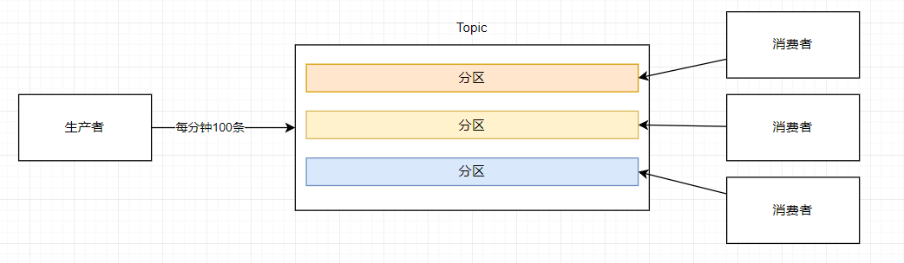

# 基础术语

## 一、体系结构

Kafka，是一个分布式的基于发布订阅模式的消息队列，在一个Kafka 体系结构中，包括：生产者，消费者，Broker，Zookeeper 集群，Controller 组成，他们主要的作用如下：

+ 生产者：生产消息，并将消息推送到 Kafka 之中
+ 消费者：从 Kafka 之中获取消息进行消费
+ Broker ：接受和处理客户端发送过来的的消息，以及对消息进行持久化
    - 一个 Borker 就表示一台 kafka 服务器，多个Broker 构成一个集群。如果一台机器出现了宕机，其他机器上的 Broker 也依旧可以对外提供服务
+ Zookeeper ：进行 Broker 的管理
+ Controller：在集群环境之中，会选择出一个 Broker 担任控制器的角色，来担任 Kafka 集群的中心。

## 二、基础概念
为了将消息进行分类，Kafka之中引入了 **主题 **的概念，生产者向指定主题之中添加内容，消费者从指定主题之中获取内容。一个主题，可以被多个消费者订阅，一个消费者，可以同时订阅多个主题。

如果消费者的速度远远落后于生产者生产的速度，消息就会逐步积累在 Kafka 之中

不想让消息进行积压，在自身的消费速度没有办法增长的情况之下，可以增加消费者进行消费，多个消费者实例共同组成一个组来消费一组主题，这个组，称之为**消费者组**。现在我们如果增加为 3 个消费者进行消费，如下图所示，

不过三个消费者处理的业务场景是一致的，不能够把一条消息被 A 处理了，还被 B 又处理了，这样实际上就乱了。我们必须通过某种机制，保证他只会被一个消费者消费到！其实，Kafka 已经为我们做了这样的事，在生产者生产消息的时候，已经把消息分成了几份，每一份叫做一个**分区**，这样的话，消费者实际上就不用去抢着消费，每个分区都只会被组内的一个消费者实例消费，其他消费者实例不能消费它，如果组内的某个消费者出现了宕机，会由组内的其他消费者来顶替他的工作，这个机制称之为重平衡每个消费者在消费消息的过程中有个字段记录它当前消费到了分区的哪个位置上，这个字段就是消费者位移

<u>不过，请注意，分区多，消费者少的时候，某个消费者可以消费多个分区，如果说分区少，消费者多的时候，其中的某些消费者就不能够消费到消息了。</u>

在 Kafka 中，每个分区是一组有序的消息日志，生产者根据分区的规则，只会将每条消息发送到一个分区，并且进入分区，会有一个唯一标识 offset，用来保证消息在分区内的顺序性，而并不能够保证多个分区的消费顺序，比如下面这种情况

在 Kafka 之中，为保证高可用，有如下的实现策略：

+ 如果一台机器出现了宕机，其他机器上的 Broker 也依旧可以对外提供服务
+ 为分区引入了**多副本机制**，通过增加副本数量可以提升容能力

多副本机制，也就说将相同的数据拷贝到不同的机器之上。在Kafka之中，有两种类型的副本：

+ 领导者副本：与客户端进行交互
+ 追随者副本：不与外界进行交互

工作机制主要是：生产者向领导者副本写消息，而消费者总是从领导者副本这里读取消息。而追随者副本，只需要做一件事情，就是向领导者副本发送请求，请求领导者把最新生产的消息发送给他，这样就能够保证与领导者的同步工作（在同一时刻，副本之间并不是完全相同的）。当领导者宕机之后，从追随者之中选出新的领导者提供服务。

一个分区的所有副本称之为：AR，所有与  leader 副本保持一定程度同步的副本组成了 LSR，与 leader 副本同步滞后过多的副本称之为 OSR。leader 副本负责维护和跟踪 ISR 集合中所有的 follower 副本的滞后状态。

消息写入分区之后，会有一个 offset，当前日志文件中下一个待写入的消息的 offset 称之为 LEO。分区 ISR 集合之中每个副本都会维护自身的 LEO。而 IST 集合之中最小的 LEO 即为分区的 HW，对于消费者来说，只能消费 HW 之前的消息。

而分区在磁盘之中又是通过 日志 来体现的，一个日志实际上就是一个磁盘之中只能够追加写消息的物理文件，并且将日志又细分为了**日志段**，每写完一个日志段，Kafka 会自动将老的日志段封存起来，在后台，会有定时任务定时检查老的日志段是否能够被删除。
