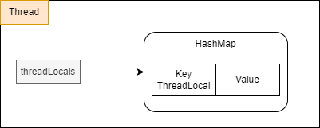
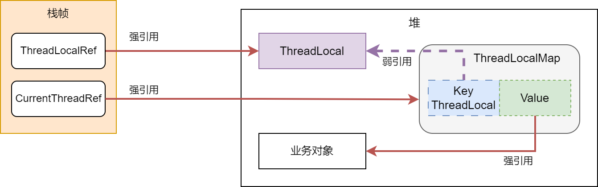
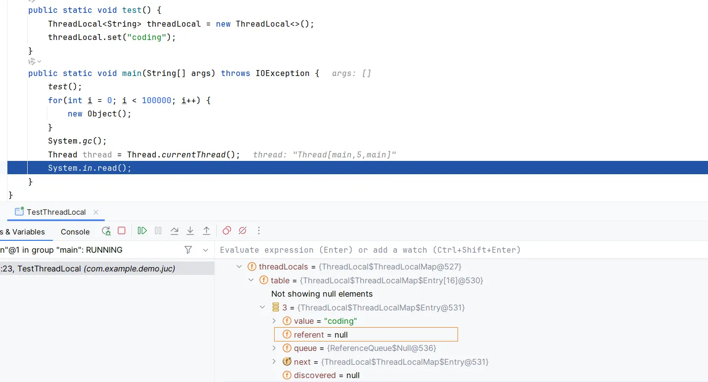

# ThreadLocal

## 一、概述

在正常的 Web 开发过程中，对于每个接口，解析 Token，读取用户ID，每个方法都要传入 userId， 是不是也写过这种“流水线”代码？

```java
private void handle(String token) {

    // 1. 从 token 中获取 userId
    Long userID = getUseIdFromToken(token);

    // 2. 验证用户的权限
    validateUserPermission(userID);

    // 3. 发起审批操作
    doExecute(userID);

    // 4. 记录操作日志
    saveOperationLog(userID);
}

private Long getUseIdFromToken(String token) {
    return 0L;
}

private void validateUserPermission(Long userId) {}

private void sendAppeal(Long userId) {}

private void saveOperationLog(Long userId) {}
```

当然了，这里的 token 实际上是从请求头或者其余方式读取到的。而这样的写法就会导致：

1）每一个接口，都需要写一遍获取并解析 Token 的业务逻辑

2）如果业务方法有需要用到 userId ，就需要在方法声明之中定义，一层一层往下传

为了解决这些问题，就需要用到 ThreadLocal，它是一个线程内部独享的变量，每个线程访问 ThreadLocal 的时候，访问的都是自己线程的私有变量。这样，我们的流程就可以改为：

1）解析 token，读取用户ID，将其放入都 ThreadLocal 中

2）业务方法从 ThreadLocal 直接取

接下来，我们首先来看一下具体的使用方式：

```java
public static final ThreadLocal<Long> USERID_HOLDER = new ThreadLocal<>();

private void handle(String token) {
    // 1. 从 token 中获取 userId
    getUseIdFromToken(token);
    // 2. 验证用户的权限
    validateUserPermission();
    // 3. 发起审批操作
    sendAppeal();
    // 4. 记录操作日志
    saveOperationLog();
    // 5. 清理 ThreadLocal
    USERID_HOLDER.remove();
}

private void getUseIdFromToken(String token) {
    USERID_HOLDER.set(1L);
}

private void validateUserPermission() {
    Long userId = USERID_HOLDER.get();
}

private void sendAppeal() {
    Long userId = USERID_HOLDER.get();
}

private void saveOperationLog() {
    Long userId = USERID_HOLDER.get();
}
```

一套操作下来，代码量腰斩，可读性 + 可维护性直线上升。在上面的代码之中，我们有两点是需要考虑的：

1）ThreadLocal 为什么要定义为：satic final

2）当执行完成操作之后，为什么需要清理 ThreadLocal 的值？不清理会造成什么后果

## 二、源码分析

在了解了，ThreaLocal 的基本使用之后，接下来，我们就来实际分析一下 ThreadLocal 的实现原理

**Thead 对象中有一个 threadLocals 的对象，类型是 ThreadLocalMap ，ThreadLocalMap 是 ThreadLocal 的内部类，是一个定制化的HashMap，其中 key 为 ThreadLocal， value 则是我们实际需要存放的值。**



接下来，我们看一下具体的 set 方法

```java
public void set(T value) {
    // 获取当前的线程
    Thread t = Thread.currentThread();
    // 获取 threadLocals 变量
    ThreadLocalMap map = getMap(t);
    if (map != null) {
        map.set(this, value);
    } else {
        // 如果是第一次调用，就创建对应的 ThreadLocalMap
        // 保存在当前线程的 athreadLocals 变量之中
        //  t.threadLocals = new ThreadLocalMap(this, firstValue);
        createMap(t, value);
    }
}
```

对于 ThreadLocal ，如果使用不当就会造成内存泄漏问题，所谓的内存泄漏是指不在会被使用的对象或者变量所占用的内存空间不能够被回收。

为了解决这个问题，ThreadLocalMap 之中的 key 设置为了 弱引用。如果线程执行，对应的内存示意图如下：



如果将 ThreadLocal 定义为了方法的局部变量，在方法执行完成之后，栈帧弹出，堆中分配的 ThreadLocal 实际上已经没有实际的使用意义了，但是由于 ThreadLocalMap 中的 Key 还引用着，就会导致 ThreadLocal 对象并不能够能够被回收，就会造成内存泄漏。

**为了解决这个问题，对于 key 采用了弱引用，在下一次 GC 的时候，就会被回收。**此时，ThreadLocalMap 中的 key 就是 null，Value 指向对业务对象，一直存在于 ThreadLocalMap 中，这个ThreadLocalMap 是 Thread 对象引用的，生命周期和 Thread 是一致的，如果说 Thread 存在，这个对象就无法被回收。**只能够等待下一次调用 set 或者 get 方法的时候，发现 key 为 null，才能够回收 Value**。

**因此，Key 设计为 弱引用，并不能够 100% 保证内存不泄露。**

在实际使用的过程之中，都是将 ThreadLocal 变量，定义为 `static final`，这样做的主要原因是：作为 GC Root 节点，不被 GC 回收，这样在能够在任何地方将 ThreadLocalMap 之中的键值对进行移除；由于 ThreadLocalMap 之中的 key 实际上是 ThreadLocal，这样做实际上是为了减少 ThreadLocal 的传递次数，方便进行全局的管理。

接下来，我们看几个实际的案例。

> **场景一：内存泄漏问题**

```java
public static void test() {
    ThreadLocal<String> threadLocal = new ThreadLocal<>();
    threadLocal.set("coding");
}
public static void main(String[] args) throws IOException {
    test();
    for(int i = 0; i < 100000; i++) {
        new Object();
    }
    System.gc();
    Thread thread = Thread.currentThread();
    System.in.read();
}
```

对应的执行结果如下：



这里就出现了，key 被回收了，但是 value 是null 的问题，如果说当前线程一直不结束，就会导致无法被回收的问题，造成内存泄漏的问题

> **场景二：线程复用造成 ThreadLocal 数据错误**

在线程池的使用过程之中，如果不手动清理，就会造成 ThreadLocal 之中的信息错误，如下面这个场景

```java
private static final ExecutorService executorService = Executors.newFixedThreadPool(1);

public static void main(String[] args) throws IOException {

    executorService.execute(() -> {
        threadLocal.set("threadA");
        System.out.println("threadA - " + threadLocal.get());
    });
    executorService.execute(() -> {
        System.out.println("threadB - " + threadLocal.get());
    });

    System.in.read();
}
/**
* threadA - threadA
* threadB - threadA
*/
```

就会出现，两个输出都是 threadA

## 三、InheritableThreadLocal

使用 ThreadLocal 只能够在当前线程之中进行参数的传递，为了让父子线程之中能够进行参数的传递，可以使用 InheritableThreadLocal

```java
ThreadLocalMap getMap(Thread t) {
    return t.inheritableThreadLocals;
}

void createMap(Thread t, T firstValue) {
    t.inheritableThreadLocals = new ThreadLocalMap(this, firstValue);
}
```

它继承于 ThreadLocal，不过重写了 createMap 和 getMap 方法，不在使用 Thread 中的 threadLocals 变量，而是使用 inheritableThreadLocals 作为替代。

那么，子线程之中如何读取父线程之中的值的？

其中核心就在于 Thread 创建的时候，会将父线程 inheritableThreadLocals 的值复制到子线程之中

```java
if (inheritThreadLocals && parent.inheritableThreadLocals != null)
    this.inheritableThreadLocals =
    ThreadLocal.createInheritedMap(parent.inheritableThreadLocals);
```

这也就要求必须要在主线程之中手动创建子线程才可以。

对于下面这种场景，在子线程之中可以获取到 ThreadLocal 的值

```java
private final static ThreadLocal<String> threadLocal = new InheritableThreadLocal<>();
public static void main(String[] args) throws InterruptedException {
    threadLocal.set("hello");
    Thread thread = new Thread(() -> {
        String s = threadLocal.get();
        System.out.println("s = " + s);
    });
    thread.join();
    thread.start();
}
```

比如说对于下面这个场景，在第二个线程的执行的时候，我们想让其读取到的值为 threadB，但是由于线程复用的问题，里面获取到的值仍然为第一次设置的值

```java
private static final ThreadLocal<String> threadLocal = new ThreadLocal<>();

private static final ExecutorService executorService = Executors.newFixedThreadPool(1);
public static void main(String[] args) throws IOException, InterruptedException {

    executorService.execute(() -> {
        threadLocal.set("threadA");
        System.out.println("threadA - " + threadLocal.get());
    });
    TimeUnit.SECONDS.sleep(5);

    threadLocal.set("threadB");
    executorService.execute(() -> {
        System.out.println("threadB - " + threadLocal.get());
    });

    System.in.read();
    
    /*
    * threadA
    * threadA
    * */
}
```

## 四、TransmittableThreadLocal

为了解决 JDK 提供的 InheritableThreadLocal 存在的问题，alibaba 提供了 TransmittableThreadLocal 。

对应的 GitHub 地址为：https://github.com/alibaba/transmittable-thread-local

首先，我们简单使用一下

```xml
<dependency>
    <groupId>com.alibaba</groupId>
    <artifactId>transmittable-thread-local</artifactId>
    <version>2.14.4</version>
    </dependency>
```

示例代码如下：

```java
private static final ThreadLocal<String> threadLocal = new TransmittableThreadLocal<>();

private static final ExecutorService executorService = Executors.newFixedThreadPool(1);

public static void main(String[] args) throws IOException, InterruptedException {
    threadLocal.set("threadA");
    Runnable runnable = () -> {
        System.out.println(threadLocal.get());
    };
    TtlRunnable ttlRunnable = TtlRunnable.get(runnable);
    executorService.execute(ttlRunnable);
    TimeUnit.SECONDS.sleep(5);
    threadLocal.set("threadB");

    ttlRunnable = TtlRunnable.get(runnable);
    executorService.execute(ttlRunnable);
    System.in.read();
    /*
    * threadA
    * threadB
    * */
}
```

注意，即使同一个 Runnable ，再向线程池提交的时候，都需要通过 `TtlRunnable.get` 方法进行装饰。也就是说，提交的时候，需要通过 get 方法获取当前线程绑定的 ThreadLocal。

除了支持 Runable 外，还支持 Callable 接口

```java
private static final ThreadLocal<String> threadLocal = new TransmittableThreadLocal<>();

private static final ExecutorService executorService = Executors.newFixedThreadPool(1);

public static void main(String[] args) throws Exception {
    threadLocal.set("threadA");
    Callable<String> callable = threadLocal::get;
    TtlCallable<String> ttlCallable = TtlCallable.get(callable);
    Future<String> submit = executorService.submit(ttlCallable);
    // submit = threadA
    System.out.println("submit = " + submit.get());
    TimeUnit.SECONDS.sleep(5);
    threadLocal.set("threadB");

    ttlCallable = TtlCallable.get(callable);
    submit = executorService.submit(ttlCallable);
    // submit = threadB
    System.out.println("submit = " + submit.get());
    System.in.read();
}
```

为了减少每次都必须调用 get 方法，alibaba 提供了对应的线程池的装饰方法。

```java
private static ExecutorService executorService = Executors.newFixedThreadPool(1);

public static void main(String[] args) throws Exception {
    
    executorService = TtlExecutors.getTtlExecutorService(executorService);
    
    threadLocal.set("threadA");
    Runnable runnable = () -> {
        System.out.println(threadLocal.get());
    };
    executorService.execute(runnable);
    TimeUnit.SECONDS.sleep(5);
    threadLocal.set("threadB");
    executorService.execute(runnable);
    System.in.read();
}
```

## 五、使用场景

:::info

通过 ThreadLocal 实现链路追踪

:::

在 Java 的日志框架之中，提供了日志链路追踪的方式，比如 Slf4j 提供的 MDC，具体的使用方式如下：

1）在 logback 的配置文件之中配置：`%X{traceId}`

```xml
<property name="PATTERN_DEFAULT" value="[%d{yyyy-MM-dd HH:mm:ss.SSS}] [%X{traceId}]  %msg%n"/>
```

2）在请求进入之后，执行下面这段代码

```java
 MDC.put("traceId", UUID.randomUUID().toString());
```

:::info

注意：配置文件配置的：traceId 和 代码之中的 traceId 是对应的

:::

在实际使用的过程之中，实际上是会结合过滤器，AOP ，拦截器等进行统一的设置。