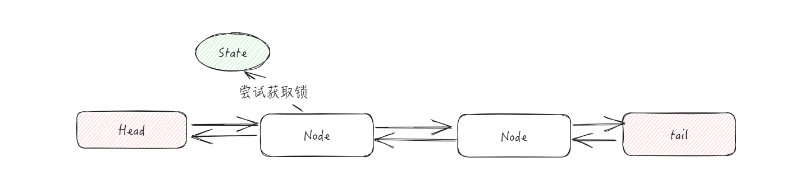
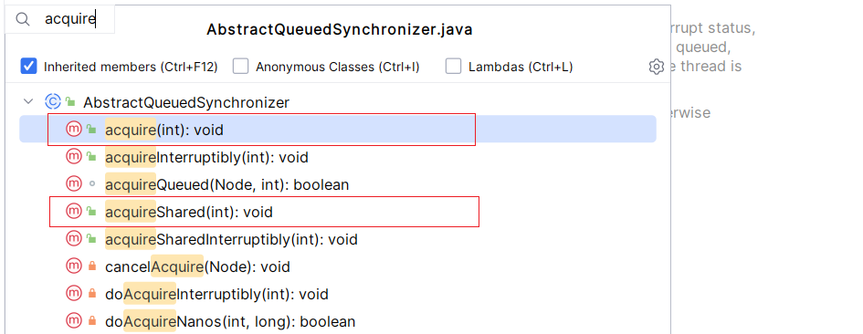
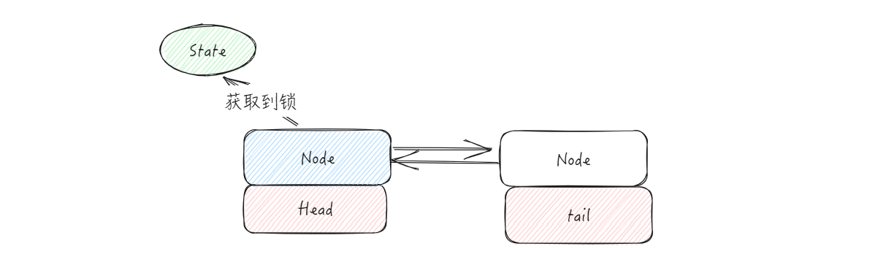
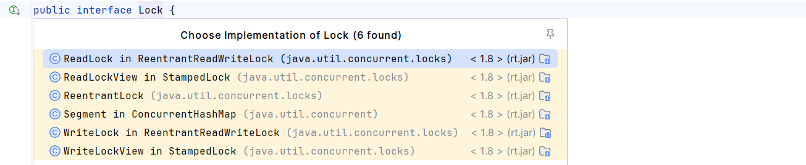
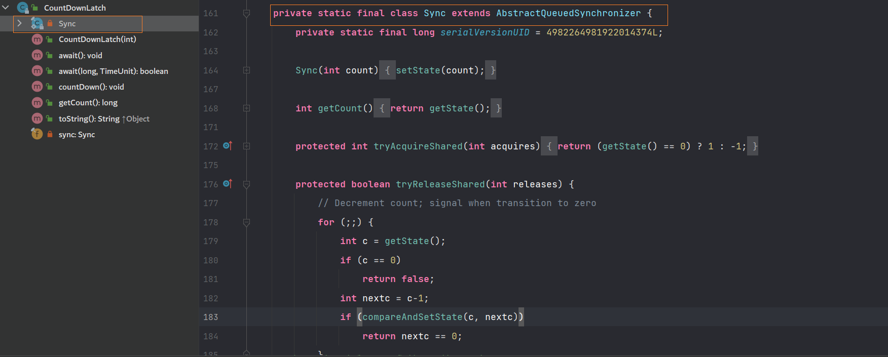
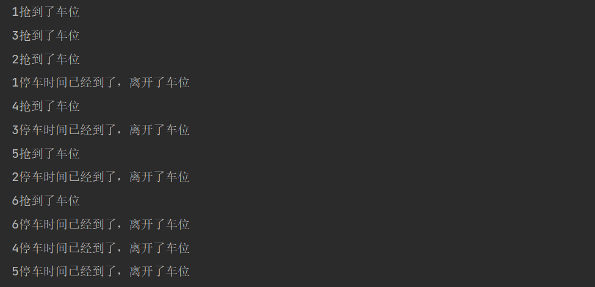

# AQS

## 一、前言

虽然 CAS 能够提供了无锁的解决方案，但是不断地自旋会耗费大量的CPU资源，而且大部分都是无效的。为了缓解这部分，可以采用队列的方式，将这部分压力进行缓解。如果没有获取到锁，就将其放入到队列之中等待，直到获取锁为止，当获取到锁的线程执行完成之后，就从队列之中唤醒一个阻塞的线程。这块是不是和 synchronized 有点类似？synchronized 之中采用的是管程来实现的排队队列。

在 JUC 包之中也提供了这样的实现，`AbstractQueuedSynchronizer`，抽象的同步器，简称为 **AQS**。

在 AQS 之中，提供了 3 个成员变量

```java
private volatile int state;

private transient volatile Node head;

private transient volatile Node tail;
```

其中 state 用来表示当前锁占用的状态，而里面的 head 和 tail 分别作为队列的头结点和尾结点。这里我们可以大致猜想一下 AQS 的核心结构



### 1.1 state

既然 state 用来表示锁占用的状态，那么他为什么不使用 boolean 类型，而是采用 int 类型呢？

首先，线程获取锁，有两种方式：

+ 独占模式，一旦被占用，其他线程就不能被占用。
+ 共享模式，一旦被占用，其他共享模式下的线程也能获取锁。

**<font style="color:#2F54EB;">所以这个state，不仅仅用来表示共享资源是否被占用，还用来表示线程占用的数量。</font>**

对于 state 变量，提供了如下的方法：

```java
protected final int getState() {
    return state;
}
protected final void setState(int newState) {
    state = newState;
}
// 通过 CAS 进行值的设置，保证原子性
protected final boolean compareAndSetState(int expect, int update) {
    // See below for intrinsics setup to support this
    return unsafe.compareAndSwapInt(this, stateOffset, expect, update);
}
```

注意，这里用 final 修饰，表示方法并不能够被重写，除了通过 CAS 的方式来修改 state 变量的值之外，还提供了单独的 setState 方法，这个方法的主要作用是获取锁成功之后，进行锁释放的时候使用，因为这个时候一定没有竞争

### 1.2 Node

在 AQS 中，队列之中存放的其实就是 Node，其核心变量如下：

```java
static final class Node {
    // 表示已共享模式的情况之下，共享锁
    static final Node SHARED = new Node();
    
    // 表示以 独占模式的情况之下，占用锁
    static final Node EXCLUSIVE = null;
    
    // 表示线程获取锁的请求已经取消了 cancelled, 不会在参与锁的竞争
    static final int CANCELLED =  1;
    
    // 表示线程已经准备好了，就等资源释放了
    static final int SIGNAL    = -1;
    
    // 表示节点在等待队列之中，节点线程等待被唤醒
    static final int CONDITION = -2;
    
    // 只有在共享模式下才会被使用
    static final int PROPAGATE = -3;
    
	// 节点的状态，对应与上面的 1，-1，-2，-3
    volatile int waitStatus;
    
    // 指向当前节点的前驱节点
    volatile Node prev;
    
    // 指向当前节点的后继节点
    volatile Node next;
    
	// 节点所对应的线程
    volatile Thread thread;

    // 如果当前 Node 不是普通节点而是条件等待节点，则节点处于某个条件等待队列上
    // 这个属性就指向了下一个条件等待节点
    Node nextWaiter;
}
```

具体这些状态是如何进行使用的，我们在后续的篇幅之中会继续说明

## 二、核心方法

对于 AQS ，他是一个抽象类，所以他的实际运用则是通过继承来实现的。而在代码设计上则使用模板设计模式，定义了获取或者释放锁的代码模板，并且在方法之中提供了相关的钩子函数，交给子类进行扩展

在上文中，我们提到了对于锁的获取，有 共享模式 和 独占模式，在 AQS 之中也为我们提供了对应的模版方法，并且定义了相应的钩子函数。

比如说，独占式获取的 acquire 方法，共享获取锁的 acquireShared 方法



接下来，我们讲解一下 AQS 中的独占模式下获取锁和释放锁的源码

### 2.1 acquire

首先，我们看一下 acquire 方法，对于这个方法，所有的子类都不能够进行重写，这个方法用来**独占式获取锁**

```java
public final void acquire(int arg) {
    // 如果说 tryAcqure 方法返回 false，才会调用 acquireQueued
    if (!tryAcquire(arg) && acquireQueued(addWaiter(Node.EXCLUSIVE), arg))
        selfInterrupt();
}
```

其中 tryAcquire 方法表示尝试获取锁，如果没有成功获取到，就不会执行后续的逻辑

:::code-group

```java [tryAcquire]
// 其中，tryAcquire 方法子类必须要进行重写，表示尝试获取锁
protected boolean tryAcquire(int arg) {
    throw new UnsupportedOperationException();
}
```

```java [addWaiter]
// 如果说获取锁失败，将当前线程封装为一个Node，放入等待队列之中，如果说队列不为空，就CAS设置尾节点
// 执行完成这个方法，线程一定会被封装为 Node 节点，放在了队列里面去
private Node addWaiter(Node mode) {
    // 封装为 Node 节点
    Node node = new Node(Thread.currentThread(), mode);
    // Try the fast path of enq; backup to full enq on failure
    // 如果队列之中有元素, 通过 cas 设置尾部
    Node pred = tail;
    if (pred != null) {
        node.prev = pred;
        if (compareAndSetTail(pred, node)) {
            pred.next = node;
            return node;
        }
    }
    // 如果说等待队列为空，直接将当前线程放入到的等待队列。
    enq(node);
    return node;
}
```

```java [acquireQueued]
// 当节点成功入队之后，就开始自旋抢锁，对于这个方法 只有成功获取到锁才会返回
// 为了不浪费资源，自旋过程之中会被阻塞，直到被前驱节点唤醒
final boolean acquireQueued(final Node node, int arg) {
    boolean failed = true;
    try {
        boolean interrupted = false;
        for (;;) {
            // 获取 Node 的前一个节点
            final Node p = node.predecessor();
            // 如果说前一个节点是头结点并且获取锁成功了
            if (p == head && tryAcquire(arg)) {
                // 将当前的节点作为头结点
                setHead(node);
                p.next = null; // help GC
                failed = false;
                return interrupted;
            }
            // 如果说获取锁失败了，需要判断当前线程是否有必要挂起
            if (shouldParkAfterFailedAcquire(p, node) && parkAndCheckInterrupt())
                interrupted = true;
        }
    } finally {
        if (failed)
            cancelAcquire(node);
    }
}
```

```java [shouldParkAfterFailedAcquire]
// 只有当前方法返回 true了，当前线程才会被阻塞
private static boolean shouldParkAfterFailedAcquire(Node pred, Node node) {
	// 获取前一个节点的状态
    int ws = pred.waitStatus;
    // 如果前一个节点的状态是：被通知状态，则将当前线程阻塞，retun true 就会调用 parkAndCheckInterrupt
    if (ws == Node.SIGNAL)
        return true;
    // 如果是 大于 0 的，只有 CANCELLED 是大于 0 的，直接让其出队，因为他没有必要去竞争锁了
    if (ws > 0) {
        // 不断往前找，直到找到一个状态不是 Cancelled 的
        do {
            node.prev = pred = pred.prev;
        } while (pred.waitStatus > 0);
        pred.next = node;
    } else {
        // 通过 cas 的方式设置为前一个线程的状态等待
        compareAndSetWaitStatus(pred, ws, Node.SIGNAL);
    }
    return false;
}
```

```java [parkAndCheckInterrupt]
private final boolean parkAndCheckInterrupt() {
    LockSupport.park(this);
    return Thread.interrupted();
}
```

:::

通过这样分析，我们能够发现，其实 head 节点就是正在执行任务的节点，此时节点的状态为 0 ，当后续有节点抢锁的时候，他首先封装为 Node 节点加入到队列之中，然后开始自旋，当然了也不是无脑的，只要将前节点的状态改为 -1，当前线程就开始阻塞了



### 2.2 release

对于锁的释放，方法相对而言比较简单，会首先尝试释放当前线程所持有的资源，

```java
public final boolean release(int arg) {
    // 独占式释放同步状态
    if (tryRelease(arg)) {
        Node h = head;
        if (h != null && h.waitStatus != 0)
            unparkSuccessor(h);
        return true;
    }
    return false;
}
```

::: code-group

```java [tryRelease]
// 同样这也是需要子类去进行扩展的方法
protected boolean tryRelease(int arg) {
	throw new UnsupportedOperationException();
}
```

```java [unparkSuccessor]
private void unparkSuccessor(Node node) {
    int ws = node.waitStatus;
    if (ws < 0)
        compareAndSetWaitStatus(node, ws, 0);
    Node s = node.next;
    if (s == null || s.waitStatus > 0) {
        s = null;
        // 这里是通过从尾节点开始向前开始找
        for (Node t = tail; t != null && t != node; t = t.prev)
            if (t.waitStatus <= 0)
                s = t;
    }
    if (s != null)
        // 唤醒阻塞的线程
        LockSupport.unpark(s.thread);
}
```

:::

## 三、Lock 接口

在讲解了 AQS 的核心流程之后，接下来，我们就来讲解一下具体的实现。

首先，我们看一下 Lock 接口。在  `Lock`  接口出现之前，Java程序是靠  `synchronzied`  关键字来实现锁功能的，而在  Java SE5 之后，并发接口中新增加了  Lock 接口，提供和  `synchronized`  关键字相似的同步功能，只是在使用时需要显示的获取和释放锁，虽然说去少了隐式获取释放锁的便捷性，但是却拥有了锁获取和释放的可操作性以及超时获取锁等 synchronized 关键字不具备的同步特性。


Lock 接口的接口定义如下：

```java
public interface Lock {
    // 获取锁，调用该方法当前线程将会获取锁，当锁获取之后，从该方法返回
    void lock();
    
    // 可中断获取锁
    void lockInterruptibly() throws InterruptedException;
    
    // 尝试非阻塞获取锁，一次性获取锁，如果获取成功则成功，如果说失败则失败
    boolean tryLock();
    
    // 超时获取锁，在超时时间之内，循环获取锁
    boolean tryLock(long time, TimeUnit unit) throws InterruptedException;
    
    // 释放锁
    void unlock();
    
    // 获取等待通知组件，该组件和当前的锁绑定，当前线程只有获取了锁，才能调用wait方法
    // 而调用之后，当前线程将释放锁
    Condition newCondition();
}
```

在 Lock 的实现类之中，最为直接的实现类是：ReetrantLock，其余类都是作为内部类进行实现



在这个类之中，提供一个抽象静态内部类 Sync 继承了 AQS，而具体的实现又交给了其内部类：NonfairSync 和 FairSync。这两个类分别用来表示公平获取锁和非公平获取锁，这也对应于 ReetrantLock 的两种模式

- 公平获取锁，表示按照线程在队列中的排队顺序，获取锁
- 非公平获取锁，表示，无视队列的规则，直接获取锁

在默认情况之下，使用的是非公平锁

```java
public ReentrantLock() {
    sync = new NonfairSync();
}

public ReentrantLock(boolean fair) {
    sync = fair ? new FairSync() : new NonfairSync();
}
```

对于非公平锁，在尝试加锁的时候，会通过 CAS 来直接修改状态，只有修改不成功了才回去，进行队列进行等待

::: code-group

```java [lock]
final void lock() {
    if (compareAndSetState(0, 1))
        setExclusiveOwnerThread(Thread.currentThread());
    else
        acquire(1);
}
```

```java [tryAcquire ]
final boolean nonfairTryAcquire(int acquires) {
    final Thread current = Thread.currentThread();
    int c = getState();
    // 进入 Lock 的时候没抢到，此时如果 state = 0，也就有线程释放了，再抢一次
    if (c == 0) {
        if (compareAndSetState(0, acquires)) {
            setExclusiveOwnerThread(current);
            return true;
        }
    }
    else if (current == getExclusiveOwnerThread()) {
        int nextc = c + acquires;
        if (nextc < 0) // overflow
            throw new Error("Maximum lock count exceeded");
        setState(nextc);
        return true;
    }
    return false;
}
```

:::

从这里我们就能够看到，对于非公平的锁，核心就是抢，根本不会在乎同步队列中的排队节点

## 四、CountDownLatch

CountDownLatch 类可以设置一个计数器，然后通过 `countDown ` 方法来进行减一的操作，使用 `await` 方法等待计数器不大于 0，然后继续执行await 方法之后的语句。

1. 主要有两个方法，当一个或者多个线程调用`await方法`的时候，这些线程会阻塞
2. 其他线程调用countDown方法会将计数器减一（调用`countDown`方法的线程不会阻塞）
3. 当计数器的值变为 0 时，因为`await方法`阻塞的线程会被唤醒，继续执行

示例代码如下：

```java
public class CountDownLatchDemo {
    /**
     * 六个同学，陆续离开之后，班长才可以锁门
     * */
    public static void main(String[] args) throws InterruptedException {
        // 创建 CountDownLatch 对象，并传入初始值
        CountDownLatch countDownLatch = new CountDownLatch(6);
        for(int i = 1 ;i <= 6; i++){
            new Thread(() -> {
                System.out.println(Thread.currentThread().getName()+"号同学离开了教室");
                countDownLatch.countDown();
            },i+"").start();
        }
        countDownLatch.await();
        System.out.println("班长锁门走人了");
    }
}
```

了解了基础使用之后，接下来，我们就来看一下对应的源码，CountDownLath 同样也是基于 AQS 来进行实现的



不过请注意，这里重写的共享锁，这里需要注意一下，对于 state 变量的操作，这也验证了，对于 State 变量不仅仅用来表示锁是否被占用，还用来表示锁占用的数量

```java
protected boolean tryReleaseShared(int releases) {
    // Decrement count; signal when transition to zero
    for (;;) {
        int c = getState();
        if (c == 0)
            return false;
        int nextc = c-1;
        if (compareAndSetState(c, nextc))
            return nextc == 0;
    }
}
```

## 五、CyclicBarrier

CyclicBarrier ，是一个可循环利用的屏障，作用是让所有线程都等待完成之后才会继续下一步行动。作用实际上和 CountDownLatch 是一致的。

不过 CyclicBarrier 是可循环利用的。

`CyclicBarrier`  的构造方法第一个参数是目标障碍数，每次执行 CyclicBarrier 一次，障碍数就会加一，如果说达到了目标障碍数，才会执行`CyclicBarrier.await()`之后的语句。

```java
public class CyclicBarrierDemo {
    public static void main(String[] args) {
        CyclicBarrier cyclicBarrier = new CyclicBarrier(7,() -> {
            System.out.println("召唤神龙");
        });
        for (int i = 1; i <= 7; i++) {
            new Thread(() -> {
                System.out.println(Thread.currentThread().getName()+"\t"+"号龙珠被收集");
                try {
                    cyclicBarrier.await();
                } catch (InterruptedException e) {
                    e.printStackTrace();
                } catch (BrokenBarrierException e) {
                    e.printStackTrace();
                }
            },String.valueOf(i)).start();
        }
    }
}
```


`CountDownLatch` 的计数器可以只能使用一次，而`CyclicBarrier `的计数器可以使用`reset()`方法重置。

而在具体的实现上，CountDownLatch 是基于 AQS 的 共享模式实现的，而 CyclicBarrier 是通过 Condition 来实现的

## 六、Semaphore

信号量，用来控制同时访问特定资源的线程数量，他可以协调各个线程，以保证合理的使用公共资源。



```java
/**
 * 六辆汽车 ，停三个停车位
 * */
public class SemaphoreDemo {
    public static void main(String[] args) {
        // 创建Semaphore，设置许可的数量
        Semaphore semaphore = new Semaphore(3);
        for (int i = 1; i <= 6; i++){
            new Thread(()->{
                // 抢占车位
                try {
                    semaphore.acquire();
                    System.out.println(Thread.currentThread().getName()+"抢到了车位");
                    // 设置停车时间
                    TimeUnit.SECONDS.sleep(new Random().nextInt(5));
                    System.out.println(Thread.currentThread().getName()+"停车时间已经到了，离开了车位");

                } catch (InterruptedException e) {
                    e.printStackTrace();
                } finally {
                    semaphore.release();
                }
            },i+"").start();
        }
    }
}
```