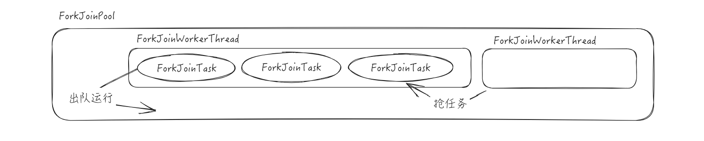

# ForkJoin

## 一、简介

`Fork / Join` ，可以将一个大的任务拆分成多个子任务，然后开启多线程进行并行处理，最后将子任务结果合并成最后的计算结果，并进行输出。这个框架主要做两件事情：

+ `Fork`：把一个复杂任务进行分拆，大事化小
+ `Join`：把分拆任务的结果进行合并

在 JUC 中，ForkJoin 框架包含如下组件：

- ForkJoinPool：执行任务的线程池
- ForkJoinWorkerThread：执行任务的工作线程，就是这个类要放到 ForkJoinPool 中执行
- ForkJoinTask：具体的任务，这个类实际上是一个抽象类，实现了 Future 接口，下面是其两个子类：
  - RecursiveTask：带返回结果的递归执行任务
  - RescursiveAction：不返回结果额递归执行任务

了解了基本的类之后，我们编写一个简单的案例：

::: code-group

```java
class Task extends RecursiveTask<Integer> {

    private final int start;

    private final int end;

    public Task(int start, int end) {
        this.start = start;
        this.end = end;
    }

    @Override
    protected Integer compute() {
        if(end - start <= 10) {
            int res = 0;
            for(int i = start; i <= end; i++) res += i;
            return res;
        } else {
            // 拆分线程去继续执行
            int mid = (start + end) / 2;
            Task left = new Task(start, mid);
            left.fork();
            
            Task right = new Task(mid + 1, end);
            right.fork();
            return left.join() + right.join();
        }
    }
}
```

```java [测试类]
ForkJoinPool forkJoinPool = new ForkJoinPool();
ForkJoinTask<Integer> res = forkJoinPool.submit(new Task(1, 100));
System.out.println(res.get());
```

:::

## 二、原理分析

对于 ForkJoinPool ，对于 submit 方法和子任务之中使用 fork 方法，存放的位置并不相同

通过 submit 方法，提交的任务，会存放在 ForkJoinPool 的全局队列中

但是对于 fork 方法，实际上是存放在了线程内部的队列之中

```java
public final ForkJoinTask<V> fork() {
    Thread t;
    if ((t = Thread.currentThread()) instanceof ForkJoinWorkerThread)
        ((ForkJoinWorkerThread)t).workQueue.push(this);
    else
        ForkJoinPool.common.externalPush(this);
    return this;
}
```

由于 ForkJoinPool 线程池有多个工作线程，就可能会出现任务分配不均衡的问题，为了解决这个问题，提出了  “工作窃取算法”，可以从其他的线程的队列之中窃取任务来执行



注意，对于 ForkJoinWorkerThread 取出任务来执行，采用是先进先出的策略，而窃取是从队列的尾部进行窃取，这样就能够保证窃取的任务一定没有处于运行状态