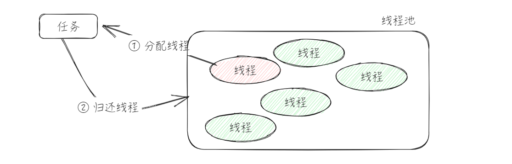
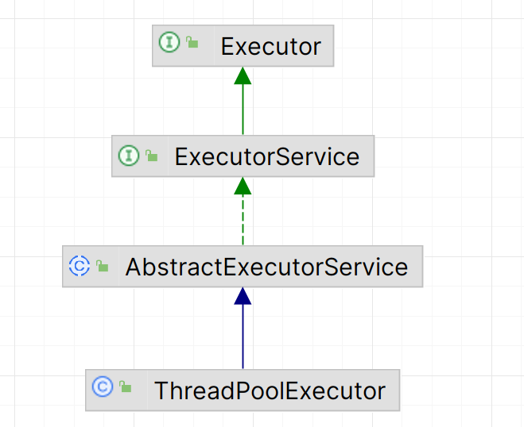
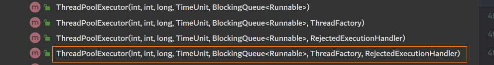
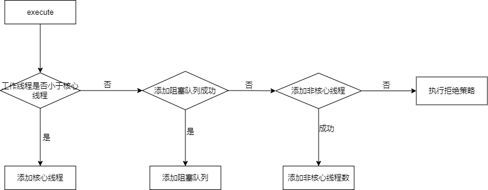
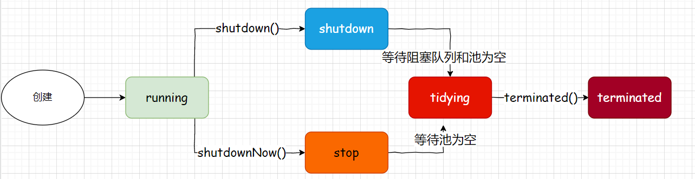
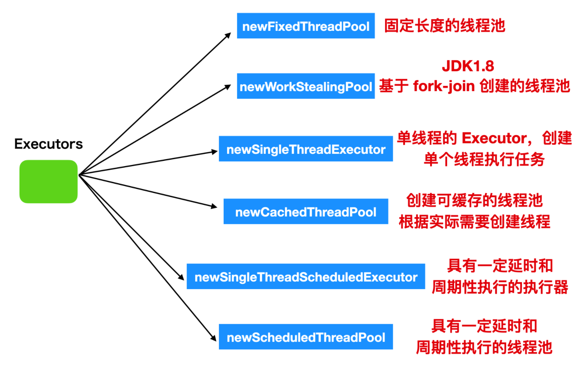

# 线程池

## 一、简介

虽然说从 Java  的角度，创建一个线程非常的简单，只需要  `new Thread()` 就能够完成，但是，实际上创建一个线程确实要调用操作系统的 API，然后操作系统为线程分配一系列资源，这个成本就会很高，所以说呢，线程是一个重量级的资源，应该避免重复的创建和销毁。

我们可以通过  **线程池**  来解决问题，他其实就是池化思想的体现，并且他还可以限制线程的个数，动态添加线程。



目前，有两种方式来获取线程池：

+ 方式一：`Executors`，里面已经封装了一些默认的线程池，可以根据实际场景来进行选择
+ 方式二：`ThreadPoolExecutor` 来进行自定义创建

不过，`Executors` 方法提供的默认线程池，都是依赖于 `ThreadPoolExecutor` 

首先，我们通过 idea 来看一下，整个体系结构，如下图：



在 Executor 类中，仅仅提供了一个方法

```java
public interface Executor {
    void execute(Runnable command);
}
```

在这个接口之中，只有一个方法，接受一个 `Runnable` 的实例，他用来执行一个任务，注意只能是  `Runnable`。他创建线程是异步执行的，也就是说，不用等待每个任务执行完毕后在执行下一个任务。

在 `ExecutorService` 中，对 `Executor` 进行了扩展，并且可以接受 Callable 对象。

而 `Executor`  和  `ExecutorService`  都仅仅作为接口定义，但是还没有实际实现，所以，这部分工作就落到了 `AbstractExecutorService` 中，这个类又是一个抽象类，不能够直接进行使用，所以，能够直接使用的类，只有 `ThreadPoolExecutor`

这里我们可以想到一点，**接口就是用来定义一个具体的行为，而抽象类则是去抽取一些子类公用的内容。**

## 二、ThreadPoolExecutor

接下来，我们就来看一下对应的 ThreadPoolExecutor。首先，我们看一下对应的构造函数



虽然说提供了四种构造函数，但本质上都是通过不同参数组合，最终调用功能最全的那个构造函数。因此，我们直接学习这个最完整的构造函数即可。

```java
new ThreadPoolExecutor(
    int corePoolSize, // 线程池的基本大小
    int maximumPoolSize, // 最大线程数量
    long keepAliveTime, // 线程的存活时间
    TimeUnit unit, // 时间单位
    BlockingQueue<Runnable> runnableTaskQueue,// 等待队列
    ThreadFactory threadFactory,// 线程工厂，用来创建线程
    RejectedExecutionHandler handler // 拒绝策略
);
```

在构造参数之中，总共有 7 个参数，各自的作用如下

- `corePoolSize`：表示核心线程池的容量大小。可以被看做成稳定的工作线程数
- `maximumPoolSize`：最大线程数
- `keepAliveTime`：线程池的保活机制，表示线程在没有任务执行的情况之下保持多久会被终止，在默认情况之下，这个参数只有在线程数量大于 corePoolSize 时才会生效。
- `millseconds`：时间单位
- `runnableTaskQueue`：等待队列，用来保存待执行的任务
- `threadFactory`：线程工厂
- `handler`：拒绝策略，当阻塞队列已经满并且说线程池中的线程个数已经达到最大线程数的时候，线程池该如何处理这次任务

那么，这些参数在线程池运行过程中是如何协同工作的呢？我们可以通过下面这张流程图来直观理解任务提交的整体逻辑：




从流程图中可以看出，线程池处理任务的核心逻辑与这些参数紧密相关。接下来，我们就结合该流程，具体分析线程池的任务执行机制。

在开始之前，我们首先回顾一下位运算，他在里面大量运用了位运算

| 符号 | 备注 | 备注                        |
| ---- | ---- | --------------------------- |
| `&`  | 与   | 两位都是 1， 则是 1         |
| `|`  | 或   | 两位之中有一位是 1， 则是 1 |
| `~`  | 取反 | 将 0 变为 1， 将 1 变为 0   |
| `^`  | 异或 | 相同为 0，不同为 1          |

在线程池之中，**用一个 int 类型的数据，同时表示线程池的状态和工作线程**，在下文之中，我们使用 ctl 进行表示。其中 **高3 为表示状态，低29 为表示工作线程的个数**。

```java
private final AtomicInteger ctl = new AtomicInteger(ctlOf(RUNNING, 0));

private static final int COUNT_BITS = Integer.SIZE - 3;

// 这里可以理解为：32个 二进制位，高 3 为 0， 低 29 位全部是1
private static final int CAPACITY   = (1 << COUNT_BITS) - 1;
```

你可以使用如下的代码打印二进制位

```java
private static void print(int n) {
    for (int i = 31; i >= 0; i--) {
        System.out.print(n >> i & 1);
        System.out.print('\t');
    }
    System.out.println();
}
```

### 2.2.1 线程池的状态

将线程池的状态分为了，对应的转换关系如下：

+ `running`：接受新任务，也能处理阻塞队列中的任务
+ `shutdown`：不接受新任务，但是处理阻塞队列中的任务
+ `stop`：不接受新任务，不处理阻塞队列中的任务，中断处理过程中的任务
+ `tidying`：所有任务执行完成，并且线程池中没有工作线程，并且将要调用 terminated方法
+ `terminated`：线程池彻底结束



在代码之中，通过如下方式进行表示：

```java
// 32 - 3 = 29
private static final int COUNT_BITS = Integer.SIZE - 3;
// 线程池的状态, 通过打印对应的二进制位，发现只有高 3 位是有值的
private static final int RUNNING    = -1 << COUNT_BITS;
private static final int SHUTDOWN   =  0 << COUNT_BITS;
private static final int STOP       =  1 << COUNT_BITS;
private static final int TIDYING    =  2 << COUNT_BITS;
private static final int TERMINATED =  3 << COUNT_BITS;
```

获取线程池状态的方法如下：

```java
// 获取到线程池的状态，这里的 c 实际上就是 ctl， CAPACITY 取反之后，高 3 位全部都是 1, 低 29 为全部都是0
// 通过 & 运算，就能够高三位上 那几位是 1，就能够快速的得到线程池的状态
private static int runStateOf(int c)     { return c & ~CAPACITY; }
```

### 2.2.2  工作线程
```java
// 32 - 3 = 29
private static final int COUNT_BITS = Integer.SIZE - 3;

// 工作线程的最大数量
private static final int CAPACITY   = (1 << COUNT_BITS) - 1;

// 获取到工作线程的个数
private static int workerCountOf(int c)  { return c & CAPACITY; }
```

在了解了线程池的状态和工作线程的个数之后，接下来，我们看一下，如何向线程池之中提交任务。

向一个线程池之中提交任务，除了使用 execute 方法，还可以通过 submit 方法进行提交，下面我们以 execute 方法为例，看一下如何提交一个任务

```java
public void execute(Runnable command) {
    if (command == null){
        throw new NullPointerException();
    }
    int c = ctl.get();

    // 1. 如果说工作线程数小于核心线程数
    if (workerCountOf(c) < corePoolSize) {
        // 添加核心线程
        // TODO: true 表示核心线程，false 表示非核心线程
        if (addWorker(command, true))  {
            return;
        }
        // 如果添加失败，重新获取 ctl
        c = ctl.get();
    }
    // 如果能到这里，就说明核心线程数已经达到了最大值
    
    // 2. 如果线程池处于工作状态 并且说 添加任务到工作队列成功
    if (isRunning(c) && workQueue.offer(command)) {
        // 重新获取 ctl
        int recheck = ctl.get();
        // 如果此时不是处于运行状态，把任务从工作队列里面移除，返回拒绝策略
        if (! isRunning(recheck) && remove(command)) {
            reject(command);
        }
        // 设置核心线程设置为 0，所有的线程都是非核心线程
        // 此时，核心线程被销毁
        else if (workerCountOf(recheck) == 0)
            // 增加没有初始任务的非核心线程
            addWorker(null, false);
    }
    // 3. 如果说工作队列失败了，就要考虑添加非核心线程数
    else if (!addWorker(command, false))
        // 如果还是失败，执行拒绝策略
        reject(command);
}
```

在流程之中，有两个方法需要我们关注：

1）`addWorker`：增加工作线程

2）`reject`：执行拒绝策略

接下来，我们分别看一下对应的方法

#### 2.2.2.1 增加工作线程

```java [addWorker]
/**
* 添加核心线程和非核心线程都是通过这个方法完成的
* firstTask 表示我们提交的任务
* core 用来表示添加的是核心线程还是非线程线程
*/
private boolean addWorker(Runnable firstTask, boolean core) {
    retry:
    for (;;) {
        // 获取 ctl
        int c = ctl.get();
        // 获取线程池的状态
        int rs = runStateOf(c);
        if (rs >= SHUTDOWN &&
            /**
            * 1. 线程池的状态是 SHUTDOWN
            * 2. 提交了空任务
            * 3. 工作队列中还有任务
            * 只有这三个条件有一个不满足，直接返回
            */
            ! (rs == SHUTDOWN &&
               firstTask == null &&
               ! workQueue.isEmpty()))
            return false;
        
        // 判断工作线程的状态
        for (;;) {
            // 获取工作线程的个数
            int wc = workerCountOf(c);
            // 工作线程是否已经是工作线程的最大值
            if (wc >= CAPACITY ||
                // 没有超过工作线程的最大值
                // 如果是核心线程，判断是否超过核心线程的最大值
                // 如果是非核心线程，判断是否超过设置的最大线程数
                wc >= (core ? corePoolSize : maximumPoolSize))
                return false;
            // 对工作线程 + 1
            if (compareAndIncrementWorkerCount(c))
                // cas 成功，跳出最外层的循环
                break retry;
            // 重新获取 ctl
            c = ctl.get();  // Re-read ctl
            // 判断线程池的状态是否有变化，如果有变化，终止本次循环，重新来过
            if (runStateOf(c) != rs)
                continue retry;
            // else CAS failed due to workerCount change; retry inner loop
        }
    }
    // 添加 工作线程的业务
    boolean workerStarted = false;
    boolean workerAdded = false;
    Worker w = null;
    try {
        // 创建 worker 线程，在这个里面实际上已经创建了线程，这里实际上是调用线程工厂进行线程的创建
        w = new Worker(firstTask);
        final Thread t = w.thread;
        if (t != null) {
            // 获取锁，因为要在启动这个线程的时候，避免线程池的状态发生变化
            final ReentrantLock mainLock = this.mainLock;
            mainLock.lock();
            try {
                int rs = runStateOf(ctl.get());

                if (rs < SHUTDOWN ||
                    (rs == SHUTDOWN && firstTask == null)) {
                    // 判断 worker 中的线程是否已经启动了，一般不会启动，除非在线程工厂中就启动
                    if (t.isAlive()) // precheck that t is startable
                        throw new IllegalThreadStateException();
                    // 将工作线程存储在 HashSet 中
                    // private final HashSet<Worker> workers = new HashSet<Worker>();
                    workers.add(w);
                    int s = workers.size();
                    if (s > largestPoolSize)
                        largestPoolSize = s;
                    workerAdded = true;
                }
            } finally {
                mainLock.unlock();
            }
            // 如果添加成功了，则启动任务
            if (workerAdded) {
                t.start();
                workerStarted = true;
            }
        }
    } finally {
        // 如果工作线程启动失败，移除工作线程
        if (! workerStarted)
            addWorkerFailed(w);
    }
    return workerStarted;
}
```

从这个方法之中，我们看到，

1）线程池中的线程最终都是通过 Worker 类的形式存在的

2）对于核心线程和非核心线程在构造上并没有区别，最终都是放在 HashSet 中

对于 Worker 类，不仅是 AQS 的子类，还实现了 Runnable 接口

```java
private final class Worker extends AbstractQueuedSynchronizer implements Runnable {}
```

这个 Worker 类，实际上是 TreadPoolExecutor 的内部类，我们在 new 这个对象的时候，他会创建一个线程，并将任务存放在成员变量里面

```java
Worker(Runnable firstTask) {
    // 在没有 执行 runworker 的时候，禁止中断
    // 其他线程调用了线程池的 shutdownNow 的时候，如果 Worker 的状态是 >= 0 则会中断该线程
    setState(-1); // inhibit interrupts until runWorker
    this.firstTask = firstTask;
    this.thread = getThreadFactory().newThread(this);
}
```

既然他继承了 Runnable ,我们就来看一下他的 run 方法

```java
public void run() {
    runWorker(this);
}
```

调用本类的 runWorker 方法

```java
final void runWorker(Worker w) {
    // 获取当前线程对象
    Thread wt = Thread.currentThread();
    // 任务
    Runnable task = w.firstTask;
    w.firstTask = null;
    w.unlock(); // 这里实际上是去释放锁了
    boolean completedAbruptly = true;
    try {
        // 获取 task, 如果 当前 Worker 没有分配任务，则会从 getTask 中进行获取
        while (task != null || (task = getTask()) != null) {
            w.lock(); // 加锁
            if ((runStateAtLeast(ctl.get(), STOP) || 
                 (Thread.interrupted() && runStateAtLeast(ctl.get(), STOP))) && !wt.isInterrupted())
                // 中断当前线程
                wt.interrupt();
            try {
                // 这个方法实际上是一个钩子函数，没有实现，可以扩展子类进行实现
                beforeExecute(wt, task);
                Throwable thrown = null;
                try {
                    // 实际的任务运行
                    task.run();
                } catch (RuntimeException x) {
                    thrown = x; throw x;
                } catch (Error x) {
                    thrown = x; throw x;
                } catch (Throwable x) {
                    thrown = x; throw new Error(x);
                } finally {
                    // 钩子函数，提供给子类进行扩展
                    afterExecute(task, thrown);
                }
            } finally {
                task = null;
                // 统计一下 当前 worker 执行了多少任务
                w.completedTasks++;
                w.unlock();
            }
        }
        completedAbruptly = false;
    } finally {
        // 正常情况之下 completedAbruptly 一定为 false
        processWorkerExit(w, completedAbruptly);
    }
}
```

从这个流程之中，能够看到如果是添加线程执行任务，这里的 firstTask 就不是null，就能够进入 while 循环，而后续退出 while 循环的条件就依赖于 **getTask** 方法，如果 getTask 方法返回为null，也就意味着这个线程任务就完成了，使命就到这了。在这个方法之中，有两个核心的方法：

- getTask： 阻塞获取任务
- processWorkerExit：处理线程退出

接下来，我们就来看一下这两个方法。

:::code-group

```java [getTask]
private Runnable getTask() {
    // 判断最后一次 poll 是否超时
    boolean timedOut = false; // Did the last poll() time out?
    for (;;) {
        int c = ctl.get();
        int rs = runStateOf(c);
        // 如果线程池状态为 shutdown 或者 工作队列是否为空
        if (rs >= SHUTDOWN && (rs >= STOP || workQueue.isEmpty())) {
            // 线程数 - 1，然后就返回 null 了，此时就标志着这个线程使命到此为此了
            decrementWorkerCount();
            return null;
        }
        int wc = workerCountOf(c);
        // Are workers subject to culling?
        // allowCoreThreadTimeOut 这个变量的默认值为 false，意思就是是否允许核心线程使用 KeepAliveTime 属性
        // true 表示当没有任务的时候，如果超过了 KeepAliveTime ，核心线程也会被回收
        // false 表示，即时没有任务，核心线程仍然是出于保活状态
        // 使用方式如下: threadPoolExecutor.allowCoreThreadTimeOut(true);
        
        // 这里的allowCoreThreadTimeOut 默认是false，所以这个判断的含义就是是否有超过核心线程的
        boolean timed = allowCoreThreadTimeOut || wc > corePoolSize;
		// 如果阻塞队列能取出来元素 timeOut 一定是 false
        // 这样的话也就是如果超过了最大最大线程数 并且阻塞队列是空的
        if ((wc > maximumPoolSize || (timed && timedOut))
            && 
            (wc > 1 || workQueue.isEmpty())) {
            if (compareAndDecrementWorkerCount(c))
                return null;
            continue;
        }

        try {
            // 这里需要注意：poll 方法超时会返回 null, 而 take 方法没有获取到值会进行等待
            Runnable r = timed ?
                workQueue.poll(keepAliveTime, TimeUnit.NANOSECONDS) :
                workQueue.take();
            if (r != null)
                return r;
            timedOut = true;
        } catch (InterruptedException retry) {
            timedOut = false;
        }
    }
}
```

```java [processWorkerExit]
private void processWorkerExit(Worker w, boolean completedAbruptly) {
    // 如果是非正常情况
    if (completedAbruptly) // If abrupt, then workerCount wasn't adjusted
        decrementWorkerCount();

    final ReentrantLock mainLock = this.mainLock;
    mainLock.lock();
    try {
        // 记录完成的任务个数
        completedTaskCount += w.completedTasks;
        // 移除当前工作线程
        workers.remove(w);
    } finally {
        mainLock.unlock();
    }
    // 线程池是否可以中止
    tryTerminate();

    int c = ctl.get();
    // 如果说当前线程池的状态小于 STOP
    if (runStateLessThan(c, STOP)) {
        // 判断线程池中的工作队列是否还有任务，并且工作线程是否还在
        if (!completedAbruptly) {
            // allowCoreThreadTimeOut 默认就是 false，用来表示核心线程是否允许超时
            int min = allowCoreThreadTimeOut ? 0 : corePoolSize;
            if (min == 0 && ! workQueue.isEmpty())
                min = 1;
            if (workerCountOf(c) >= min)
                return; // replacement not needed
        }
        // 添加非核心的线程，处理工作线程中的任务
        addWorker(null, false);
    }
}
```

:::

#### 2.2.2.2 执行拒绝策略

对于 reject 方法，对应的源码如下

```java
final void reject(Runnable command) {
    handler.rejectedExecution(command, this);
}
```

JUC 包中 提供的拒绝策略如下：

+ `AbortPolicy`：丢弃任务并抛出 RejectedExecutionException 异常，让你感知到任务被拒绝了，越是你可以根据业务逻辑选择重试或者放弃提交等策略
+ `CallerRunsPolicy`：这种机制相对而言比较完善，当有新的任务提交的时候，如果说线程池没有被关闭且没有能力执行，则由调用线程处理该任务，也就是说谁提交的，谁负责执行任务

+ `DiscardPolicy`: 直接丢弃任务，但是不抛出异常，相对而言处在一定的风险，因为我们提交之后根本不知道这个任务被丢弃了，可能造成数据的丢失
+ `DiscardOldestPolicy`：如果线程池没有被关闭，并且没有能力执行，则直接丢弃队列最前面的任务，然后重新尝试执行任务（重复此过程

除了这些拒绝策略之外，当然了还可以自定义拒绝策略，自定义拒绝策略只需要实现对应 RejectedExecutionHandler 即可，按照实际的业务需求处理对应的业务即可

```java
public class MyRejectedExecutionHandler implements RejectedExecutionHandler {

    @Override
    public void rejectedExecution(Runnable r, ThreadPoolExecutor executor) {

    }
}
```

### 2.2.3 Executors

创建线程的工具类，可以使用静态工厂方法来创建线程池




这些常用线程池的底层实现均由 `ThreadPoolExecutor`提供支持，但它们的参数配置不同，因此适用于不同的场景，也对应着不同的资源使用风险。

1）**FixedThreadPool**：其核心线程数与最大线程数相等，使用了一个**无界队列**（LinkedBlockingQueue）。这种配置的潜在风险在于，如果任务处理速度跟不上任务提交速度，队列中将不断积压等待执行的任务。由于队列无界，积压的任务会持续占用内存，最终可能导致内存溢出（OOM）。

```java
public static ExecutorService newFixedThreadPool(int nThreads) {
    return new ThreadPoolExecutor(nThreads, nThreads,
                                  0L, TimeUnit.MILLISECONDS,
                                  new LinkedBlockingQueue<Runnable>());
}
```

2）**SingleThreadExecutor**：可以看作是 `FixedThreadPool`的一个特例，其核心线程数与最大线程数均为 1，同样使用了**无界队列**（LinkedBlockingQueue）。因此，它面临着和 `FixedThreadPool`同样的问题：在任务处理过慢时，无界队列会导致任务积压，进而引发内存溢出（OOM）。

```java
public static ExecutorService newSingleThreadExecutor() {
    return new FinalizableDelegatedExecutorService
        (new ThreadPoolExecutor(1, 1,
                                0L, TimeUnit.MILLISECONDS,
                                new LinkedBlockingQueue<Runnable>()));
}
```

3）**CachedThreadPool**它的核心线程数为 0，最大线程数接近无限大，并使用了**同步移交队列**（SynchronousQueue）。这种设计使得在有新任务到来时，若没有空闲线程，就会立即创建新线程执行。其风险在于无法控制线程数量，在高并发场景下会创建大量线程，可能耗尽系统资源（如线程数超过操作系统限制或导致内存不足）。

```java
public static ExecutorService newCachedThreadPool() {
    return new ThreadPoolExecutor(0, Integer.MAX_VALUE,
                                  60L, TimeUnit.SECONDS,
                                  new SynchronousQueue<Runnable>());
}
```

4）**newWorkStealingPool**这是基于 **ForkJoinPool** 实现的线程池，采用工作窃取（Work-Stealing）算法，能更高效地处理可分解的并行任务

```java
public static ExecutorService newWorkStealingPool() {
    return new ForkJoinPool
        (Runtime.getRuntime().availableProcessors(),
         ForkJoinPool.defaultForkJoinWorkerThreadFactory,
         null, true);
}
```

5）**newScheduledThreadPool**：用于执行定时或周期性任务。其核心线程数由用户指定，最大线程数理论上无限制。它使用了一个**无界的延迟工作队列**（DelayedWorkQueue）。主要风险同样来自于无界队列：如果周期性任务的执行时间超过其间隔周期，或者有大量定时任务被提交，队列中积压的待执行任务会越来越多，最终导致内存溢出（OOM）。

```java
public ScheduledThreadPoolExecutor(int corePoolSize) {
    super(corePoolSize, Integer.MAX_VALUE, 0, NANOSECONDS,
          new DelayedWorkQueue());
}
```

6）**newSingleThreadScheduledExecutor**：只是将核心线程数指定为了 1，内部仍然使用的是无界的延迟队列

```java
public static ScheduledExecutorService newSingleThreadScheduledExecutor() {
    return new DelegatedScheduledExecutorService
        (new ScheduledThreadPoolExecutor(1));
}
```

对于 Executos 之中提供的线程池，主要的问题就在于使用的无界队列，容易造成 OOM。这里我们只演示 ScheduledThreadPoolExecutor 的基本使用

| 方法                     | 执行方式 | 触发时机                   | 适用场景                             |
| :----------------------- | :------- | :------------------------- | :----------------------------------- |
| `schedule`               | 一次性   | 初始延迟后执行一次         | 延迟任务、超时控制                   |
| `scheduleAtFixedRate`    | 固定速率 | 以上次任务**开始时间**计时 | 需要稳定间隔的任务（如定时报表）     |
| `scheduleWithFixedDelay` | 固定延迟 | 以上次任务**结束时间**计时 | 需要保证执行间隔的任务（如资源清理） |

