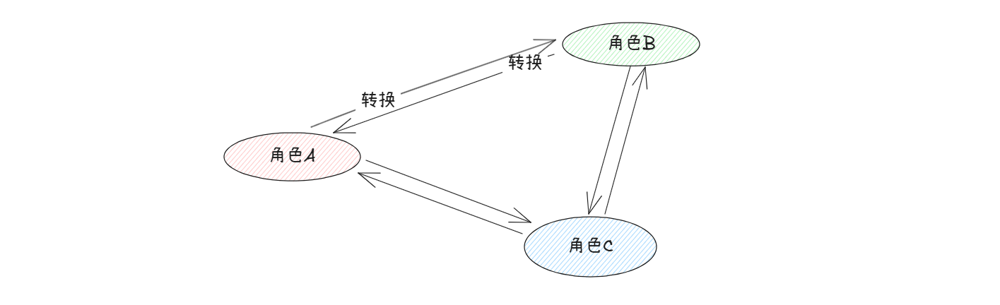

# 状态设计模式

## 一、简介

**状态模式**，对于有状态的对象，把复杂的判断逻辑提取到不同的状态对象之中，允许状态对象在其内部状态发生变化的时候改变其行为。

比如说：某个射击类的游戏，每个角色都有一个动作就是攻击，但是不同角色的攻击能力是不一样的，所以，希望在角色发生转变的过程之中，改变其攻击能力。



不同的角色，称之为**状态**；状态直接发生变化的过程，称之为**事件**，不同状态下能够做的事情，称之为**动作**。

## 二、示例

接下来，我们就来用实际的代码来进行演示。

> 背景：有 3 个角色，每个角色都可以进行 **普通攻击** 和 **使用技能** 来进行攻击。

```java
@AllArgsConstructor
@Getter
public enum StateEnum {

    STATE_A(1, "角色A"),
    
    STATE_B(2, "角色B"),
    
    STATE_C(3, "角色C")
    ;
    /**
     * 状态码
     */
    private final Integer code;
    
    /**
     * 状态描述
     */
    private final String desc;
}
```

定义具体的行为，也就是每个状态下能够做那些事。

```java
public interface IStateHandler {

    /**
     * 普通攻击
     * @param currentUser 当前用户
     * @param targetUser 目标用户
     * @param currentState 当前的状态
     * @return 攻击的结果
     */
    Result normalAttack(String currentUser, String targetUser, StateEnum currentState);

    /**
     * 通过 技能A 来进行攻击
     * @param currentUser 当前用户
     * @param targetUser 目标用户
     * @param currentState 当前的状态
     * @return 攻击的结果
     */
    Result attackBySkillA(String currentUser, String targetUser, StateEnum currentState);
}
```

这里定义一个抽象类来实现接口，并通过 **模板设计模式** 来进行再次抽象具体的行为，用来做一些共性的操作

```java
public abstract class AbstractState implements IStateHandler{
    
    protected Logger logger = LoggerFactory.getLogger(AbstractState.class);
    
    @Override
    public Result normalAttack(String currentUser, String targetUser, StateEnum currentState) {
        logger.info("{} 当前的状态为:{}, 向 {} 进行了 普通攻击", currentUser, currentState.getDesc(), targetUser);
        return doNormalAttack(currentUser, targetUser, currentState);
    }

    public abstract Result doNormalAttack(String currentUser, String targetUser, StateEnum currentState);

    @Override
    public Result attackBySkillA(String currentUser, String targetUser, StateEnum currentState) {
        logger.info("{} 当前的状态为:{}, 向 {} 通过技能A 发起了攻击", currentUser, currentState.getDesc(), targetUser);
        return doAttackBySkillA(currentUser, targetUser, currentState);
    }
    public abstract Result doAttackBySkillA(String currentUser, String targetUser, StateEnum currentState);
}
```

接下来，就是定义不同状态下具体的实现。这里只给出一个状态的实现，其余两个状态是一致的。

```java
@Service
public class StateA extends AbstractState {
    @Override
    public Result doNormalAttack(String currentUser, String targetUser, StateEnum currentState) {
        logger.info("StateA-doNormalAttack");
        return new Result();
    }

    @Override
    public Result doAttackBySkillA(String currentUser, String targetUser, StateEnum currentState) {
        logger.info("StateA-doAttackBySkillA");
        return new Result();
    }
}
```

状态定义完成之后，就可以在不同的状态下进行不同的操作~~，但是如何通过状态，来找到具体的类呢？

这里可以借助于 Spring 来进行完成，将其通过 Spring 注入到 Map 之中，

```java
public class StateConfig {

    @Resource
    private StateA stateA;

    @Resource
    private StateB stateB;

    @Resource
    private StateC stateC;

    protected Map<StateEnum, IStateHandler> map = new HashMap<>();

    @PostConstruct
    public void init() {
        map.put(StateEnum.STATE_A, stateA);
        map.put(StateEnum.STATE_B, stateB);
        map.put(StateEnum.STATE_C, stateC);
    }
}
```

我们就可以通过如下的方式：

```java
@Service
public class StateHandlerImpl extends StateConfig implements IStateHandler {

    @Override
    public Result normalAttack(String currentUser, String targetUser, StateEnum currentState) {
        return map.get(currentState).normalAttack(currentUser, targetUser, currentState);
    }
    
    @Override
    public Result attackBySkillA(String currentUser, String targetUser, StateEnum currentState) {
        return map.get(currentState).normalAttack(currentUser, targetUser, currentState);
    }
}
```

对应的测试方法如下：

```java
@Resource(name = "stateHandlerImpl")
private IStateHandler stateHandler;

@Test
public void testStateFlow() {
    StateEnum currentState = StateEnum.STATE_A;
    stateHandler.normalAttack("currentUser", "targetUser", currentState);
    stateHandler.attackBySkillA("currentUser", "targetUser", currentState);
}
```

在这个案例过程之中，我们不仅仅是 状态设计模式 的使用，还集成了 策略设计模式 和 模板设计模式。

当然了，除了这个方式来进行实现，Spring 也提供了状态机，不过这个状态机相对而言是重量级的。如果状态的转换是复杂的，可以通过工作流来进行实现


