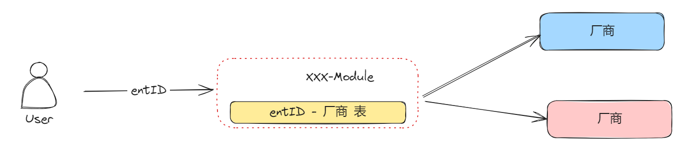
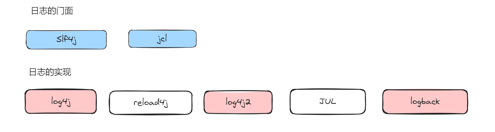
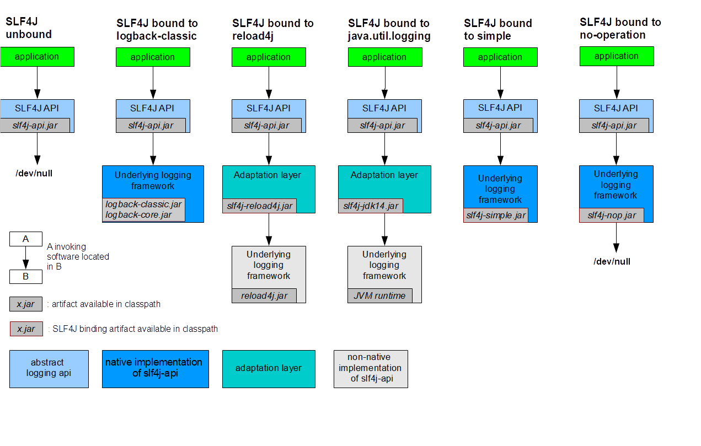
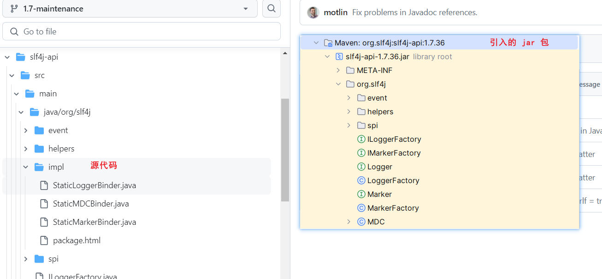
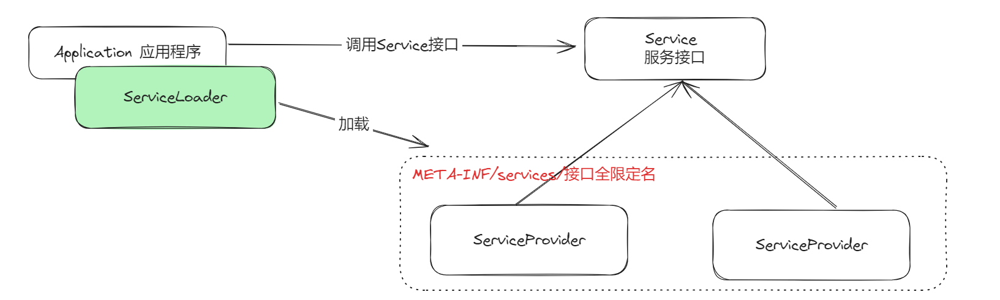
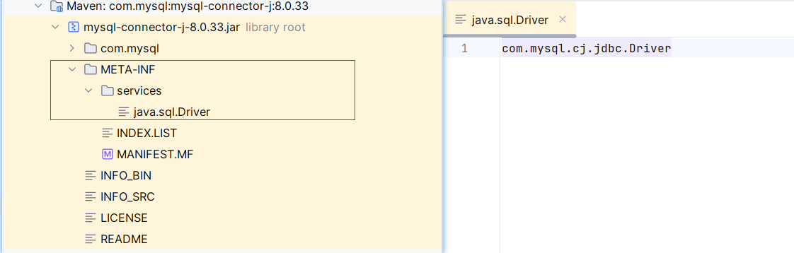
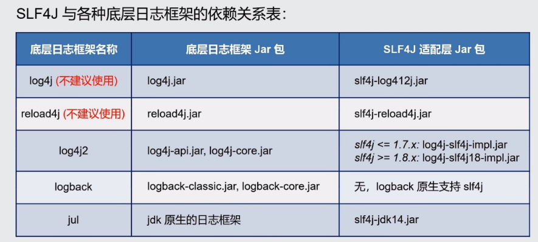

# 适配器模式

## 一、简介

比如，我们现在实现了登录接口和注册接口

```java
public interface UserService {
    /**
     * 实现用户的注册功能
     * @param userRegisterReq 请求参数
     * @return 用户注册的结果
     */
    CommonResult<?> register(UserRegisterReq userRegisterReq);

    /**
     * 实现用户的登录
     * @param userLoginReq 请求参数
     * @return 登录结果
     */
    CommonResult<?> login(UserLoginReq userLoginReq);
}
```

不过随着产品的迭代，我们需要让登录接口支持第三方登录，并且不影响原有的登录逻辑。我们希望最后的接口是这样的：能够提供出 Gitee 登录的接口服务能力。

```java
public interface UserServiceTarget {
    /**
     * 通过 Gitee 进行登录
     * @return 登录结果
     */
    CommonResult<?> loginByGitee();
}
```

很显然，现在的接口不支持。这个时候，我们可以采用适配器设计模式，**旨在将一个类的接口适配成用户所期待的接口**。能够帮助不兼容的接口变得兼容。适配器根据被适配对象的不同，又分为对象适配器和类适配器

1）对象适配器：适配器关联一个他需要被适配的类的实例

```java
@Service
public class UserServiceAdapter2 implements UserServiceTarget {
    
    @Resource
    private UserService userService;
    /**
     * 通过 Gitee 进行登录
     *
     * @return 登录结果
     */
    @Override
    public CommonResult<?> loginByGitee() {
        return null;
    }
}
```

2）类适配器：继承被适配的类

```java
@Service
public class UserServiceAdapter extends UserServiceImpl implements UserServiceTarget {
    /**
     * 通过 Gitee 进行登录
     * @return 登录结果
     */
    @Override
    public CommonResult<?> loginByGitee() {
        return null;
    }
}
```

不过这个时候，我们就发现了问题：

对于类适配器，继承完成之后，就能够具备 UserServiceImpl 类的所有功能。而对象适配器则不行。你必须要重写一遍这样的方法才可以，就比如这样，这也是两者最大的区别，如果说原来的接口中个数不多，使用两个都是可以的。否则，推荐使用类适配器

```java
public CommonResult<?> login(UserLoginReq userLoginReq) {
    return userService.login(null);
}
```

对于适配器设计模式，更像是一种补丁，来弥补最初设计上的缺陷。

## 二、使用场景
### 2.1  封装有缺陷的接口设计
比如说，在某个 SDK 中，有这样的一个类，但是他有好多的静态方法

```java
public class Message {
    public static void sendMessage() {}
    
    public static void getMessage() {}
}
```

但是，实际情况下，我们在具体使用的时候，并不希望他暴露出` getMessage` 方法，比如我们只想提供这样的接口

```java
public interface MessageTarget {
    void sendMessageTo();
}
```

我们可以这样做：

```java
public class MessageAdapter extends Message implements MessageTarget{
    @Override
    public void sendMessageTo() {
        sendMessage();
    }
}
```

### 2.2  统一多个类的接口设计
#### 2.2.1 案例一：对接外部系统
比如说，现在有一种场景，客户调用我司，我司去对接多个外部厂商。



各个厂商的接口定义确实不同的，那么，如何把原本不兼容的接口转为统一的接口，其实就可以使用适配器设计模式。

我们将接口格式定义为下面这样，将用户的调用数据都封装在了 PlatFormDto 里面

```java
public interface ManagerService {
    void getInfoFromPlatFrom(PlatFormDto platFormDto);
}
```

所有的调用厂商的类，都实现这个接口

```java
@Slf4j
public class CodingManagerServiceImpl implements ManagerService{
    @Override
    public void getInfoFromPlatFrom(PlatFormDto platFormDto) {
        log.info("Coding 厂商实现");
        // 调用 Coding 厂商
    }
}

@Slf4j
public class DefaultManagerServiceImpl implements ManagerService{
    @Override
    public void getInfoFromPlatFrom(PlatFormDto platFormDto) {
        log.info("默认厂商实现");
    }
}
```

而在实际调用的时候，我们又可以通过策略设计模式，伪代码如下：

```java
// 具体厂商的实现类
Map<String,ManagerService> managerServiceMap = new HashMap<>();
// 企业 与厂商的绑定关系
Map<String,String> entBindTheSource = new HashMap<>();

PlatFormDto platFormDto = new PlatFormDto();
String entId = platFormDto.getEntId();
String source = entBindTheSource.get(entId);
managerServiceMap.get(source).getInfoFromPlatFrom(platFormDto);
```

#### 2.2.2  案例二：日志框架
如果某个功能的实现依赖于多个外部系统，每个系统提供的接口格式不同，通过适配器设计模式，将他们的接口适配为统一的接口定义。其中最为典型的就是日志框架

Java 中有太多的日志框架了，在一个项目中，映入了两个组件，但是他们分别使用了 logback 和 log4j。这样就会导致，你必须要在项目中维护两个日志文件，否则就会导致一个模块的日志丢失。并且两个日志框架的 API 还不同，如果要更换日志框架，不仅仅需要更换 maven 依赖，还需要更改代码，这就造成了维护成本较高。

所以，设计者定义了一份标准，来统一日志框架的 API，这就是日志的门面。如果你想切换切换日志框架，只需要更改 maven 依赖即可，使用对应的配置文件就行。

如果说，你不兼容原生日志门面提供的规范 API，则需要去提供对应的适配器，将原来不兼容的 API 转为日志门面提供的 API。



但是有些日志框架并不支持 Slf4j，所有就需要适配层，在 Slf4j 的官网中，提供了下面这张图，他说明了各个日志框架与 Slf4j 的适配层



对于 Slf4j ，不同版本的实现还是有所差异的

1）1.7.x：基于 JVM 类加载机制，与底层的日志框架进行绑定

2）1.8.x：基于 Java 的 SPI 机制，与底层的日志框架进行绑定

##### 2.2.2.1 SLF4J-1.7
我们首先映入了 1.7 的 slf4j，我们看一下绑定的代码

```java
private final static void bind() {
    try {
        // the next line does the binding
        // 这个类是由适配层或者底层日志框架来实现的，在 slf4j 的 jar 包中没有这个类
        StaticLoggerBinder.getSingleton();
    } catch (NoClassDefFoundError ncde) {
       
    } catch (java.lang.NoSuchMethodError nsme) {
        
    } catch (Exception e) {
        
    } finally {
        
    }
}
```

对于其余的日志框架，需要在自己的项目中实现一个包名为：org.slf4j.impl 的类。为了保证编译通过，slf4j 提供了简单的实现，但是打包完成之后，他会将这个类文件给删除。



这主要是借助于 Maven 的插件

```java
<plugin>
    <groupId>org.apache.maven.plugins</groupId>
    <artifactId>maven-antrun-plugin</artifactId>
    <version>3.0.0</version>
    <executions>
        <execution>
            <phase>process-classes</phase>
            <goals>
                <goal>run</goal>
            </goals>
        </execution>
    </executions>
    <configuration>
        <target>
            <echo>Removing log package from target/classes</echo>
            <delete dir="target/classes/com/coding/log"/>
        </target>
    </configuration>
</plugin>
```

##### 2.2.2.2 SLF4J-1.8
###### 01 SPI 机制
```java
private final static void bind() {
    try {
        // 通过 ServiceLoader 加载 SLF4JServiceProvider
        List<SLF4JServiceProvider> providersList = findServiceProviders();
        // 如果有多个，则打印警告信息
        reportMultipleBindingAmbiguity(providersList);
        if (providersList != null && !providersList.isEmpty()) {
            // 默认取第一个进行绑定
            PROVIDER = providersList.get(0);
            // SLF4JServiceProvider.initialize() is intended to be called here and nowhere else.
            PROVIDER.initialize();
            INITIALIZATION_STATE = SUCCESSFUL_INITIALIZATION;
            reportActualBinding(providersList);
        } else {
            INITIALIZATION_STATE = NOP_FALLBACK_INITIALIZATION;
            Util.report("No SLF4J providers were found.");
            Util.report("Defaulting to no-operation (NOP) logger implementation");
            Util.report("See " + NO_PROVIDERS_URL + " for further details.");

            Set<URL> staticLoggerBinderPathSet = findPossibleStaticLoggerBinderPathSet();
            reportIgnoredStaticLoggerBinders(staticLoggerBinderPathSet);
        }
        postBindCleanUp();
    } catch (Exception e) {
        failedBinding(e);
        throw new IllegalStateException("Unexpected initialization failure", e);
    }
}
```

而在 `findServiceProviders`方法中，他实际上是要去找：`SLF4JServiceProvider`类的所有实现

```java
private static List<SLF4JServiceProvider> findServiceProviders() {
    ServiceLoader<SLF4JServiceProvider> serviceLoader = ServiceLoader.load(SLF4JServiceProvider.class);
    List<SLF4JServiceProvider> providerList = new ArrayList<SLF4JServiceProvider>();
    for (SLF4JServiceProvider provider : serviceLoader) {
        providerList.add(provider);
    }
    return providerList;
}
```

其实就是通过 `ServiceLoader` 来加载某个接口的具体实现。

```java
public final class ServiceLoader<S> implements Iterable<S>{}
```

这个类实际上就是一个迭代器

```java
private boolean hasNextService() {
    if (nextName != null) {
        return true;
    }
    if (configs == null) {
        try {
            String fullName = PREFIX + service.getName();
            if (loader == null)
                configs = ClassLoader.getSystemResources(fullName);
            else
                configs = loader.getResources(fullName);
        } catch (IOException x) {
            fail(service, "Error locating configuration files", x);
        }
    }
    while ((pending == null) || !pending.hasNext()) {
        if (!configs.hasMoreElements()) {
            return false;
        }
        pending = parse(service, configs.nextElement());
    }
    nextName = pending.next();
    return true;
}
```

就是通过 ClassLoader 来加载下面路径的文件

```java
private static final String PREFIX = "META-INF/services/";

String fullName = PREFIX + service.getName();
```



###### 02 JDBC 中的 SPI
在 Java SPI 出现之前，我们需要通过 Class.forName 来加载驱动

```java
Class.forName("com.mysql.cj.jdbc.Driver");
```

为什么这样就能够加载到驱动呢？因为 JDBC 要求 Driver 实现类在类加载的时候，能够将自身的实例对象注册到 DriverManager 中，从而加载数据库驱动。如下图：

```java
public class Driver extends NonRegisteringDriver implements java.sql.Driver {
    // Register ourselves with the DriverManager.
    static {
        try {
            java.sql.DriverManager.registerDriver(new Driver());
        } catch (SQLException E) {
            throw new RuntimeException("Can't register driver!");
        }
    }
    public Driver() throws SQLException {
        // Required for Class.forName().newInstance().
    }
}
```

但是，对于程序员来说，需要记住，各种数据库的驱动名称，就显得很繁琐。那如果厂商将驱动名称直接写在一个固定的路径的配置文件中，我们去直接读取。

这套机制，就称之为：SPI

规范

1. 文件路径：必须在 Jar 包的 META-INF/services 目录之下
2. 文件名称：Service 接口的全限定名
3. 文件内容：Service 实现类的全限定名。如果有多个实现，那么每一个实现类在文件中单独占据一行



###### 03 自定义 SPI
接下来，我们编写一个实际案例来实现一下 SPI

首先，我们定义一个 User-API 的模块，在项目中定义了一个接口

```java
package com.coding;

/**
 * @Description
 * @Author 不会Coding
 * @Date 2024/7/28
 */
public interface UserService {
    /**
     * 通过 用户ID 来获取用户的姓名
     * @param userId 用户ID
     * @return 用户姓名
     */
    String getUserName(String userId);
}
```

接下来，分别创建 User-Source-Default 和 User-Source-Coding 模块，引入 Uer-API 模块，分别实现这个接口

1）User-Source-Default 模块

```java
public class UserServiceDefaultImpl implements UserService {
    /**
     * 通过 用户ID 来获取用户的姓名
     *
     * @param userId 用户ID
     * @return 用户姓名
     */
    @Override
    public String getUserName(String userId) {
        return "default username";
    }
}
```

2）User-Source-Coding 模块

```java
package com.coding;

/**
 * @Description
 * @Author 不会Coding
 * @Date 2024/7/28
 */
public class UserServiceCodingImpl implements UserService{
    /**
     * 通过 用户ID 来获取用户的姓名
     *
     * @param userId 用户ID
     * @return 用户姓名
     */
    @Override
    public String getUserName(String userId) {
        return "coding username";
    }
}

```

准备完成上述内容之后，我们开始测试

```xml
<dependencies>
  <dependency>
    <groupId>com.coding</groupId>
    <artifactId>User-API</artifactId>
    <version>1.0-SNAPSHOT</version>
  </dependency>
  <dependency>
    <groupId>com.coding</groupId>
    <artifactId>User-Source-Default</artifactId>
    <version>1.0-SNAPSHOT</version>
  </dependency>
</dependencies>
```

在项目之下，建立一个 `META-INF/services` 文件夹，创建一个名为：`com.coding.UserService` 的文件，在文件中填充如下内容

```java
com.coding.UserServiceDefaultImpl
```

创建测试类

```java
public class Main {
    public static void main(String[] args) {
        ServiceLoader<UserService> load = ServiceLoader.load(UserService.class);
        for (UserService userService : load) {
            System.out.println(userService.getUserName("1"));
        }
    }
}
```

完成测试

##### 2.2.2.3 依赖关系


