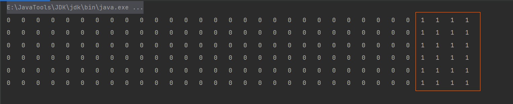
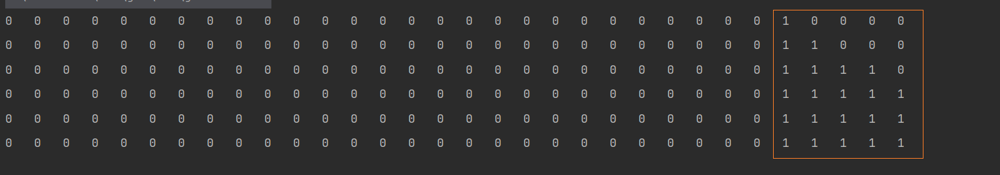
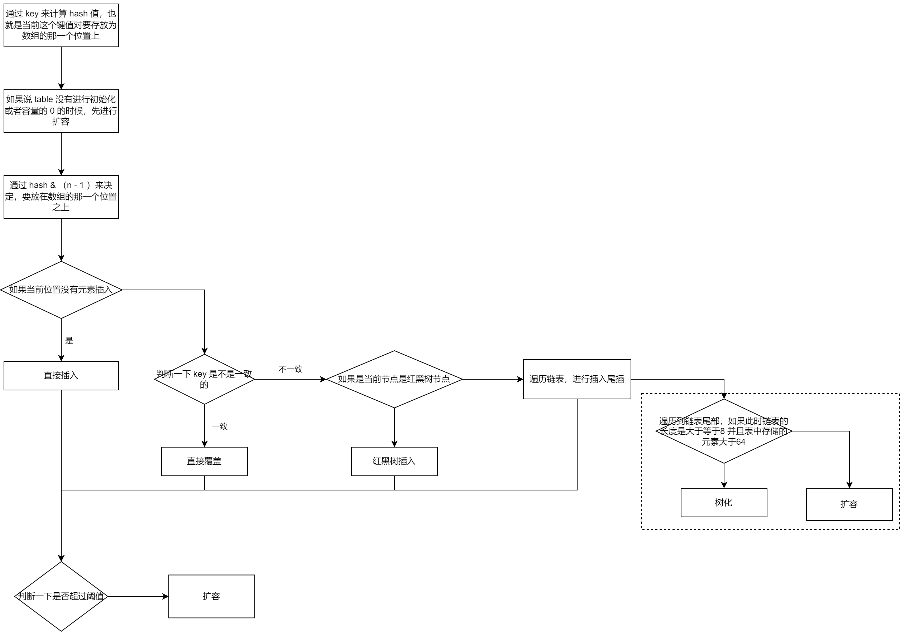
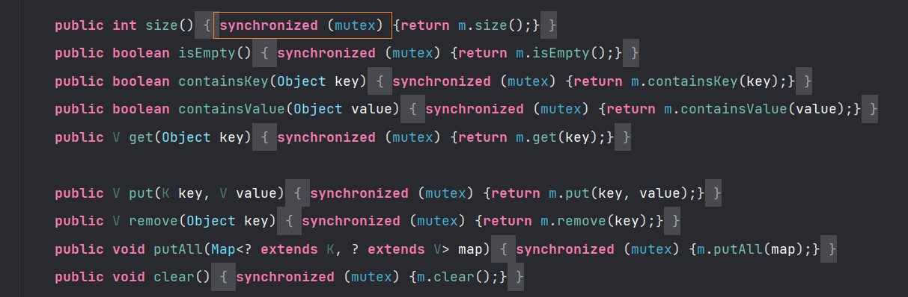
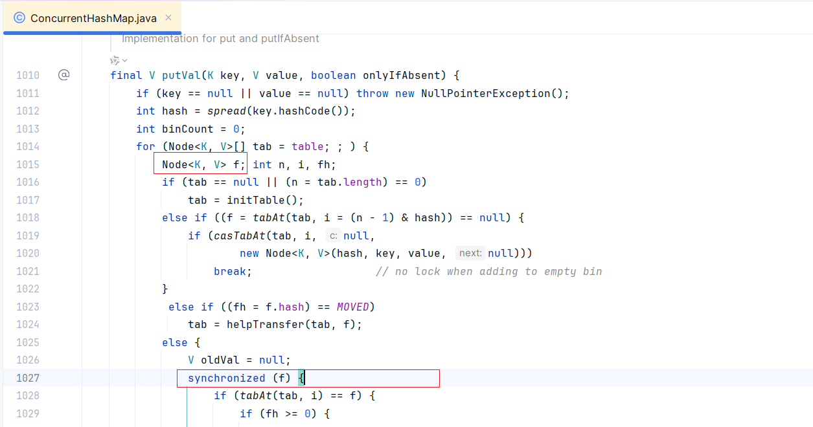

# Map

## 一、HashMap

:::tip

​	散列表，平常也叫做哈希表，用数组的方式支持按照下标进行数据访问的特性

:::

比如说我们每个人都存在一个 **<身份证，姓名>** 的映射关系，我们需要把这个键值对存放在我们的数组中去，来提供 O(1) 访问的特点，但是身份证号太长了，我们需要先将身份证号和数组的下标通过某种方式进行转换，然后在再指定位置下标之上放上我们的姓名即可。每次访问的时候，我们需要我们先将身份证号进行某种转化，然后拿这个转换之后的结果，去指定位置进行取就行了。这种转化方式我们称之为 **散列函数**。

但是数组的长度毕竟是有限的，可能会出现多个点映射到同一个位置的情况，这种情况我们称之为 **哈希冲突**

当散列表之中，存在的元素过多时，我们并不能够将链表的长度无限扩展，这就会影响整体的性能，这个时候就需要考虑扩容的时候，那么元素达到多少的时候进行扩容呢？这里引入一个新的概念 "**阈值**"，而阈值的计算依赖于散列表的容量和**负载因子**，负载因子衡量了散列表满的程度，在默认情况之下，负载因子为 0.75

:::info

负载因子能够在一定程度之上，影响 HashMap的性能，因为，负载因子过大，就能说明散列表装填的元素更加的多，元素多了，就会导致链表过长，进而影响性能。如果说太小了，就会导致数据量稀释，空间浪费

:::

通过上面的分析，我们会有两个问题

+ 到底采用什么样的 Hash 方式？
+ 如何处理哈希冲突的问题

### 1.1 构造函数

#### 1.1.1 无参构造

```java
public HashMap() {
    // 负载因子默认设置为 0.75
    this.loadFactor = DEFAULT_LOAD_FACTOR; 
}
```

```java
// 默认的负载因子是 0.75 数组默认大小是 16 
static final int DEFAULT_INITIAL_CAPACITY = 1 << 4;

static final float DEFAULT_LOAD_FACTOR = 0.75f;
```

在构造方法中，我们并没有发现`table`数组的初始化。所以在一般情况之下，我们就可以认为他是按照`懒加载`原则，在首次使用的时候被初始化，这个思路，在好多底层源码上都是这样实现的。

#### 1.1.2 指定容量和负载因子

```java
static final int MAXIMUM_CAPACITY = 1 << 30;

// 指定 容量 和 负载因子
public HashMap(int initialCapacity, float loadFactor) {
    // 如果说容量小于 0 ，直接抛出异常
    if (initialCapacity < 0)
        throw new IllegalArgumentException("Illegal initial capacity: " + initialCapacity);
    // 最大容量最大只能是 1 << 30 
    if (initialCapacity > MAXIMUM_CAPACITY)
        initialCapacity = MAXIMUM_CAPACITY;
    // 判断负载因子
    if (loadFactor <= 0 || Float.isNaN(loadFactor))
        throw new IllegalArgumentException("Illegal load factor: " + loadFactor);
    this.loadFactor = loadFactor;// 设置负载因子
    this.threshold = tableSizeFor(initialCapacity);// 计算阈值
}
```

对于阈值的计算，是通过容量来进行计算的，**计算出大于等于该容量的最小的 2 的整数次幂**。不断右移的目的在于，把二进制的各个位置之上都赋值为1

```java
static final int tableSizeFor(int cap) {
    // 用于解决 容量本身就是2 的 N 次方的情况
    int n = cap - 1;
    n |= n >>> 1;
    n |= n >>> 2;
    n |= n >>> 4;
    n |= n >>> 8;
    n |= n >>> 16;
    // 得到的值是一个低位全是1的值，最后返回的时候 +1，则会得到1个比 n 大的 2 的N次方。
    return (n < 0) ? 1 : (n >= MAXIMUM_CAPACITY) ? MAXIMUM_CAPACITY : n + 1;
}
```

对于这个一步，我们演示一下效果，我们写下如下代码，打印一下每次运算之后的二进制位

```java
private static void get(int x) {
    for(int i = 31; i >= 0; i--) {
        if(((x >> i) & 1) == 1) {
            System.out.print("1\t");
        } else {
            System.out.print("0\t");
        }
    }
    System.out.println();
}
public static void main(String[] args) {
    int n = 17- 1;
    get(n);
    n |= n >>> 1;
    get(n);
    n |= n >>> 2;
    get(n);
    n |= n >>> 4;
    get(n);
    n |= n >>> 8;
    get(n);
    n |= n >>> 16;
    get(n);
    //return (n < 0) ? 1 : (n >= MAXIMUM_CAPACITY) ? MAXIMUM_CAPACITY : n + 1;
}
```

如果我们将16作为参数进行传递



我们将17作为参数进行传递



通过演示，发现，该函数的目的最终会得到一个后几位都是1的数，也就是2的整数次幂，并且这个数是大于该参数的最小的二的整数次幂。其实就是，将该数从最高的哪一位开始后面所有的二进制位都填充为1，从填充17哪里就能非常容易看出来，配合上或运算的特性，

而对于减1的目的，我传入16，如果不减一，得到的是31，就是为了得到大于等于当前数的最小的2的整数次幂（最后返回的时候有加1的特点）

> 为什么要求数组的长度一定是2的整数倍？

+ 因为我们在进行key-->下标的映射过程之中，我们一般的想法是通过`hash % (n - 1)`,而底层是通过`hash & (length - 1)`，只有在2的倍数的情况之下，两种方案才是等价的
+ 另一个方面，是因为位运算的速度更加的快

#### 1.1.3 指定容量

```java
/**
* 构造方法：HashMap(int initialCapacity)
*/
public HashMap(int initialCapacity) {
    this(initialCapacity, DEFAULT_LOAD_FACTOR);
}
```

这里的构造方法，我们发现，实际上就是通过指定容量和负载因子的构造函数，这里的负载因子直接就是默认的。

::: info

这里需要注意一下，假如说容量指定为了 2，当HashMap 第二个元素的时候，阈值就是 2 * 0.75 =  1，这个时候就要考虑扩容的问题

:::

#### 1.1.4 传入一个Map

```java
/**
* 构造方法：HashMap(Map<? extends K, ? extends V> m)
*/
public HashMap(Map<? extends K, ? extends V> m) {
    this.loadFactor = DEFAULT_LOAD_FACTOR;// 默认的负载因子计算 0.75 
    putMapEntries(m, false);
}
```

相比于之前的构造函数，这一次多了一步

```java
final void putMapEntries(Map<? extends K, ? extends V> m, boolean evict) {
    // 1. 计算出要放入的键值对的数量
    int s = m.size();
    if (s > 0) {
        // 如果说这个table是空的
        if (table == null) { // pre-size
            // 计算出所需要的table的最小容量
            // 数组容量 / 键值对的数量 > 负载因子
            // 键值对的数量 = 数组容量 / 负载因子，这里加一的目的就是下面int向下取整的问题
            float ft = ((float)s / loadFactor) + 1.0F;
            int t = ((ft < (float)MAXIMUM_CAPACITY) ?
                     (int)ft : MAXIMUM_CAPACITY);
            // 如果说这个 t 大于阈值，计算新的阈值
            //因为此时 table 未初始化，我们只需要保证 threshold 大于数组大小即可，
            // 在 put key-value 键值的时候，在去真正的初始化 table 
            if (t > threshold)
                threshold = tableSizeFor(t); // 计算阈值
        }
        // 如果table 已经被初始化了，并且说 s 大于 阈值，需要不断扩容，
        else if (s > threshold)
            resize();
        // 遍历m集合，把元素都给放进去
        for (Map.Entry<? extends K, ? extends V> e : m.entrySet()) {
            K key = e.getKey();
            V value = e.getValue();
            putVal(hash(key), key, value, false, evict);
        }
    }
}
```

### 1.2 哈希函数

这里我们以 put 方法为例，来看一下对应的 hash 函数

```java
public V put(K key, V value) {
    return putVal(hash(key), key, value, false, true);
}
```

对应的源码如下：

```java
static final int hash(Object key) {
    int h;
    return (key == null) ? 0 : (h = key.hashCode()) ^ (h >>> 16);
}
```

对应的 put 方法，当前我们只关注这一行，这里的 hash 实际上就是通过这个 hash 函数来获取到的

```java
p = tab[i = (n - 1) & hash]
```

通过这样，我们就能看出，他首先通过 key 的 hashCode 方法，返回一个 int 值，然后将高16位和低16位进行异或。

这里实际上是为了增加随机值，让数据元素更加均衡的散列，减少碰撞。

**注意，这里的key如果是0，hash值是 0，说明HashMap中能够进行 null 值存放**

这个有一个需要补充的点，相比于其他的元素，String 类型更加的适合作为 HashMap 的 key，主要原因如下：

+ hashCode 方法要保证同一个对象调用该方法的时候都应该相同的值，String类型对该条件具有很好的支持，因为String对象的 hashCode 方法是根据 String 对象的内容计算的，并不是根据地址，在底层复写了 hashCode 方法
+ 并且创建字符串的时候，他的 hashCode 方法进行了缓存，不需要二次计算

### 1.3 哈希冲突

对于散列表处理哈希冲突的方式，主要有来两种：

- 开发地址法：就是从冲突的位置在接下来往下找，给冲突元素找一个空位
- 链地址法：就是 数组 加 链表 的结合。在每个数组元素上都对应一个链表结构，当数据被 Hash 后，得到数组下标，把数据放在对应下标元素的链表上。

虽然说这样可以解决 Hash 冲突的问题，但是链表查询一个元素的时间复杂度是 `O(N)`，如果 **哈希函数散列程度不够高**，就会导致大部分的 key 都映射到同一个点之上，就会导致对应数组位置之上的链表过长。

在 JDK 1.7 的时候，就采用这种方式，而为解决这个问题，在 JDK 1.8 的时候，对于这部分内容进行了优化 使用  **数组 + 链表 + 红黑树** 的实现方式，如果说链表的长度超过某个值，就会使用红黑树，用红黑树之后，会达到 O(logn)。

为什么要采用红黑树呢？采用其余的数据结构不可以吗？

如果采用二叉搜索树，查找的时间复杂度就是 O(logN)，但是在极端情况之下，会退化为链表，时间复杂度就变为了 O(N)

如果采用 AVL 树，在二叉搜索树的基础之上进行了改良，保证了每个左子树和右子树高度差不超过 1，但是插入的效率就会降低

为了保证插入和查询都能够具有均衡的水平，引入了**红黑树**。

> 那么为什么不直接采用红黑树呢？

这主要是因为，红黑树节点占用的空间较多，如果直接采用红黑树就会造成空间的浪费，并且红黑树虽然查询较快，但是插入慢，在时间和空间的权衡之下，会优先选择链表

### 1.4 添加元素

接下来，我们以添加元素对应的源码设计

```java
public V put(K key, V value) {
    // hash 计算hash 值
    return putVal(hash(key), key, value, false, true);
}

final V putVal(int hash, K key, V value, boolean onlyIfAbsent, boolean evict) {
    
    Node<K,V>[] tab; // table 数组
    
    Node<K,V> p; // 对应位置上的Node节点
    
    int n, i;// 用 n 来表示数组的大小，用 i 来表示 对应table 中的位置
    
    /**
    * 1. 如果说 table 还没有进行初始化， 或者容量为0的时候，进行扩容
    *  从这里就能够看到，Hash 表底层就是一个数组
    */
    if ((tab = table) == null || (n = tab.length) == 0)
        n = (tab = resize()).length;
    /**
    * 2. 获取对应数组位置上的节点, p 就表示对应位置上的节点，也就是说通过映射，映射到数组上的这个点
    * 2.1 如果说为 null， 直接建立一个节点
    */
    if ((p = tab[i = (n - 1) & hash]) == null)
        tab[i] = newNode(hash, key, value, null);
    else {
        /**
        * 3. 说明当前映射的位置上已经有其他元素了，就要处理 哈希冲突
        */
        Node<K,V> e; K k;
        /**
        * 3.1 这个时候如果说 映射到的这个点和我们要插入的点一样（哈希值一样并且 key相同），直接使用就行了
        */
        if (p.hash == hash &&
            ((k = p.key) == key || (key != null && key.equals(k))))
            e = p;
        /**
        * 3.2 如果说这个点 是 红黑树的节点，就插入树中
        */ 
        else if (p instanceof TreeNode)
            e = ((TreeNode<K,V>)p).putTreeVal(this, tab, hash, key, value);
        else { 
            /** 
            * 3.3 这个点是 链表中的点
            */
            for (int binCount = 0; ; ++binCount) {
                // 3.3.1 找到了链尾
                if ((e = p.next) == null) {
                    // 3.3.2 创建一个新的节点
                    p.next = newNode(hash, key, value, null);
                    // 3.3.3 如果说链表的长度 大于等于 8 ，进行树化
                    if (binCount >= TREEIFY_THRESHOLD - 1) // -1 for 1st
                        treeifyBin(tab, hash);
                    break;
                }
                // 如果说遍历到的这个 e 就是我们要找的，直接使用就行了
                if (e.hash == hash &&
                    ((k = e.key) == key || (key != null && key.equals(k))))
                    break;
                p = e;
            }
        }
        /**
        * 4. 找到了对应的节点，覆盖对应的value值
        */
        if (e != null) { // existing mapping for key
            V oldValue = e.value;
            if (!onlyIfAbsent || oldValue == null)
                e.value = value;
            afterNodeAccess(e);
            return oldValue;
        }
    }
    // 增加修改次数
    ++modCount;
    // 如果说长度超过阈值 ，进行扩容
    if (++size > threshold)
        resize();
    afterNodeInsertion(evict);
    return null;
}
```

整个流程较为简单，对应的流程图如下：



但是，这里有几个细节，需要我们注意

- 映射数组下标的方式
- 扩容方法

#### 1.4.1 映射数组下标

在哈希函数小节，我们就看到了，哈希函数是通过如下的方式进行映射的

```java
p = tab[i = (n - 1) & hash]
```

在上文之中也提到了，HashMap 底层数组的大小一定是 2 的整数次幂，这主要是因为只有在2的倍数的情况之下

+ `hash % (n - 1)`   与  `hash & (length - 1)` 才是等价的

#### 1.4.2 扩容

当 HashMap 中 键值对   **达到阈值**  的时候，就要考虑   **扩容**。对于阈值的计算，引入了负载因子的概念。我们假设 HashMap 的数组容量为 capacity ，key-value 键值对数量为 size ，负载因子为 loadFactor 。那么，当 `size / capacity > loadFactor` 时，也就是数组的使用量比率到达 loadFactor 比例时

```java
final Node<K,V>[] resize() {
    // 旧的 table 数组
    Node<K,V>[] oldTab = table;
    // 获取旧的 table 数组的长度
    int oldCap = (oldTab == null) ? 0 : oldTab.length;
    // 获取以前的阈值
    int oldThr = threshold;
    int newCap, newThr = 0;
    /**
    * 1. 以前的容量是大于0的
    */
    if (oldCap > 0) {
        /**
        * 1.1 这个容量超过了允许的最大范围，不在允许扩容，设置阈值为int的最大值。
        */
        if (oldCap >= MAXIMUM_CAPACITY) {
            threshold = Integer.MAX_VALUE;
            return oldTab;
        }
        /**
        * 1.2 目标是两倍扩容，并且这个值不能超过最大容量；如果说旧的容量是 > 16的，
        * 将新阈值设置为原来的两倍，阈值 = 容量 * 负载因子，负载因子不发生变化，容量扩容为
        * 原来的两倍，所以只需要将以前阈值* 2，就能得到新的阈值
        */
        else if ((newCap = oldCap << 1) < MAXIMUM_CAPACITY &&
                 oldCap >= DEFAULT_INITIAL_CAPACITY)
            newThr = oldThr << 1; // double threshold
    }
    /**
    * 2. 在构造方法中，我们发现并没对table进行初始化 
    * 说明以前容量为空，也就是说table数组未进行初始化，进行初始化操作
    */
    // 2.1 构造时传入了容量，计算出来阈值
    else if (oldThr > 0) //初始容量设置为阈值
        newCap = oldThr;
    /**
    * 2.2 说明执行的是默认构造方法（只设置了负载因子），阈值 和 容量 都是0
    */
    else { 
        /**
        * 2.2.1 设置新的容量和阈值
        */
        newCap = DEFAULT_INITIAL_CAPACITY;
        newThr = (int)(DEFAULT_LOAD_FACTOR * DEFAULT_INITIAL_CAPACITY);
    }
    /**
    * 3. 如果说上面并没有计算出阈值，则进行计算
    */
    if (newThr == 0) {
        float ft = (float)newCap * loadFactor;
        newThr = (newCap < MAXIMUM_CAPACITY && ft < (float)MAXIMUM_CAPACITY ? (int)ft : Integer.MAX_VALUE);
    }
    threshold = newThr;
    //4. 创建一个新的table数组
    @SuppressWarnings({"rawtypes","unchecked"})
    Node<K,V>[] newTab = (Node<K,V>[])new Node[newCap];
    table = newTab;
    // 5. 如果说以前的table数组不为null，要将旧的table数组复制到新的table数组中。
    if (oldTab != null) {
        for (int j = 0; j < oldCap; ++j) {
            Node<K,V> e;
            if ((e = oldTab[j]) != null) {
                oldTab[j] = null;
                if (e.next == null)
                    newTab[e.hash & (newCap - 1)] = e;
                else if (e instanceof TreeNode)
                    // 5.1 在这个方法之中，如果说 容量是小于 6 的就要退化为链表
                    ((TreeNode<K,V>)e).split(this, newTab, j, oldCap);
                else { // preserve order
                    Node<K,V> loHead = null, loTail = null;
                    Node<K,V> hiHead = null, hiTail = null;
                    Node<K,V> next;
                    do {
                        next = e.next;
                        if ((e.hash & oldCap) == 0) {
                            if (loTail == null)
                                loHead = e;
                            else
                                loTail.next = e;
                            loTail = e;
                        }
                        else {
                            if (hiTail == null)
                                hiHead = e;
                            else
                                hiTail.next = e;
                            hiTail = e;
                        }
                    } while ((e = next) != null);
                    if (loTail != null) {
                        loTail.next = null;
                        newTab[j] = loHead;
                    }
                    if (hiTail != null) {
                        hiTail.next = null;
                        newTab[j + oldCap] = hiHead;
                    }
                }
            }
        }
    }
    // 6. 返回新创建的table数组
    return newTab;
}
```

通过分析 resize() 方法的源码，我们发现，该方法有两个职责

+ 创建初始存储表格
+ 在容量不充足的情况之下，进行扩容，目标是两倍

#### 1.4.3 树化

```java
static final int MIN_TREEIFY_CAPACITY = 64;

final void treeifyBin(Node<K,V>[] tab, int hash) {
    int n, index; Node<K,V> e;
    /**
    * 1. 如果 table 容量小于 MIN_TREEIFY_CAPACITY(64) ，则选择扩容
    */
    if (tab == null || (n = tab.length) < MIN_TREEIFY_CAPACITY)
        resize();
    /**
    * 2. 将 hash 对应的位置进行树化
    */
    else if ((e = tab[index = (n - 1) & hash]) != null) {
        // 顺序遍历链表，逐个转换成 TreeNode 节点
        TreeNode<K,V> hd = null, tl = null;
        do {
            TreeNode<K,V> p = replacementTreeNode(e, null);
            if (tl == null)
                hd = p;
            else {
                p.prev = tl;
                tl.next = p;
            }
            tl = p;
        } while ((e = e.next) != null);
        // 树化
        if ((tab[index] = hd) != null)
            hd.treeify(tab);
    }
}
```

这里我们对方法这块进行总结：

- 如果说 table 的容量是小于 64，进行扩容，而不是进行树化
- 当进行树化的时候，是将 hash 对应的位置进行遍历，转为 TreeNode 节点

## 二、Hashtable

### 2.1 简介

相比于 HashMap ，Hashtable 是线程安全的，而他实现线程安全的方式，则是通过在方法上通过 `synchronized` 来实现的

底层使用的哈希表进行实现，**默认容量使用11，并不要求是2的N次方**

::: code-group

```java [添加元素]
public synchronized V put(K key, V value) {
    // Make sure the value is not null
    if (value == null) {
        throw new NullPointerException();
    }

    // Makes sure the key is not already in the hashtable.
    Entry<?,?> tab[] = table;
    // 计算数组的下标
    int hash = key.hashCode();
    int index = (hash & 0x7FFFFFFF) % tab.length;
    @SuppressWarnings("unchecked")
    Entry<K,V> entry = (Entry<K,V>)tab[index];
    for(; entry != null ; entry = entry.next) {
        if ((entry.hash == hash) && entry.key.equals(key)) {
            V old = entry.value;
            entry.value = value;
            return old;
        }
    }
	// 这实际上是添加元素的核心方法
    addEntry(hash, key, value, index);
    return null;
}
```

```java [addEntry]
private void addEntry(int hash, K key, V value, int index) {
    modCount++;

    Entry<?,?> tab[] = table;
    if (count >= threshold) {
        // Rehash the table if the threshold is exceeded
        // 进行扩容
        // int newCapacity = (oldCapacity << 1) + 1;
        rehash();
        tab = table;
        hash = key.hashCode();
        index = (hash & 0x7FFFFFFF) % tab.length;
    }

    // Creates the new entry.
    @SuppressWarnings("unchecked")
    Entry<K,V> e = (Entry<K,V>) tab[index];
    tab[index] = new Entry<>(hash, key, value, e);
    count++;
}
```

:::

通过阅读上述代码过程，我们发现以下信息：

+ 我们发现 hashtable 中键和值都是不能为null的
+ 方法上使用`synchronized`进行修饰
+ 扩容使用的是 `2N + 1`

> **为什么使用 2N + 1**
>

+ hashtable中的初始容量是11，key--> 数组下标映射是：`(hash & 0x7FFFFFFF) % tab.length;`，因为初始容量是11，是一个素数，在素数情况之下，key % m 在区间中均匀分布，后面扩容采用这种方式进行扩容，保证扩容之后仍然是一个素数

### 2.2 与 HashMap 的区别
2. **安全性角度分析**: Hashtable是线程安全的，大部分方法之上都使用synchronized来进行修饰，而HashMap并不是线程安全的
3. **是否提供contains方法**：HashMap中把Hashtable的contains方法去除掉，改为了containsValue和containsKey，因为contains方法容易引起误解，Hashtable则保留了contains，containsKey，containsValue三个方法，其中contains和containsValue功能相同
4. **key和value是否允许空值**：在Hashtable中，key和value都不允许出现null值，但是HashMap中，允许键设置为null
5. **hash方式不同**:HashTable直接使用对象的 hashCode，而HashMap则是重新计算一个hash值
6. **扩容方式是不同**：HashTable的初始容量是11，每次扩容则是2N+1，而HashMap中，则是使用两倍扩容
6. **底层实现不同**：
   - HashMap，在底层是基于数组 + 链表+红黑树进行实现的
   - Hashtable，基于哈希表进行实现

## 三、TreeMap
`TreeMap ` 是基于平衡二叉树（红黑树）的一种提供顺序访问的 Map，与`HashMap `不同，他的 get，put ，remove之类的操作都是 O(log(n))的时间复杂度，可以自定义排序规则，具体顺序可以由指定 Comparator 来决定，或者根据键的自然顺序来判断

> 对比HashMap 和 TreeMap
>

+ HashMap是基于数组 + 链表 + 红黑树 实现的，而TreeMap是基于红黑树实现的
+ 使用HashMap需要键对象明确定义hashCode和equals方法，为了优化Hashmap空间的使用，可以调整初始容量大小和扩容，而TreeMap没有这种选项
+ HashMap的时间复杂度是O(1)，而TreeMap主要是保证数据平衡，时间复杂度是O（logn）；
+ 两者都是线程不安全的
+ HashMap是无序的，而TreeMap是有序的
+ TreeMap适用于按照自然顺序或者自定义顺序遍历键的场景，而HashMap适用于Map中插入，删除和定位元素

## 四、LinkedHashMap
LinkedHashMap，继承了HashMap，因此所有的Map功能都已经实现了，只需要实现自己的特殊功能就行了

底层是 数组 + 链表+ 双向链表
- 数组 + 链表 -----> HashMap结构
- 双向链表----> 存储插入顺序

+ 实际上，LinkedHashMap 可以理解成是 LinkedList + HashMap 的组合。

## 五、线程安全的Map
> **为什么说HashMap是线程不安全的**
>

首先在HashMap的put方法之中，出现了++的操作，这个时候就不是线程安全的

**扩容时期取出的值可能不准确**，首先HashMap本身的容量就不是很大，如果不停的向map中添加新的数据，他会进行扩容，而在扩容的时候，他会新建立一个新的空数组，并且用旧的顶替新的数组，那么，在这个过程中如果有线程来获取值，很有可能取到null值

**key丢失**，同时put操作就会导致一个数据丢失，如果说两个key发生碰撞，并且两个线程同时判断这个位置是空，可以写入，所以这两个线程的两个不同的value便会添加到数组的同一个位置，就会只保留一个数据

**可见性，没有办法保证，**如果说一个线程向key放入了一个新的值，线程二在获取的时候，感知不到。

### 5.1 Collections.synchronizedMap

通过这种方式，获得的是加锁的Map



### 5.2 ConcurrentHashMap

ConcurrentHashMap 是 JUC 提供的线程安全的 Map 结构。

- 在  JDK7，ConcurrentHashMap是采用  分段锁 的思想提升性能，将数据分为一段段存储。整个map结构是一个一个 `Segment `组成，每个`Segment`代表部分或者是一段数据，这个类通过继承`ReentrantLock`来保证线程安全，每次加锁锁住的是一个`Segment`，每次加锁锁粒度更加细化；
- 在 JDK8 ，底层使用Node数组 + 链表 + 红黑树，**并发安全的主要实现是通过对指定的Node节点加锁**，来保证数据更新的安全性，也减少了并发冲突的概率，使用 CAS 来保证读，并使用 synchronized 保证写

在 JDk 1.8 ConcurrentHash 进行写操作的时候，锁住的其实是一个 Node 节点，而 casTabAt 则是通过 cas 来完成的

