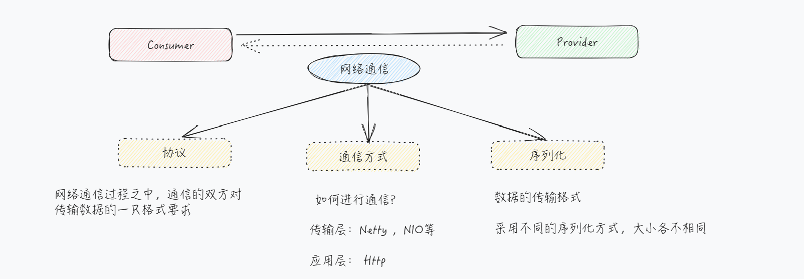
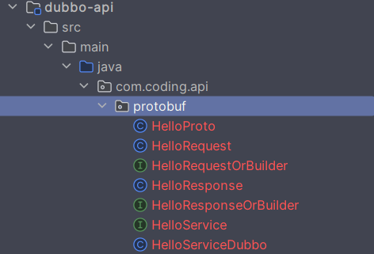
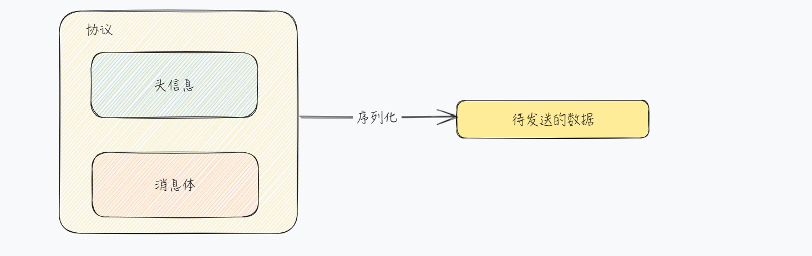

# 网络通信

## 一、简介

在上一小节之中，我们完成了第一个直连式 Dubbo 应用的开发。在这个过程之中，我们对于 Dubbo 如何进行网络通信的细节并不清楚。

**客户端通过 DubboReference 完成代理对象的注入，服务端通过 DubboService 完成服务的发布。**

里面的细节，完全被封装了。回看 RPC 通信，在一次通信过程之中，我们主要考虑如下几个方面的内容：



Dubbo 在通信过程之中，同样也离不开这些核心内容。在服务端启动过程的日志，我们也能够看出，Dubbo 使用 Netty 来作为底层的通信框架。

所以，接下来的重点就放在了 Dubbo 的 **协议** 和 **序列化 **上面

## 二、序列化

序列化，主要是指数据的传输格式，采用不同的序列化方式，大小也各不相同。那么在 Dubbo 之中，支持那些序列化方式呢？

https://cn.dubbo.apache.org/zh-cn/overview/mannual/java-sdk/reference-manual/serialization/serialization/

从官网的介绍之中，Dubbo 支持多种序列化，如 Hessian2、FastJson2、kryo、protobuf 等。接下来，我们看一下常见的序列化方式。

### 2.1 kryo

::: code-group

```xml [依赖]
<dependency>
    <groupId>org.apache.dubbo.extensions</groupId>
    <artifactId>dubbo-serialization-kryo</artifactId>
    <version>1.0.1</version>
</dependency>

<dependency>
    <groupId>com.esotericsoftware</groupId>
    <artifactId>kryo</artifactId>
    <version>5.4.0</version>
</dependency>
<dependency>
    <groupId>de.javakaffee</groupId>
    <artifactId>kryo-serializers</artifactId>
    <version>0.45</version>
</dependency>
```

```yml [配置]
dubbo:
  application:
    name: ${spring.application.name}
  protocol:
    name: dubbo
    serialization: kryo
```

:::

这个时候，我们再一次看一下控制台输出的信息

```markdown
[DUBBO] Export dubbo service com.coding.helloworld.api.UserService to url dubbo://192.168.1.5:20880/com.coding.helloworld.api.UserService?anyhost=true&application=dubbo-serialization-kryo-provider&background=false&bind.ip=192.168.1.5&bind.port=20880&deprecated=false&dubbo=2.0.2&dynamic=true&executor-management-mode=isolation&file-cache=true&generic=false&interface=com.coding.helloworld.api.UserService&ipv6=2408:8207:4841:3d50:8965:b8b2:a459:1763&methods=getUserInfo&pid=21200&prefer.serialization=kryo&qos.enable=true&release=3.2.0&serialization=kryo&side=provider&timestamp=1735466360452
```

对比一下，上一小节开发时，控制台输出的消息内容

::: code-group

```markdown[未指定序列化方式]
# 未指定序列化方式
prefer.serialization=fastjson2,hessian2
```

```markdown[指定序列化方式]
# 制定了序列化方式
prefer.serialization=kryo
serialization=kryo
```

:::

在 Consumer 模块，此时，我并没有引入依赖，通过上节课的方式进行了调用，此时调用没有发生问题，通过 Debug  `Serialization`  类

发现，最终序列化使用的是 	`Hessian2Serialization` ，并没有使用 Kryo 的序列化方式？这块具体是如何进行适配的呢？这里留作一个疑问点

为了使用 Kryo 的序列化方式，客户端需要做如下配置：

::: code-group

```xml [依赖]
<dependency>
    <groupId>org.apache.dubbo.extensions</groupId>
    <artifactId>dubbo-serialization-kryo</artifactId>
    <version>1.0.1</version>
</dependency>

<dependency>
    <groupId>com.esotericsoftware</groupId>
    <artifactId>kryo</artifactId>
    <version>5.4.0</version>
</dependency>
<dependency>
    <groupId>de.javakaffee</groupId>
    <artifactId>kryo-serializers</artifactId>
    <version>0.45</version>
</dependency>
```

```java
@DubboReference(url = "dubbo://192.168.1.5:20880/com.coding.helloworld.api.UserService?serialization=kryo")
private UserService userService;
```

:::

此时，再次进行调用，使用的就是 kryo 的序列方式了

### 2.2 protobuf

在 Protobuf 开关过程之中，较为重要的就是 proto 文件的编写以及编译

接下来，首先，在父项目之中，定义 protobuf 相关的版本以及编译的插件

::: code-group

```xml [依赖]
<!-- 使用 protobuf -->
<dependency>
    <groupId>com.google.protobuf</groupId>
    <artifactId>protobuf-java</artifactId>
    <version>3.22.2</version>
</dependency>
<dependency>
    <groupId>com.google.protobuf</groupId>
    <artifactId>protobuf-java-util</artifactId>
    <version>3.22.2</version>
</dependency>
<dependency>
    <groupId>org.apache.dubbo</groupId>
    <artifactId>dubbo-serialization-protobuf</artifactId>
    <version>2.7.23</version>
    <exclusions>
        <exclusion>
            <artifactId>dubbo-common</artifactId>
            <groupId>org.apache.dubbo</groupId>
        </exclusion>
        <exclusion>
            <artifactId>dubbo-serialization-api</artifactId>
            <groupId>org.apache.dubbo</groupId>
        </exclusion>
        <exclusion>
            <artifactId>protobuf-java</artifactId>
            <groupId>com.google.protobuf</groupId>
        </exclusion>
        <exclusion>
            <artifactId>protobuf-java-util</artifactId>
            <groupId>com.google.protobuf</groupId>
        </exclusion>
    </exclusions>
</dependency>
```

```xml [增加编译插件]
<build>
    <extensions>
        <extension>
            <groupId>kr.motd.maven</groupId>
            <artifactId>os-maven-plugin</artifactId>
            <version>1.7.1</version>
        </extension>
    </extensions>
    <pluginManagement>
        <plugins>
            <!-- 定义 protobuf 编译插件-->
            <plugin>
                <groupId>org.xolstice.maven.plugins</groupId>
                <artifactId>protobuf-maven-plugin</artifactId>
                <version>0.6.1</version>
                <configuration>
                    <protocArtifact>
                        com.google.protobuf:protoc:3.22.2:exe:${os.detected.classifier}</protocArtifact>
                    <outputDirectory>${basedir}/src/main/java</outputDirectory>
                    <clearOutputDirectory>false</clearOutputDirectory>
                    <pluginId>Dubbo</pluginId>
                    <protocPlugins>
                        <protocPlugin>
                            <id>dubbo</id>
                            <groupId>org.apache.dubbo</groupId>
                            <artifactId>dubbo-compiler</artifactId>
                            <version>0.0.2</version>
                            <mainClass>org.apache.dubbo.gen.dubbo.Dubbo3Generator</mainClass>
                        </protocPlugin>
                    </protocPlugins>
                </configuration>

                <executions>
                    <execution>
                        <goals>
                            <goal>compile</goal>
                        </goals>
                    </execution>
                </executions>
            </plugin>
        </plugins>
    </pluginManagement>
</build>
```

:::

在 API 模块之中，引入如下的依赖：

```xml
<dependencies> 
    <dependency>
        <groupId>com.google.protobuf</groupId>
        <artifactId>protobuf-java</artifactId>
    </dependency>
    <dependency>
        <groupId>com.google.protobuf</groupId>
        <artifactId>protobuf-java-util</artifactId>
    </dependency>
    <dependency>
        <groupId>org.apache.dubbo</groupId>
        <artifactId>dubbo-serialization-protobuf</artifactId>
    </dependency>
</dependencies>
<build>
    <plugins>
        <plugin>
            <groupId>org.xolstice.maven.plugins</groupId>
            <artifactId>protobuf-maven-plugin</artifactId>
        </plugin>
    </plugins>
</build>
```

在 `src/main/proto`，建立文件夹，用来存放 proto 文件，这里提供一个示例代码：

```protobuf
syntax = "proto3";

option java_multiple_files = true;

option java_package = "com.coding.api.protobuf";

option java_outer_classname = "HelloProto";

message HelloRequest{
  string username = 1;
}

message HelloResponse{
  string result = 1;
}

service HelloService{
  rpc hello(HelloRequest) returns (HelloResponse){}
}
```

编写完成之中，进行编译


最终编译完成，生成的文件如下：



编写以及编译完成对应的 proto 文件之后，接下来就是 Provider 和 Consumer 模块的开发

由于在 API 模块已经引入了相关的依赖，所以此时在 Providre 和 Consumer 模块就不需要引入 protobuf 相关的依赖了

::: code-group

```yaml [服务端配置]
server:
  port: 9001
  servlet:
    context-path: /provider
spring:
  application:
    name: dubbo-serialization-protobuf-provider
dubbo:
  application:
    name: ${spring.application.name}
  protocol:
    name: dubbo
    serialization: protobuf
```

```java [Provider]
@DubboService
@Slf4j
public class UserServiceImpl implements HelloService {

    @Override
    public HelloResponse hello(HelloRequest request) {
        String username = request.getUsername();
        log.info("HelloService#hello,params:{}", username);
        HelloResponse.Builder builder = HelloResponse.newBuilder();
        builder.setResult("success");
        return builder.build();
    }

    @Override
    public CompletableFuture<HelloResponse> helloAsync(HelloRequest request) {
        return null;
    }
}
```

```java [客户端]
@DubboReference(url = "dubbo://192.168.1.5:20880/com.coding.api.protobuf.HelloService?serialization=protobuf")
private HelloService helloService;

@Test
void helloWorld() {
    HelloRequest.Builder builder = HelloRequest.newBuilder();
    builder.setUsername("coding");
    HelloResponse hello = helloService.hello(builder.build());
    log.info("解析处理的返回结果为：{}", hello.getResult());
}
```

:::

对于目前的 proto 编译之后的文件，文件个数太多了，可以通过如下方式进行简化，但是 Dubbo 当前版本并不支持这个配置，可以编译通过，但是获取不到返回结果

https://github.com/apache/dubbo/issues/15010

```java {3}
// 将这个参数设置为 false
option java_multiple_files = false;
```

## 三、协议

协议就是通信双方的约定。协议 和 序列化 对应的关系如下：



在我们发送的数据前面，增加了头信息，组成了协议，信息组装完成之中，进行序列化，这样就构成了需要进行发送的消息。所以，在 Dubbo 之中，不同的协议 和 序列化 方式，会影响待发送的数据的大小。 

在 Dubbo 之中，支持的协议种类是比较多的，比如，Dubbo 协议，rest 协议，triple 协议，grpc 协议等。对于不同的协议，采用不同的序列化方式，通信的效率其实并不相同。

在之前的开发之中，我们使用的都是 Dubbo 协议，默认的协议就是 Dubbo

### 3.1 Dubbo 协议

> 官网链接：https://cn.dubbo.apache.org/zh-cn/overview/mannual/java-sdk/reference-manual/protocol/dubbo/

Dubbo 协议，是 Dubbo 自己定义的私有协议，基于 TCP 层，默认的通信方式是 Netty4。采用了单一长连接 和 NIO 异步通信，适合于小数据量并发的服务调用，不适合传送大数据量的服务。

### 3.2 Rest 协议

Rest 协议就是我们平时说的 Restful，使用 Rest 协议，可以让 Dubbo 服务直接通过 url 进行访问。

#### 3.2.1 依赖

```xml
<!-- 定义 Rest 协议的依赖-->
<dependency>
    <groupId>org.apache.dubbo</groupId>
    <artifactId>dubbo-rpc-rest</artifactId>
</dependency>
```

#### 3.2.2 API 模块

在 API 模块引入 Rest 的依赖

> 可以只在 API 模块之中引入，Provider 和 Consumer 模块都间接引入了

```xml
<!-- 定义 Rest 协议的依赖-->
<dependency>
    <groupId>org.apache.dubbo</groupId>
    <artifactId>dubbo-rpc-rest</artifactId>
</dependency>
```

对应的接口定义如下：

```java
@Path("restUserService")
public interface RestUserService {
    /**
     * 基于 rest 获取用户信息
     */
    @POST
    @Path("getUserInfoRest")
    @Consumes("application/json")
    @Produces({ContentType.APPLICATION_JSON_UTF_8})
    UserInfoRespDTO getUserInfoRest(UserInfoReqDTO userInfoReqDTO);
}
```

#### 3.2.3 Provider 模块

在 Provider 之中提供对应的实现

```java
@DubboService
@Slf4j
public class RestUserServiceImpl implements RestUserService {
    /**
     * 基于 rest 获取用户信息
     *
     * @param userInfoReqDTO
     */
    @Override
    public UserInfoRespDTO getUserInfoRest(UserInfoReqDTO userInfoReqDTO) {
        log.info("基于 rest 协议，获取到的用户结果为：{}", userInfoReqDTO);
        UserInfoRespDTO userInfoRespDTO = new UserInfoRespDTO();
        userInfoRespDTO.setUsername("coding");
        return userInfoRespDTO;
    }
}
```

增加如下配置：

```yaml
dubbo:
  application:
    name: ${spring.application.name}
  protocol:
    name: rest
    port: 9002
    server: tomcat
    context-path: /provider
```

#### 3.2.4 Consumer 模块

在 Consumer 模块，我们可以通过如下方式进行调用：

```markdown
http://localhost:9002/restUserService/getUserInfoRest
```

通过代码，可以通过如下方式进行调用

```java
@DubboReference(url = "rest://192.168.1.7:9002/com.coding.api.rest.RestUserService")
private RestUserService restUserService;

@Test
public void testRestProtocol() {
    UserInfoReqDTO userInfoReqDTO = new UserInfoReqDTO();
    userInfoReqDTO.setUsername("coding");
    UserInfoRespDTO userInfoRest = restUserService.getUserInfoRest(userInfoReqDTO);
    Assert.notNull(userInfoRest, "用户信息不允许为空");
    log.info("获取到的用户信息为：{}", userInfoRest.getUsername());
}
```

### 3.3 Triple 协议

在 Triple 协议之中，支持 使用 Java 接口的方式来开发通信服务，同时支持 Protobuf 的方式来开发 。

这里基于 Dubbo 3.2.0 版本进行演示

#### 3.3.1 Java 接口

##### 01 简单 RPC

基于 Java 接口来开发，与以往的开发并没有什么差别，只需要将对应的配置修改为：tri 即可。

```yaml
dubbo:
  application:
    name: ${spring.application.name}
  protocol:
    name: tri
```

在直连式客户端的开发中，只需要将对应的协议调整为：tri 即可

```java
@DubboReference(url = "tri://192.168.1.7:50051/com.coding.api.UserService")
private UserService userService;

@Test
public void testFirstApplication() {
    UserInfoRespDTO userNameByUserID = userService.getUserNameByUserID(1);
    Assert.notNull(userNameByUserID, "获取用户信息失败");
    log.info("获取到的用户信息为：{}", userNameByUserID);
}
```

由于 GRPC 仅支持 protobuf 的模式，因此接口 + triple 协议的方式无法与谷歌官方原生的 GRPC 协议互相进行调用。

##### 02 流式 RPC

在 GRPC 之中，支持流式调用，基于 Java 接口信息支持流式调用的方式如下：

> 注意：参数之中为 返回 ， 返回为请求参数

```java
public interface TripleUserService {
    StreamObserver<Integer> getUserNameByUserID(StreamObserver<UserInfoRespDTO> responseObserver);
}
```

对应的服务端的代码如下：

```java
@DubboService
@Slf4j
public class TripleUserServiceImpl implements TripleUserService {
    /**
     * 通过用户名获取用的信息
     *
     * @param responseObserver@return 用户信息
     */
    @Override
    public StreamObserver<Integer> getUserNameByUserID(StreamObserver<UserInfoRespDTO> responseObserver) {
        return new StreamObserver<Integer>() {
            @Override
            public void onNext(Integer data) {
                log.info("接受到客户端的请求参数" + data);
                UserInfoRespDTO userInfoRespDTO = new UserInfoRespDTO();
                userInfoRespDTO.setUserId(data);
                userInfoRespDTO.setUsername("coding");
                responseObserver.onNext(userInfoRespDTO);
            }

            @Override
            public void onError(Throwable throwable) {
                log.error("客户端响应失败", throwable);
            }

            @Override
            public void onCompleted() {
                log.info("调用完成~");
                responseObserver.onCompleted();
            }
        };
    }
}
```

对应的客户端的代码如下：

```java
@DubboReference(url = "tri://192.168.1.7:50051/com.coding.api.trip.TripleUserService")
private TripleUserService tripleUserService;

@Test
public void testTripUserService() {
    StreamObserver<Integer> requestObserver = tripleUserService.getUserNameByUserID(new StreamObserver<UserInfoRespDTO>() {
        @Override
        public void onNext(UserInfoRespDTO data) {
            log.info("接受到服务端的返回结果为：{}", data);
        }

        @Override
        public void onError(Throwable throwable) {

        }

        @Override
        public void onCompleted() {
        }
    });
    for (int i = 0; i < 10; i++) {
        requestObserver.onNext(i);
    }
    requestObserver.onCompleted();
}
```

#### 3.3.2 Protobuf

在上文之中，我们已经讲解了基于 protobuf 进行序列化，本章节的开发步骤与其保持一致，只要将对应的协议修改为：tri 即可。

### 3.4 多协议的支持

Dubbo 在发布服务的时候，默认 RPC 服务只能够通过一种协议进行访问。通过多协议，可以针对于一个服务，提供多个协议的访问支持。

```yaml
dubbo:
  application:
    name: ${spring.application.name}
  protocols:
    dubbo:
      name: dubbo
      port: -1
    triple:
      name: tri
      port: -1
```

在服务提供者这里，在默认情况之下，针对于多个协议，会向外暴露多个地址，如果想规定某个方法使用哪种协议，可以通过下面这种通信方式：

```java
@DubboService(protocol = "tri")
@Slf4j
public class UserServiceImpl implements UserService {}
```

在目前验证之中，发现 rest 和 其余的协议不能够同时存在 ~


