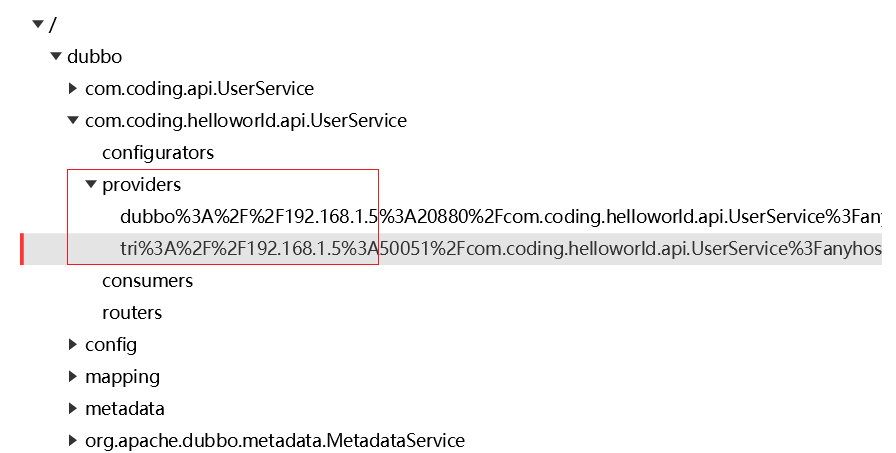
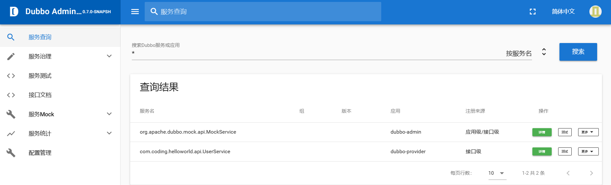
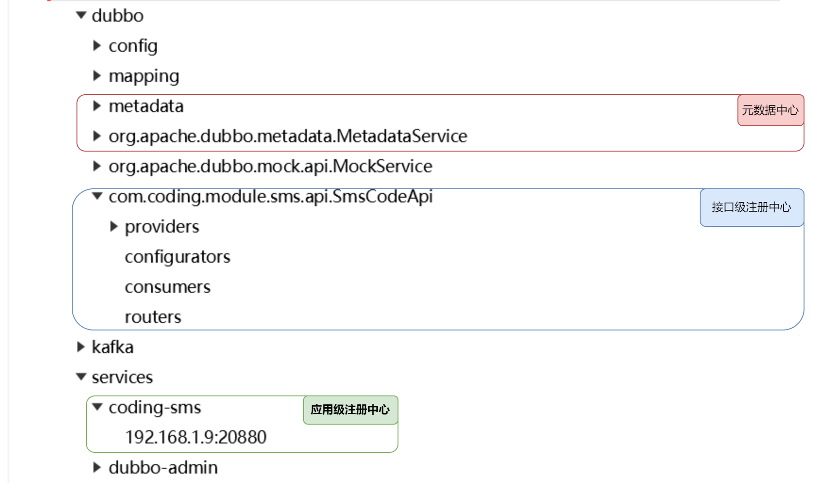
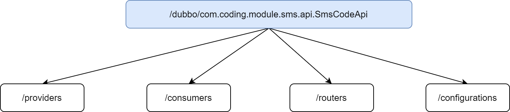
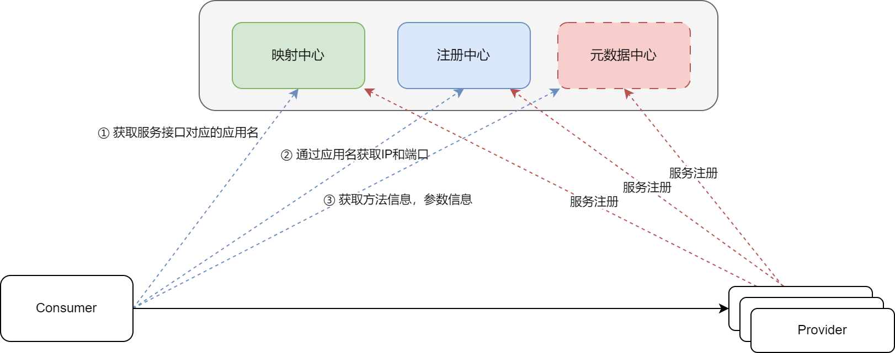
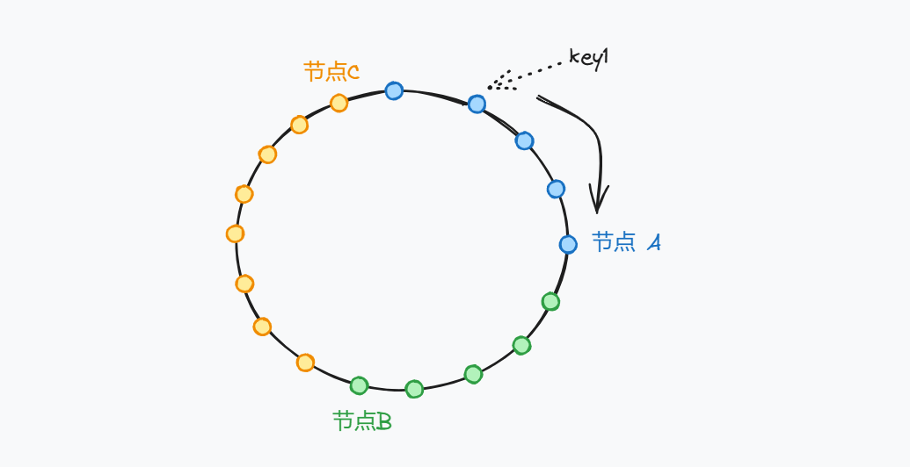
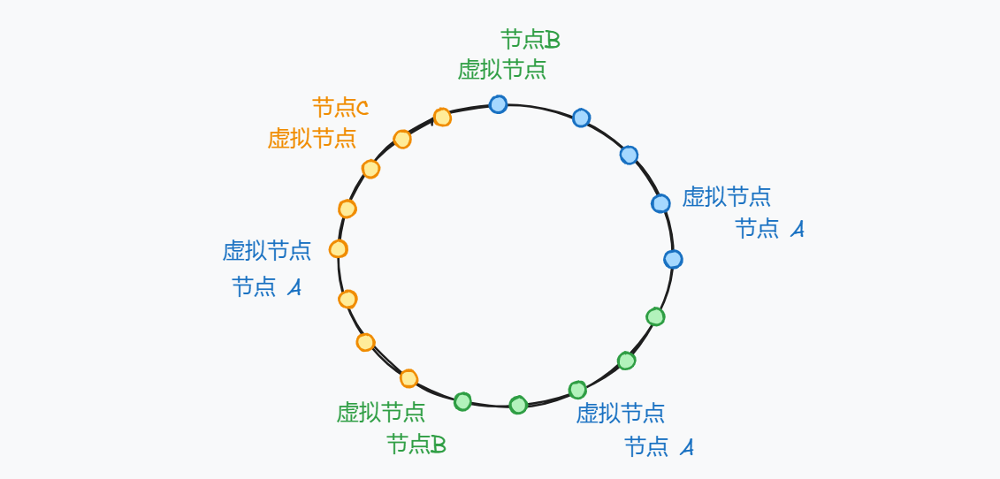

# 服务发现

在之前的开发过程之中，我们都是通过直连式来进行开发。但是，实际的开发过程之中，并不会通过这种方式，而是都会接入注册中心来做。

那么引入注册中心，能够带来那些好处呢？

1）可以有效的管理 RPC 集群的健康情况，动态的上线或者下线服务

2）将 Provider 和 Consumer 解耦合

3）现在的客户端只能够调用配置一个客户端的地址，接入了注册中心之后，多个 Provider 注册之后，客户端获取到信息之后，可以通过负载均衡选择一个 Provider 进行调用，并且如果调用失败，还可以选择其余的 Provider 进行调用，从一定程度上，提供了容错机制。

## 一、常见的注册中心

常见的注册中心有：Nacos，Zookeeper，Consul 等，这里以 Zookeeper 和 Nacos 为例，介绍 Dubbo 如何集成 注册中心。

### 1.1  Zookeeper

#### 1.1.1 Provider

服务端这里，我们将使用双协议，同时支持 Dubbo 协议 和 Triple 协议。

::: code-group

```xml [添加依赖]
<dependency>
  <groupId>org.apache.dubbo</groupId>
  <artifactId>dubbo-registry-zookeeper</artifactId>
</dependency>
```

```yaml [添加配置]
dubbo:
  application:
    name: ${spring.application.name}
  registry:
    address: zookeeper://1.92.153.10:9101
  protocols:
    dubbo:
      name: dubbo
      port: -1
    tri:
      name: tri
      port: -1
```

:::

在 开发完成之后，我们就来启动 Provider ，上一篇文章之中，提到了，在多个协议开发过程之中，对于每个 服务，都会向外暴露多个 URL，而引入了注册中心之后，就体现 ZK 上的多个节点



#### 1.1.2 Consumer

::: code-group

```xml [添加依赖]
<dependency>
  <groupId>org.apache.dubbo</groupId>
  <artifactId>dubbo-registry-zookeeper</artifactId>
</dependency>
```

```yaml [添加配置]
dubbo:
  application:
    name: ${spring.application.name}
    qos-enable: false
  registry:
    address: zookeeper://1.92.153.10:9101
```

:::

### 1.2 Nacos

首先，在 Nacos 之中，增加命名空间 **helloWorld**

#### 1.2.1 Provider

::: code-group

```xml 依赖]
<dependency>
    <groupId>org.apache.dubbo</groupId>
    <artifactId>dubbo-registry-nacos</artifactId>
</dependency>
```

```yaml [配置]
server:
  port: 9001
  servlet:
    context-path: /provider
spring:
  application:
    name: dubbo-provider
dubbo:
  application:
    name: ${spring.application.name}
  registry:
    address: nacos://1.92.153.10:8848
    username: nacos
    password: nacos
    parameters:
      namespace: helloWorld
```

:::

#### 1.2.2 Consumer

::: code-group

```xml [依赖]
<dependency>
    <groupId>org.apache.dubbo</groupId>
    <artifactId>dubbo-registry-nacos</artifactId>
</dependency>
```

```yaml [配置]
server:
  port: 9092
  servlet:
    context-path: /consumer
spring:
  application:
    name: consumer
dubbo:
  application:
    name: ${spring.application.name}
    qos-enable: false
  registry:
    address: nacos://1.92.153.10:8848
    username: nacos
    password: nacos
    parameters:
      namespace: coding
    group: coding
```

:::

通过这样的方式，客户端可以不用在注解里面编写对应的 url 属性了，通过这样的方式，也可以完成调用

```java
@DubboReference
private UserService userService;
```

## 二、 DubboAdmin

在 Dubbo 之中，不仅仅有服务的发现与调用，还具备服务治理的能力。

```markdown
https://github.com/apache/dubbo-admin
```

选择分支为：develop

下载完成，进行编译，对应的命令如下

```markdown
mvn clean package -DskipTests=true
```

在这里，我是将其放在了 Docker 之中运行，对应的配置文件如下：

::: code-group

```dockerfile [DockerFile]
FROM eclipse-temurin:8-jre
RUN mkdir /dubbo-admin
WORKDIR /dubbo-admin

COPY ./dubbo-admin.jar app.jar

EXPOSE 8002

ENTRYPOINT java -jar app.jar
```

```yaml [docker-compose]
services:
   dubbo-admin:
      build: .
      ports:
        - "8002:8002"
        - "30880:30880"
      environment:
        DUBBO_IP_TO_REGISTRY: 1.92.153.10
      volumes:
        - ./application.properties:/dubbo-admin/application.properties
        - ./logs:/dubbo-adminlogs
```

```yaml [dubbo-admin 配置文件]
server.port=8002
dubbo.protocol.port=30880
dubbo.application.qos-port=32222

admin.registry.address=zookeeper://1.92.153.10:9101
admin.config-center=zookeeper://1.92.153.10:9101
admin.metadata-report.address=zookeeper://1.92.153.10:9101
```

:::

启动完成之后，对应的 UI 界面如下



## 三、注册中心详解

在 Dubbo 之中，按照存储结构的不同，分为了接口级注册中心和应用级注册中心。在不同的 Dubbo 的版本之中，对其支持不一样。

| 版本 | 备注 |
| --- | --- |
| 2.6.x ~ 2.7.5 | 接口级注册中心 |
| 2.7.5 ~ 2.7.23 | 接口级注册中心，应用级注册中心 |
| 3.x | 接口级注册中心，应用级注册中心（内部组织接口相比于 2.7.5 及其后续有变动） |


我们可以通过配置文件来进行切换，对应的配置如下，默认配置为 all

```yaml
dubbo:
  application:
    # instance : 应用级别的注册中心
    # interface : 接口级别的注册中心
    # all : 支持两种
    register-mode: all
```

接下来，我们查看一下挂载到 zookeeper 之上的节点



接下来，我们就来分别看一下不同的存储结构，在注册中心上配置的内容有什么差异？

### 3.1 接口级注册中心
接下来，我们首先将修改配置文件：

```yaml
dubbo:
  application:
    register-mode: interface
```

接口级别注册，挂载的节点如下：



不同的节点具有不同的含义：

1. providers：所有的服务集群及其实例的相关信息，当我们注册一个服务之后，就会在当前节点下面建立一个子节点                          
2. consumers：所有这个服务的消费者
3. routers：路由信息
4. configurations：存储负载均衡策略、超时设置、重试设置等信息

那么接口注册中心存在那些问题呢？

在 1.1 小节，我们在提到了多个协议下，在 Zookeeper 之中注册的内容，从里面能够看到

::: code-group

```markdown [dubbo协议]
/dubbo/com.coding.helloworld.api.UserService/providers/dubbo://192.168.1.5:20880/com.coding.helloworld.api.UserService?anyhost=true&application=dubbo-provider&background=false&deprecated=false&dubbo=2.0.2&dynamic=true&executor-management-mode=isolation&file-cache=true&generic=false&interface=com.coding.helloworld.api.UserService&ipv6=2408:8207:4841:3d50:8965:b8b2:a459:1763&methods=getUserInfo&pid=27472&prefer.serialization=fastjson2,hessian2&release=3.2.0&service-name-mapping=true&side=provider&timestamp=1735483755428
```

```markdown [tri协议]
/dubbo/com.coding.helloworld.api.UserService/providers/tri://192.168.1.5:50051/com.coding.helloworld.api.UserService?anyhost=true&application=dubbo-provider&background=false&deprecated=false&dubbo=2.0.2&dynamic=true&executor-management-mode=isolation&file-cache=true&generic=false&interface=com.coding.helloworld.api.UserService&ipv6=2408:8207:4841:3d50:8965:b8b2:a459:1763&methods=getUserInfo&pid=27472&prefer.serialization=fastjson2,hessian2&release=3.2.0&service-name-mapping=true&side=provider&timestamp=1735483757495
```

:::

对比这两个地址信息，里面有很多信息都是重复的。如果说集群之中存在的大量的这种重复数据，当数据量较多的时候，对于注册中心的压力就会较大。既然存在这大量的重复数据，那么就要考虑提取公共部分，我们首先来看一下，这个 url 之后有那些公共部分

### 3.2 应用级注册中心

应用级注册中心，对应的配置如下：

```yaml
dubbo:
  application:
    register-mode: instance
```

应用级注册中心的流程如下



在第一次调用的时候，Consumer 会把映射中心，注册中心，元数据中心的内容都注册到本地，这就是为什么 RPC 调用第一次都会很慢的

在上图之中，对于元数据中心，维护了 RPC 调用过程之中所需要的方法信息，参数信息，配置信息。但是这部分数据并没有一定要放在 Nacos 或者 ZK 这些中间件之中，它有两种方式：

+ local 模式：不创建元数据中心，consumer 直接从 provider 中获取元数据信息
+ remote 模式：独立构建元数据中心，consumer 从元数据中心拉去元数据信息，进行 RPC 访问，默认是不开启的。

默认情况之中使用的 local 模式，如果想使用 remote 模式，我们可以通过如下的方式：

::: code-group

```xml [步骤一：添加依赖]
<dependency>
  <groupId>org.apache.dubbo</groupId>
  <artifactId>dubbo-metadata-report-zookeeper</artifactId>
</dependency>
```

```yaml [步骤二：增加配置]
dubbo:
  application:
    register-mode: instance
    metadata-type: remote
  metadata-report:
    address: zookeeper://1.92.153.10:9101
```

:::

通过这样的方式，我们就可以使用 remote 模式了。那么，元数据中心都存储了那些内容呢？

```json
{
  "app": "coding-sms",
  "revision": "efa52b909657151f71d7a9aa037b6742",
  "services": {
    "com.coding.module.sms.api.MessageSendApi:dubbo": {
      "name": "com.coding.module.sms.api.MessageSendApi",
      "params": {
        "executor-management-mode": "isolation",
        "side": "provider",
        "file-cache": "true",
        "release": "3.2.0",
        "methods": "sendMessage",
        "deprecated": "false",
        "dubbo": "2.0.2",
        "interface": "com.coding.module.sms.api.MessageSendApi",
        "service-name-mapping": "true",
        "register-mode": "instance",
        "generic": "false",
        "metadata-type": "remote",
        "application": "coding-sms",
        "prefer.serialization": "fastjson2,hessian2",
        "background": "false",
        "dynamic": "true",
        "anyhost": "true"
      },
      "path": "com.coding.module.sms.api.MessageSendApi",
      "port": 20880,
      "protocol": "dubbo"
    }
  }
}
```

从内容上，能够发现，主要包含使用的协议，运行时信息等。

:::info

为什么要同时支持接口级注册中心和应用级的注册中心？

主要是考虑到遗留系统的迁移

:::

### 3.3 命名空间和分组
namespace 和 group 这两个概念都是

```yaml
dubbo:
  registry:
    group: coding-message-group
    parameters:
      namespace: coding-cloud
```

### 3.4 多注册中心

```yaml
dubbo:
  registries:
    nacos:
      address: nacos://1.92.153.10:8848
      username: nacos
      password: nacos
      parameters:
        namespace: coding
    zookeeper:
      address: zookeeper://1.92.153.10:9101
```

## 四、负载均衡

负载均衡，可以在集群环境之中，把请求均匀的分散到集群的每个节点。从而优化资源的使用。

比如，最常见的为 Nginx，不过 Ngxin 属于服务器端的负载均衡，而 Dubbo 负载均衡属于客户端的负载均衡。

具体可以查看下面这个类：

```java
org.apache.dubbo.common.constants.LoadbalanceRules
```

具体可以通过如下这种方式进行配置的

```java
@DubboReference(url = "tri://192.168.1.7:50051/com.coding.api.UserService", loadbalance = LoadbalanceRules.RANDOM)
private UserService userService;
```

Dubbo 3 中支持的负载均衡算法如下：

- 随机负载均衡：random
  - Dubbo 之中的默认算法，所有服务提供者默认的权重都是一样的。
  - 可以在服务端通过 `@DubboService(weight = 1)` 进行配置
- 轮询负载均衡：roundrobin
  - 从注册中心获取到所有服务提供者的连接之中，顺序调用
- 最少活跃负载均衡：leastactive
- 最小响应负载均衡：shortestresponse
- 一致性Hash负载均衡：consistenthash

### 4.1 一致性 Hash 算法

这里只对 一致性Hash 算法 进行说明

> 这个算法在 Redis 集群之中也有使用

假设环境如下：一个接口一个 3 个 服务提供者，分别用 0,1,2 表示。

在发起访问的时候，我们可以**通过参数值进行 Hash**，得到值之后，然后对服务提供者的数量进行取模，取模完成之中，就能够映射到某个服务器。对应的方式如下
$$
hash(params) \% num
$$
但是，如果说 num 发生变化，就会导致这个映射关系失效，如果在缓存系统之中，就会导致缓存失效。

在 一致性Hash 算法之中，通过构建圆环来解决这个问题。现在我们有一个圆环，圆环上有好多个节点，我们分别对3 台服务器进行计算，将其映射到这个圆环上面，当客户端需要调用的时候，通过Hash计算，映射到这个圆环上面，然后顺时针开始找，找到的第一个节点，就去调用那一台服务。



如果说**节点A** 在某个时刻宕机了，原 节点A 的能力就会交给**节点B**完成。此时节点B的压力就会上升。

并且如果说圆环上的位置比较多，每一次都交给 节点 A 完成，就会造成 **数据倾斜**。

为了解决这个问题，引入了**虚拟节点**的概念。先在 Hash 环上映射虚拟节点，在将虚拟节点分配给具体的节点。



如果某个时刻节点A 发生了宕机，只需将虚拟节点分配给其余的节点即可，避免了某个节点压力突然增大的问题。


