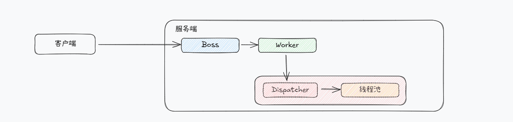

# 多线程模型

为了提供 Dubbo 单个实例处理能力，设计了多线程的处理方式。Dubbo 底层使用 Netty 进行通信。在 Netty 之中，有两类线程组：

- Boss 线程：主要进行网络连接处理之中的 accept 
- Worker 线程：主要进行进行 read 和 write

通过 Handler 来进行集成。

Dispatcher 详解

| 类型   | 作用                       | 使用场景 |
| ------ | -------------------------- | -------- |
| all    | 所有消息都派发到线程池之中 | 默认值   |
| direct |                            |          |
|        |                            |          |

