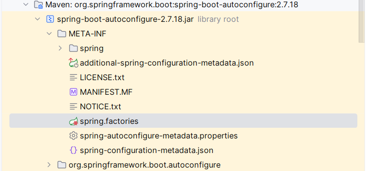
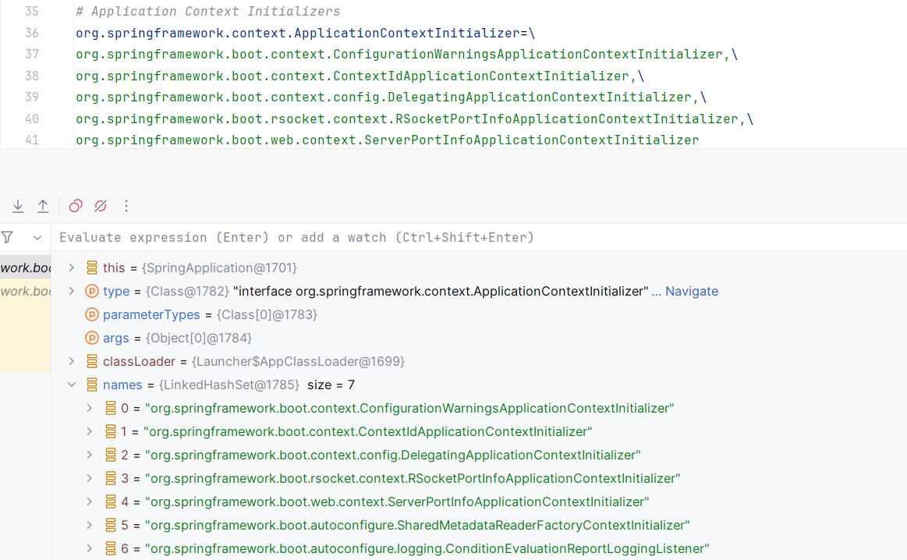
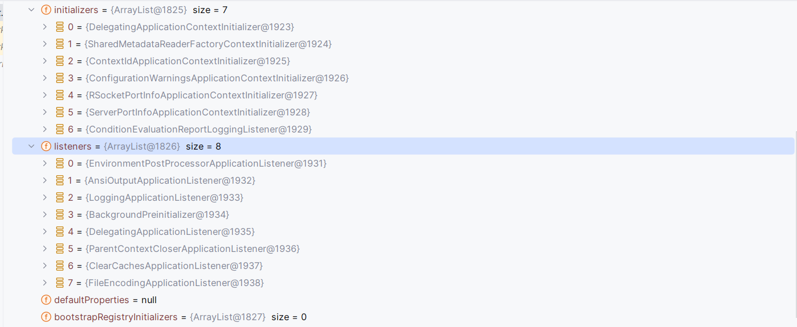
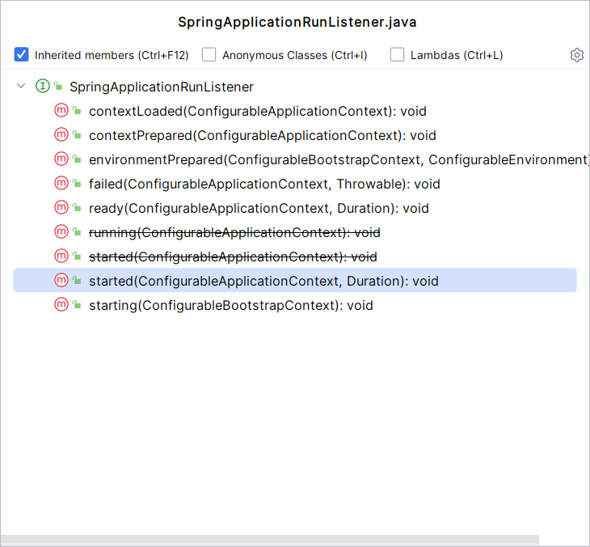
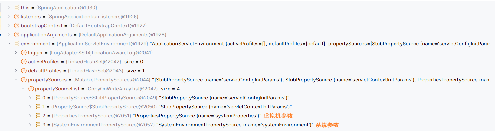
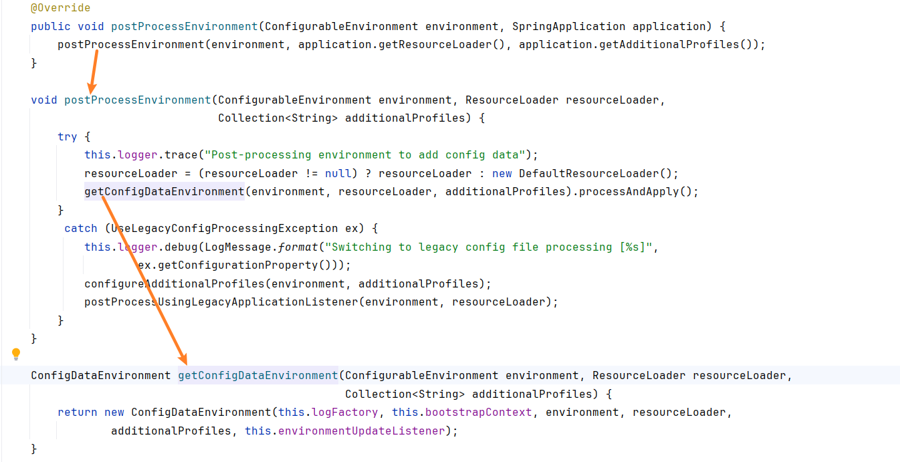
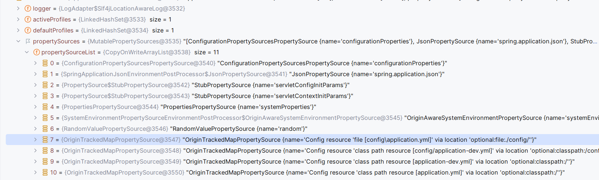
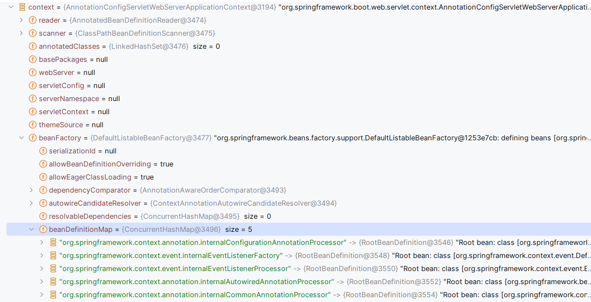

# 启动流程

在 SpringBoot 启动类，通常都是下面这种方式

```java
@SpringBootApplication
public class CodingBootApplication {
    public static void main(String[] args) {
        SpringApplication.run(CodingBootApplication.class,args);
    }
}
```

对于这个 run 方法，对应的底层代码如下：

```java
public static ConfigurableApplicationContext run(Class<?>[] primarySources, String[] args) {
    return new SpringApplication(primarySources).run(args);
}
```

从这里，我们就能够看出，这里实际上分为了两个部分

1. 创建 SpringApplication 对象
2. 调用 run 方法

接下来，我们也按照这个步骤来逐步进行分析

## 一、构建 SpringApplication 对象
当我们通过源码最终确定了构造函数，不过对于第一个参数，目前是 null，对于第二个参数则是我们传入的 Class 对象，并且他是一个可变参数。

```java
public SpringApplication(ResourceLoader resourceLoader, Class<?>... primarySources) {
    
    this.resourceLoader = resourceLoader;
    
    Assert.notNull(primarySources, "PrimarySources must not be null");
    // 表示传入的配置类，这个时候发现这里的配置类其实能够传递多个
    this.primarySources = new LinkedHashSet<>(Arrays.asList(primarySources));
    
    // 判断应用的类型
    // 在这个过程之中，他会通过项目之中是否存在不同的类，来确定需要构造的容器的类型
    this.webApplicationType = WebApplicationType.deduceFromClasspath();
    
    // TODO 实例化对象
    this.bootstrapRegistryInitializers = new ArrayList<>(
            getSpringFactoriesInstances(BootstrapRegistryInitializer.class));
    setInitializers((Collection) getSpringFactoriesInstances(ApplicationContextInitializer.class));
    setListeners((Collection) getSpringFactoriesInstances(ApplicationListener.class));

    // TODO 2 确定一下运行 main 方法的类那个
    this.mainApplicationClass = deduceMainApplicationClass();
}
```

对于实例化对象这块，他们都是调用的是同一个方法：`getSpringFactoriesInstances`

### 1.1 主配置类
比如说，现在有下面这个配置类

```java
@Configuration
@ComponentScan(basePackages = "com.coding.demo")
public class AppDemoConfig {
}
```

修改原来的启动类如下

```java
@SpringBootApplication
public class CodingBootApplication {
    public static void main(String[] args) {
        SpringApplication.run(new Class[]{CodingBootApplication.class, AppDemoConfig.class},args);
    }
}
```

通过这样的方式，我们也可以将 demo 包下面的类，注入到 Spring 容器之中。

### 1.2 判断应用的类型
通过下面的代码，能够看出来就是通过判断项目之中是否存在指定的类，来判断一下

```java
private static final String[] SERVLET_INDICATOR_CLASSES = { 
        "javax.servlet.Servlet",
        "org.springframework.web.context.ConfigurableWebApplicationContext" 
};

private static final String WEBMVC_INDICATOR_CLASS = "org.springframework.web.servlet.DispatcherServlet";

private static final String WEBFLUX_INDICATOR_CLASS = "org.springframework.web.reactive.DispatcherHandler";

private static final String JERSEY_INDICATOR_CLASS = "org.glassfish.jersey.servlet.ServletContainer";

// 具体的代码
static WebApplicationType deduceFromClasspath() {
    if (ClassUtils.isPresent(WEBFLUX_INDICATOR_CLASS, null) && !ClassUtils.isPresent(WEBMVC_INDICATOR_CLASS, null)
            && !ClassUtils.isPresent(JERSEY_INDICATOR_CLASS, null)) {
        return WebApplicationType.REACTIVE;
    }
    for (String className : SERVLET_INDICATOR_CLASSES) {
        if (!ClassUtils.isPresent(className, null)) {
            return WebApplicationType.NONE;
        }
    }
    return WebApplicationType.SERVLET;
}
```

### 1.3 实例化对象
```java
// private List<BootstrapRegistryInitializer> bootstrapRegistryInitializers;
this.bootstrapRegistryInitializers = new ArrayList<>(
    getSpringFactoriesInstances(BootstrapRegistryInitializer.class));

// private List<ApplicationContextInitializer<?>> initializers;
setInitializers((Collection) getSpringFactoriesInstances(ApplicationContextInitializer.class));

// private List<ApplicationListener<?>> listeners;
setListeners((Collection) getSpringFactoriesInstances(ApplicationListener.class));
```

这三行代码都是调用一个方法，向集合之中添加对象

#### 1.3.1 getSpringFactoriesInstances
```java
private <T> Collection<T> getSpringFactoriesInstances(Class<T> type) {
    return getSpringFactoriesInstances(type, new Class<?>[] {});
}
// ############## 重载调用 #################
private <T> Collection<T> getSpringFactoriesInstances(Class<T> type, Class<?>[] parameterTypes, Object... args) {
    ClassLoader classLoader = getClassLoader();
    // Use names and ensure unique to protect against duplicates
    Set<String> names = new LinkedHashSet<>(SpringFactoriesLoader.loadFactoryNames(type, classLoader));
    List<T> instances = createSpringFactoriesInstances(type, parameterTypes, classLoader, args, names);
    AnnotationAwareOrderComparator.sort(instances);
    return instances;
}
```

对于这个里面的核心方法如下：

```java
SpringFactoriesLoader.loadFactoryNames(type, classLoader)

List<T> instances = createSpringFactoriesInstances(type, parameterTypes, classLoader, args, names);
```

##### 1.3.1.1 loadFactoryNames
我们首先来看第一部分：

```java
SpringFactoriesLoader.loadFactoryNames(type, classLoader)

public static List<String> loadFactoryNames(Class<?> factoryType, @Nullable ClassLoader classLoader) {
    ClassLoader classLoaderToUse = classLoader;
    if (classLoaderToUse == null) {
        classLoaderToUse = SpringFactoriesLoader.class.getClassLoader();
    }
    String factoryTypeName = factoryType.getName();
    return loadSpringFactories(classLoaderToUse).getOrDefault(factoryTypeName, Collections.emptyList());
}
```

对于这个`loadSpringFactories`，实际上是去读取这个文件: `<font style="color:#080808;background-color:#ffffff;">META-INF/spring.factories</font>`



读取出来的内容如下：



也就是说我们第一部分的主要作用就是：通过我们传入的类的全路径，然后在 `spring.factories` 之中，找到对应的类信息

##### 1.3.1.2 createSpringFactoriesInstances
第二部分的主要作用就是：通过查找到的类信息，构建出对应的对象。

```java
private <T> List<T> createSpringFactoriesInstances(Class<T> type, Class<?>[] parameterTypes,
        ClassLoader classLoader, Object[] args, Set<String> names) {
    List<T> instances = new ArrayList<>(names.size());
    for (String name : names) {
        try {
            Class<?> instanceClass = ClassUtils.forName(name, classLoader);
            Assert.isAssignable(type, instanceClass);
            Constructor<?> constructor = instanceClass.getDeclaredConstructor(parameterTypes);
            T instance = (T) BeanUtils.instantiateClass(constructor, args);
            instances.add(instance);
        }
        catch (Throwable ex) {
            throw new IllegalArgumentException("Cannot instantiate " + type + " : " + name, ex);
        }
    }
    return instances;
}
```

在上文之中，判断项目之中是否有那个具体的类，就是通过 ClassUtils 这个类来完成的，在想反射构建这个对象也是这个工具类。

我们可以通过如下方式来获取方法的调用栈

```java
private Class<?> deduceMainApplicationClass() {
    try {
        StackTraceElement[] stackTrace = new RuntimeException().getStackTrace();
        for (StackTraceElement stackTraceElement : stackTrace) {
            if ("main".equals(stackTraceElement.getMethodName())) {
                return Class.forName(stackTraceElement.getClassName());
            }
        }
    }
    catch (ClassNotFoundException ex) {
        // Swallow and continue
    }
    return null;
}
```

#### 1.3.2 实例化结果

在这几个步骤完成之中，已经构建完成了对应的对象



### 1.4 确定执行的 Main 方法
他这里其实是通过调用栈来获取到 Main 方法的

```java
private Class<?> deduceMainApplicationClass() {
    try {
        StackTraceElement[] stackTrace = new RuntimeException().getStackTrace();
        for (StackTraceElement stackTraceElement : stackTrace) {
            if ("main".equals(stackTraceElement.getMethodName())) {
                return Class.forName(stackTraceElement.getClassName());
            }
        }
    }
    catch (ClassNotFoundException ex) {
        // Swallow and continue
    }
    return null;
}
```

## 二、run 方法
对应的源码如下：

```java
public ConfigurableApplicationContext run(String... args) {
    long startTime = System.nanoTime();
    // 对于这个方法，实际上就是，构建 DefaultBootstrapContext，遍历上一步的 bootstrapRegistryInitializers
    DefaultBootstrapContext bootstrapContext = createBootstrapContext();
    ConfigurableApplicationContext context = null;
    
    // 设置了一个系统变量
    configureHeadlessProperty();
    
    // TODO 1
    SpringApplicationRunListeners listeners = getRunListeners(args);
    // 调用上一行的listener，发布 ApplicationStartingEvent 事件
    listeners.starting(bootstrapContext, this.mainApplicationClass);
    
    try {
        // 这个过程，实际上是封装命令行参数的
        ApplicationArguments applicationArguments = new DefaultApplicationArguments(args);
        // 准备 Environment
        ConfigurableEnvironment environment = prepareEnvironment(listeners, bootstrapContext, applicationArguments);
        configureIgnoreBeanInfo(environment);
        
        // 打印背景信息
        Banner printedBanner = printBanner(environment);

        // 创建容器,这里其实是创建了一个空容器，里面不包含对象
        context = createApplicationContext();
        context.setApplicationStartup(this.applicationStartup);

        // 为上一步所做的容器做一些初始化操作
        prepareContext(bootstrapContext, context, environment, listeners, applicationArguments, printedBanner);

        // 刷新容器
        refreshContext(context);
        
        // 容器刷新之后的后置方法，这里只是一个空方法，没有实现
        afterRefresh(context, applicationArguments);
        
        Duration timeTakenToStartup = Duration.ofNanos(System.nanoTime() - startTime);
        if (this.logStartupInfo) {
            new StartupInfoLogger(this.mainApplicationClass).logStarted(getApplicationLog(), timeTakenToStartup);
        }
        
        // 发布 ApplicationStartedEvent 事件，标志 Spring容器已经刷新完成
        listeners.started(context, timeTakenToStartup);
        
        // 调用 ApplicationRunner 和 CommondLineRunner 对象的 run 方法
        callRunners(context, applicationArguments);
    }
    catch (Throwable ex) {
        handleRunFailure(context, ex, listeners);
        throw new IllegalStateException(ex);
    }
    try {
        Duration timeTakenToReady = Duration.ofNanos(System.nanoTime() - startTime);
        // 发布 ApplicationReadyEvent 事件，标志 SpringApplication 已经启动完成了，可以正常接受请求了
        listeners.ready(context, timeTakenToReady);
    }
    catch (Throwable ex) {
        handleRunFailure(context, ex, null);
        throw new IllegalStateException(ex);
    }
    return context;
}
```

从整个流程看下来，SpringBoot  的启动流程也并不复杂，其中的关键还是在与 refreshContext 方法。不过在不同的阶段发布了对应的事件。接下来，我们就来总结一下整个流程图

### 2.1 获取事件的发布者
```java
private SpringApplicationRunListeners getRunListeners(String[] args) {
    Class<?>[] types = new Class<?>[] { SpringApplication.class, String[].class };
    return new SpringApplicationRunListeners(logger,
            getSpringFactoriesInstances(SpringApplicationRunListener.class, types, this, args),
            this.applicationStartup);
}
```

在这个过程之中，他还会调用`getSpringFactoriesInstances`，去 spring.factories 之中，找到对应的`SpringApplicationRunListener`对应的实现类。

通过这种方式，我们只能够获取到一个：`EventPublishingRunListener` ，因为他在 `spring.factories`之中，只配置了这一个。

:::info
注意，这个配置文件在：spring-boot 包下面

:::

```markdown
# Run Listeners
org.springframework.boot.SpringApplicationRunListener=\
org.springframework.boot.context.event.EventPublishingRunListener
```

我们来看一下返回对象的构造函数

```java
private final List<SpringApplicationRunListener> listeners;

SpringApplicationRunListeners(Log log, Collection<? extends SpringApplicationRunListener> listeners,
        ApplicationStartup applicationStartup) {
    this.log = log;
    this.listeners = new ArrayList<>(listeners);
    this.applicationStartup = applicationStartup;
}
```

对应的方法如下，就像是在 Spring 的生命周期之中，在做各种操作。



:::info
我们先来捋一下这个对象之间的关系，我们最终要返回的是 SpringApplicationRunListeners 这个对象，在这个对象之中定义了一个集合 listeners ，在这个集合之中存放的是 SpringApplicationRunListener 对象，这个对象的获取方式是从 spring.factories 配置文件之中获取的，现在这个集合之中只有一个对象，那就是 EventPublishingRunListener 这个对象。

:::

我们来看一下 `EventPublishingRunListener`  这个对象的构造函数

```java
private final SimpleApplicationEventMulticaster initialMulticaster;

public EventPublishingRunListener(SpringApplication application, String[] args) {
    this.application = application;
    this.args = args;
    this.initialMulticaster = new SimpleApplicationEventMulticaster();
    for (ApplicationListener<?> listener : application.getListeners()) {
        this.initialMulticaster.addApplicationListener(listener);
    }
}
```

请注意，在构造这个对象的时候，会把 1.3 中获取到的 listeners 集合 放置在了 `initialMulticaster` 这个对象里面。

### 2.2 发布 ApplicationStartingEvent 事件
这一步骤的 starting ，实际上是调用 SpringApplicationRunListeners 的方法

```java
void starting(ConfigurableBootstrapContext bootstrapContext, Class<?> mainApplicationClass) {
    doWithListeners("spring.boot.application.starting", (listener) -> listener.starting(bootstrapContext),
            (step) -> {
                if (mainApplicationClass != null) {
                    step.tag("mainApplicationClass", mainApplicationClass.getName());
                }
            });
}
```

```java
private void doWithListeners(String stepName, Consumer<SpringApplicationRunListener> listenerAction,
			Consumer<StartupStep> stepAction) {
		StartupStep step = this.applicationStartup.start(stepName);
		this.listeners.forEach(listenerAction);
		if (stepAction != null) {
			stepAction.accept(step);
		}
		step.end();
	}
```

从这段代码之中，我们能够看出来，实际上就是循环调用 listeners 对象的 starting 方法，在 2.1 章节，我们也提到了，这个集合中只有一个对象，那就是 `EventPublishingRunListener`

```java
// 事件广播器
private final SimpleApplicationEventMulticaster initialMulticaster;

public EventPublishingRunListener(SpringApplication application, String[] args) {
    this.application = application;
    this.args = args;
    // 事件广播器
    this.initialMulticaster = new SimpleApplicationEventMulticaster();
    for (ApplicationListener<?> listener : application.getListeners()) {
        this.initialMulticaster.addApplicationListener(listener);
    }
}

@Override
public void starting(ConfigurableBootstrapContext bootstrapContext) {
    this.initialMulticaster
        .multicastEvent(new ApplicationStartingEvent(bootstrapContext, this.application, this.args));
}
```

这里的 multicastEvent 方法，就是通过事件类型筛选出具体能够处理的 `ApplicationListener`，调用其`onApplicationEvent `这个方法。

<font style="color:#080808;background-color:#ffffff;">实际开发，我们是通过如下方式来监听具体的事件</font>

```java
@Component
public class CodingApplicationStartingListener implements ApplicationListener<ApplicationStartingEvent> {
    @Override
    public void onApplicationEvent(ApplicationStartingEvent event) {
        System.out.println("CodingApplicationStartingListener");
    }
}
```

其实是不允许的。因为到目前为止，我们的对象还没有被创建放到 Spring 容器之中。所以我们需要通过如下方式，在 resource 目录下面定义一个 META-INF 的文件夹，下面定义一个 spring.factories 文件

```markdown
org.springframework.context.ApplicationListener=\
  com.coding.springboot.event.CodingApplicationStartingListener
```

通过这样就能够可以接受到对应的事件

### 2.3 prepareEnvironment
```java
private ConfigurableEnvironment prepareEnvironment(SpringApplicationRunListeners listeners,
        DefaultBootstrapContext bootstrapContext, ApplicationArguments applicationArguments) {
    // Create and configure the environment
    // 在这个对象里面会有 MutablePropertySources 这个对象
    // MutablePropertySources 对象里面又有一个 propertySourceList 集合，这个集合里面有一个List 每个元素都是 PropertySource
    ConfigurableEnvironment environment = getOrCreateEnvironment();
    
    // 封装命令行参数，并将封装后的对象添加在了首位
    configureEnvironment(environment, applicationArguments.getSourceArgs());
    
    // 把所有的 PropertiesSource 都封装在 ConfigurationPropertySourcesPropertySource 并添加 propertySourceList 的首位
    ConfigurationPropertySources.attach(environment);
    
    // 发布 ApplicationEnvironmentPreparedEvent 事件，表示环境已经准备好了
    listeners.environmentPrepared(bootstrapContext, environment);
    // 将 defaultProperties 移动到集合的最后面
    DefaultPropertiesPropertySource.moveToEnd(environment);
    
    Assert.state(!environment.containsProperty("spring.main.environment-prefix"),
            "Environment prefix cannot be set via properties.");
    bindToSpringApplication(environment);
    if (!this.isCustomEnvironment) {
        EnvironmentConverter environmentConverter = new EnvironmentConverter(getClassLoader());
        environment = environmentConverter.convertEnvironmentIfNecessary(environment, deduceEnvironmentClass());
    }
    ConfigurationPropertySources.attach(environment);
    return environment;
}
```

#### 2.3.1 通过类型创建 ConfigurableEnvironment 对象
```java
private ConfigurableEnvironment getOrCreateEnvironment() {
    if (this.environment != null) {
        return this.environment;
    }
    // 会通过的不同 web 类型创建不同的的对象
    ConfigurableEnvironment environment = this.applicationContextFactory.createEnvironment(this.webApplicationType);
    if (environment == null && this.applicationContextFactory != ApplicationContextFactory.DEFAULT) {
        environment = ApplicationContextFactory.DEFAULT.createEnvironment(this.webApplicationType);
    }
    return (environment != null) ? environment : new ApplicationEnvironment();
}
```

我们只需要看这个 createEnvironment 方法就可以了，虽然我们看到他执行的是一个无参数构造环境，最终会调用到 `AbstractEnvironment`<font style="color:#080808;background-color:#ffffff;"> 的方法</font>

```java
public AbstractEnvironment() {
    this(new MutablePropertySources());
}

protected AbstractEnvironment(MutablePropertySources propertySources) {
    this.propertySources = propertySources;
    this.propertyResolver = createPropertyResolver(propertySources);
    customizePropertySources(propertySources);
}
```

不过，`createPropertyResolver` 和 `customizePropertySources` 都是来自于子类的方法，前一个方法是用来添加解析器的，后一个方法则是用来封装一些配置信息的，最终是被封装在了 MutablePropertySources 这个对象的 propertySourceLis 这个集合里面，这个集合里面存放的元素都是`PropertySource`，通过查看源码，初始化的时候，就会向集合之中添加  4 个 对象，其中包含 VM 环境变量 和 系统的环境变量。我们可以通过 Debug 的方式来看一下



当我们加入如下参数的时候：`<font style="color:#080808;background-color:#ffffff;">-DcodingVm=123 -DcodingVmpro=456</font>`<font style="color:#080808;background-color:#ffffff;">这个时候就会加载到第 3 个对象里面。用 List 也能够说明取配置值也是有顺序的，也可以理解为是有优先级的。</font>

#### <font style="color:#080808;background-color:#ffffff;">2.3.2 发布 ApplicationEnvironmentPreparedEvent 事件</font>
这段代码的主要作用就是发布 ApplicationEnvironmentPreparedEvent 事件，满足条件的是：EnvironmentPostProcessorApplicationListener

```java
@Override
public void onApplicationEvent(ApplicationEvent event) {
    if (event instanceof ApplicationEnvironmentPreparedEvent) {
        onApplicationEnvironmentPreparedEvent((ApplicationEnvironmentPreparedEvent) event);
    }
    if (event instanceof ApplicationPreparedEvent) {
        onApplicationPreparedEvent();
    }
    if (event instanceof ApplicationFailedEvent) {
        onApplicationFailedEvent();
    }
}
```

<font style="color:#080808;background-color:#ffffff;">最后实际处理的方法如下：</font>

```java
private void onApplicationEnvironmentPreparedEvent(ApplicationEnvironmentPreparedEvent event) {
    ConfigurableEnvironment environment = event.getEnvironment();
    SpringApplication application = event.getSpringApplication();
    for (EnvironmentPostProcessor postProcessor : getEnvironmentPostProcessors(application.getResourceLoader(),
            event.getBootstrapContext())) {
        postProcessor.postProcessEnvironment(environment, application);
    }
}
```

我们首先来看一下 `getEnvironmentPostProcessors`<font style="color:#080808;background-color:#ffffff;"> 这个方法</font>

```java
List<EnvironmentPostProcessor> getEnvironmentPostProcessors(ResourceLoader resourceLoader,
        ConfigurableBootstrapContext bootstrapContext) {
    ClassLoader classLoader = (resourceLoader != null) ? resourceLoader.getClassLoader() : null;
    EnvironmentPostProcessorsFactory postProcessorsFactory = this.postProcessorsFactory.apply(classLoader);
    return postProcessorsFactory.getEnvironmentPostProcessors(this.deferredLogs, bootstrapContext);
}
```

请注意，对于 postProcessorsFactory 这个参数，实际上是在构造函数之中进行赋值的，最终是去取 spring.factories 之中，`EnvironmentPostProcessor`这个接口的所有实现，有兴趣可以自己去看一下

**1）RandomValuePropertySourceEnvironmentPostProcessor：即使我们配置文件没有配置下面这些内容，也可以注入**

```java
@Value("${random.int}")
private Integer randomInt;

@Value("${random.long}")
private Long randomLong;
```

**2）SpringApplicationJsonEnvironmentPostProcessor：可以在命令行参数或者虚拟机参数里面加入这个参数**

```java
spring.application.json="{ \"coding\":\"hello\"}"

@Value("${coding}")
private String coding;
```

**3）ConfigDataEnvironmentPostProcessor：负责解析配置文件**



最后的解析方法实际上是在 processAndApply 之中。这里我们说明一下，Spring Boot 的配置文件的解析顺序

:::tips
默认情况之下，会在下面这些目录之中去找 application 的文件，不过可以通过 spring.config.name 来进行配置，这个参数需要在命令行参数或者虚拟机参数之中去指定，读取配置文件的顺序和优先级如下，对于我们配置文件之中配置了 spring.profiles.active 参数的时候，会优先解析完成基础的 application 文件，然后在下面的目录里面再次寻找对于的文件进行解析

:::

```markdown
# 无默认值
spring.config.import

# 无默认值
spring.config.additional-location

# 有默认值，优先级如下
# optional:file:./config/*/
# optional:file:./config/;
# optional:file:./;

# optional:classpath:/config/
# optional:classpath:/;
```



### 2.4 createApplicationContext
```java
// ApplicationContextFactory DEFAULT = new DefaultApplicationContextFactory();
private ApplicationContextFactory applicationContextFactory = ApplicationContextFactory.DEFAULT;

protected ConfigurableApplicationContext createApplicationContext() {
    return this.applicationContextFactory.create(this.webApplicationType);
}
```

接下来，我们就来分析一下对应的 create 方法

```java
@Override
public ConfigurableApplicationContext create(WebApplicationType webApplicationType) {
    try {
        return getFromSpringFactories(webApplicationType, ApplicationContextFactory::create,
                AnnotationConfigApplicationContext::new);
    }
    catch (Exception ex) {
        throw new IllegalStateException("Unable create a default ApplicationContext instance, "
                + "you may need a custom ApplicationContextFactory", ex);
    }
}
```

对应的代码如下：

```java
private <T> T getFromSpringFactories(WebApplicationType webApplicationType,
                                     BiFunction<ApplicationContextFactory, WebApplicationType, T> action, Supplier<T> defaultResult) {
    for (ApplicationContextFactory candidate : SpringFactoriesLoader.loadFactories(ApplicationContextFactory.class,
                                                                                   getClass().getClassLoader())) {
        T result = action.apply(candidate, webApplicationType);
        if (result != null) {
            return result;
        }
    }
    return (defaultResult != null) ? defaultResult.get() : null;
}
```

在 SpringBoot 之中，有两个候选者工厂：

```protobuf
org.springframework.boot.ApplicationContextFactory=\
org.springframework.boot.web.reactive.context.AnnotationConfigReactiveWebServerApplicationContext.Factory,\
org.springframework.boot.web.servlet.context.AnnotationConfigServletWebServerApplicationContext.Factory
```

我们通过 debug 的方式来获取一下这个对象



能够看到这里面也只是涵盖了 Spring 内置的对象，并不包含我们自定义的对象

### 2.5 prepareContext
```java
private void prepareContext(
        DefaultBootstrapContext bootstrapContext, ConfigurableApplicationContext context,
        ConfigurableEnvironment environment, SpringApplicationRunListeners listeners,
        ApplicationArguments applicationArguments, Banner printedBanner) {
    // 设置环境信息
    context.setEnvironment(environment);
    postProcessApplicationContext(context);
    // 调用容器之中所有 ApplicationContextInitializer 的 initialize 方法
    applyInitializers(context);
    // 发布 ApplicationContextInitializedEvent 事件
    listeners.contextPrepared(context);
    bootstrapContext.close(context);
    
    if (this.logStartupInfo) {
        logStartupInfo(context.getParent() == null);
        logStartupProfileInfo(context);
    }
    // Add boot specific singleton beans
    // 向容器之中注册几个 bean 对象
    ConfigurableListableBeanFactory beanFactory = context.getBeanFactory();
    beanFactory.registerSingleton("springApplicationArguments", applicationArguments);
    if (printedBanner != null) {
        beanFactory.registerSingleton("springBootBanner", printedBanner);
    }
    if (beanFactory instanceof AbstractAutowireCapableBeanFactory) {
        ((AbstractAutowireCapableBeanFactory) beanFactory).setAllowCircularReferences(this.allowCircularReferences);
        if (beanFactory instanceof DefaultListableBeanFactory) {
            ((DefaultListableBeanFactory) beanFactory)
                .setAllowBeanDefinitionOverriding(this.allowBeanDefinitionOverriding);
        }
    }
    if (this.lazyInitialization) {
        context.addBeanFactoryPostProcessor(new LazyInitializationBeanFactoryPostProcessor());
    }
    context.addBeanFactoryPostProcessor(new PropertySourceOrderingBeanFactoryPostProcessor(context));
    // 将配置类加载到容器之中，此时已经解析成为了 BeanDefinition
    Set<Object> sources = getAllSources();
    Assert.notEmpty(sources, "Sources must not be empty");
    load(context, sources.toArray(new Object[0]));
    // 发布 ApplicationPreparedEvent 事件
    listeners.contextLoaded(context);
}
```

### 2.6 refreshContext
```java
private void refreshContext(ConfigurableApplicationContext context) {
    if (this.registerShutdownHook) {
        shutdownHook.registerApplicationContext(context);
    }
    refresh(context);
}
```

其中又是调用下面这个方法，调用容器的 refresh 方法，感觉就像是在 Spring 源码分析过程之中的 refresh 方法。

```java
protected void refresh(ConfigurableApplicationContext applicationContext) {
    applicationContext.refresh();
}
```

答案也确实如此，最终就是 Spring 源码分析过程之中，调用的 refresh 方法，这里就不做赘述了

### 2.7 callRunners
这个过程之中就是调用实现了 `ApplicationRunner` 和 `CommandLineRunner` 这两个类的 run 方法，那么这两种方式都有什么区别呢？

```java
@Component
public class CodingApplicationRunner implements ApplicationRunner {
    @Override
    public void run(ApplicationArguments args) throws Exception {
        System.out.println("CodingApplicationRunner start");
        // 获取以 -- 开头的参数
        Set<String> optionNames = args.getOptionNames();
        System.out.println(optionNames);
        for (String optionName : optionNames) {
            System.out.println(optionName + "=" + args.getOptionValues(optionName));
        }
        System.out.println("--------------------------------------------------");
        // 获取非 -- 开头的参数, 这种方式，无法通过 getOptionValues 获取值
        List<String> nonOptionArgs = args.getNonOptionArgs();
        
        System.out.println("--------------------------------------------------");
        // 获取所有的键值对
        String[] sourceArgs = args.getSourceArgs();
        for (String sourceArg : sourceArgs) {
            System.out.println(sourceArg);
        }
        System.out.println("CodingApplicationRunner end");
    }
}
```

```java
@Component
public class CodingCommandLineRunner implements CommandLineRunner {
    @Override
    public void run(String... args) throws Exception {
        System.out.println("CodingCommandLineRunner start");
        for (String arg : args) {
            System.out.println(arg);
        }
        System.out.println("CodingCommandLineRunner end");
    }
}
```

