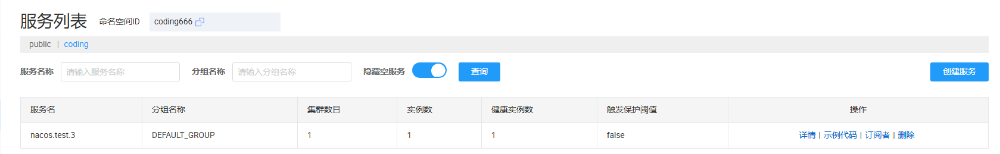
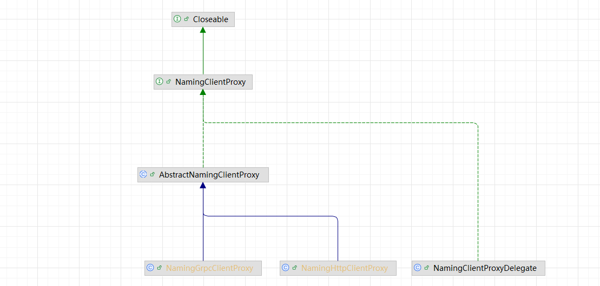

# 服务注册

## 一、客户端注册服务

在 Nacos 源码包中，有 example 包，这里面存放的是 Nacos 的示例代码。这里，这里我将 Nacos 的地址和命名空间更换到了我本地的 nacos 服务上。这个测试类主要完成两个操作：

1. 服务注册
2. 获取服务注册信息

```java
@Test
public void test_registry() throws NacosException, IOException, InterruptedException {
    Properties properties = new Properties();
    properties.setProperty("serverAddr", "localhost:8848");
    properties.setProperty("namespace", "coding666");
    NamingService naming = NamingFactory.createNamingService(properties);
    naming.registerInstance("nacos.test.3", "11.11.11.11", 8888, "TEST1");
    naming.registerInstance("nacos.test.3", "2.2.2.2", 9999, "DEFAULT");
    
    // 读取注册到的服务列表信息
    TimeUnit.SECONDS.sleep(2);
    List<Instance> allInstances = naming.getAllInstances("nacos.test.3");
    log.info("allInstance.length = {}", allInstances.size());
    for (Instance instance : allInstances) {
        log.info("instance: {}", instance);
    }
    System.in.read();
}
```

执行完成后，在 nacos 服务上就能够看到对应的注册信息，并且点击详情之后，能够看到对应注册 IP 地址和端口也是代码之中配置的



从当前案例，我们也能够看到，**NamingService** 是客户端注册和读取服务地址的核心类。接下来，我们就通过这个类来看一下客户端是如何发起注册的。

```java
/**
 * register a instance to service with specified cluster name.
*
* @param serviceName name of service
* @param ip          instance ip
* @param port        instance port
* @param clusterName instance cluster name, 这个参数实际上是对应于分组名称
* @throws NacosException nacos exception
*/
void registerInstance(String serviceName, String ip, int port, String clusterName) throws NacosException;
```

最终调用到了：`NacosNamingService#registerInstance`，方法定义如下： 

> 类型：NacosNamingService.java
>
> 这里的 Instance 实际上就是：ip，prot，clusterName, weight(默认值给的是 1.0)

```java
@Override
public void registerInstance(String serviceName, String groupName, Instance instance) throws NacosException {
    NamingUtils.checkInstanceIsLegal(instance);
    // 向服务端发起注册请求
    clientProxy.registerService(serviceName, groupName, instance);
}
```

这里的 clientProxy 对应的定义如下：

```java
private NamingClientProxy clientProxy;
```



这里从继承体系之中能够看到，支持 GRPC请求，Http 请求。那么最终是如何确定要执行哪一种请求呢？我们需要先查看 clientProxy 的构造方式

```java
 this.clientProxy = new NamingClientProxyDelegate(this.namespace, serviceInfoHolder, nacosClientProperties, changeNotifier);
```

在 NamingClientProxyDelegate 中，又封装了 GRPC 和 http 的调用类

```java
private final NamingHttpClientProxy httpClientProxy;

private final NamingGrpcClientProxy grpcClientProxy;
```

通过继续查看 registerService 方法，我们发现，最终是通过 instance 的 ephemeral 属性来确定是 GRPC 还是 HTTP。这个值默认是 true，并且在整个过程之中，我们并没有设置过 instance 的 ephemeral 属性，**所以默认走的是：GRPC 请求**，如果想要改，就需要自行构造 Instance，调用对应重载的 registerService 方法

```java
@Override
public void registerService(String serviceName, String groupName, Instance instance) throws NacosException {
    //  return instance.isEphemeral() ? grpcClientProxy : httpClientProxy;
    getExecuteClientProxy(instance).registerService(serviceName, groupName, instance);
}
```

对于客户端的注册相对比较简单，接下来，我们看一下服务端是如何处理注册请求的

## 二、服务端处理注册事件

在 Nacos 服务端处理时间的入口是：**GrpcRequestAcceptor**，通过客户端传递的 type 字段，来查找不同的 `RequestHandler`

对于服务注册和销毁对应的 Handler 是：`InstanceRequestHandler`，对应的源码如下：

>  com.alibaba.nacos.naming.remote.rpc.handler#handle

```java
@Override
@Secured(action = ActionTypes.WRITE)
public InstanceResponse handle(InstanceRequest request, RequestMeta meta) throws NacosException {
    Service service = Service
        .newService(request.getNamespace(), request.getGroupName(), request.getServiceName(), true);
    switch (request.getType()) {
        case NamingRemoteConstants.REGISTER_INSTANCE:
            // 处理服务注册请求
            return registerInstance(service, request, meta);
        case NamingRemoteConstants.DE_REGISTER_INSTANCE:
            // 处理服务注销请求
            return deregisterInstance(service, request, meta);
        default:
            throw new NacosException(NacosException.INVALID_PARAM,
                                     String.format("Unsupported request type %s", request.getType()));
    }
}
```

对于服务注册请求：

```java
private InstanceResponse registerInstance(Service service, InstanceRequest request, RequestMeta meta)
    throws NacosException {
    clientOperationService.registerInstance(service, request.getInstance(), meta.getConnectionId());
    NotifyCenter.publishEvent(new RegisterInstanceTraceEvent(System.currentTimeMillis(),
                                                             meta.getClientIp(), true, service.getNamespace(), service.getGroup(), service.getName(),
                                                             request.getInstance().getIp(), request.getInstance().getPort()));
    return new InstanceResponse(NamingRemoteConstants.REGISTER_INSTANCE);
}
```

```java
@Override
public void registerInstance(Service service, Instance instance, String clientId) throws NacosException {
    
    // 1. 验证 instance 之中的参数信息
    NamingUtils.checkInstanceIsLegal(instance);
    
    /*
     * 2. 通过 命名空间 + 分组 + 分组，获取对应的单例对象，这里面会维护两个 Map
     * 2.1) singletonRepository: key: service value: service 如果不存在，则发布一个事件
     * 2.2) namespaceSingletonMaps: key: namespace value: 所有的 service
     * 命名空间下 + 分组 + 服务，构成了一条唯一的记录，这也实际和 Nacos 页面上实际是一致的
    */
    Service singleton = ServiceManager.getInstance().getSingleton(service);
    
    // 3. 只有持久化的示例才可以访问
    if (!singleton.isEphemeral()) {
        throw new NacosRuntimeException(NacosException.INVALID_PARAM,
                                        String.format("Current service %s is persistent service, can't register ephemeral instance.",
                                                      singleton.getGroupedServiceName()));
    }
    
    // 4. 通过客户端管理器读取对应的客户端信息
    Client client = clientManager.getClient(clientId);
    if (!clientIsLegal(client, clientId)) {
        return;
    }
    InstancePublishInfo instanceInfo = getPublishInfo(instance);
    // 这里会发布：ClientChangedEvent 事件
    // Service - InstancePublishInfo
    client.addServiceInstance(singleton, instanceInfo);
    // 设置一下最后更新时间
    client.setLastUpdatedTime();
    // 设置一下版本信息
    client.recalculateRevision();
    
    // com/alibaba/nacos/naming/core/v2/index/ClientServiceIndexesManager.java 消费对应的事件
    // 5. 维护 publisherIndexes: Map<Service, Set<client.getClientId>>, 服务和对应发布这个服务的客户端列表
    NotifyCenter.publishEvent(new ClientOperationEvent.ClientRegisterServiceEvent(singleton, clientId));
    NotifyCenter.publishEvent(new MetadataEvent.InstanceMetadataEvent(singleton, instanceInfo.getMetadataId(), false));
}
```

对于服务注册流程并不复杂，这里总结一下：

1）命名空间 + 服务 + 分组，构成了一个 Service，这个 Service 实际上是单例

2）客户端发起连接之后，服务端会为其创建 Client 对象，通过客户端传入的注册信息，生成 InstancePublishInfo，在 Client 对象之中，维护 Service 和 InstancePublishInfo 的绑定关系

3）维护 服务 和 注册服务的Client 之间的绑定关系

## 三、客户端获取全部实例

在之前的篇幅之中，我们看到了 Nacos 的服务注册功能，接下来，我们学习一下对于客户端是如何获取全部的实例的

```java
NamingService naming = NamingFactory.createNamingService(properties);
naming.registerInstance("nacos.test.3", "11.11.11.11", 8888, "TEST1");
naming.registerInstance("nacos.test.3", "2.2.2.2", 9999, "DEFAULT");
TimeUnit.SECONDS.sleep(2);
List<Instance> allInstances = naming.getAllInstances("nacos.test.3");
```

不过，在这段代码执行过程之中，发现在 Nacos 的服务端只能够看到一个服务实例，这主要是因为：**一个 NamingService 实例对应一个服务进程，同一个进程内多次调用 registerInstance 会覆盖**

其中，对于 `getAllInstace` 调到到底层的源码如下：

```java
@Override
public List<Instance> getAllInstances(String serviceName, String groupName, List<String> clusters, boolean subscribe) throws NacosException {
    ServiceInfo serviceInfo;
    String clusterString = StringUtils.join(clusters, ",");
    // 1. subscribe 这个参数默认就是 true，可以理解为默认及时开启订阅的
    if (subscribe) {
        // 客户端缓存
        serviceInfo = serviceInfoHolder.getServiceInfo(serviceName, groupName, clusterString);
        if (null == serviceInfo || !clientProxy.isSubscribed(serviceName, groupName, clusterString)) {
            serviceInfo = clientProxy.subscribe(serviceName, groupName, clusterString);
        }
    } else {
        serviceInfo = clientProxy.queryInstancesOfService(serviceName, groupName, clusterString, 0, false);
    }
    List<Instance> list;
    if (serviceInfo == null || CollectionUtils.isEmpty(list = serviceInfo.getHosts())) {
        return new ArrayList<>();
    }
    return list;
}
```


