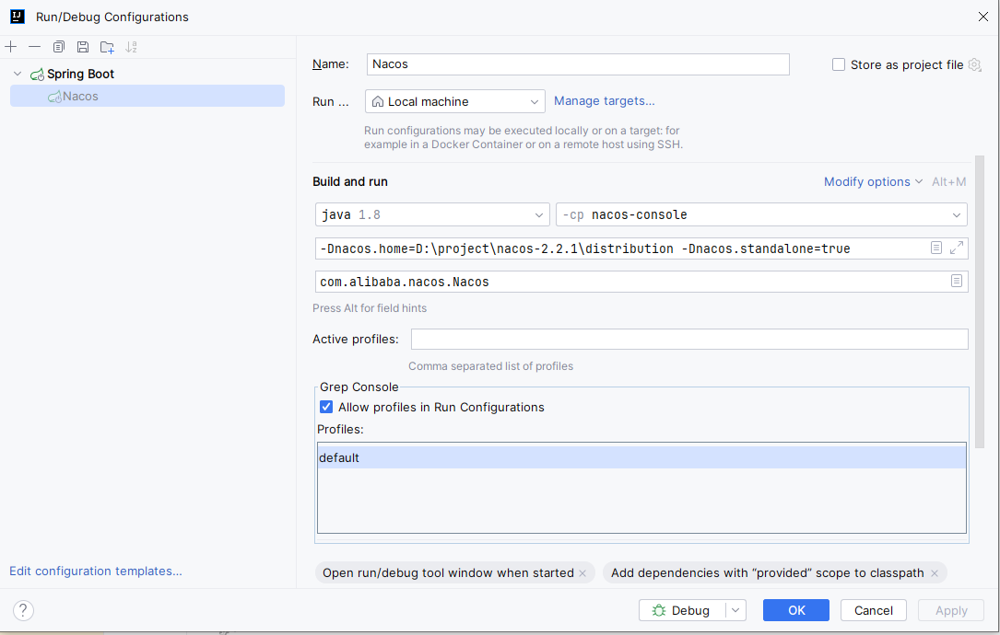
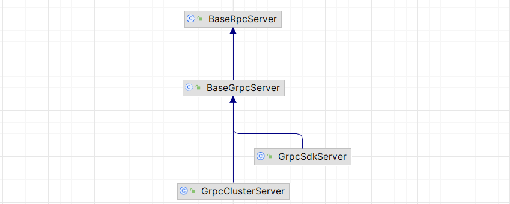

源码下载

下载地址：https://github.com/alibaba/nacos/archive/refs/tags/2.2.1.zip



前段当前使用的版本为： 16.20.2


对于 BaseRpcServer 现在有两个具体的实现类，现在看来这两个实现类都是会走的



服务注册

# 配置中心

```yml
spring:
  application:
    name: sca-nacos
  cloud:
    nacos:
      server-addr: localhost:8848
      username: nacos
      password: nacos
      discovery:
        namespace: nacos
      config:
        namespace: nacos
        group: DEFAULT_GROUP # 拉取指定分组的配置文件
        file-extension: yaml # 指定 yaml 格式的配置文件
        shared-configs:
          - data-id: shared
            group: DEFAULT_GROUP
            refresh: true
        extension-configs:
          - data-id: extension
            group: DEFAULT_GROUP
            refresh: true
```

读取的配置文件为：

- 通用配置：`{spring.application.name}.{spring.cloud.config.file-extension}`
- 自定义配置：`{spring.application.name}-{spring.profile.active}.{spring.cloud.config.file-extension}`

```markdown
com.alibaba.cloud.nacos.client.NacosPropertySourceLocator

loadSharedConfiguration(composite);
loadExtConfiguration(composite);
loadApplicationConfiguration(composite, dataIdPrefix, nacosConfigProperties, env);
```

从这里我们就能够看到，shared 对应的配置文件，优先级是最低的


