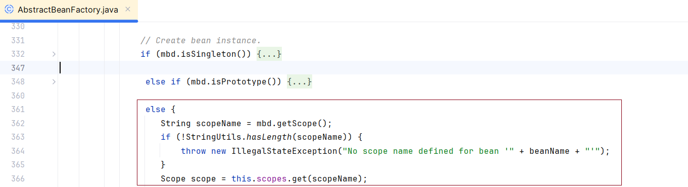
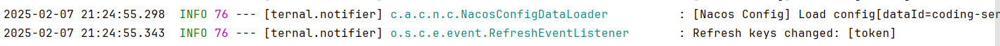

# 配置中心

现在遇见了一个问题，接入了 Nacos 作为配置中心之后，出现了死锁的问题？现在尝试来复现一下。

示例代码如下

```java
@Resource
private UserService userService;

@GetMapping("/test")
public String test1() {
    return userService.test();
}
```

```java
@Service
@RefreshScope
public class UserServiceImpl implements UserService {

    @Value("${token}")
    private String token;
    
    @Override
    public String test() {
        return token;
    }
}
```

通过改变这个值，这个对象实际上发生了变化，得到了一个新的实例，接下来，我们就来看一下这个注解是如何完成的。

首先，我们关注一下对象的创建，对于标注为 @RefreshScope 的对象，对于创建对象的过程之中，是通过下面这种方式，并没有走单例或者多例对象的创建分支。也就是下面这个分支的内容：



趁这个机会，我们来看一下这块的内容，通过 Debug，这个的 Scope 实际上是 GenericScope，这块实际上是通过 **FactoryBean** 来创建对象。

```java
Object scopedInstance = scope.get(beanName, () -> {
    beforePrototypeCreation(beanName);
    try {
        return createBean(beanName, mbd, args);
    }
    finally {
        afterPrototypeCreation(beanName);
    }
});
beanInstance = getObjectForBeanInstance(scopedInstance, name, beanName, mbd);
```

其中对于 get 方法

```java
@Override
public Object get(String name, ObjectFactory<?> objectFactory) {
    BeanLifecycleWrapper value = this.cache.put(name, new BeanLifecycleWrapper(name, objectFactory));
    this.locks.putIfAbsent(name, new ReentrantReadWriteLock());
    try {
        // 这里实际上面一个代码块，进行了原始对象的创建
        // 并且这里会把原始对象放在代理对象的 bean 属性里面去
        return value.getBean();
    }
    catch (RuntimeException e) {
        this.errors.put(name, e);
        throw e;
    }
}
```

不过在当前的 getObject 方法之中，我们并没有看到创建对象的方法，而是在 setBeanFactory 的过程之中，创建了代理对象。

:::info

通过这里的梳理，我们能够确定，使用了 @RefreshScope 标注的对象，实际上是一个复杂对象，LockedScopedProxyFactoryBean 对象，原始对象实际上是被放在了这个对象里面的 cache 对象中的 bean 属性之中

:::

对于代理对象，我们最为主要的就是关注里面的 **invoke** 方法

```java
@Override
public Object invoke(MethodInvocation invocation) throws Throwable {
    Method method = invocation.getMethod();
    if (AopUtils.isEqualsMethod(method) || AopUtils.isToStringMethod(method)
        || AopUtils.isHashCodeMethod(method) || isScopedObjectGetTargetObject(method)) {
        return invocation.proceed();
    }
    // 获取代理对象
    Object proxy = getObject();
    // 获取锁, 最终是通过这个集合来获取数据
    // private ConcurrentMap<String, ReadWriteLock> locks = new ConcurrentHashMap<>();
    ReadWriteLock readWriteLock = this.scope.getLock(this.targetBeanName);
    if (readWriteLock == null) {
        if (logger.isDebugEnabled()) {
            logger.debug("For bean with name [" + this.targetBeanName
                         + "] there is no read write lock. Will create a new one to avoid NPE");
        }
        readWriteLock = new ReentrantReadWriteLock();
    }
    Lock lock = readWriteLock.readLock();
    lock.lock();
    try {
        if (proxy instanceof Advised) {
            Advised advised = (Advised) proxy;
            ReflectionUtils.makeAccessible(method);
            // 方法运行
            return ReflectionUtils.invokeMethod(method, advised.getTargetSource().getTarget(),
                                                invocation.getArguments());
        }
        return invocation.proceed();
    }
    // see gh-349. Throw the original exception rather than the
    // UndeclaredThrowableException
    catch (UndeclaredThrowableException e) {
        throw e.getUndeclaredThrowable();
    }
    finally {
        lock.unlock();
    }
}
```

在实际方法的运行过程之中，会进行如下的步骤：

- 获取读锁
- 原始方法运行
- 释放锁

在看到了原始方法的运行之中，我们就来看一下当 Nacos 的配置发生变化之后，会发生什么？

这里，我直接通过日志的方式来进行定位（这个时候，建议将日志的级别设置为 debug）



从这里，我们能够看到当配置发生变化之后， `RefreshEventListener` 会答应对应的日志信息，这里我们只需要关注 `RefreshEvent` 相关的逻辑即可

```java
@Override
public void onApplicationEvent(ApplicationEvent event) {
    if (event instanceof ApplicationReadyEvent) {
        handle((ApplicationReadyEvent) event);
    }
    else if (event instanceof RefreshEvent) {
        handle((RefreshEvent) event);
    }
}
```

通过查看对应的 handle 方法，最终确定了 RefreshScope 下面这个方法

```java
@ManagedOperation(description = "Dispose of the current instance of all beans "
                  + "in this scope and force a refresh on next method execution.")
public void refreshAll() {
    super.destroy();
    // 对于事件发布这块，这里我并没有看到这里有具体的 Nacos 的实现代码
    this.context.publishEvent(new RefreshScopeRefreshedEvent());
}
```

其中，对于 destroy 方法，这个也会获取锁，不过这里获取的是写锁

```java [销毁实例]
@Override
public void destroy() {
    List<Throwable> errors = new ArrayList<Throwable>();
    Collection<BeanLifecycleWrapper> wrappers = this.cache.clear();
    for (BeanLifecycleWrapper wrapper : wrappers) {
        try {
            // private ConcurrentMap<String, ReadWriteLock> locks = new ConcurrentHashMap<>();
            // 这里的 key 实际上是 bean 的名称
            Lock lock = this.locks.get(wrapper.getName()).writeLock();
            lock.lock();
            try {
                // 这里注意一下，这里会清理里面的 bean 属性和 callBack 属性
                wrapper.destroy();
            }
            finally {
                lock.unlock();
            }
        }
        catch (RuntimeException e) {
            errors.add(e);
        }
    }
    if (!errors.isEmpty()) {
        throw wrapIfNecessary(errors.get(0));
    }
    this.errors.clear();
}
```

那么这里会造成死锁吗？注意这里使用的是：**ReentrantReadWriteLock**，它允许读和读是共存的，而读写和写写仍然是互斥的。

