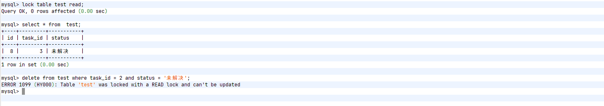
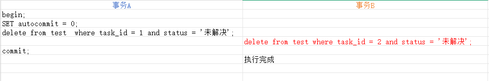

# 锁

:::info

最近在工作之中，遇见了 delete 语句被阻塞导致事务超时的问题，借此机会，来分享一下 MySQL 之中的锁以及常见的语句都加什么锁。

:::

在 MySQL 中，根据锁的粒度不同，锁可以分为以下三类：

- **全局锁**：锁定整个数据库中的所有表；
- **表级锁**：每次操作锁定整张表；
- **行级锁**：每次操作仅锁定对应的行数据。

每一类锁还可以进一步细分为其他具体类型，但主要可归纳为以下两种基本锁模式：

- **共享锁（S 锁）**：事务在读取记录时，需要先获取该记录的 S 锁；
- **排他锁（X 锁）**：事务在修改或写入记录时，必须获取该记录的 X 锁。

在兼容性方面，多个 S 锁之间是兼容的，即允许同时被多个事务持有；而 X 锁与其他任何锁均互斥——不仅多个 X 锁之间不能共存，S 锁与 X 锁之间也无法同时持有。

## 一、全局锁

全局锁用于锁定整个数据库实例。加上全局锁后，实例将处于只读状态，此时会阻塞所有涉及数据更新的操作，包括对表的修改以及对记录进行增删改的事务提交。

全局锁的典型使用场景是执行**全库逻辑备份**。通过锁定所有表，可以获取一个一致性的数据库视图，从而确保备份数据的完整性和一致性。

此外，当客户端连接断开时，全局锁会自动释放。

```sql
-- 加锁
flush tables with read lock;

-- 解锁
unlock tables;
```

## 二、表级锁

表锁用于锁定整张表。加上表锁后，整张表将处于只读状态，不能够进行添加或者删除数据。包括当前线程。

### 2.1 表锁

表锁的语法如下：

```sql
-- 共享锁
lock table 表名 read

-- 排他锁
lock tables 表名 write;

-- 释放锁
unlock tables
```



### 2.2 MDL

MDL（Metadata Lock，元数据锁）无需显式使用，会在访问表时自动加锁。它的主要作用是防止在执行 SELECT 等查询操作时，其他客户端对表结构进行修改，从而确保元数据的一致性。

在对表进行增、删、改、查等常规操作时，会自动添加 MDL 读锁；而当需要修改表结构（如 ALTER TABLE）时，则会获取 MDL 写锁。MDL 读锁之间是兼容的，即允许多个事务同时持有；但读锁与写锁之间是互斥的，读写操作无法同时进行。

### 2.3 意向锁

在对表级别加锁时，需要确保表中所有行数据均未被锁定。因此，在尝试获取表锁之前，必须遍历检查所有行记录是否存在行级锁，这一过程较为低效。

为了提升加锁效率，InnoDB引入了**意向锁（Intention Lock）**机制。当事务需要对某一行数据加行锁（共享锁或排他锁）时，它会首先在**表级别**附加一个对应的意向锁。这样，后续其他事务在申请表级锁时，只需检查该意向锁是否存在，即可快速判断表中是否已有行被锁定，从而避免遍历所有行记录，大幅提高了加锁判断的性能。

:::=tabs
::意向共享锁
当事务准备对表中的某些行加**共享锁（S行锁）**时，它会先在表上加一个**意向共享锁**。

::意向排他锁
当事务准备对表中的某些行加**排他锁（X行锁）**时，它会先在表上加一个**意向排他锁**。

:::

## 三、行级锁

在 InnoDB 存储引擎中支持行级锁，而 MyISAM 则不支持行级锁，仅支持表级锁。

对于数据库中的同一行记录，基本操作可分为读和写两种：

- 对于**写操作**，同一时间只允许一个客户端修改该行数据，因此必须通过加锁机制来保证互斥性。
- 对于**读操作**，在不同隔离级别下可采用不同机制：
  - 在 `READ COMMITTED` 或 `REPEATABLE READ` 等隔离级别中，通常使用 MVCC（多版本并发控制）来实现非阻塞读取；
  - 在 `SERIALIZABLE` 隔离级别下，则通过加锁方式保证读一致性。

除了依赖 MVCC 机制外，在某些场景下也可以显式地使用锁来实现读取控制，这种方式也被称之为 **锁定读**。例如通过 `SELECT ... FOR SHARE` 或 `SELECT ... FOR UPDATE` 主动加锁。

1）对记录加读锁，其余事务仍然能够获取读锁，但是不能够获取写锁

```sql
SELECT ... LOCK IN SHARE MODE;
```

|      | session1                                   | session2                                          |
| ---- | ------------------------------------------ | ------------------------------------------------- |
| T1   | begin                                      | begin                                             |
| T2   |                                            | select * from tt where id = 1 lock in share mode; |
| T3   | select * from tt where id = 1;             |                                                   |
| T4   | update tt set a = 1 where id = 1; **阻塞** |                                                   |
| T5   |                                            | commit                                            |
| T6   | **阻塞恢复**                               |                                                   |

2）对记录加写锁，其余事务不能够加读锁或者写锁。

```sql
SELECT ... FOR UPDATE;
```

|      | session1                          | session2                                  |
| ---- | --------------------------------- | ----------------------------------------- |
| T1   | begin                             | begin                                     |
| T2   |                                   | select * from tt where id = 1 for update; |
| T3   | update tt set a = 1 where id = 1; |                                           |
| T4   |                                   | commit                                    |
| T5   | update 正常执行                   |                                           |

这里需要区分一下读取的两种方式：

- 快照读：当通过 MVCC 生成的快照读取数据时，不会出现幻读的问题
- 当前读，读取所有已经提交的记录的最新值，**加锁的 SELECT 或者对数据进行增删改的时候都会进行当前读**，这种情况是会出现幻读的问题

MySQL 中提供了以下几种行级锁机制：

:::=tabs
::记录锁
记录锁针对单条记录进行加锁，分为共享锁（读锁）和排他锁（写锁）两种类型，用于控制对某一行数据的并发访问。

::间隙锁
间隙锁，锁定一个索引范围之间的间隙，防止其他事务在该范围内插入新记录，从而有效避免幻读问题。**该锁仅存在于可重复读（REPEATABLE READ）和串行化（SERIALIZABLE）隔离级别中**，是可重复读隔离级别下实现幻读防治的核心机制之一。

::Next-Key
Next-Key 锁是记录锁与间隙锁的结合，它同时锁定索引记录本身以及该记录之前的间隙。这种锁机制通过在更大范围内施加锁定，进一步增强了并发控制的能力，尤其在高隔离级别下保障数据的一致性。

:::

在 MySQL 45 讲中，提到了，加锁的规则：

- 原则：加锁的基本单位是 Next-Key Lock
- 原则：查找过程之中，访问到的对象才会进行加锁，如果进行了索引覆盖，则会锁二级索引，而不是锁主键
- 等值查询时，给唯一索引加锁的时候，next-key lock 退化为行锁，如果不是唯一索引，则会向右遍历时且最后一个值不满足等值条件的时候，next-key lock 退化为间隙锁。
- 优化 ：索引上的等值查询，向右遍历时且最后一个值不满足等值条件的时候，next-key lock 退化为间隙锁。
- 范围查询：无论是否是唯一索引，范围查询都需要访问到不满足条件的第一个值为止

## 四、语句加锁分析

现在有一张表，对应的建表语句如下：

```sql
CREATE TABLE `test` (
  `id` int NOT NULL AUTO_INCREMENT,
  `task_id` int NOT NULL,
  `status` varchar(255) COLLATE utf8mb4_unicode_ci DEFAULT NULL,
  PRIMARY KEY (`id`) USING BTREE
) ENGINE=InnoDB AUTO_INCREMENT=3 DEFAULT CHARSET=utf8mb4;
```

对应的初始化语句如下：

```sql
insert into test(task_id, status) values(1, '未解决'), (2, '未解决');
```

按照如下操作进行操作



其中，事务B 的红色标记的语句会被阻塞？

```
mysql> select * from performance_schema.data_locks\G;
*************************** 1. row ***************************
               ENGINE: INNODB
       ENGINE_LOCK_ID: 139866107797448:1184:139866012737872
ENGINE_TRANSACTION_ID: 362361
            THREAD_ID: 465040
             EVENT_ID: 20
        OBJECT_SCHEMA: test-mysql
          OBJECT_NAME: test
       PARTITION_NAME: NULL
    SUBPARTITION_NAME: NULL
           INDEX_NAME: NULL
OBJECT_INSTANCE_BEGIN: 139866012737872
            LOCK_TYPE: TABLE
            LOCK_MODE: IX
          LOCK_STATUS: GRANTED
            LOCK_DATA: NULL
*************************** 2. row ***************************
               ENGINE: INNODB
       ENGINE_LOCK_ID: 139866107797448:118:4:1:139866012734960
ENGINE_TRANSACTION_ID: 362361
            THREAD_ID: 465040
             EVENT_ID: 20
        OBJECT_SCHEMA: test-mysql
          OBJECT_NAME: test
       PARTITION_NAME: NULL
    SUBPARTITION_NAME: NULL
           INDEX_NAME: PRIMARY
OBJECT_INSTANCE_BEGIN: 139866012734960
            LOCK_TYPE: RECORD
            LOCK_MODE: X
          LOCK_STATUS: GRANTED
            LOCK_DATA: supremum pseudo-record
*************************** 3. row ***************************
               ENGINE: INNODB
       ENGINE_LOCK_ID: 139866107797448:118:4:2:139866012734960
ENGINE_TRANSACTION_ID: 362361
            THREAD_ID: 465040
             EVENT_ID: 20
        OBJECT_SCHEMA: test-mysql
          OBJECT_NAME: test
       PARTITION_NAME: NULL
    SUBPARTITION_NAME: NULL
           INDEX_NAME: PRIMARY
OBJECT_INSTANCE_BEGIN: 139866012734960
            LOCK_TYPE: RECORD
            LOCK_MODE: X
          LOCK_STATUS: GRANTED
            LOCK_DATA: 6
*************************** 4. row ***************************
               ENGINE: INNODB
       ENGINE_LOCK_ID: 139866107797448:118:4:3:139866012734960
ENGINE_TRANSACTION_ID: 362361
            THREAD_ID: 465040
             EVENT_ID: 20
        OBJECT_SCHEMA: test-mysql
          OBJECT_NAME: test
       PARTITION_NAME: NULL
    SUBPARTITION_NAME: NULL
           INDEX_NAME: PRIMARY
OBJECT_INSTANCE_BEGIN: 139866012734960
            LOCK_TYPE: RECORD
            LOCK_MODE: X
          LOCK_STATUS: GRANTED
            LOCK_DATA: 7
4 rows in set (0.00 sec)

ERROR: 
No query specified
```


