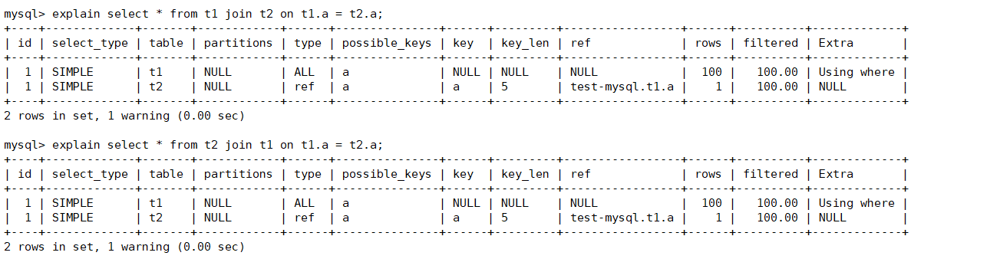
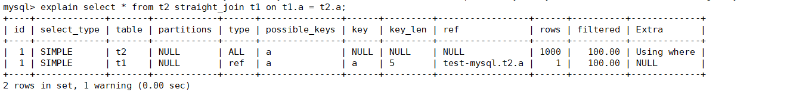
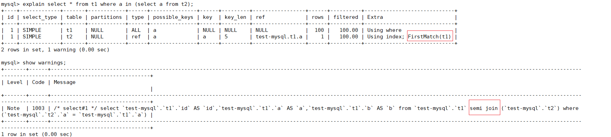

# Join原理

## 一、前言

连接的本质就是把各个连接表之中的记录都取出来一次匹配的组合加入到结果集之中，返回给用户。

连接查询的基本过程如下：

1. 确定第一个需要查询的表，这个表称之为 ，驱动表
2. 针对于从驱动表之中查询出来的每一条记录，分别去被驱动表之中查找匹配的记录

按照连接的方式，又有不同的区分：

1. 内连接：驱动表之中的记录，如果说在被驱动表中找不到对应的记录，就不会加入到对应的结果集之中
2. 外连接：驱动表之中的记录，如果说在被驱动表中找不到对应的记录，仍然会加入到最终的结果集之中，不过对应被驱动表相关的列被赋值为了 null

其实连接的语义就是这样：

```java
for(驱动表) {
    for(被驱动表) {}
    添加到结果集之中
}
```

整体的搜索过程如下：

- 遍历驱动表，取出一条数据，然后拿这条数据，去 被驱动表 之中查找，如果满足条件，作为结果集的一部分进行返回
- 循环往复，直到处理完成 驱动表的全部数据为止。

对于驱动表，默认走的是全表扫描，对于被驱动表的搜索，按照是否可以走索引，采取的算法不同。

> 情况一：被驱动表，可以走索引

在树上查找一个元素的时间复杂度是 logM，如果需要回表，时间复杂度就是 2 * logM。

对于 驱动表，需要全表扫描，需要扫描 N 行，每一行都需要查找一次被驱动表，总体的时间复杂度就是：N + N * 2 * logM。对于驱动表的行数，影响了整体的查找效率。

对于 in 查询，如果能够走索引，mysql 也会改写为 join，使用的是 semi join。

**结论：在被驱动表可以走索引的过程中，如果可以走索引，需要让数据量较少的表作为驱动表。**

在下面这个查询的过程之中，对于 t2  的 b 字段没有索引，但是 MySQL 此时将  t2 作为了驱动表，进行扫描



为此，可以通过 **STRAIGHT_JOIN** 来强制指定 驱动表，



> 情况二：被驱动表，无法走索引

如果不能够走索引，第一种方式，就是全表扫描，驱动表和被驱动表都需要进行全表扫描，N + N * M，MySQL 并没有采用这种方式。

而是将驱动表的全部数据全部读取到 **join_buffer** 之中，扫描被驱动表，与 join_buffer 之中的数据做对比，满足 join 条件的，作为结果集的一部分返回。总体扫描的行数：N + M，在被驱动表与 join_buffer 进行对比，需要对比 N * M  次。复杂度就是：N + M + N * M，对于这种算法，哪一个表作为驱动表，时间复杂度都是一致的。

但是 join_buffer 是放在内存之中的，如果其大小不能够放下整个驱动表，MySQL 就会采用 **分段放** 的方式，选取出一部分数据放在 join_buffer 之中，这一部分数据处理完成之后，再将下一部分的数据，放置在 join_buffer 之中，循环往复，直到处理完成为止，这种算法称之为：BNL。

在这种情况之下，驱动表不能够放入到缓存之中，假设 join_buffer 的总量为 size，驱动表一行的数据量为 row，需要放入 （size / row） * N 次，遍历被驱动表 （size / row） * N * M  次，需要比对 M * N 次

复杂度就是：N + (size / row) * N * M + M * N，(size / row) 的大小会影响，会影响整体的查询效率

**结论：如果被驱动表不能够走索引，让能够更多的放入 join_buffer 的表作为驱动表。**

但是，BNL 算法，在内存之中比对的次数并没有减少，为此，可以为放入 join_buffer 之中的数据，对连接条件，构建 Hash table，这样就能够达到 O(1) 的复杂度，这个算法，就是 MySQL 在 8.0 提到的 **Hash Join**。

> in 语句

除了我们在语句之中，直接写 join ，对于有索引的 in 的语句，mysql 会改写为 semi join。



## 二、优化

下面，我们通过实际的案例分析一下：

::: code-group

```sql [建表语句]
CREATE TABLE `t2` (
  `id` int(11) NOT NULL,
  `a` int(11) DEFAULT NULL,
  `b` int(11) DEFAULT NULL,
  PRIMARY KEY (`id`),
  KEY `a` (`a`)
) ENGINE=InnoDB;

create table t1 like t2;
insert into t1 (select * from t2 where id<=100)
```

```sql [模拟数据]
drop procedure idata;
delimiter ;;
create procedure idata()
begin
  declare i int;
  set i=1;
  while(i<=1000)do
    insert into t2 values(i, i, i);
    set i=i+1;
  end while;
end;;
delimiter ;
call idata();
```

:::

