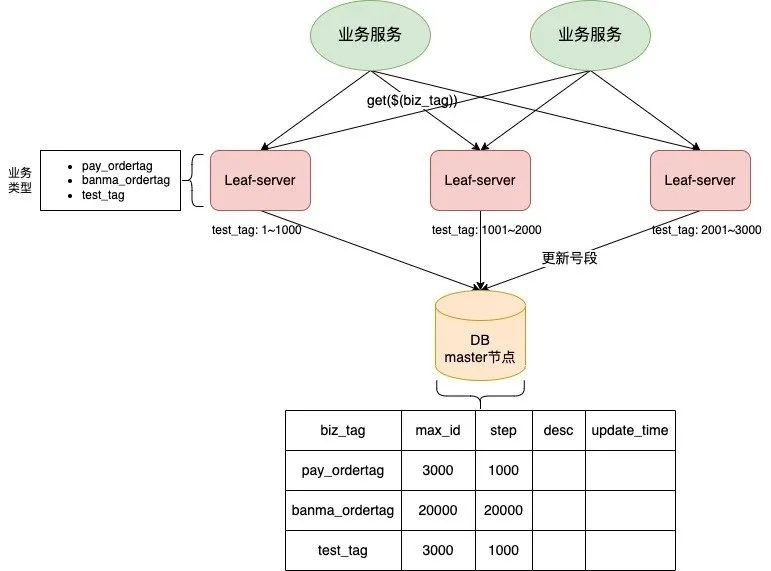
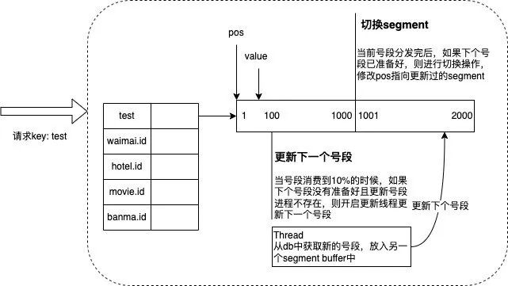
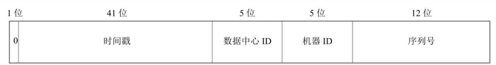

# 唯一ID

## 一、前言

在业务开发，会存在大量的场景使用唯一ID来进行标识，对于一个唯一ID，特性如下：

- 全局唯一：必须保证生成的ID是全局唯一的
- 有序性：生成的ID需要按照某种规则是有序的，防止插入数据库时出现页分裂的问题
- 安全性：不暴露系统和业务的信息

## 二、UUID

生成唯一ID，其中最为有效的方式就是通过 UUID 来获取，并且这种方式重复的概率非常低，在这种情况之下每个 Web 系统都含有一个ID生成器负责独立的生成ID。

但是 ID 并不能随时间增长，ID 可能也并不是纯数字的。如果采用这种方式作为数据库的主键就会造成页分裂的问题，影响插入的效率。

对于 UUID 的使用方式就比较简单了, jdk 的包里面已经提供了：

```java
import java.util.UUID;

String uuid = UUID.randomUUID().toString();
```


## 三、自增ID

这个方法的核心就是利用数据库的自增ID来实现唯一ID，强依赖于数据库，当 DB 不可用时，整个系统就会处于不可用的状态，并且 ID 的生成效率依赖于数据库的读写性能。除了采用数据库之外，还可以采用 Redis 的 incr 命令来实现。

这两种方式虽然能够生成唯一ID，但是对于数据库和Redis的压力比较大。

针对于这种方案，可以进行如下的优化：

- 批量生成：服务启动时，一次性生成一批次的 ID，放在内存之中，直接从内存中返回即可
- 水平拆分：多个分片，不同的初始值，相同的步长，即第一个分片 1,3,5,7,9..... , 第二个分片 2,4,6,8,10...

## 四、数据库的号段模式

号段模式，可以理解为批量从数据库获取一部分ID，然后存在内存之中，获取 ID 的时候直接从内存之中返回即可。比如有两台服务器，第一台服务器申请到的号段是：[1,1000]，第二个服务器申请到的号段是：[1001,2000]，第一台服务器获取ID的时候，就从1开始递增，直到申请到的号段使用完成。通过这种方式，可以大大减少数据库的使用压力。

接下来，我们就来看一下美团 Leaf-segment 方案。对于美团的方案，其实就是基于数据库批量生成，其对应的流程如下：在数据库之中建立一张表，用来表示不同的业务当前使用到的最大ID，以及每次申请的步长，当我们申请 ID 的时候，只需要执行 `update XX set max_id = max_id + step` ，当 update 成功的时候，就说明申请到了 **[max_id, max_id + step]** 范围的号段



使用这种方式，有如下的缺点：

- ID号码不够随机，能够泄露发号数量的信息，不太安全。
- 当号段使用完之后，去再次去申请号段，会有阻塞，并且会耗时在数据库的 IO
- DB宕机会造成整个系统不可用。

为了解决问题二，采用双buffer的方式，服务内部有两个号段缓存区 segment。当前号段已下发10%时，如果下一个号段未更新，则另启一个更新线程去更新下一个号段。当前号段全部下发完后，如果下个号段准备好了则切换到下个号段为当前segment接着下发，循环往复。



但是，我看了一下 GitHub 的代码，不知道是否维护？

## 五、雪花算法

对于雪花算法，由 64 位组成，构成图如下：



其中，这几部分的含义如下：

- 符号位：1 位，始终作为数字 0
- 时间戳：41 位
- 数据中心：5 位，最多可以有 32 个数据中心
- 机器ID：5位，每个数据中心最多可以有 32 个机器
- 序列号：12 位，对于某个机器或者进程，每生成一个 ID，序列号就加一，这个数字每毫秒开始都被重置为 0

对于 数据中心ID 和 机器ID 通常在起始阶段就选好了，一旦系统运行起来，这两个部分都是固定的，对于时间戳和序列号在运行后生效。

这种方案的**优势**在于：本次生成，没有网络开销，性能较高，整体呈增长趋势。**劣势**在于时钟回拨问题。

为了解决时钟回拨问题，可以采用如下方案：

- 将 ID 生成交给少量服务器，关闭这些服务器的时钟回拨能力，这样做对于ID的生成就不是本地了，而是需要调用对应的接口来获取唯一ID