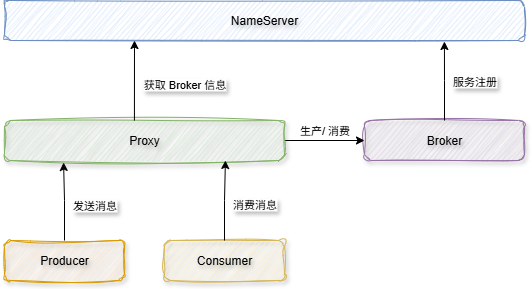

# 常见术语

在安装 RocketMQ 的过程之中，我们实际上是执行了两步命令：

```sh
nohup sh rocketmq-all-5.2.0-bin-release/bin/mqnamesrv &

nohup sh rocketmq-all-5.2.0-bin-release/bin/mqbroker -n localhost:9876 --enable-proxy &
```

这里启动了 NameServer、Broker、Proxy 这三个核心的组件，加上 Producer 和 Consumer 就构成了 RocketMQ 的整个体系结构




当服务启动时，Broker 向 NameServer 注册路由信息。Proxy 获取路由信息。Producer 发送消息至 Proxy，Proxy 通过路由信息，找到对应的 Broker，由 Broker 进行信息的存储。

消息发送完成后，消息就被划分到 Topic 的不同的队列中，消费者就要开始消费了。

在 RocketMQ 中，多个消费者示例构成了**消费者组**，这里有个重要的规则：**同一条消费只能够被消费者组内的一个消费者消费**，引入消费者组的设计，有两个方面的好处：

1）多个消费者同时消费，提升了消费端的消费能力。

2）能够保证当一个消费者宕机后，同组之中的消费者也能够继续消费

其中对于第一点，RocketMQ 称之为 “共享消费”，当然了也可以不采用这种方式，可以让消费者组内只有一个消费者消费，这种消费策略称之为 “广播消费”。

那么，在常用的**共享消费的模式**下，消息是如何在消费者组内做负载均衡的呢？这里有两个关键点：

- 消费粒度：同一个Topic中的消息，将会被消费者组内的多个消费者平摊，这也就意味着一个队列会被同一个消费者组内的多个消费者消费
- 队列消费：同一个Topic中一个队列的消息，只会被同一个消费者内的一个消费者消费


