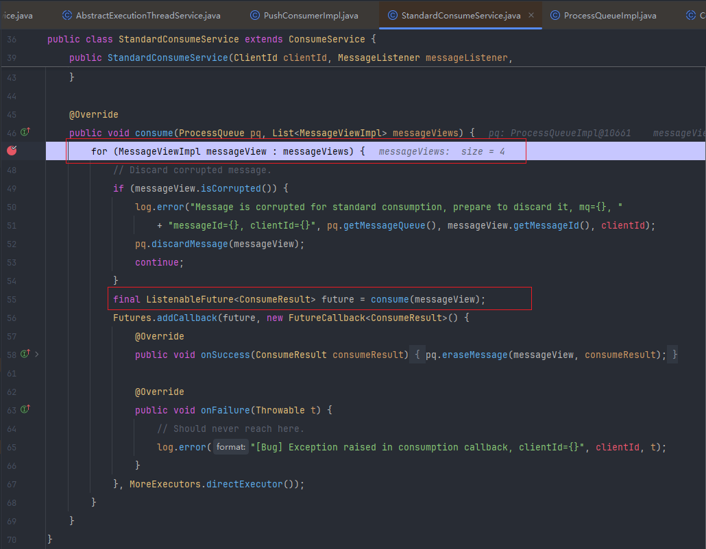

# 消费者原理详解

在 SpringBoot 之中，只需要非常简单的方式，就能够实现 RocketMQ 消息的消费，在这里，我们解析一下原理。

基础环境：SpringBoot 2.7.18，RocketMQ 5.2。对应的 Maven 依赖如下：

```xml
<dependency>
    <groupId>org.apache.rocketmq</groupId>
    <artifactId>rocketmq-v5-client-spring-boot-starter</artifactId>
    <version>2.3.4</version>
</dependency>
```

Spring Boot 中，只需要使用如下方式就可以消费消息

```java
@Component
@RocketMQMessageListener(topic = "coding-transaction", consumerGroup = "coding")
@Slf4j
public class CodingRockerMqListener implements RocketMQListener{

    @Override
    public ConsumeResult consume(MessageView messageView) {
        log.info("RocketMQMessageListener receive message:{}",messageView);
        ByteBuffer body = messageView.getBody();
        String message = StandardCharsets.UTF_8.decode(body).toString();
        log.info("Message is :{}",message);
        return ConsumeResult.SUCCESS;
    }

```

对于接入了 SpringBoot 自动配置的类，我们查看源码的入口始终是查找如下文件：

```java
META-INF\spring\org.springframework.boot.autoconfigure.AutoConfiguration.imports
```

在 RocketMQ 中，对应源码的入口是：RocketMQAutoConfiguration。在配置类上，我们看到 Import 了，好几个类，这个时候如何去找到关键的类代码呢？

**在这里实际上是通过 BeanPostProcessor 来完成对应功能的增强的。**

RocketMQMessageListenerBeanPostProcessor 类实现了 BeanPostProcessor 接口，所以我们就需要关注 Before 和 After 方法

```java
@Override
public Object postProcessAfterInitialization(Object bean, String beanName) throws BeansException {
    Class<?> targetClass = AopUtils.getTargetClass(bean);
    RocketMQMessageListener ann = targetClass.getAnnotation(RocketMQMessageListener.class);
    if (ann != null) {
        RocketMQMessageListener enhance = enhance(targetClass, ann);
        if (listenerContainerConfiguration != null) {
            listenerContainerConfiguration.registerContainer(beanName, bean, enhance);
        }
    }
    return bean;
}
```

在 registerContainer 方法之中，又向 Spring 容器之中，注册了 DefaultListenerContainer 对象，并将注解之中的属性解析放入对应的属性

:::code-group

```java [registerContainer]
public void registerContainer(String beanName, Object bean, RocketMQMessageListener annotation) {
    validate(annotation);
    String containerBeanName = String.format("%s_%s", DefaultListenerContainer.class.getName(),
                                             counter.incrementAndGet());
    GenericApplicationContext genericApplicationContext = (GenericApplicationContext) applicationContext;
    genericApplicationContext.registerBean(
        containerBeanName, 
        DefaultListenerContainer.class, 
        () -> createRocketMQListenerContainer(containerBeanName, bean, annotation) // [!code error]
    );
    DefaultListenerContainer container = genericApplicationContext.getBean(containerBeanName, DefaultListenerContainer.class);

    containers.add(container);

    log.info("Register the listener to container, listenerBeanName:{}, containerBeanName:{}", beanName, containerBeanName);
}
```

```java [createRocketMQListenerContainer] {6}
private DefaultListenerContainer createRocketMQListenerContainer(String name, Object bean, RocketMQMessageListener annotation) {
    DefaultListenerContainer container = new DefaultListenerContainer();
    container.setName(name);
    container.setRocketMQMessageListener(annotation);
    // 这里会将 对象 放入 MessageListener 之中
    container.setMessageListener((RocketMQListener) bean); // [!code error]
    container.setAccessKey(environment.resolvePlaceholders(annotation.accessKey()));
    container.setSecretKey(environment.resolvePlaceholders(annotation.secretKey()));
    container.setConsumerGroup(environment.resolvePlaceholders(annotation.consumerGroup()));
    container.setTag(environment.resolvePlaceholders(annotation.tag()));
    container.setEndpoints(environment.resolvePlaceholders(annotation.endpoints()));
    container.setTopic(environment.resolvePlaceholders(annotation.topic()));
    container.setNamespace(environment.resolvePlaceholders(annotation.namespace()));
    container.setRequestTimeout(Duration.ofSeconds(annotation.requestTimeout()));
    container.setMaxCachedMessageCount(annotation.maxCachedMessageCount());
    container.setConsumptionThreadCount(annotation.consumptionThreadCount());
    container.setMaxCacheMessageSizeInBytes(annotation.maxCacheMessageSizeInBytes());
    container.setType(annotation.filterExpressionType());
    return container;
}
```

:::

从这里，能够看出，原始对象并没有改变，而是向 Spring 容器之中，注册了 **DefaultListenerContainer** 对象，并将对象放入了 ListenerContainerConfiguration#contains 之中。

对于 DefaultListenerContainer 又实现了 `InitializingBean` 方法，在 afterPropertiesSet 方法，有进行了信息的初始化操作

:::code-group

```java [afterPropertiesSet]
@Override
public void afterPropertiesSet() throws Exception {
    initRocketMQPushConsumer();
}
```

```java [initRocketMQPushConsumer]
private void initRocketMQPushConsumer() {
    if (rocketMQListener == null) {
        throw new IllegalArgumentException("Property 'rocketMQListener' is required");
    }
    Assert.notNull(consumerGroup, "Property 'consumerGroup' is required");
    Assert.notNull(topic, "Property 'topic' is required");
    Assert.notNull(tag, "Property 'tag' is required");
    
    FilterExpression filterExpression = null;
    final ClientServiceProvider provider = ClientServiceProvider.loadService();
    if (StringUtils.hasLength(this.getTag())) {
        // 这里看一下，这里实际上就是设置对应的过滤消息的规则
        filterExpression = RocketMQUtil.createFilterExpression(this.getTag(),this.getType()); // [!code error]
    }
    ClientConfiguration clientConfiguration = RocketMQUtil
        .createClientConfiguration(this.getAccessKey(), this.getSecretKey(),                     
                                   this.getEndpoints(), this.getRequestTimeout(), this.sslEnabled, this.namespace);

    PushConsumerBuilder pushConsumerBuilder = provider.newPushConsumerBuilder()
        .setClientConfiguration(clientConfiguration);
    // Set the consumer group name.
    if (StringUtils.hasLength(this.getConsumerGroup())) {
        pushConsumerBuilder.setConsumerGroup(this.getConsumerGroup());
    }
    // Set the subscription for the consumer.
    if (StringUtils.hasLength(this.getTopic()) && Objects.nonNull(filterExpression)) {
        pushConsumerBuilder.setSubscriptionExpressions(Collections.singletonMap(this.getTopic(), filterExpression));
    }
    pushConsumerBuilder
        .setConsumptionThreadCount(this.getConsumptionThreadCount())
        .setMaxCacheMessageSizeInBytes(this.getMaxCacheMessageSizeInBytes())
        .setMaxCacheMessageCount(this.getMaxCachedMessageCount())
        .setMessageListener(rocketMQListener);
    
    // TODO: 扩展点
    if (rocketMQListener instanceof RocketMQPushConsumerLifecycleListener) {
        ((RocketMQPushConsumerLifecycleListener) rocketMQListener).prepareStart(pushConsumerBuilder);
    }
    
    this.setPushConsumerBuilder(pushConsumerBuilder);
}
```

:::

放入在 ListenerContainerConfiguration#contains 之中的 DefaultListenerContainer，在 RocketMQMessageListenerBeanPostProcessor#start 方法使用，进行消费者客户端的初始化

:::info

这个流程之中，运用的都是 Spring 的生命周期的扩展点，还有 SpringBoot 启动过程之中留下的扩展点

:::

```java
public void startContainer() {
    for (DefaultListenerContainer container : containers) {
        if (!container.isRunning()) {
            try {
                container.start();
            } catch (Exception e) {
                log.error("Started container failed. {}", container, e);
                throw new RuntimeException(e);
            }
        }
    }
}
```

在 start 之中，调用的方法如下：

```java
@Override
public PushConsumer build() throws ClientException {
    checkNotNull(clientConfiguration, "clientConfiguration has not been set yet");
    checkNotNull(consumerGroup, "consumerGroup has not been set yet");
    checkNotNull(messageListener, "messageListener has not been set yet");
    checkArgument(!subscriptionExpressions.isEmpty(), "subscriptionExpressions have not been set yet");
    final PushConsumerImpl pushConsumer = new PushConsumerImpl(clientConfiguration, consumerGroup,
                                                               subscriptionExpressions, 
                                                               messageListener, 
                                                               maxCacheMessageCount, 
                                                               maxCacheMessageSizeInBytes,
                                                               consumptionThreadCount);
    pushConsumer.startAsync().awaitRunning();
    return pushConsumer;
}
```

这里构建了 **PushConsumerImpl**。在 startAsync 方法中，最终是调用下面的方法

> PS： 这个时候，我们先不关注与各个方法里面的详细信息，只需要关注整个流程就够了

```java
@Override
protected void startUp() throws Exception {
    try {
        log.info("Begin to start the rocketmq push consumer, clientId={}", clientId);
        GaugeObserver gaugeObserver = new ProcessQueueGaugeObserver(processQueueTable, clientId, consumerGroup);
        this.clientMeterManager.setGaugeObserver(gaugeObserver);
        super.startUp();
        final ScheduledExecutorService scheduler = this.getClientManager().getScheduler();
        this.consumeService = createConsumeService();
        // Scan assignments periodically.
        scanAssignmentsFuture = scheduler.scheduleWithFixedDelay(() -> {
            try {
                scanAssignments();
            } catch (Throwable t) {
                log.error("Exception raised while scanning the load assignments, clientId={}", clientId, t);
            }
        }, 1, 5, TimeUnit.SECONDS);
        log.info("The rocketmq push consumer starts successfully, clientId={}", clientId);
    } catch (Throwable t) {
        log.error("Exception raised while starting the rocketmq push consumer, clientId={}", clientId, t);
        shutDown();
        throw t;
    }
}
```


在 RocketMQ 之中，SpringBoot 的注解上面来看，是不支持批量消费消息的




```
ConsumeTask
```

下面对于常见的配置项进行扩展

```java

```

