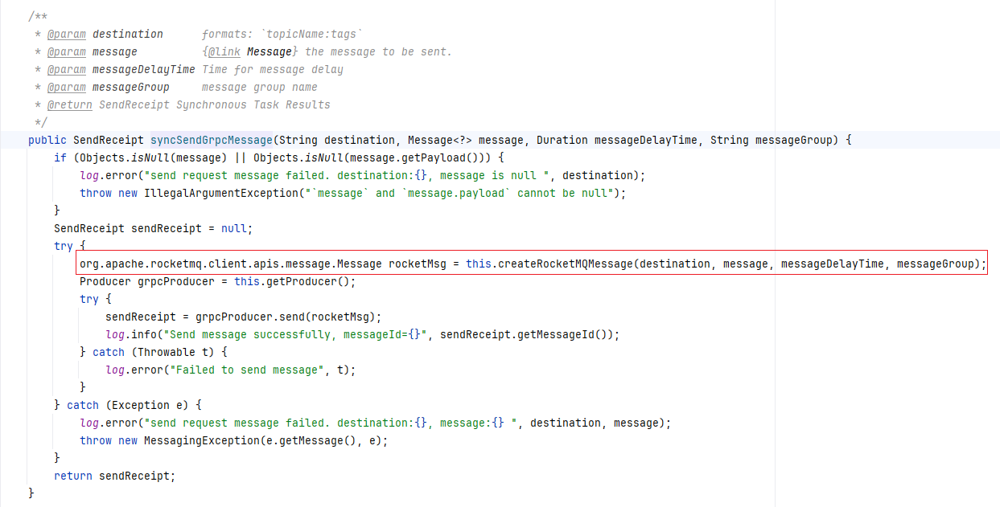

# 消费者特性

## 一、消费者分类

## 二、消息过滤

消费者订阅了主题之后，默认情况之下会将主题的所有消息投递给消费者。如果消费者只关注部分消息，可以通过设置过滤条件在 RocketMQ 的服务端进行过滤，这样消费者就只会收到关注的消息。

在 RocketMQ 中提供了两种过滤方式：

1）基于 Tag 进行过滤：发送者发送时，为每一条消息设置 Tag 标签，类似于打一个标记，消费者订阅时，告诉服务端只需要这个标签的数据

2）基于 SQL 属性过滤：发送者发送消息时，给消息设置 key-value 键值对，消费者订阅时设置 SQL 语法的过滤表达式进行消息过滤

### 2.1 基于 Tag 进行过滤

:::code-group

```java [发送者]
import org.springframework.messaging.Message;
import org.springframework.messaging.support.MessageBuilder;

@Resource
private RocketMQClientTemplate rocketMQClientTemplate;

@Test
void send_filterMessage() throws InterruptedException {
    final String topic  = "coding-filter-message";
    Message<String> message = MessageBuilder.withPayload("hello rocketmq").build();
    // topic:tag
    rocketMQClientTemplate.send(topic + ":tag-B", message);
    new CountDownLatch(1).await();
}
```

```java [消费者]
@Component
@RocketMQMessageListener(topic = "coding-filter-message", consumerGroup = "coding", tag = "tag-A")
@Slf4j
public class CodingFilterMessageRocketMqListener implements RocketMQListener {
    
    @Override
    public ConsumeResult consume(MessageView messageView) {
        ByteBuffer body = messageView.getBody();
        String message = StandardCharsets.UTF_8.decode(body).toString();
        log.info("consume message: {}", message);
        return ConsumeResult.SUCCESS;
    }
    
}
```

:::

请注意，这里 Message 是 Spring 中的包，查看一下 `syncSendNormalMessage` 重载的几个方法，最终都是将消息转为 Spring 中的 Message 继续处理的。

 

从这里能够清晰的看到，最终会转为 RocketMQ 自定义的 Message 进行发送。

```java
public static org.apache.rocketmq.client.apis.message.Message getAndWrapMessage(
    String destination, MessageHeaders headers, byte[] payloads, Duration messageDelayTime, String messageGroup) {
    if (payloads == null || payloads.length < 1) {
        return null;
    }
    if (destination == null || destination.length() < 1) {
        return null;
    }
    // 1. 请注意，这里将传入的 Topic 名称， 通过 分号 分割为了两个部分
    String[] tempArr = destination.split(":", 2);
    final ClientServiceProvider provider = ClientServiceProvider.loadService();
    org.apache.rocketmq.client.apis.message.MessageBuilder messageBuilder = null;
    // resolve header
    if (Objects.nonNull(headers) && !headers.isEmpty()) {
        Object keys = headers.get(RocketMQHeaders.KEYS);
        if (ObjectUtils.isEmpty(keys)) {
            keys = headers.get(toRocketHeaderKey(RocketMQHeaders.KEYS));
        }
        // 2. 第一部分设置为了 TOPIC
        messageBuilder = provider.newMessageBuilder().setTopic(tempArr[0]);
        if (tempArr.length > 1) {
            // 3. 第二部分设置为了 Tag 标签组
            messageBuilder.setTag(tempArr[1]);
        }
        if (StringUtils.hasLength(messageGroup)) {
            messageBuilder.setMessageGroup(messageGroup);
        }
        if (!ObjectUtils.isEmpty(keys)) {
            messageBuilder.setKeys(keys.toString());
        }
        if (Objects.nonNull(messageDelayTime)) {
            messageBuilder.setDeliveryTimestamp(System.currentTimeMillis() + messageDelayTime.toMillis());
        }
        messageBuilder.setBody(payloads);
        org.apache.rocketmq.client.apis.message.MessageBuilder builder = messageBuilder;
        headers.forEach((key, value) -> builder.addProperty(key, String.valueOf(value)));
    }
    return messageBuilder.build();
}
```


### 2.2 基于 SQL 属性过滤

SQL属性过滤使用SQL92语法作为过滤规则表达式，语法规范如下：

| 语法                    | 说明                                                         | 示例                                                         |
| ----------------------- | ------------------------------------------------------------ | ------------------------------------------------------------ |
| IS NULL                 | 判断属性不存在。                                             | `a IS NULL` ：属性a不存在。                                  |
| IS NOT NULL             | 判断属性存在。                                               | `a IS NOT NULL`：属性a存在。                                 |
| *>* >= *<* <=           | 用于比较数字，不能用于比较字符串，否则消费者客户端启动时会报错。 **说明** 可转化为数字的字符串也被认为是数字。 | *`a IS NOT NULL AND a > 100`：属性a存在且属性a的值大于100。* `a IS NOT NULL AND a > 'abc'`：错误示例，abc为字符串，不能用于比较大小。 |
| BETWEEN xxx AND xxx     | 用于比较数字，不能用于比较字符串，否则消费者客户端启动时会报错。等价于>= xxx AND \<= xxx。表示属性值在两个数字之间。 | `a IS NOT NULL AND (a BETWEEN 10 AND 100)`：属性a存在且属性a的值大于等于10且小于等于100。 |
| NOT BETWEEN xxx AND xxx | 用于比较数字，不能用于比较字符串，否则消费者客户端启动会报错。等价于\< xxx OR > xxx，表示属性值在两个值的区间之外。 | `a IS NOT NULL AND (a NOT BETWEEN 10 AND 100)`：属性a存在且属性a的值小于10或大于100。 |
| IN (xxx, xxx)           | 表示属性的值在某个集合内。集合的元素只能是字符串。           | `a IS NOT NULL AND (a IN ('abc', 'def'))`：属性a存在且属性a的值为abc或def。 |
| *=* <>                  | 等于和不等于。可用于比较数字和字符串。                       | `a IS NOT NULL AND (a = 'abc' OR a<>'def')`：属性a存在且属性a的值为abc或a的值不为def。 |
| *AND* OR                | 逻辑与、逻辑或。可用于组合任意简单的逻辑判断，需要将每个逻辑判断内容放入括号内。 | `a IS NOT NULL AND (a > 100) OR (b IS NULL)`：属性a存在且属性a的值大于100或属性b不存在。 |

:::code-group

```java [发送者]
import org.springframework.messaging.Message;
import org.springframework.messaging.support.MessageBuilder;

@Test
void send_filterMessage_sql() throws InterruptedException {
    final String topic  = "coding-filter-message";
    Message<String> message = MessageBuilder.withPayload("hello rocketmq")
        .setHeader("coding", "666")
        .setHeader("coding-dog", 888)
        .build();
    rocketMQClientTemplate.syncSendNormalMessage(topic, message);
    new CountDownLatch(1).await();
}
```

```java
@Component
@RocketMQMessageListener(topic = "coding-filter-message", consumerGroup = "coding-2", filterExpressionType = "sql92", tag = "coding IS NULL")
@Slf4j
public class CodingFilter3MessageRocketMqListener implements RocketMQListener {

    @Override
    public ConsumeResult consume(MessageView messageView) {
        ByteBuffer body = messageView.getBody();
        String message = StandardCharsets.UTF_8.decode(body).toString();
        log.info("consume message: {}", message);
        return ConsumeResult.SUCCESS;
    }
}

```

:::

对于这里的设置，我们可以看一下这块的源码：


设置对应的表达式

```java
 public static FilterExpression createFilterExpression(String tag, String type) {
        if (!StringUtils.hasLength(tag) && !StringUtils.hasLength(type)) {
            log.info("no filterExpression generate");
            return null;
        }
        if (!"tag".equalsIgnoreCase(type) && !"sql92".equalsIgnoreCase(type)) {
            log.info("do not support your filterExpressionType {}", type);
        }
        FilterExpressionType filterExpressionType = "tag".equalsIgnoreCase(type) ? FilterExpressionType.TAG : FilterExpressionType.SQL92;
        FilterExpression filterExpression = new FilterExpression(tag, filterExpressionType);
        return filterExpression;
    }
```

