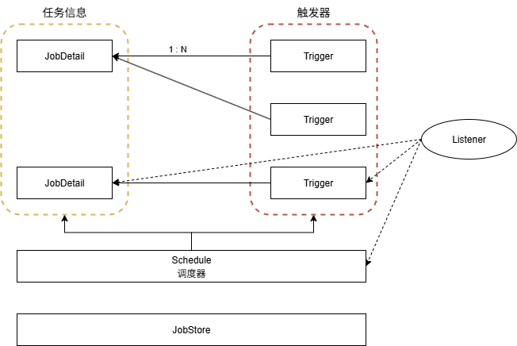
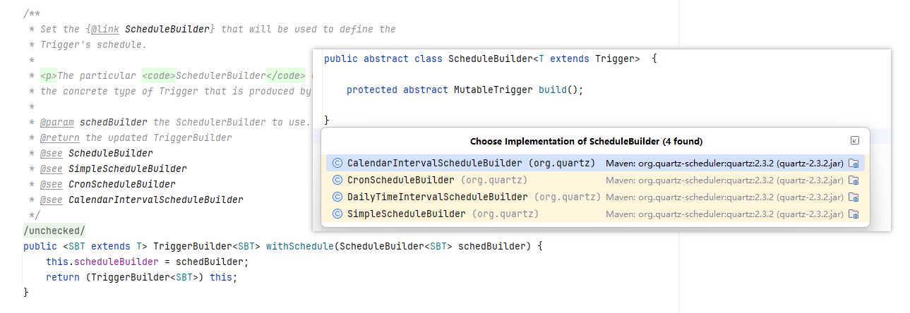

# Quartz

## 一、快速上手

在 Quartz 之中，有 5 个部分组成：

1）Job：任务，定时任务需要执行的业务逻辑都是编写在这里

2）Trigger：触发器，定时任务在什么时候执行，一个触发器只能够绑定一个 Job，每一次执行的时候，都是单独创建一个 Job

3）Scheduler：调度器

4）Listener：监听器

5）JobStore：存储任务和触发器相关的信息



下面是 Quartz 的简单案例：

```java
public class Main {

    public static class DemoJob implements Job {
        @Override
        public void execute(JobExecutionContext context) throws JobExecutionException {
            System.out.println("DemoJob.execute");
        }
    }

    public static void main(String[] args) throws SchedulerException {
        // 调度器
        Scheduler scheduler = StdSchedulerFactory.getDefaultScheduler();

        // 触发器
        SimpleScheduleBuilder simpleScheduleBuilder =
                SimpleScheduleBuilder.simpleSchedule()
                        .withIntervalInSeconds(3)
                        .withRepeatCount(10);

        SimpleTrigger trigger = TriggerBuilder.newTrigger()
                .startAt(new Date(System.currentTimeMillis() + 5000))// startAt 设置首次触发时间
                .withSchedule(simpleScheduleBuilder)// withSchedule 设置触发器的触发规则
                .build();
        
        // JOB
        JobDetail jobDetail = JobBuilder.newJob(DemoJob.class).build();

        // 将 任务 和 触发器 绑定到 任务调度 里面去
        scheduler.scheduleJob(jobDetail, trigger);

        // 执行
        scheduler.start();
    }
}
```

从使用案例之中，我们能够发现：对于触发器，JobDetail 的构建方式都采用了建造者模式。

而在 Spring Boot 之中，我们可以通过如下的方式进行

::: code-group

```java [Job]
@Slf4j
public class DemoJob implements Job {

    @Override
    public void execute(JobExecutionContext context) throws JobExecutionException {
        log.info("DemoJob executing");
    }
}
```

```java [配置类]
@Configuration
public class QuartzConfiguration {

    @Bean
    public JobDetail demoJobDetail() {
        return JobBuilder
                .newJob(DemoJob.class)
                .withIdentity("demoJob", "demoJobGroup") // 两者构成了 JobDetail 的唯一名称
                .usingJobData("key1", "value1") // 可以携带的额外参数信息
                .storeDurably() // 没有 Trigger 关联的时候任务是否被保留。因为创建 JobDetail 时，还没 Trigger 指向它，所以需要设置为 true ，表示保留
                .build();
    }
    @Bean
    public Trigger demoteJobTrigger() {
        return TriggerBuilder
                .newTrigger()
                .startNow()
                .withSchedule(SimpleScheduleBuilder.simpleSchedule().withIntervalInSeconds(2).repeatForever())
                .forJob(demoJobDetail())
                .withIdentity("demoteJob", "demoteJobGroup")
                .build();
    }
}
```

:::

在这里提供了四种 Trigger 的执行策略：



1）SimpleScheduleBuilder：固定时刻或者固定时间间隔

```java
// 每隔 10 秒执行一次
SimpleScheduleBuilder.simpleSchedule().withIntervalInSeconds(10).repeatForever();
```

2）CronScheduleBuilder：使用 cron 表达式控制执行时间

```java
CronScheduleBuilder.cronSchedule("0/10 * * * * ?").build().getScheduleBuilder();
```

3）CalendarIntervalScheduleBuilder

4）DailyTimeIntervalScheduleBuilder


```java
public Scheduler getScheduler() throws SchedulerException {
    if (cfg == null) {
        // 1. 这里的 cfg 实际上是属性解析器，就是读取 quartz 的配置文件，后续如果 quartz 要读取配置，都通过他去读取
        // 2. 优先级
        // 2.1 org.quartz.properties: 会首先读取这个配置对应的文件
        // 2.2 quartz.properties
        initialize();
    }
	// 维护所有的调度器
    SchedulerRepository schedRep = SchedulerRepository.getInstance();
	// org.quartz.scheduler.instanceName
    Scheduler sched = schedRep.lookup(getSchedulerName());

    if (sched != null) {
        if (sched.isShutdown()) {
            schedRep.remove(getSchedulerName());
        } else {
            return sched;
        }
    }
	// 初始化调度器
    sched = instantiate();

    return sched;
}
```


## 多数据源下使用 Quartz

在做定时任务的过程之汇总

