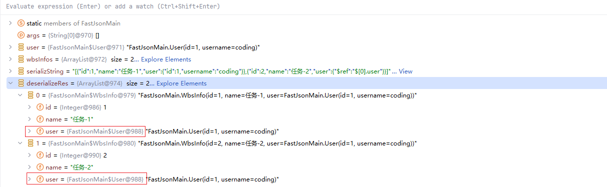

# FastJson 循环依赖处理机制

最近在开发过程之中，发现给到前端的序列化结果之中出现了：$ref 的字样，并不是我们设置的对象。这里记录一下产生的原因和解决方案。

我们使用 FastJson 作为序列化工具，对应的版本是：1.2.83

```xml
<dependency>
    <groupId>com.alibaba</groupId>
    <artifactId>fastjson</artifactId>
    <version>1.2.83</version>
</dependency>
```

出现问题的示例代码如下：

```java
@Slf4j
public class FastJsonMain {

    @Data
    @AllArgsConstructor
    @NoArgsConstructor
    static class WbsInfo {
        private Integer id;
        private String name;
        private User user;
    }
    @Data
    @AllArgsConstructor
    @NoArgsConstructor
    static class User {
        private Integer id;

        private String username;
    }

    public static void main(String[] args) {
        User user = new User(1, "coding");
        List<WbsInfo> wbsInfos = new ArrayList<>();
        wbsInfos.add( new WbsInfo(1, "任务-1", user));
        wbsInfos.add( new WbsInfo(2, "任务-2", user));
        String serializString = JSON.toJSONString(wbsInfos);
        log.info("序列化之后的结果为: {}", serializString);
        List<WbsInfo> deserializeRes = JSON.parseObject(serializString, new TypeReference<List<WbsInfo>>() {});
        log.info("wbsInfo: {}", deserializeRes);
    }
}
```

这里的执行结果如下：

```text
序列化之后的结果为: [{"id":1,"name":"任务-1","user":{"id":1,"username":"coding"}},{"id":2,"name":"任务-2","user":{"$ref":"$[0].user"}}]

wbsInfo: [FastJsonMain.WbsInfo(id=1, name=任务-1, user=FastJsonMain.User(id=1, username=coding)), FastJsonMain.WbsInfo(id=2, name=任务-2, user=FastJsonMain.User(id=1, username=coding))]

```

能够发现，序列的字符串中第二个对象中的 user 信息是 $ref , 这并不是前端能够处理的。但是反序列化之后的结果却是正确的，并且两个 WbsInfo 中的 User 都是一致的。




出现这个问题的原因主要是：FastJson 中的重复/循环检测功能，要解决这个问题就需要关闭这个功能，将上述序列化代码调整如下：

```java
serializString = JSON.toJSONString(wbsInfos, SerializerFeature.DisableCircularReferenceDetect);
log.info("序列化之后的结果为: {}", serializString);
deserializeRes = JSON.parseObject(serializString, new TypeReference<List<WbsInfo>>() {});
log.info("wbsInfo: {}", deserializeRes);
```

这时候再次执行，结果如下

```java
[{"id":1,"name":"任务-1","user":{"id":1,"username":"coding"}},{"id":2,"name":"任务-2","user":{"id":1,"username":"coding"}}]
```

在 FastJson 进行序列化的时候，会通过传入的对象的类型，找到不同的序列器，对于对象，对应的序列化器是：JavaBeanSerializer，在这个里面能够发现，要序列化那些字段，**实际上是通过 get 或者 is 开头的方法来判断的**，如果还是需要有这种类型开头的方法，可以在对应的方法上面携带：`@JSONField(serialize = false)` 或者在序列化的时候增加 `SerializerFeature.IgnoreErrorGetter` 忽略没有成员变量的 get 函数

对于引用对象，在序列化的时候会判断这个对象在上下文之中是否出现过，如果出现过，则会输出：$ref 这样的内容。这块的源代码如下：

>com/alibaba/fastjson/serializer/JavaBeanSerializer.java

```java
public boolean writeReference(JSONSerializer serializer, Object object, int fieldFeatures) {
    SerialContext context = serializer.context;
    int mask = SerializerFeature.DisableCircularReferenceDetect.mask;
    if (context == null || (context.features & mask) != 0 || (fieldFeatures & mask) != 0) {
        return false;
    }

    if (serializer.references != null && serializer.references.containsKey(object)) {
        // TODO:  out.write("{\"$ref\":\"@\"}");
        // 如果这个对象在序列化的上下文之中出现过, 就输出：out.write("{\"$ref\":\"@\"}");
        serializer.writeReference(object);
        return true;
    } else {
        return false;
    }
}
```

不过这个问题，在 FastJson2 之中并没有出现，也并不需要单独的配置


