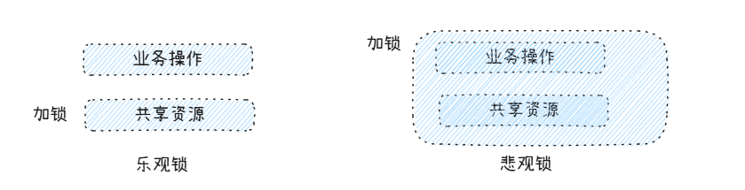

# 乐观锁与悲观锁

> 乐观锁是一种常见的并发控制策略，核心思想是：数据在大部分情况之下不会发生冲突，不需要锁，只需要在提交更新的时候检查数据是否被修改过。与之相对的则是悲观锁，认为冲突一定会发生，必须加锁后进行访问。

乐观锁，主体思想是 **CAS 机制**，在读取数据时，是什么样子，在改的时候，希望还是什么样子。 比如，在 Java 之中的 Atomic类，在 SQL 之中通过 Version 机制，都是一样的。 

```sql
create table user
(
    id      int auto_increment primary key ,
    name    varchar(100) not null,
    version int     default 1    not null
);
# 模拟数据
insert into user(name) values ('coding');

# 查询数据
select name, version from  user where id = 1;

# 通过乐观锁更新数据
update user set name = 'coding666', version = version + 1 where id = 1 and version = 1;

```

悲观锁，主体思想是 **先将共享资源锁住，后进行访问或者修改**。比如 MySQL 中的 select...for update， Redis 加锁等等。。。

```sql
select name from user where id = 1 for update;
```



乐观锁，只是最后在实际操作共享资源的时候，进行比较判断。而悲观锁，则是在整个流程之中将数据都锁死了。两者锁定时长和范围并不相同。乐观锁更多的适合于读多写少的场景，悲观锁适合于写操作频繁且有并发写入的情况。


