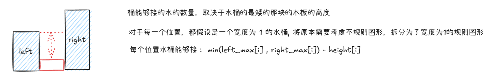
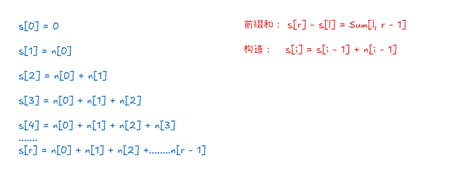

# LeetCode Hot

## 双指针

### 11. 盛最多水的容器

结果集的计算为：S = min(height[i], height[j]) * (j - i).

```java
class Solution {
    public int maxArea(int[] height) {
        int res = -1;
        int left = 0;
        int right = height.length - 1;
        while (left < right) {
            if (height[right] > height[left]) {
                res = Math.max(res, (right - left) * height[left]);
                left++;
            } else {
                res = Math.max(res, (right - left) * height[right]);
                right--;
            }
        }
        return res;
    }
}
```

### 15. 三数之和

```java
class Solution {
    public List<List<Integer>> threeSum(int[] nums) {
        List<List<Integer>> res = new ArrayList<>();
        int n = nums.length;
        Arrays.sort(nums);
        Set<Integer> executedSet = new HashSet<>();
        for (int i = 0; i < n; i++) {
            if (i != 0 && nums[i] == nums[i - 1]) {
                continue;
            }
            int left = i + 1;
            int right = n - 1;
            while (left < right) {
                int temp = nums[i] + nums[left] + nums[right];
                if (temp == 0) {
                    res.add(Arrays.asList(nums[i], nums[left], nums[right]));
                    do {
                        left++;
                    } while (left < right && nums[left] == nums[left - 1]);
                    do {
                        right--;
                    } while (right > left && nums[right] == nums[right + 1]);
                } else if (temp > 0) {
                    right--;
                } else {
                    left++;
                }
            }
        }
        return res;
    }
}
```

### 42.接雨水

原题链接：https://leetcode.cn/problems/trapping-rain-water/?envType=study-plan-v2&envId=top-100-liked

给定 `n` 个非负整数表示每个宽度为 `1` 的柱子的高度图，计算按此排列的柱子，下雨之后能接多少雨水。

**示例 1：**


```
输入：height = [0,1,0,2,1,0,1,3,2,1,2,1]
输出：6
解释：上面是由数组 [0,1,0,2,1,0,1,3,2,1,2,1] 表示的高度图，在这种情况下，可以接 6 个单位的雨水（蓝色部分表示雨水）。 
```



```java
class Solution {
    public int trap(int[] height) {
        int n = height.length;
        int[] preMax = new int[n];
        int[] sufMax = new int[n];

        preMax[0] = height[0];
        for(int i = 1; i < n; i++) {
            preMax[i] = Math.max(height[i], preMax[i - 1]);
        }

        sufMax[n - 1] = height[n - 1];
        for(int i = n - 2; i >= 0; i--) {
            sufMax[i] = Math.max(height[i], sufMax[i + 1]);
        }

        int res = 0;
        for(int i = 0; i < n; i++) {
            res += Math.min(preMax[i], sufMax[i]) - height[i];
        }
        return res;
        
    }
}
```

## 滑动窗口

### 3. 无重复字符的最长子串

给定一个字符串 `s` ，请你找出其中不含有重复字符的 **最长 子串** 的长度。

**示例 1:**

```
输入: s = "abcabcbb"
输出: 3 
解释: 因为无重复字符的最长子串是 "abc"，所以其长度为 3。注意 "bca" 和 "cab" 也是正确答案。
```

滑动窗口，用两个指针维护窗口，Map 用来判断是否出现过字符以及存储每个字符最近一次出现的位置。

R 指针不断向右移动，当窗口之中出现过重复字符，就需要考虑移动 L 指针的位置，此时重复元素是 R 指针指向的元素， Map 之中存储的是 R 指针当前指向的元素上一次位置 index。此时只需要 L = index + 1即可，**不过请注意，L 指针只能够右移，不能够左移**，如果左移，就会导致滑动窗口之中可能存在重复的字符串。

```java
class Solution {
    public int lengthOfLongestSubstring(String s) {
        int n = s.length();
        char[] arr = s.toCharArray();
        int l = 0;
        int res = 0;
        Map<Character, Integer> map = new HashMap<>();
        for(int r = 0; r < n; r++) {
            int index = map.getOrDefault(arr[r], -1);
            if(index != -1) {
                l = Math.max(l, index + 1);
            }
            res = Math.max(res, r - l + 1);
            map.put(arr[r], r);
        }        
        return res;
    }
}
```


### 438. 找到字符串中所有字母异位词

给定两个字符串 `s` 和 `p`，找到 `s` 中所有 `p` 的 **异位词** 的子串，返回这些子串的起始索引。不考虑答案输出的顺序。

**示例 1:**

```
输入: s = "cbaebabacd", p = "abc"
输出: [0,6]
解释:
起始索引等于 0 的子串是 "cba", 它是 "abc" 的异位词。
起始索引等于 6 的子串是 "bac", 它是 "abc" 的异位词。
```

 **提示:**

- `1 <= s.length, p.length <= 3 * 104`
- `s` 和 `p` 仅包含小写字母

```java
class Solution {
    public List<Integer> findAnagrams(String s, String p) {
        List<Integer> res = new ArrayList<>();
        int n = s.length();
        int m = p.length();
        if (n < m) {
            return res;
        }
        int[] arr = new int[26];
        for (int i = 0; i < m; i++) {
            arr[p.charAt(i) - 'a']++;
        }
        char[] sArr = s.toCharArray();
        for (int i = 0; i < n; i++) {
            int[] temp = new int[26];
            if (n - i < m) {
                continue;
            }
            int startIndex = i;
            for (int j = 0; j < m; j++) {
                temp[sArr[startIndex] - 'a']++;
                startIndex++;
            }
            boolean flag = true;
            for (int j = 0; j < 26; j++) {
                if (arr[j] != temp[j]) {
                    flag = false;
                    break;
                }
            }
            if (flag) {
                res.add(i);
            }
        }
        return res;
    }
}
```

## 子串

### 560. 和为 K 的子数组

给你一个整数数组 `nums` 和一个整数 `k` ，请你统计并返回 *该数组中和为 `k` 的子数组的个数* 。

子数组是数组中元素的连续非空序列。

**示例 1：**

```
输入：nums = [1,1,1], k = 2
输出：2
```

前缀和



```java
class Solution {
    public int subarraySum(int[] nums, int k) {
        int n = nums.length;
        int[] sum = new int[n + 10];
        for(int i = 1; i <= n; i++) {
            sum[i] = sum[i - 1] + nums[i - 1];
        }
        int res = 0;
        for(int i = 1; i <= n; i++) {
            for(int j = i - 1; j >= 0; j--) {
                if(sum[i] - sum[j] == k) {
                    ++res;
                }
            }
        }
        return res;   
    }
}
```

### 239. 滑动窗口最大值

给你一个整数数组 `nums`，有一个大小为 `k` 的滑动窗口从数组的最左侧移动到数组的最右侧。你只可以看到在滑动窗口内的 `k` 个数字。滑动窗口每次只向右移动一位。

返回 *滑动窗口中的最大值* 。

**示例 1：**

```
输入：nums = [1,3,-1,-3,5,3,6,7], k = 3
输出：[3,3,5,5,6,7]
解释：
滑动窗口的位置                最大值
---------------               -----
[1  3  -1] -3  5  3  6  7       3
 1 [3  -1  -3] 5  3  6  7       3
 1  3 [-1  -3  5] 3  6  7       5
 1  3  -1 [-3  5  3] 6  7       5
 1  3  -1  -3 [5  3  6] 7       6
 1  3  -1  -3  5 [3  6  7]      7
```

单调队列

```java
class Solution {
    public int[] maxSlidingWindow(int[] nums, int k) {
        int n = nums.length;
        int[] res = new int[n - k + 1];
        int hh = 0;
        int tt = -1;
        int[] q = new int[n];
        for (int i = 0; i < n; i++) {
            if (hh <= tt && i - k + 1 > q[hh]) {
                hh++;
            }  
            while (hh <= tt && nums[q[tt]] < nums[i]){
                --tt;
            }
            q[++tt] = i;
            if (i - k + 1 >= 0) {
                res[i - k + 1] = nums[q[hh]];
            }
        }
        return res;

    }
}
```

## 二分查找

二分查找的基本模板

```java
l = -1 ;
r = N;
int mid = l + r >> 1;
if (isBlue(mid)) l = mid;
else r = mid;

// return l or r
```

### 35.搜索插入位置

给定一个排序数组和一个目标值，在数组中找到目标值，并返回其索引。如果目标值不存在于数组中，返回它将会被按顺序插入的位置。

请必须使用时间复杂度为 `O(log n)` 的算法。

**示例 1:**

```
输入: nums = [1,3,5,6], target = 5
输出: 2
```

示例代码

```python
class Solution:
    def searchInsert(self, nums: List[int], target: int) -> int:
        l = -1;
        r = len(nums)
        while l + 1 != r :
            mid = l + r >> 1;
            if nums[mid] < target:
                l = mid;
            else:
                r = mid;
        return r;
```

### 34. 在排序数组中查找元素的第一个和最后一个位置

给你一个按照非递减顺序排列的整数数组 `nums`，和一个目标值 `target`。请你找出给定目标值在数组中的开始位置和结束位置。

如果数组中不存在目标值 `target`，返回 `[-1, -1]`。

你必须设计并实现时间复杂度为 `O(log n)` 的算法解决此问题。

**示例 1：**

```
输入：nums = [5,7,7,8,8,10], target = 8
输出：[3,4]
```

示例代码

```python
class Solution:
    def searchRange(self, nums: List[int], target: int) -> List[int]:
        l = -1
        r = len(nums)
        res = [-1, -1]
        
        // 查找左边界
        while l + 1 != r:
            mid = l + r >> 1;
            if nums[mid] < target:
                l = mid;
            else:
                r = mid

        if r == len(nums):
            return res;

        if nums[r] == target:
            res[0] = r
		
        // 查找右边界
        l = -1
        r = len(nums)
        while l + 1 != r:
            mid = l + r >> 1
            if nums[mid] <= target:
                l = mid;
            else:
                r = mid
        
        if nums[l] == target:
            res[1] = l;
    
        return res
```

