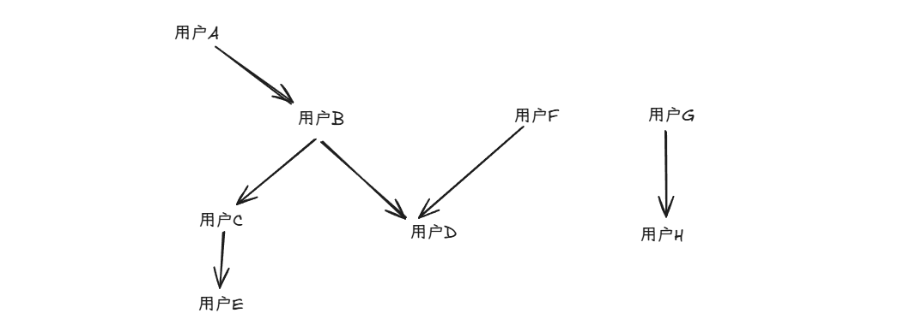

最近有一个比较有意思的业务场景，这里分析一下具体的实现思路。

项目是一个多用户任务协作平台。核心功能在于**允许用户将自己的任务共享给其他用户，并形成一个可扩展的协作网络**。

**协作规则详解**

- **所有权与初始协作**：每个任务有唯一的创建者（所有者）。任务所有者可以邀请其他用户成为该任务的“协作者”。例如，用户A创建任务后，邀请用户B协作，则用户B获得该任务的编辑权限。
- **协作关系的双向性**：协作关系是双向的。一旦用户B成为用户A任务的协作者，不仅用户B可以编辑用户A的任务，用户A也自动获得了编辑用户B名下任务的权限。
- **协作网络的传递性**：这是该系统的关键特性。协作权限可以通过网络进行传递。例如，用户B可以继续邀请用户C协作。此时，用户C将获得以下权限：编辑其直接协作用户B的所有任务。由于用户B与用户A已存在协作关系，用户C也因此间接获得了编辑用户A任务的权限。

如下面这张图：用户A，B，D，C，E，F 构成了协作网（也可理解为联通块），可以互相编辑对象的任务



在编辑一条任务的时候，就需要判断任务能否被当前用户所编辑。进而可以将任务转换为：当前任务的创建人和当前用户是否处于同一个协作网之中。对于这种问题，我们可以通过并查集解决。

对应的示例代码如下

```java [并查集相关的代码]
private static int[] f;

public static void init(int n) {
    for (int i = 1; i <= n; i++) {
        f[i] = i;
    }
}

public static int find(int x) {
    if (f[x] == x) return f[x];
    return find(f[x]);
}

public static void merge(int creatorIdIndex, int partnerIdIndex) {
    f[find(creatorIdIndex)] = find(partnerIdIndex);
}
```

顺理，我们的第一版代码就如期完成了


```java
@Data
@AllArgsConstructor
public static class Partner {
    /**
         * 创建人
         */
    private Long creatorId;

    /**
         * 协作者
         */
    private Long partnerId;
}
```


示例代码如下：

