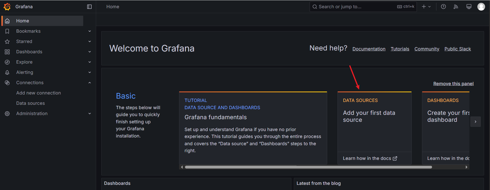
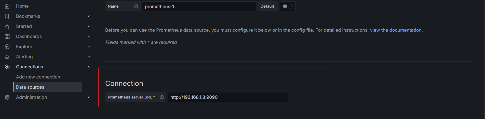
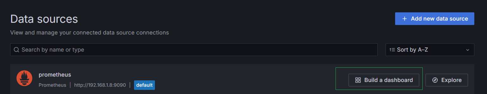
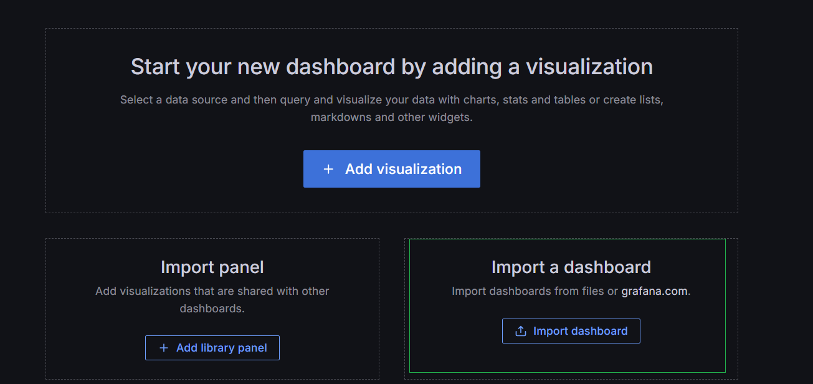
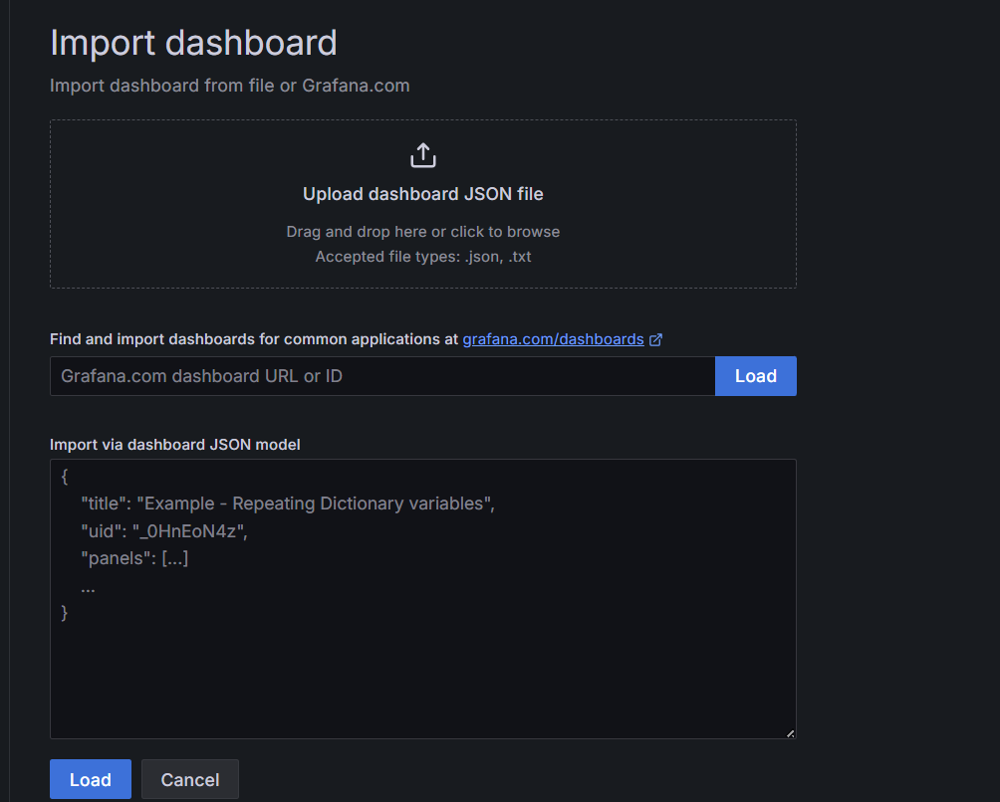
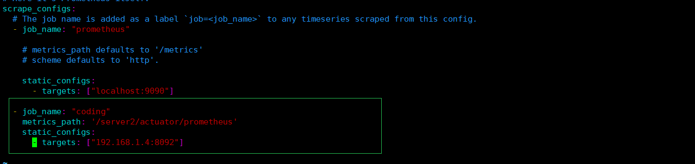
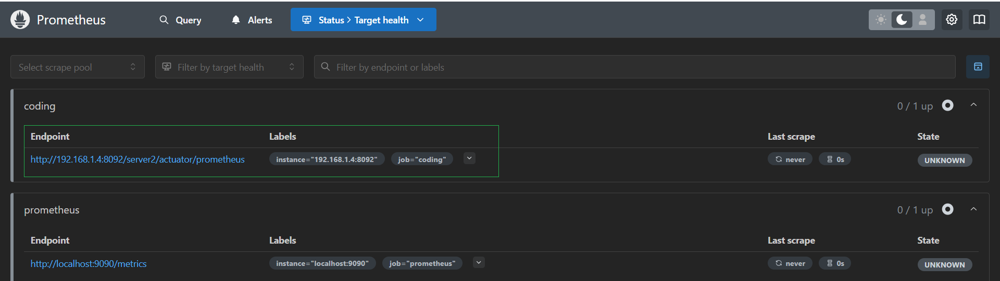

# 监控 JVM 内存

## 一、安装

### 1.1 prometheus

首先下载对应的压缩包

```markdown
https://prometheus.io/download/
```

```markdown
# 解压
tar -xf prometheus-3.2.1.linux-amd64.tar.gz

# 修改文件名
mv prometheus-3.2.1.linux-amd64 prometheus

# 最终解压之后的文件位置
/home/haolong/monitor/prometheus

# 安装完成之后，可以直接通过下面这个命令启动
./prometheus --config.file=prometheus.yml &

# 启动完成之后，访问 9090 端口就能够看到
```

### 1.2 Grafana

Grafana 是一个开源的分析与可视化平台，用于数据的可视化，监控和告警

```markdown
# 下载安装包
wget https://dl.grafana.com/enterprise/release/grafana-enterprise-11.5.2.linux-amd64.tar.gz

# 启动
./grafana-server &

# 启动完成就可以通过 访问 3000 端口，默认的账户和密码都是 admin/admin
```

首先，配置一个监控的数据来源：



这里填写 prometheus 的地址



> 添加 dashboard







选择一个具体的模板就可以

## 二、SpringBoot

在 Spring Boot 项目之中，引入如下的依赖信息：

```xml
<dependency>
    <groupId>org.springframework.boot</groupId>
    <artifactId>spring-boot-starter-actuator</artifactId>
</dependency>
<dependency>
    <groupId>io.micrometer</groupId>
    <artifactId>micrometer-registry-prometheus</artifactId>
</dependency>
```

添加如下配置：

```yaml
management:
  endpoints:
    web:
      exposure:
        include: "*"
  metrics:
    export:
      prometheus:
        enabled: true
```

启动项目，访问如下地址就能够看到监控的信息

```markdown
http://localhost:8092/server2/actuator/prometheus
```

修改 prometheus.yml 增加如下内容：



重启之后，就能够在 prometheus 中看到如下的信息

