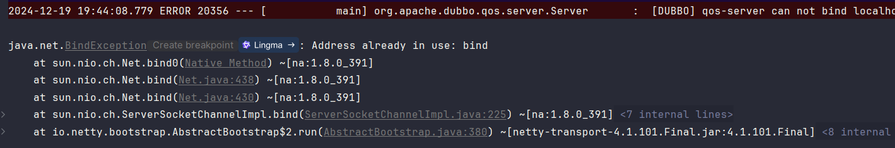

# 网络通信

## 一、简介

在上一小节之中，我们完成了第一个直连式 Dubbo 应用的开发。在这个过程之中，我们对于 Dubbo 如何进行网络通信的细节并不清楚。

**客户端通过 DubboReference 完成代理对象的注入，服务端通过 DubboService 完成服务的发布。**

里面的细节，完全被封装了。回看 RPC 通信，在一次通信过程之中，我们主要考虑如下几个方面的内容：


Dubbo 在通信过程之中，同样也离不开这些核心内容。

## 二、序列化

序列化，主要是指数据的传输格式，采用不同的序列化方式，大小也各不相同。那么在 Dubbo 之中，支持那些序列化方式呢？

https://cn.dubbo.apache.org/zh-cn/overview/mannual/java-sdk/reference-manual/serialization/serialization/

从官网的介绍之中，我们看到要在不同的协议之下，有不同的序列化方式支持。接下来，我们看一下常见的序列化方式。

### 2.1 Dubbo 协议下的序列化

#### 2.1.1 kryo

引入依赖

```xml
<dependency>
    <groupId>org.apache.dubbo.extensions</groupId>
    <artifactId>dubbo-serialization-kryo</artifactId>
    <version>1.0.1</version>
</dependency>
```

添加配置文件

```yml
dubbo:
  application:
    name: ${spring.application.name}
  protocol:
    name: dubbo
    serialization: kryo
```

这个时候，我们再一次看一下控制台输出的信息

```markdown
Export dubbo service com.coding.api.UserService to url dubbo://192.168.1.9:20880/com.coding.api.UserService?anyhost=true&application=dubbo-provider&background=false&bind.ip=192.168.1.9&bind.port=20880&deprecated=false&dubbo=2.0.2&dynamic=true&executor-management-mode=isolation&file-cache=true&generic=false&interface=com.coding.api.UserService&ipv6=2408:8207:484d:d3a0:4865:f67c:ae63:eba7&methods=getUserNameByUserID,register&pid=2720&prefer.serialization=kryo&qos.enable=true&release=3.2.0&serialization=kryo&side=provider&timestamp=1734607575183, dubbo version: 3.2.0, current host: 192.168.1.9
```

对比一下，上一小节开发时，控制台输出的消息内容

```markdown
# 未指定序列化方式
prefer.serialization=fastjson2,hessian2
# 制定了序列化方式
prefer.serialization=kryo
serialization=kryo
```

不过当我们再次启动上一小节开发的 Consumer 的时候，但是调用过程之中是由报错的。具体的报错日志如下：



为此，我们可以通过如下方式进行关闭

```yaml
dubbo:
  application:
    name: dubbo-consumer
    qos-enable: false
```

这里，我并没有修改客户端的代码，我们先来试一试，能不能进行访问？

```java
@DubboReference(url = "dubbo://192.168.1.9:20880/com.coding.api.UserService")
private UserService userService;
```

尝试过后，可以进行访问。为此，我查阅了官方文档，对应的地址信息如下：

```markdown
https://cn.dubbo.apache.org/zh-cn/overview/mannual/java-sdk/reference-manual/serialization/serialization-upgrade/
```

文章之中，提到了，在客户端进行序列化的时候，会优先使用 prefer-serialization 配置的协议，如果不支持，才会使用 serrialization 配置的协议。按照这样的方式，在服务端，我配置了如下的方式

```java
dubbo:
  application:
    name: ${spring.application.name}
  provider:
    prefer-serialization: kryo
  protocol:
    name: dubbo
    serialization: kryo
```

但是，我并没有修改客户端的代码，我仍然是可以进行访问通信的。


```java
@DubboReference(url = "dubbo://192.168.1.9:20880/com.coding.api.UserService?serialization=kryo")
private UserService userService;
```

### 2.2 triple 协议下的序列化


## 三、协议

