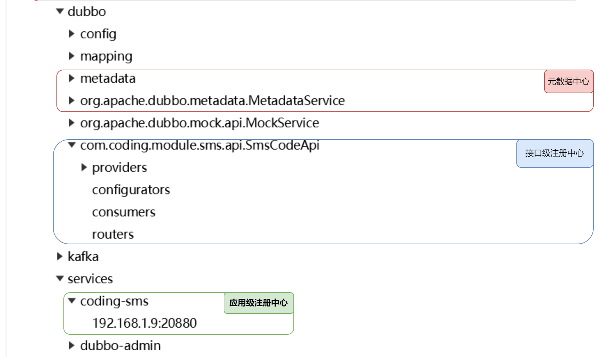
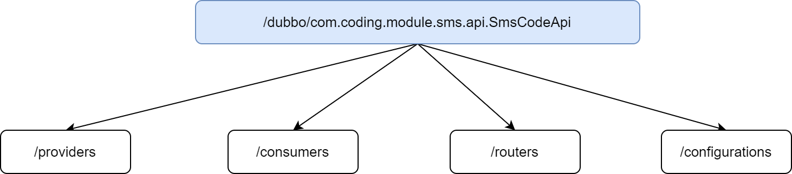
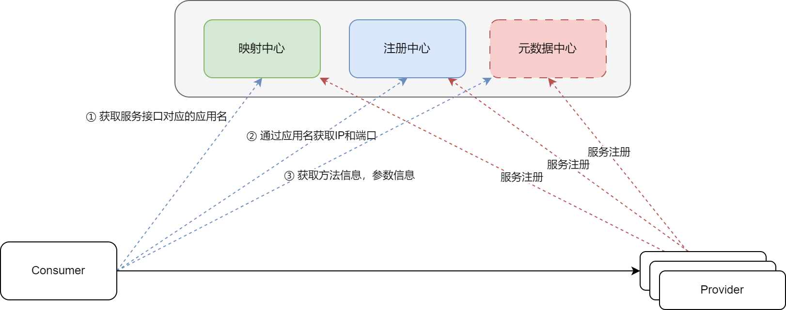

# 一、常见的注册中心

这一小节，将会熟悉一下常见的注册中心的使用

## 1.1  Zookeeper
添加依赖

```xml
<dependency>
  <groupId>org.apache.dubbo</groupId>
  <artifactId>dubbo-registry-zookeeper</artifactId>
</dependency>
```

配置信息如下

```yaml
dubbo:
  application:
    name: coding-module-member
  registry:
   address: zookeeper://1.92.153.10:9101
```

## 1.2 Nacos
添加依赖

```xml
<dependency>
  <groupId>org.apache.dubbo</groupId>
  <artifactId>dubbo-registry-nacos</artifactId>
</dependency>
```

配置信息如下

```yaml
dubbo:
  application:
    name: coding-module-member
  registry:
    address: nacos://1.92.153.10:8848
    username: nacos
    password: nacos
```

# 二、 DubboAdmin

# 三、注册中心详解

在 Dubbo 之中，按照存储结构的不同，分为了接口级注册中心和应用级注册中心。在不同的 Dubbo 的版本之中，对其支持不一样。

| 版本 | 备注 |
| --- | --- |
| 2.6.x ~ 2.7.5 | 接口级注册中心 |
| 2.7.5 ~ 2.7.23 | 接口级注册中心，应用级注册中心 |
| 3.x | 接口级注册中心，应用级注册中心（内部组织接口相比于 2.7.5 及其后续有变动） |


我们可以通过配置文件来进行切换，对应的配置如下，默认配置为 all

```yaml
dubbo:
  application:
    # instance : 应用级别的注册中心
    # interface : 接口级别的注册中心
    # all : 支持两种
    register-mode: all
```

接下来，我们查看一下挂载到 zookeeper 之上的节点



接下来，我们就来分别看一下不同的存储结构，在注册中心上配置的内容有什么差异？

## 3.1 接口级注册中心
接下来，我们首先将修改配置文件：

```yaml
dubbo:
  application:
    register-mode: interface
```

接口级别注册，挂载的节点如下：



不同的节点具有不同的含义：

1. providers：所有的服务集群及其实例的相关信息，当我们注册一个服务之后，就会在当前节点下面建立一个子节点                          
2. consumers：所有这个服务的消费者
3. routers：路由信息
4. configurations：存储负载均衡策略、超时设置、重试设置等信息

那么接口注册中心存在那些问题呢？

1. 注册中心数据总体量过大，存在大量重复的数据
2. 推送 Consumer 有延迟

## 3.2 应用级注册中心
应用级注册中心，对应的配置如下：

```yaml
dubbo:
  application:
    register-mode: instance
```

应用级注册中心的流程如下



在第一次调用的时候，Consumer 会把映射中心，注册中心，元数据中心的内容都注册到本地，这就是为什么 RPC 调用第一次都会很慢的~~~

在上图之中，对于元数据中心，维护了 RPC 调用过程之中所需要的方法信息，参数信息，配置信息。但是这部分数据并没有一定要放在 Nacos 或者 ZK 这些中间件之中，它有两种方式：

+ local 模式：不创建元数据中心，consumer 直接从 provider 中获取元数据信息
+ remote 模式：独立构建元数据中心，consumer 从元数据中心拉去元数据信息，进行 RPC 访问，默认是不开启的。

默认情况之中使用的 local 模式，如果想使用 remote 模式，我们可以通过如下的方式：

步骤一：添加依赖

```xml
<dependency>
  <groupId>org.apache.dubbo</groupId>
  <artifactId>dubbo-metadata-report-zookeeper</artifactId>
</dependency>
```

步骤二：增加配置

```yaml
dubbo:
  application:
    register-mode: instance
    metadata-type: remote
  metadata-report:
    address: zookeeper://1.92.153.10:9101
```

通过这样的方式，我们就可以使用 remote 模式了。那么，元数据中心都存储了那些内容呢？

```json
{
  "app": "coding-sms",
  "revision": "efa52b909657151f71d7a9aa037b6742",
  "services": {
    "com.coding.module.sms.api.MessageSendApi:dubbo": {
      "name": "com.coding.module.sms.api.MessageSendApi",
      "params": {
        "executor-management-mode": "isolation",
        "side": "provider",
        "file-cache": "true",
        "release": "3.2.0",
        "methods": "sendMessage",
        "deprecated": "false",
        "dubbo": "2.0.2",
        "interface": "com.coding.module.sms.api.MessageSendApi",
        "service-name-mapping": "true",
        "register-mode": "instance",
        "generic": "false",
        "metadata-type": "remote",
        "application": "coding-sms",
        "prefer.serialization": "fastjson2,hessian2",
        "background": "false",
        "dynamic": "true",
        "anyhost": "true"
      },
      "path": "com.coding.module.sms.api.MessageSendApi",
      "port": 20880,
      "protocol": "dubbo"
    }
  }
}
```

从内容上，能够发现，主要包含使用的协议，运行时信息等。

为什么要同时支持接口级注册中心和应用级的注册中心？

主要是考虑到遗留系统的迁移

## 3.3  注册中心的补充配置
## 3.4 命名空间和分组
namespace 和 group 这两个概念都是

```yaml
dubbo:
  registry:
    group: coding-message-group
    parameters:
      namespace: coding-cloud
```

## 3.5 多注册中心


