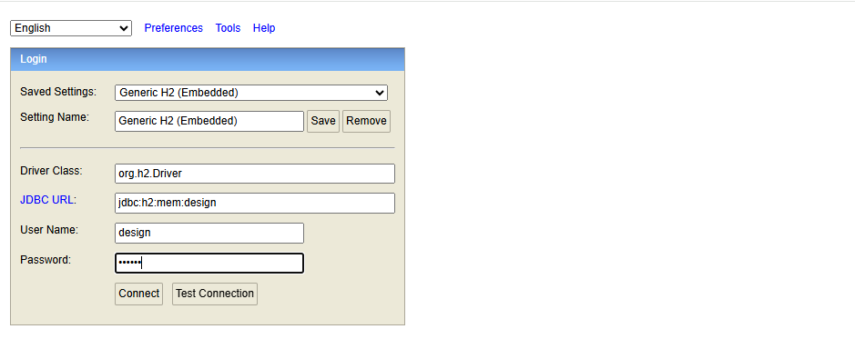

# H2

H2 是一个开源的轻量级 Java 内存数据库，适用于开发、测试使用。

这里基于 JDK8 和 SpringBoot 2.6.13 ，介绍一下 H2 数据库集成方式

## SpringBoot 集成

1）引入依赖

> 这里的 scope 根据实际情况进行选择即可，一般配置为 test
>
> 对于 ORM 框架自行选择

```xml
<dependency>
    <groupId>com.h2database</groupId>
    <artifactId>h2</artifactId>
    <version>1.4.200</version>
    <scope>runtime</scope>

</dependency>
<!-- MyBatis-->
<dependency>
    <groupId>org.mybatis.spring.boot</groupId>
    <artifactId>mybatis-spring-boot-starter</artifactId>
    <version>2.3.2</version>
</dependency>
```

2）添加配置

```yml
spring:
  datasource:
    url: jdbc:h2:mem:design
    username: design
    password: design
    driver-class-name: org.h2.Driver
    h2-console-setting: INIT=RUNSCRIPT FROM 'classpath:schema.sql'
  h2:
    console:
      enabled: true
      path: /h2-console
server:
  port: 8081
```

在 resources 下放置 schema.sql, 示例如下

```sql
CREATE TABLE IF NOT EXISTS users (
    id INT AUTO_INCREMENT PRIMARY KEY,
    USER_NAME VARCHAR(255) NOT NULL
);
```

项目启动之后，访问 `http://localhost:8081/h2-console` 地址, 安装和配置文件一样的配置，即可登录



登录完成之后，就可以看到对应的表结构了