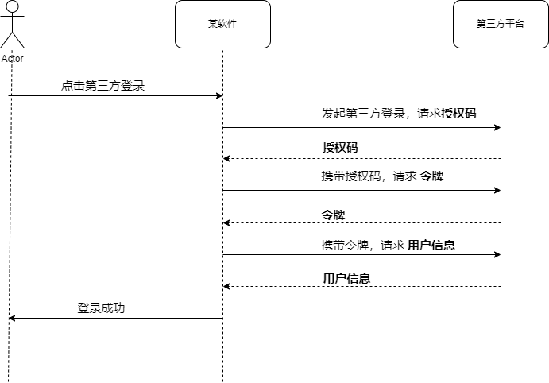
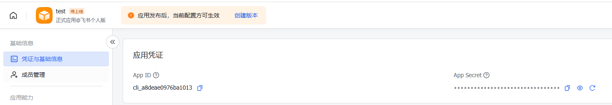

# OAuth2

## 一、前言

现在大部分软件或者网页都支持微信登录，这可以避免你注册之后，还需要上传昵称，头像以及填写个人信息问题，这可以节约你的时间。

下面以极客时间进行举例，你在登录的时候，是可以选择微信进行登录的。你扫码登录之后，极客时间就能够拿到用户微信的头像，昵称作为你在极客时间的基础数据。而极客时间并不是真实的通过的你微信的账号和密码来进行登录微信的，而是，你在微信点击确定之后，微信给你一个极客时间的临时凭证，有了这个凭证，你就能够访问用户的数据了。当然了，如果你不同意，也是拿不到你的数据。

这实际上就是一个授权码模式，



## 二、常见方式

> 这里使用 JustAuth 进行实现

这里介绍一下以 集成飞书 和 Gitee 为例

```xml
<dependency>
    <groupId>me.zhyd.oauth</groupId>
    <artifactId>JustAuth</artifactId>
    <version>1.16.7</version>
</dependency>
```

### 2.1 Gitee

### 2.2 飞书

飞书的集成，需要首先创建一个应用，我这里创建一个 test 应用。创建完成后，就可以获取到对应的 `AppID` 和 对应 ` App Secret`



在配置文件之中进行配置

```yml
--- # 三方授权
justauth:
  address: http://localhost:80
  type:
    feishu:
      client-id: cli_a8deae0976ba1013
      client-secret: 7eZxBRa3CxlD51nJU6hHcPc47RGsvyqu
      redirect-uri: ${justauth.address}/social-callback?source=feishu
```

