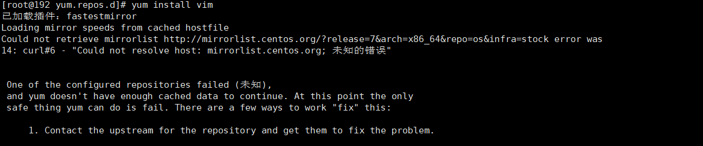

这里先记录一个小插曲



解决方案如下：

```markdown
cd /etc/yum.repos.d

cp CentOS-Base.repo CentOS-Base.repo.bak

rm CentOS-Base.repo

vi CentOS-Base.repo

yum clean all

yum makecache
```

将下面的内容填入到文件之中

```properties
[base]
name=CentOS-$releasever - Base - mirrors.aliyun.com
baseurl=http://mirrors.aliyun.com/centos/$releasever/os/$basearch/
gpgcheck=1
gpgkey=http://mirrors.aliyun.com/centos/RPM-GPG-KEY-CentOS-7

[updates]
name=CentOS-$releasever - Updates - mirrors.aliyun.com
baseurl=http://mirrors.aliyun.com/centos/$releasever/updates/$basearch/
gpgcheck=1
gpgkey=http://mirrors.aliyun.com/centos/RPM-GPG-KEY-CentOS-7

[extras]
name=CentOS-$releasever - Extras - mirrors.aliyun.com
baseurl=http://mirrors.aliyun.com/centos/$releasever/extras/$basearch/
gpgcheck=1
gpgkey=http://mirrors.aliyun.com/centos/RPM-GPG-KEY-CentOS-7

[centosplus]
name=CentOS-$releasever - Plus - mirrors.aliyun.com
baseurl=http://mirrors.aliyun.com/centos/$releasever/centosplus/$basearch/
gpgcheck=1
enabled=0
gpgkey=http://mirrors.aliyun.com/centos/RPM-GPG-KEY-CentOS-7
```

